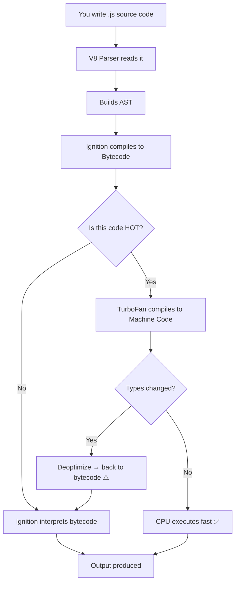

# 01 — What is JavaScript: Complete Interview & Reference Guide

## Overview

JavaScript is a high-level, JIT-compiled, single-threaded, dynamically typed, garbage-collected scripting language that conforms to the ECMAScript standard. It is the only language natively understood by web browsers and — via Node.js — runs on servers, CLIs, and embedded systems. This chapter covers the complete pipeline from source code to machine code execution, built-in functions, interview-ready definitions, and deep performance insights into the V8 engine.

---

## Table of Contents

1. [Syntax Reference — End to End](#1-syntax-reference--end-to-end)
2. [Built-in Functions & Methods](#2-built-in-functions--methods)
3. [Deep Insights & Gotchas](#3-deep-insights--gotchas)
4. [Interview-Ready Definitions](#4-interview-ready-definitions)
5. [Tricky Interview Questions](#5-tricky-interview-questions)
6. [Controversial Topics & Ongoing Debates](#6-controversial-topics--ongoing-debates)
7. [Quick Reference Cheat Sheet](#7-quick-reference-cheat-sheet)
8. [Memory Map & Visual Flowchart](#8-memory-map--visual-flowchart)
9. [LinkedIn-Style Post](#9-linkedin-style-post)
10. [Summary & Individual Notes Index](#10-summary--individual-notes-index)

---

## 1. Syntax Reference — End to End

### 1.1 The First JavaScript Program

```javascript
// Hello World — the entry point of every learning journey
console.log("Hello The Testing Academy!");
```

- `console` — a global object available in both browsers and Node.js
- `.log()` — a method that prints to stdout / browser DevTools console
- The string `"..."` is a **string literal**

### 1.2 How JS Code Is Written and Executed

```javascript
// Source code (what YOU write)
console.log("Hello World");

// What V8 does invisibly:
// 1. Parse → builds AST (Abstract Syntax Tree)
// 2. Compile to bytecode (Ignition interpreter)
// 3. Profile: is this code "hot" (called many times)?
// 4. If hot → TurboFan compiles to machine code
// 5. If types change → deoptimize back to bytecode
```

### 1.3 Running JS — Two Environments

```javascript
// In a Browser: open DevTools → Console tab → type directly
console.log("I run in the browser");

// In Node.js: save as hello.js, run: node hello.js
console.log("I run in Node.js");
```

---

## 2. Built-in Functions & Methods

### `console.log(...args)`
- **Purpose:** Prints to stdout / browser console
- **Returns:** `undefined`
- **Accepts:** Any number of arguments of any type

```javascript
console.log("text");               // text
console.log(1, 2, 3);             // 1 2 3
console.log("Value:", 42);        // Value: 42
console.log([1, 2], { a: 1 });    // [1, 2] { a: 1 }
```

### Other `console` methods

| Method | Use |
|--------|-----|
| `console.error(msg)` | Red error output |
| `console.warn(msg)` | Yellow warning |
| `console.table(arr)` | Tabular display |
| `console.time(label)` / `console.timeEnd(label)` | Measure execution time |

---

## 3. Deep Insights & Gotchas

### 3.1 JavaScript Is NOT "Interpreted" Anymore
The common interview answer "JS is interpreted" is **outdated**. Modern JS engines use JIT (Just-In-Time) compilation. V8 interprets via bytecode first, then compiles hot paths to machine code mid-run.

### 3.2 JS Is Single-Threaded — But Asynchronous
JavaScript runs on a single thread (one call stack). It handles async operations (setTimeout, fetch, I/O) via the **Event Loop + Callback Queue** — not multiple threads.

```javascript
console.log("1");
setTimeout(() => console.log("2"), 0);
console.log("3");
// Output: 1  3  2  — setTimeout fires AFTER current call stack clears
```

### 3.3 `typeof null === "object"` — The Famous Bug
```javascript
typeof null === "object"  // true — this is a 27-year-old bug in JS
typeof undefined === "undefined"  // true
```
Never use `typeof` to check for null. Use `=== null` directly.

### 3.4 V8 Deoptimization — Changing Types Kills Performance
```javascript
function add(a, b) { return a + b; }
add(1, 2);    // V8 optimizes for numbers
add("a", "b"); // V8 deoptimizes — types changed
```
Keep argument types consistent in hot functions.

### 3.5 `console.log` Is Not Guaranteed to Be Synchronous in Browsers
In some browser implementations, `console.log` is **asynchronous** for complex objects. The object shown in DevTools may reflect its state at the time of *display*, not at the time of *log*.

```javascript
let obj = { x: 1 };
console.log(obj);  // might show { x: 2 } if obj mutates before display
obj.x = 2;
```
Use `console.log(JSON.stringify(obj))` to capture the exact state.

---

## 4. Interview-Ready Definitions

### JavaScript
> **Definition (say this):** "JavaScript is a high-level, JIT-compiled, single-threaded, dynamically typed language that follows the ECMAScript specification. It runs natively in browsers and via Node.js on servers."
> **Follow-up:** "Is JavaScript interpreted or compiled?"
> **Answer:** "Neither purely — it uses JIT compilation. V8 first interprets bytecode via Ignition, then compiles hot code paths to native machine code via TurboFan, giving it near-native performance for frequently executed code."

### JIT Compilation
> **Definition (say this):** "JIT (Just-In-Time) compilation starts interpreting code immediately for fast startup, then identifies 'hot' code paths and compiles them to machine code at runtime for speed — combining the benefits of both interpretation and compilation."
> **Follow-up:** "What happens if the types change after JIT optimization?"
> **Answer:** "The engine deoptimizes — it discards the compiled machine code and falls back to interpreting bytecode to stay correct."

### V8 Engine
> **Definition (say this):** "V8 is Google's open-source JavaScript engine written in C++. It powers Chrome and Node.js. Its two key components are Ignition (the bytecode interpreter) and TurboFan (the optimizing JIT compiler)."

### ECMAScript
> **Definition (say this):** "ECMAScript (ES) is the specification that defines the JavaScript language standard. Each yearly release (ES2015/ES6, ES2022, etc.) adds new language features. JavaScript is the most popular implementation of ECMAScript."

---

## 5. Tricky Interview Questions

---

**Q1:** Is JavaScript compiled or interpreted?
**A:** Neither purely. It uses JIT compilation — starting as interpreted bytecode (fast startup) and compiling hot paths to machine code at runtime (fast execution). The answer "interpreted" is technically outdated.
**Difficulty:** Medium

---

**Q2:** What is the output?
```javascript
console.log("1");
setTimeout(() => console.log("2"), 0);
console.log("3");
```
**A:** `1  3  2`. `setTimeout` with 0ms delay doesn't run immediately — it goes to the callback queue and executes only after the current call stack is empty.
**Difficulty:** Medium

---

**Q3:** What is the difference between Source Code, Bytecode, and Binary Code?
**A:**
- **Source code** — human-readable text you write (`.js`, `.py`, `.c`)
- **Bytecode** — intermediate instructions for a VM (V8 Ignition, JVM) — portable but not directly CPU-executable
- **Binary/Machine code** — CPU-native instructions — fastest, but architecture-specific

JS goes: source → bytecode → (hot paths) → machine code automatically.
**Difficulty:** Easy

---

**Q4:** What happens when V8 "deoptimizes"?
**A:** When V8 optimizes a function for specific types (e.g., number + number), but then encounters unexpected types (e.g., string + number), it discards the compiled machine code and falls back to interpreting bytecode. This is called deoptimization and causes a performance hit. It's why keeping function argument types consistent matters.
**Difficulty:** Hard

---

**Q5:** What is the Event Loop?
**A:** JavaScript runs on a single thread with one call stack. The Event Loop monitors the call stack and the callback queue (setTimeout, I/O callbacks, Promises). When the stack is empty, it pushes the next callback from the queue onto the stack for execution. This enables async programming without multiple threads.
**Difficulty:** Medium

---

**Q6:** What is `typeof null`? Is it a bug?
**A:** `typeof null === "object"`. Yes — this is a long-standing (27+ year) bug in JavaScript. In the original JS implementation, values were stored with a type tag, and `null` shared the object tag (`000`). Fixing it would break existing code, so it remains. Always use `value === null` to check for null.
**Difficulty:** Medium

---

**Q7:** What does `console.log` return?
**A:** `undefined`. It is called for its side effect (printing) and has no meaningful return value.
**Difficulty:** Easy

---

**Q8:** Can you run JavaScript without a browser?
**A:** Yes — Node.js is a runtime built on V8 that executes JS outside the browser. It provides access to the file system, network, and OS — things the browser sandbox doesn't allow.
**Difficulty:** Easy

---

**Q9:** What is the difference between a compiled language like C and JS?
**A:** C is compiled ahead of time to machine code for a specific CPU architecture — the resulting binary runs without any runtime toolchain. JS requires the V8 engine (or another JS runtime) to be present at execution time. C has the fastest cold execution; JS has the advantage of portability and no explicit compile step.
**Difficulty:** Medium

---

**Q10:** What is "V8" and what does it do?
**A:** V8 is Google's open-source JavaScript and WebAssembly engine written in C++. It parses JS source, compiles it to bytecode (Ignition), and JIT-compiles hot paths to machine code (TurboFan). It powers Chrome, Edge, Node.js, and Deno.
**Difficulty:** Easy

---

## 6. Controversial Topics & Ongoing Debates

### "JavaScript Is Interpreted" — Still the Wrong Answer in 2025?

**The debate:** Textbooks and courses still say "JavaScript is an interpreted language." Is this still accurate?

**Reality:** No modern JS engine uses pure interpretation. V8, SpiderMonkey, and JavaScriptCore all use JIT compilation. The "interpreted" label dates from the 1990s.

**Why it persists:** JS doesn't have a separate compile step visible to the developer — there's no `javac` or `gcc` to run. The execution *feels* interpreted. But under the hood it's not.

**Best answer in interviews:** "JS is JIT-compiled at runtime. It starts interpreted for fast startup, then compiles hot code to machine code for speed."

---

### Single-Threaded vs Multi-Threaded JavaScript

**The debate:** Is JavaScript truly single-threaded if Web Workers exist?

**Reality:** The JS runtime is single-threaded — one call stack, one event loop. Web Workers run in *separate threads* with *separate contexts* — they cannot directly access the main thread's DOM or variables; they communicate only via `postMessage`.

**Conclusion:** "Single-threaded" refers to the JS execution context. Web Workers are truly parallel but isolated.

---

## 7. Quick Reference Cheat Sheet

### JS Execution Pipeline (V8)

```
Source Code (.js)
    │
    ▼ Parse
AST (Abstract Syntax Tree)
    │
    ▼ Compile
Bytecode (V8 Ignition)  ──interpret──► runs (slower)
    │
    │ Hot path detected
    ▼
Machine Code (TurboFan)  ──────────► runs (fast)
    │
    │ Types change
    ▼
Deoptimize → back to bytecode
```

### Key Terms

| Term | One-line definition |
|------|-------------------|
| Source code | Human-readable code you write |
| Bytecode | Intermediate VM instructions (V8 Ignition) |
| Machine code | CPU-native binary instructions (TurboFan JIT) |
| JIT | Compile during execution, not before |
| V8 | Google's JS engine (Chrome, Node.js) |
| Event Loop | Moves callbacks from queue to call stack when stack is empty |
| ECMAScript | The spec; JS is its most popular implementation |

### `console` Methods

| Method | Purpose |
|--------|---------|
| `console.log()` | Standard output |
| `console.error()` | Error (red) |
| `console.warn()` | Warning (yellow) |
| `console.table()` | Array/object as table |
| `console.time(label)` | Start timer |
| `console.timeEnd(label)` | Stop timer and print elapsed |

---

## 8. Memory Map & Visual Flowchart

### A) Mind Map

```
[What is JavaScript]
  ├── Language traits
  │     ├── High-level ✅
  │     ├── Dynamically typed ⚠️ (no type enforcement)
  │     ├── Single-threaded ⚠️ (event loop for async)
  │     ├── Garbage-collected ✅
  │     └── ECMAScript standard ✅
  ├── Execution pipeline
  │     ├── Source code (.js) → you write this
  │     ├── AST → parser builds this
  │     ├── Bytecode (Ignition) → fast startup
  │     └── Machine code (TurboFan) → hot path JIT ✅
  ├── Runtime environments
  │     ├── Browser (Chrome/V8, Firefox/SpiderMonkey, Safari/JSC)
  │     └── Node.js (V8 on server side)
  ├── Common gotchas
  │     ├── typeof null === "object" ⚠️ (historical bug)
  │     ├── setTimeout(fn, 0) is NOT immediate ⚠️
  │     ├── console.log objects may be async in browser ⚠️
  │     └── Type changes deoptimize JIT ⚠️
  └── console
        ├── console.log() → primary output
        ├── console.error() / .warn() → styled output
        └── console.table() / .time() → utilities
```

### B) Flowchart — How JavaScript Runs



### C) Execution Trace — setTimeout(fn, 0) Surprise

```javascript
console.log("1");
setTimeout(() => console.log("2"), 0);
console.log("3");
```

| Step | Call Stack | Callback Queue | Output |
|------|-----------|----------------|--------|
| 1 | `console.log("1")` | empty | `1` |
| 2 | `setTimeout(...)` | — | — |
| 3 | `console.log("3")` | `fn` queued | `3` |
| 4 | Stack empty | `fn` moved to stack | `2` |

**Result:** `1  3  2` — async even with 0ms delay.

---

## 9. LinkedIn-Style Post

### 📢 LinkedIn Post

> **"JavaScript is an interpreted language."**
> That's what most books say. It's also wrong. 😅
>
> Here's what actually happens when you run a `.js` file:
>
> ```
> Source → Bytecode (Ignition) → Machine Code (TurboFan)
> ```
>
> V8 (the engine behind Chrome and Node.js) starts by **interpreting** bytecode — fast startup, no warm-up needed.
>
> Then it watches your code. If a function runs thousands of times with the same argument types, V8 compiles it to **native machine code** mid-run. That's JIT — Just-In-Time compilation.
>
> ⚠️ But here's the catch: if you then pass different types, V8 **deoptimizes** — it throws away the compiled code and goes back to interpretation.
>
> 💡 This is why type consistency in hot functions matters for performance.
>
> One more thing most people miss:
>
> ❌ `typeof null === "object"` — not a feature, a 27-year-old bug. Always use `=== null` to check for null.
>
> **Key Takeaway:** JavaScript is JIT-compiled at runtime, not purely interpreted. Understanding the V8 pipeline helps you write faster, more predictable code.
>
> #JavaScript #V8 #WebDev #NodeJS #ProgrammingTips

---

## 10. Summary & Individual Notes Index

| File | Topic |
|------|-------|
| [Compilation_vs_Interpretation_vs_JIT_IQ.md](./Compilation_vs_Interpretation_vs_JIT_IQ.md) | Compilation vs Interpretation vs JIT — full comparison table + V8 walkthrough |
| [Source_Code_ByteCODE_Binary_IQ.md](./Source_Code_ByteCODE_Binary_IQ.md) | Source code → Bytecode → Binary pipeline with V8 diagram |

---

## Summary

**Key Takeaway:** JavaScript is JIT-compiled at runtime, not purely interpreted. Understanding the V8 pipeline—source code → bytecode → machine code—explains why type consistency matters for performance and why seemingly old features like `typeof null === "object"` remain unfixed.
