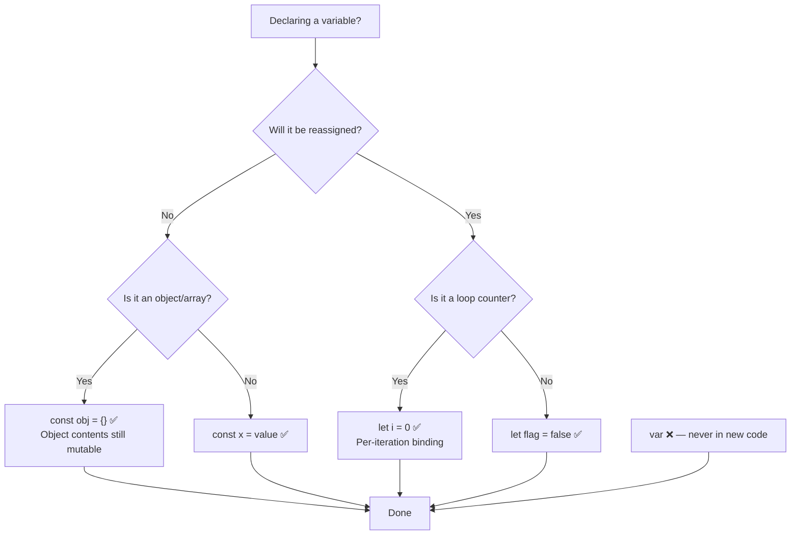

# 02 — Variables & `let`: Complete Interview & Reference Guide

> Variables are named containers for values. JavaScript has three declaration keywords: `var` (function-scoped, legacy), `let` (block-scoped, ES6), and `const` (block-scoped, immutable binding). This chapter focuses on `let` — its scoping rules, Temporal Dead Zone (TDZ), per-iteration binding in loops, and how it solves the classic closure-in-loop bug that plagued `var` code.

---

## Table of Contents

1. [Syntax Reference — End to End](#1-syntax-reference--end-to-end)
2. [Built-in Functions & Methods](#2-built-in-functions--methods)
3. [Deep Insights & Gotchas](#3-deep-insights--gotchas)
4. [Interview-Ready Definitions](#4-interview-ready-definitions)
5. [Tricky Interview Questions](#5-tricky-interview-questions)
6. [Controversial Topics & Ongoing Debates](#6-controversial-topics--ongoing-debates)
7. [Quick Reference Cheat Sheet](#7-quick-reference-cheat-sheet)
8. [Memory Map & Visual Flowchart](#8-memory-map--visual-flowchart)
9. [LinkedIn-Style Post](#9-linkedin-style-post)
10. [Summary & Individual Notes Index](#10-summary--individual-notes-index)

---

## 1. Syntax Reference — End to End

### 1.1 Declaring Variables

```javascript
// let — block-scoped, re-assignable, no re-declaration
let a = 9;
let name = "Raja";
let isActive = true;
let score;          // declared, unassigned → undefined

// const — block-scoped, not re-assignable
const MAX = 100;
const PI = 3.14159;

// var — function-scoped, hoisted, legacy
var x = 10;
```

### 1.2 `let` in a Block

```javascript
{
    let blockScoped = "only inside";
    console.log(blockScoped); // "only inside" ✅
}
console.log(blockScoped); // ReferenceError ❌ — out of scope
```

### 1.3 `let` in a `for` Loop

```javascript
// let — new binding per iteration (correct closure behaviour)
for (let i = 0; i < 3; i++) {
    setTimeout(() => console.log(i), 100);
}
// Output: 0  1  2 ✅

// var — single shared binding (classic bug)
for (var i = 0; i < 3; i++) {
    setTimeout(() => console.log(i), 100);
}
// Output: 3  3  3 ❌
```

### 1.4 Temporal Dead Zone (TDZ)

```javascript
console.log(a); // ReferenceError — TDZ, let not initialised yet
let a = 5;
console.log(a); // 5

// var hoisting (no TDZ — initialised to undefined)
console.log(b); // undefined (no error)
var b = 10;
```

### 1.5 No Re-declaration with `let`

```javascript
let user = "Raja";
let user = "Priyan"; // SyntaxError: Identifier 'user' already declared

var x = 1;
var x = 2; // OK — var allows re-declaration ⚠️
```

### 1.6 The Infinite Loop (Missing Condition)

```javascript
// This runs forever — missing condition is always true
for (let i = 0; ; i++) {
    console.log(i);
}
// Fix: always provide a condition
for (let i = 0; i < 10; i++) {
    console.log(i);
}
```

---

## 2. Built-in Functions & Methods

> This chapter focuses on language syntax rather than built-in methods. Key global values used with variables:

### `undefined`
- Default value of a declared but unassigned variable
- Also returned by functions with no `return` statement

### `typeof` operator
```javascript
let a;
typeof a;         // "undefined"
typeof 42;        // "number"
typeof "hello";   // "string"
typeof true;      // "boolean"
typeof null;      // "object" ⚠️ (historical bug)
typeof {};        // "object"
typeof [];        // "object"
typeof function(){}; // "function"
```

---

## 3. Deep Insights & Gotchas

### 3.1 TDZ — `let` Is Hoisted but NOT Initialised

People say "`let` is not hoisted" — that's inaccurate. `let` IS hoisted (the name is reserved at the top of its scope) but it is NOT initialised until the declaration line runs. Accessing it before that throws `ReferenceError` — this gap is called the Temporal Dead Zone.

```javascript
// TDZ starts here ↓
console.log(x); // ReferenceError
let x = 5;      // TDZ ends here ↑
```

### 3.2 `let` Creates a New Binding Per Loop Iteration

This is the key difference from `var`:
```javascript
for (let i = 0; i < 3; i++) { /* new i each time */ }
for (var i = 0; i < 3; i++) { /* same i shared */    }
```
Each `let` iteration gets its own copy — this is why closures inside `let` loops capture the right value.

### 3.3 Missing Loop Condition = Infinite Loop

```javascript
for (let i = 0; ; i++) { } // ← no condition = always true = infinite
```
V8 treats an empty condition slot as `true` — this will crash Node.js with OOM or freeze the browser tab.

### 3.4 `const` Is Not Truly "Constant" for Objects/Arrays

```javascript
const user = { name: "Raja" };
user.name = "Priyan"; // ✅ OK — the reference is constant, not the object
user = {};            // ❌ TypeError — can't reassign the binding
```

### 3.5 Block-Scoping Applies to `if`, `for`, `while`, `{}`

```javascript
if (true) {
    let x = 10;
}
console.log(x); // ReferenceError — x is block-scoped to the if block
```

---

## 4. Interview-Ready Definitions

### `let`
> **Definition (say this):** "`let` is a block-scoped variable declaration keyword introduced in ES6. It creates a new binding for each block it's declared in, cannot be re-declared in the same scope, and is subject to the Temporal Dead Zone — you can't access it before the declaration line."
> **Follow-up:** "What problem did `let` solve that `var` had?"
> **Answer:** "Two problems: (1) `var` is function-scoped, so it leaks out of blocks like `if` and `for`. (2) `var` shares a single binding across all loop iterations, causing bugs when closures capture the loop counter."

### Temporal Dead Zone (TDZ)
> **Definition (say this):** "The TDZ is the period from the start of a block to the point where a `let` or `const` declaration is evaluated. During the TDZ, accessing the variable throws a ReferenceError even though the name is technically reserved."
> **Follow-up:** "Does this mean `let` is not hoisted?"
> **Answer:** "No — `let` IS hoisted (the name is reserved at scope creation), but it is not initialised. The TDZ is the gap between hoisting and initialisation."

### Block Scope
> **Definition (say this):** "Block scope means a variable is only accessible within the `{}` block it's declared in — including `if`, `for`, `while`, functions, or standalone `{}` blocks."

### `var` vs `let` vs `const`
> **Definition (say this):** "`var` is function-scoped and can be re-declared; `let` is block-scoped, re-assignable, but not re-declarable; `const` is block-scoped and the binding cannot be reassigned — though object properties can still be mutated."

---

## 5. Tricky Interview Questions

---

**Q1:** What is the output?
```javascript
console.log(x);
var x = 5;
```
**A:** `undefined`. `var` is hoisted and initialised to `undefined`. No error.
**Difficulty:** Easy

---

**Q2:** What is the output?
```javascript
console.log(y);
let y = 5;
```
**A:** `ReferenceError`. `let` is in the TDZ — hoisted but not initialised.
**Difficulty:** Medium

---

**Q3:** What is the output?
```javascript
for (var i = 0; i < 3; i++) {
    setTimeout(() => console.log(i), 0);
}
```
**A:** `3  3  3`. All callbacks close over the same `var i`, which equals `3` by the time they run.
**Difficulty:** Medium

---

**Q4:** What is the output?
```javascript
for (let i = 0; i < 3; i++) {
    setTimeout(() => console.log(i), 0);
}
```
**A:** `0  1  2`. Each iteration gets its own `let i` binding.
**Difficulty:** Medium

---

**Q5 — Spot the Bug:**
```javascript
for (let i = 0; ; i++) {
    console.log(i);
}
```
**A:** Infinite loop — the condition slot is empty, treated as always `true`. The program will run until Node.js crashes with out-of-memory or the browser freezes.
**Difficulty:** Medium

---

**Q6:** What is the output?
```javascript
let a = 1;
{
    let a = 2;
    console.log(a);
}
console.log(a);
```
**A:** `2` then `1`. Inner block has its own `a` — shadow variable. Outer `a` is unchanged.
**Difficulty:** Medium

---

**Q7:** Can you re-declare a `let` variable?
```javascript
let x = 1;
let x = 2;
```
**A:** `SyntaxError: Identifier 'x' has already been declared`. `let` (and `const`) cannot be re-declared in the same scope. `var` can.
**Difficulty:** Easy

---

**Q8:** Is `const` truly constant?
```javascript
const user = { name: "Raja" };
user.name = "Priyan";
console.log(user.name);
```
**A:** `"Priyan"`. `const` makes the binding constant (you can't reassign `user = ...`), not the value. Objects and arrays can still be mutated.
**Difficulty:** Medium

---

**Q9:** What is the output?
```javascript
{
    let x = 10;
    var y = 20;
}
console.log(typeof x);
console.log(y);
```
**A:** `"undefined"` (typeof doesn't throw for undeclared) then `20`. `let x` is block-scoped (gone). `var y` leaks out of the block.
**Difficulty:** Hard

---

**Q10:** When is `let` preferable over `const`?
**A:** Use `let` when the variable needs to be reassigned — e.g., a loop counter, an accumulator, or a flag that flips. Use `const` for everything else (encourages immutability by default).
**Difficulty:** Easy

---

## 6. Controversial Topics & Ongoing Debates

### `var` — Should It Ever Be Used?

**The debate:** Is there any valid reason to use `var` in modern JavaScript?

**One side:** `var` still works and is sometimes seen in legacy codebases. Some developers argue it's fine for top-level global declarations.

**Other side:** `var`'s function scoping, hoisting to `undefined`, and re-declaration allowance are all sources of bugs. ESLint's `no-var` rule and every modern style guide (Airbnb, Google) forbid `var`.

**Current consensus:** Never use `var` in new code. Always use `const` by default; `let` when reassignment is needed. Leave `var` in the past.

---

### `const` by Default — Is It Premature Optimisation?

**The debate:** Should you default to `const` even when you're not sure if a variable will be reassigned?

**One side:** `const` documents intent — it signals "this value won't change." It also prevents accidental reassignment bugs.

**Other side:** Constantly changing `const` to `let` as you write code is noisy. Some teams prefer `let` everywhere for simplicity.

**Current consensus:** Prefer `const` by default. Switch to `let` when reassignment is needed. Never use `var`.

---

## 7. Quick Reference Cheat Sheet

### `var` vs `let` vs `const`

| Feature | `var` | `let` | `const` |
|---------|-------|-------|---------|
| Scope | Function | Block | Block |
| Hoisted | Yes (as `undefined`) | Yes (TDZ) | Yes (TDZ) |
| Re-declaration | ✅ | ❌ SyntaxError | ❌ SyntaxError |
| Re-assignment | ✅ | ✅ | ❌ TypeError |
| Loop binding | Shared | Per-iteration | Per-iteration |
| When to use | Never (legacy) | Counters, flags | Everything else |

### Decision Rule

```
Need to reassign?
  ├── No  → const  ✅ (prefer this)
  └── Yes → let    ✅
             └── Never → var ❌
```

### TDZ Cheat

```javascript
// var: hoisted as undefined, no TDZ
console.log(a); // undefined
var a = 5;

// let/const: hoisted but uninitialized (TDZ)
console.log(b); // ReferenceError ← TDZ
let b = 5;
```

---

## 8. Memory Map & Visual Flowchart

### A) Mind Map

```
[JavaScript Variables]
  ├── var (legacy)
  │     ├── Function-scoped ⚠️
  │     ├── Hoisted as undefined ⚠️
  │     ├── Re-declarable ⚠️
  │     └── Shared loop binding ❌ (closure bug)
  ├── let (modern) ✅
  │     ├── Block-scoped
  │     ├── TDZ — cannot use before declaration ⚠️
  │     ├── No re-declaration
  │     ├── Re-assignable ✅
  │     └── New binding per loop iteration ✅
  └── const (modern) ✅
        ├── Block-scoped
        ├── TDZ — same as let
        ├── No re-declaration
        ├── No re-assignment ❌ (TypeError)
        └── Object/Array CONTENTS still mutable ⚠️
```

### B) Flowchart — Which Keyword to Use?



### C) Execution Trace — TDZ Step by Step

```javascript
// What V8 does when it enters a block with let
let x = 5;
```

| Engine Phase | What happens to `x` |
|-------------|---------------------|
| Block entry | Name `x` is reserved in scope — **TDZ begins** |
| Before line `let x = 5` | Any access → `ReferenceError` |
| Line `let x = 5` is evaluated | `x` is initialised to `5` — **TDZ ends** |
| After declaration | `x` is accessible normally |

---

## 9. LinkedIn-Style Post

### 📢 LinkedIn Post

> **Most JS beginners learn `var`. Most professionals never use it.**
>
> Here's the closure-in-loop bug that `var` causes — and why `let` fixes it:
>
> ```javascript
> for (var i = 0; i < 3; i++) {
>     setTimeout(() => console.log(i), 100);
> }
> // Output: 3  3  3  ← All see the final value of i
> ```
>
> All three callbacks share the **same `var i`** — by the time they run, the loop has finished and `i === 3`.
>
> Replace `var` with `let`:
>
> ```javascript
> for (let i = 0; i < 3; i++) {
>     setTimeout(() => console.log(i), 100);
> }
> // Output: 0  1  2  ✅
> ```
>
> `let` creates a **new binding for each iteration**. Each callback captures its own `i`.
>
> ⚠️ Also watch out for the TDZ:
> ```
> console.log(x); // ReferenceError — TDZ!
> let x = 5;
> ```
>
> 💡 **Simple rule:**
> - `const` → when value won't change (default)
> - `let` → when reassignment is needed
> - `var` → never, in 2025
>
> **Key Takeaway:** `var` shares one binding for all loop iterations. `let` gives each iteration its own. This one difference prevents an entire class of async bugs.
>
> #JavaScript #ES6 #WebDev #CodingTips #LearnJavaScript

---

## 10. Summary & Individual Notes Index

| File | Topic |
|------|-------|
| [Let_Keyword_and_Loops_IQ.md](./Let_Keyword_and_Loops_IQ.md) | `let` keyword — block scoping, TDZ, per-iteration binding, infinite loop from empty condition |
