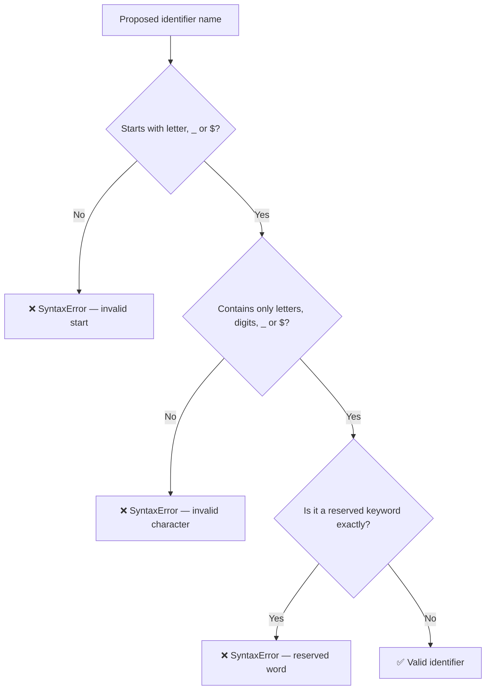

# 03 — Identifiers & Comments: Complete Interview & Reference Guide

> An identifier is any name given to a variable, function, class, or parameter in JavaScript. Identifiers follow strict rules: they must start with a letter, `$`, or `_`; can contain letters, digits, `$`, and `_`; are case-sensitive; and cannot be reserved keywords. This chapter also covers JS naming conventions (camelCase, PascalCase, snake_case, SCREAMING_SNAKE_CASE) and single-line / multi-line comments.

---

## Table of Contents

1. [Syntax Reference — End to End](#1-syntax-reference--end-to-end)
2. [Built-in Functions & Methods](#2-built-in-functions--methods)
3. [Deep Insights & Gotchas](#3-deep-insights--gotchas)
4. [Interview-Ready Definitions](#4-interview-ready-definitions)
5. [Tricky Interview Questions](#5-tricky-interview-questions)
6. [Controversial Topics & Ongoing Debates](#6-controversial-topics--ongoing-debates)
7. [Quick Reference Cheat Sheet](#7-quick-reference-cheat-sheet)
8. [Memory Map & Visual Flowchart](#8-memory-map--visual-flowchart)
9. [LinkedIn-Style Post](#9-linkedin-style-post)
10. [Summary & Individual Notes Index](#10-summary--individual-notes-index)

---

## 1. Syntax Reference — End to End

### 1.1 Valid Identifiers

```javascript
let a = 10;             // single letter ✅
let _private = "x";     // underscore start ✅
let $price = 99;        // dollar sign start ✅
let item1 = "first";    // letter then digit ✅
let _temp2 = 0;         // underscore then digit ✅
let a1_b2 = true;       // mixed ✅
let _ = 10;             // just underscore ✅
let $ = 10;             // just dollar ✅

// Unicode is valid (though rarely used)
let café = "coffee";
let 变量 = "variable";
```

### 1.2 Invalid Identifiers

```javascript
// let 1stPlace = "no";    // ❌ starts with digit
// let 2ndItem = "no";     // ❌ starts with digit
// let my-name = "no";     // ❌ hyphen not allowed
// let my name = "no";     // ❌ space not allowed
// let my@name = "no";     // ❌ @ not allowed
// let const = "no";       // ❌ reserved keyword
// let function = "no";    // ❌ reserved keyword
// let class = "no";       // ❌ reserved keyword

let Function = "ok";    // ✅ case-sensitive — Function ≠ function
```

### 1.3 Case Sensitivity

```javascript
let Name = "raja";      // different variable from:
let name = "priyan";    // case matters — Name ≠ name
```

### 1.4 Naming Conventions

```javascript
// 1. camelCase — variables, functions (JS standard)
let userName = "Raja";
let totalPrice = 99.99;
let isLoggedIn = true;
function getUserInfo() { return "info"; }

// 2. PascalCase — classes, constructors, React components
class UserProfile { }
function Person() { }

// 3. snake_case — less common in JS, common in Python/DB
let user_name = "snake";
let total_price = 49.99;

// 4. SCREAMING_SNAKE_CASE — constants
const MAX_SIZE = 100;
const API_KEY = "abc123";
const DATABASE_URL = "localhost";
```

### 1.5 Comments

```javascript
// Single-line comment — ignored by the engine

/*
  Multi-line comment
  Can span many lines
  Used for documentation blocks
*/

/**
 * JSDoc comment — generates documentation
 * @param {string} name - The user's name
 * @returns {string} A greeting
 */
function greet(name) {
    return `Hello, ${name}`;
}
```

---

## 2. Built-in Functions & Methods

> This chapter is about language syntax (naming rules) rather than runtime functions. The key keyword contexts:

### Reserved Keywords (cannot be used as identifiers)
```
break, case, catch, class, const, continue, debugger, default, delete,
do, else, export, extends, false, finally, for, function, if, import,
in, instanceof, let, new, null, return, static, super, switch, this,
throw, true, try, typeof, var, void, while, with, yield
```

### Future Reserved Words (avoid even though some are currently valid)
```
enum, await, implements, interface, package, private, protected, public
```

---

## 3. Deep Insights & Gotchas

### 3.1 Reserved Keywords Are Case-Sensitive

```javascript
let function = "x"; // ❌ SyntaxError — `function` is reserved
let Function = "x"; // ✅ OK — capital F, not the keyword
let If = true;      // ✅ OK — not the keyword `if`
```

### 3.2 `$` and `_` Have Special Conventional Meanings

```javascript
let $element = document.querySelector("#id"); // jQuery convention
let _privateField = "internal";               // _ prefix = "don't touch"
let __proto__ = {};   // ⚠️ dangerous — do not use this identifier name
```

### 3.3 Unicode Identifiers Are Valid but Problematic

```javascript
let café = "coffee";  // valid JavaScript
let 変量 = 42;         // valid JavaScript
// But: most teams forbid Unicode identifiers for portability
// (keyboard differences, copy-paste issues, regex matching)
```

### 3.4 Identifiers Are Case-Sensitive — A Common Source of Bugs

```javascript
let userName = "Raja";
console.log(username); // ReferenceError — u ≠ U
console.log(UserName); // ReferenceError — U ≠ u
```

### 3.5 Comments Are Completely Ignored by the Engine

Comments have zero runtime cost. They are stripped during parsing. Over-commenting is a style issue, not a performance issue.

---

## 4. Interview-Ready Definitions

### Identifier
> **Definition (say this):** "An identifier is a name given to a variable, function, class, or parameter. It must start with a letter, `$`, or `_`; can contain letters, digits, `$`, and `_`; is case-sensitive; and cannot be a reserved keyword."
> **Follow-up:** "Can you start an identifier with a digit?"
> **Answer:** "No — `1stPlace` is a SyntaxError. Identifiers must start with a letter, `$`, or `_`."

### camelCase
> **Definition (say this):** "camelCase is the JS convention for variable and function names: the first word is lowercase, every subsequent word starts with an uppercase letter. Example: `getUserName`, `totalPrice`, `isLoggedIn`."

### PascalCase
> **Definition (say this):** "PascalCase (also called UpperCamelCase) is the convention for class names and constructors in JS: every word starts with an uppercase letter. Example: `UserProfile`, `ShoppingCart`."

### SCREAMING_SNAKE_CASE
> **Definition (say this):** "SCREAMING_SNAKE_CASE (all uppercase, words separated by underscores) is the convention for constants whose values should never change at runtime. Example: `MAX_RETRIES`, `API_BASE_URL`."

### Reserved Keyword
> **Definition (say this):** "A reserved keyword is a word that JavaScript has pre-assigned a specific meaning to — like `let`, `const`, `if`, `for`, `class`. They cannot be used as identifiers. However, they are case-sensitive, so `Let` or `IF` are valid (though confusing and discouraged)."

---

## 5. Tricky Interview Questions

---

**Q1:** Which of these is a valid identifier?
```javascript
let 1stName = "x";
let _1stName = "x";
let $1stName = "x";
```
**A:** `_1stName` ✅ and `$1stName` ✅ are valid. `1stName` ❌ is a SyntaxError — identifiers cannot start with a digit.
**Difficulty:** Easy

---

**Q2:** Is `let Function = "x"` valid?
**A:** Yes ✅ — `Function` (capital F) is not the reserved keyword `function` (lowercase). JavaScript identifiers are case-sensitive. However, it's terrible practice as it's confusing.
**Difficulty:** Medium

---

**Q3:** What is the output?
```javascript
let Name = "Raja";
let name = "Priyan";
console.log(Name, name);
```
**A:** `"Raja"  "Priyan"` — `Name` and `name` are completely separate identifiers.
**Difficulty:** Easy

---

**Q4:** Which identifier names are typically avoided by convention and why?
**A:**
- `_` alone — used as "intentionally unused" in destructuring (`let [_, second] = arr`)
- `$` alone — used by jQuery to mean the jQuery object
- `__proto__` — dangerous, affects prototype chain
- Single letters (`a`, `b`, `x`) — fine for temporary/loop vars, bad for meaningful data
**Difficulty:** Medium

---

**Q5 — Spot the Bug:**
```javascript
let totalAmount = 100;
console.log(totalamount);
```
**A:** `ReferenceError: totalamount is not defined`. JavaScript identifiers are case-sensitive — `totalAmount` ≠ `totalamount`. This is one of the most common typo bugs.
**Difficulty:** Easy

---

**Q6:** What naming convention is used for each of the following in JavaScript?
- A variable storing user age
- A class representing a shopping cart
- A function that fetches user data
- A constant for maximum retry attempts
**A:**
- `userAge` — camelCase
- `ShoppingCart` — PascalCase
- `fetchUserData` — camelCase
- `MAX_RETRY_ATTEMPTS` — SCREAMING_SNAKE_CASE
**Difficulty:** Easy

---

**Q7:** Can Unicode characters be used in identifiers?
**A:** Yes — the JS spec allows Unicode letters and Unicode escape sequences (`\u0041` for `A`). However, most teams prohibit them in style guides due to keyboard differences, encoding issues, and regex complexity.
**Difficulty:** Medium

---

**Q8:** Do comments affect performance?
**A:** No. Comments are stripped by the parser before any execution begins. They have zero runtime cost. The concern with over-commenting is code readability, not performance.
**Difficulty:** Easy

---

**Q9:** What is a JSDoc comment and when would you use it?
```javascript
/**
 * Calculates the sum of two numbers.
 * @param {number} a - First number
 * @param {number} b - Second number
 * @returns {number} The sum
 */
function add(a, b) { return a + b; }
```
**A:** JSDoc comments (`/** ... */`) are a structured documentation format. IDEs (VS Code) read them to provide IntelliSense autocomplete, type hints, and hover documentation. TypeScript also uses JSDoc annotations for type checking in `.js` files.
**Difficulty:** Medium

---

## 6. Controversial Topics & Ongoing Debates

### camelCase vs snake_case in JavaScript

**The debate:** JavaScript convention is camelCase, but Python/database convention is snake_case. When JS talks to a Python backend or a SQL database, which should win in the JS code?

**One side:** Always use camelCase in JS regardless of the backend. Use a mapping/transform layer at the API boundary.

**Other side:** Use snake_case throughout if the team is full-stack Python/Django — reduces mental context-switching.

**Current consensus:** Use camelCase in JS. Use a serialization layer (e.g., `humps` library or manual mapping) to convert between camelCase (JS) and snake_case (backend/DB) at the API boundary. Don't mix conventions in the same codebase.

---

### `_` Prefix for "Private" — Is It Enough?

**The debate:** Using `_fieldName` to signal a private field — is this sufficient?

**Reality:** `_fieldName` is just a convention. The variable is still fully accessible externally. It only communicates intent, not enforcement.

**ES2022 answer:** Use true private class fields with `#`:
```javascript
class User {
    #password = "secret";  // truly private — SyntaxError to access externally
}
```

---

## 7. Quick Reference Cheat Sheet

### Identifier Rules

| Rule | ✅ Valid | ❌ Invalid |
|------|---------|-----------|
| Start char | Letter, `_`, `$` | Digit, `-`, `@`, `#`, space |
| After start | Letter, digit, `_`, `$` | `-`, `@`, `#`, space |
| Reserved word | `Function`, `If` (capital) | `function`, `if` (lowercase) |
| Case sensitive | `Name` ≠ `name` | — |

### Naming Conventions

| Convention | Style | Use for |
|-----------|-------|---------|
| camelCase | `myVariable` | Variables, functions |
| PascalCase | `MyClass` | Classes, constructors, React components |
| snake_case | `my_variable` | Rare in JS; common in Python/DB |
| SCREAMING_SNAKE | `MAX_SIZE` | Constants |
| `_prefix` | `_private` | Convention for "internal" (not enforced) |
| `#prefix` | `#private` | True private class fields (ES2022) |

### Comment Syntax

```javascript
// Single-line comment

/* Multi-line
   comment */

/** JSDoc comment
 * @param {type} name - description
 * @returns {type} description
 */
```

---

## 8. Memory Map & Visual Flowchart

### A) Mind Map

```
[Identifiers & Comments]
  ├── Identifier Rules
  │     ├── Valid start: letter, _, $ ✅
  │     ├── Invalid start: digit, -, @, space ❌
  │     ├── After start: letters, digits, _, $ ✅
  │     ├── Case-sensitive: Name ≠ name ⚠️
  │     └── Reserved keywords forbidden ❌
  ├── Naming Conventions
  │     ├── camelCase → variables, functions ✅
  │     ├── PascalCase → classes, constructors ✅
  │     ├── SCREAMING_SNAKE → const values ✅
  │     ├── snake_case → rare in JS ⚠️
  │     └── _prefix → "private" convention (not enforced) ⚠️
  ├── Reserved Keywords
  │     ├── const, let, var, function, class...
  │     ├── Case-sensitive: `function` ❌ but `Function` ✅
  │     └── Future reserved: enum, await, interface...
  └── Comments
        ├── // single-line (no runtime cost)
        ├── /* multi-line */
        └── /** JSDoc → IDE autocomplete + TypeScript types */
```

### B) Flowchart — Is This a Valid Identifier?



### C) Execution Trace — Case Sensitivity Bug

```javascript
let totalAmount = 100;
console.log(totalamount); // ReferenceError
```

| Step | Engine looks for | Found? | Result |
|------|-----------------|--------|--------|
| 1 | `totalAmount` in scope | ✅ | Stored = 100 |
| 2 | `totalamount` in scope | ❌ | `ReferenceError` |

The engine treats `totalAmount` and `totalamount` as **completely different names**.

---

## 9. LinkedIn-Style Post

### 📢 LinkedIn Post

> **One typo, one ReferenceError. It happens to everyone.**
>
> ```javascript
> let totalAmount = 100;
> console.log(totalamount); // ReferenceError ❌
> ```
>
> JavaScript identifiers are **case-sensitive**. `totalAmount` and `totalamount` are two completely different names to the engine.
>
> But that's just the start. Here are the identifier rules most people only half-remember:
>
> ✅ Can start with: letter, `_`, `$`
> ❌ Cannot start with: digit, `-`, `@`, space
>
> ```javascript
> let _private = "ok";   // ✅
> let $price = 99;       // ✅
> let 1stItem = "nope";  // ❌ SyntaxError
> let my-var = "nope";   // ❌ SyntaxError
> ```
>
> And the one that trips everyone:
>
> ⚠️ `function` is reserved → `Function` (capital F) is NOT.
> Both are bad practice, but only one causes a SyntaxError.
>
> 💡 **Naming conventions that matter:**
> - `camelCase` → variables & functions
> - `PascalCase` → classes & constructors
> - `SCREAMING_SNAKE_CASE` → constants
>
> **Key Takeaway:** Identifiers must start with a letter, `_`, or `$` — never a digit. And JavaScript is case-sensitive, every single character.
>
> #JavaScript #WebDev #CodingTips #CleanCode #LearnToCode

---

## 10. Summary & Individual Notes Index

| File | Topic |
|------|-------|
| [03_Identifier_Rules_Basics_IQ.md](./03_Identifier_Rules_Basics_IQ.md) | Basic identifier rules — valid starts, invalid chars |
| [04_Identifier_Naming_Conventions_IQ.md](./04_Identifier_Naming_Conventions_IQ.md) | camelCase, PascalCase, snake_case, SCREAMING_SNAKE |
| [05_Comments_IQ.md](./05_Comments_IQ.md) | Single-line, multi-line, JSDoc comments |
| [06_Identifier_Rules_Advanced_IQ.md](./06_Identifier_Rules_Advanced_IQ.md) | Reserved keywords, Unicode identifiers, advanced gotchas |
