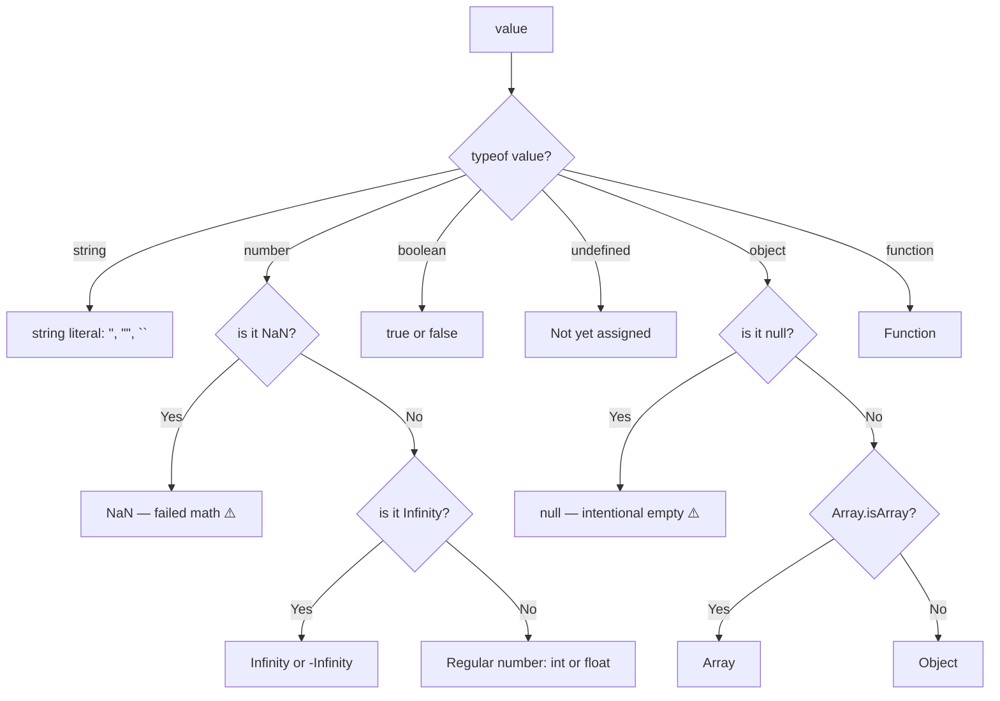

# 04 — Literals & Data Types: Complete Interview & Reference Guide

## Overview

A literal is a fixed value written directly in code — `42`, `"hello"`, `true`, `null`. JavaScript has 7 primitive types (string, number, bigint, boolean, undefined, null, symbol) and one complex type (object). This chapter covers all literal forms, the special values `null` and `undefined`, JavaScript's single unified `number` type (IEEE 754), and the `typeof` operator. Understanding data types is crucial for avoiding common JavaScript gotchas.

---

## Table of Contents

1. [Syntax Reference — End to End](#1-syntax-reference--end-to-end)
2. [Built-in Functions & Methods](#2-built-in-functions--methods)
3. [Deep Insights & Gotchas](#3-deep-insights--gotchas)
4. [Interview-Ready Definitions](#4-interview-ready-definitions)
5. [Tricky Interview Questions](#5-tricky-interview-questions)
6. [Controversial Topics & Ongoing Debates](#6-controversial-topics--ongoing-debates)
7. [Quick Reference Cheat Sheet](#7-quick-reference-cheat-sheet)
8. [Memory Map & Visual Flowchart](#8-memory-map--visual-flowchart)
9. [LinkedIn-Style Post](#9-linkedin-style-post)
10. [Summary & Individual Notes Index](#10-summary--individual-notes-index)

---

## 1. Syntax Reference — End to End

### 1.1 All Literal Types

```javascript
// String literals
let s1 = "double quotes";
let s2 = 'single quotes';
let s3 = `template literal ${1 + 1}`; // ES6 — evaluates expressions

// Number literals
let decimal = 42;          // base 10
let float   = 3.14;        // floating point
let binary  = 0b1010;      // base 2 → 10
let octal   = 0o52;        // base 8 → 42
let hex     = 0x2A;        // base 16 → 42
let exp     = 1.5e3;       // exponential → 1500
let negExp  = 1.5e-3;      // → 0.0015

// Boolean literals
let yes = true;
let no  = false;

// Null literal
let empty = null;           // intentional absence of value

// Undefined — not a literal, but a value
let unset;                  // implicitly undefined
let explicit = undefined;   // explicit assignment (rare, avoid)

// BigInt literal (ES2020)
let big = 9007199254740991n; // n suffix

// Object literal
let user = { name: "Raja", age: 25 };

// Array literal (array is an object)
let colors = ["red", "green", "blue"];
```

### 1.2 `typeof` — Inspecting Data Types

```javascript
typeof "hello"      // "string"
typeof 42           // "number"
typeof 3.14         // "number"    (no separate float type!)
typeof true         // "boolean"
typeof undefined    // "undefined"
typeof null         // "object"    ⚠️ HISTORICAL BUG
typeof {}           // "object"
typeof []           // "object"    (arrays are objects)
typeof function(){} // "function"
typeof Symbol()     // "symbol"
typeof 42n          // "bigint"
```

### 1.3 `null` vs `undefined`

```javascript
// undefined — JS assigned it (variable declared, not initialised)
let a;
console.log(a);           // undefined
console.log(typeof a);    // "undefined"

// null — DEVELOPER assigned it (intentional emptiness)
let profilePicture = null;
console.log(profilePicture);        // null
console.log(typeof profilePicture); // "object" ⚠️

// Equality behaviour
console.log(null == undefined);  // true  (loose equality)
console.log(null === undefined); // false (strict equality — different types)
```

---

## 2. Built-in Functions & Methods

### Number Built-ins

```javascript
Number.isInteger(42);       // true
Number.isInteger(3.14);     // false
Number.isFinite(Infinity);  // false
Number.isNaN(NaN);          // true (reliable)
isNaN("hello");             // true ⚠️ (global isNaN coerces — unreliable)
Number.isNaN("hello");      // false ✅ (no coercion)

Number.parseInt("42px");    // 42
Number.parseFloat("3.14x"); // 3.14
Number("42");               // 42
Number(null);               // 0
Number(undefined);          // NaN
Number(true);               // 1
Number(false);              // 0
Number("");                 // 0
```

### `typeof` Operator

```javascript
typeof value  // returns a string: "string"|"number"|"boolean"|
              //   "undefined"|"object"|"function"|"symbol"|"bigint"
```

---

## 3. Deep Insights & Gotchas

### 3.1 `typeof null === "object"` — The 27-Year Bug

In the original 1995 JS implementation, values were stored with a type tag. The tag `000` meant object — and null's bit pattern was all zeros, so it matched the object tag. This was a bug, not a design choice. It was never fixed to avoid breaking the web.

**Rule:** Never use `typeof` to check for null. Use `value === null`.

### 3.2 JavaScript Has Only ONE Number Type

There's no `int`, `float`, `double` in JavaScript. All numbers are **IEEE 754 double-precision 64-bit** floating-point. This includes:
- Integers (up to 2^53 - 1 exactly)
- Floats
- `Infinity`, `-Infinity`
- `NaN` (Not a Number — but `typeof NaN === "number"` !)

```javascript
typeof NaN    // "number" ⚠️ — "Not a Number" has type "number"
0.1 + 0.2     // 0.30000000000000004 ⚠️ — IEEE 754 floating point precision
```

### 3.3 `null == undefined` but `null !== undefined`

```javascript
null == undefined   // true  — loose equality special rule
null === undefined  // false — different types
null == 0           // false — null only loosely equals null/undefined
null == false       // false
```

### 3.4 `NaN !== NaN` — NaN Is Never Equal to Itself

```javascript
NaN === NaN // false — this is per the IEEE 754 spec
NaN == NaN  // false
// Check for NaN with:
Number.isNaN(NaN)       // true ✅
isNaN(NaN)              // true ✅ (but also coerces, so isNaN("x") = true ⚠️)
Object.is(NaN, NaN)     // true ✅
```

### 3.5 Template Literals Allow Expressions, Not Just Variables

```javascript
let a = 5, b = 3;
console.log(`Sum is ${a + b}`);      // "Sum is 8"
console.log(`${a > b ? "big" : "small"}`); // "big"
console.log(`${JSON.stringify({x:1})}`);   // "{"x":1}"
```

### 3.6 Number Bases Are All `typeof "number"`

```javascript
let hex = 0xFF;
console.log(hex);          // 255 (always displayed as decimal)
console.log(typeof hex);   // "number" (always)
```

---

## 4. Interview-Ready Definitions

### Literal
> **Definition (say this):** "A literal is a value written directly in source code without any computation. Examples: `42`, `"hello"`, `true`, `null`, `[1,2,3]`, `{ a: 1 }`."

### `null`
> **Definition (say this):** "`null` is a primitive value that represents intentional absence of any object value. It is explicitly assigned by the developer to indicate 'no value here'. Its `typeof` returns `"object"` — a historical bug in JavaScript."
> **Follow-up:** "How is `null` different from `undefined`?"
> **Answer:** "`undefined` means a variable exists but has not been given a value — JavaScript sets it automatically. `null` means the developer deliberately set the value to 'nothing'. `null == undefined` is `true`, but `null === undefined` is `false`."

### IEEE 754
> **Definition (say this):** "JavaScript numbers follow the IEEE 754 double-precision 64-bit floating-point standard. This means all numbers — integers and floats alike — are stored in the same format, which causes `0.1 + 0.2 !== 0.3` due to binary rounding."

### `NaN`
> **Definition (say this):** "`NaN` (Not a Number) is a special numeric value indicating a failed mathematical operation. Paradoxically, `typeof NaN === 'number'`. It is not equal to anything — not even itself: `NaN !== NaN`. Use `Number.isNaN()` to detect it."

### `typeof`
> **Definition (say this):** "`typeof` is a unary operator that returns a string describing the type of its operand. It has one known quirk: `typeof null === 'object'` — a historical bug that was never fixed."

---

## 5. Tricky Interview Questions

---

**Q1:** What is the output?
```javascript
console.log(typeof null);
console.log(typeof undefined);
```
**A:** `"object"` then `"undefined"`. The `null` result is a 27-year-old JS bug — `null` is not an object.
**Difficulty:** Medium

---

**Q2:** What is the output?
```javascript
console.log(0.1 + 0.2 === 0.3);
```
**A:** `false`. Due to IEEE 754 binary floating-point representation, `0.1 + 0.2` equals `0.30000000000000004`. Use `Math.abs((0.1+0.2) - 0.3) < Number.EPSILON` for float comparison.
**Difficulty:** Medium

---

**Q3:** What is the output?
```javascript
console.log(null == undefined);
console.log(null === undefined);
console.log(null == 0);
console.log(null == false);
```
**A:** `true`, `false`, `false`, `false`. `null` loosely equals only `null` and `undefined` — not `0`, `""`, or `false`.
**Difficulty:** Hard

---

**Q4:** What is the output?
```javascript
console.log(typeof NaN);
console.log(NaN === NaN);
console.log(Number.isNaN(NaN));
```
**A:** `"number"`, `false`, `true`. `NaN` has type `"number"` (counterintuitive). It is never equal to itself. `Number.isNaN()` is the reliable detector.
**Difficulty:** Hard

---

**Q5:** What is the difference between `isNaN()` and `Number.isNaN()`?
**A:** `isNaN()` (global) coerces its argument to a number first — so `isNaN("hello")` returns `true` (because `Number("hello")` is `NaN`). `Number.isNaN()` does NOT coerce — it only returns `true` if the value is literally `NaN`. Always prefer `Number.isNaN()`.
**Difficulty:** Medium

---

**Q6:** What is the output?
```javascript
let x;
console.log(x == null);
console.log(x === null);
```
**A:** `true` then `false`. `x` is `undefined`. `undefined == null` is `true` (loose). `undefined === null` is `false` (different types, strict).
**Difficulty:** Medium

---

**Q7:** Name all primitive types in JavaScript.
**A:** 7 primitives: `string`, `number`, `bigint`, `boolean`, `undefined`, `null`, `symbol`. Everything else is an `object` (including arrays, functions are objects too, though `typeof function` returns `"function"`).
**Difficulty:** Easy

---

**Q8:** What is the output?
```javascript
console.log(0b1010);
console.log(0o52);
console.log(0x2A);
```
**A:** `10`, `42`, `42` — binary, octal, and hex literals all display as decimal. `typeof` for all three is `"number"`.
**Difficulty:** Easy

---

**Q9:** What is BigInt and when would you use it?
**A:** BigInt (`42n`) is a numeric type that can represent integers of arbitrary size. Regular JS numbers can exactly represent integers up to `2^53 - 1` (Number.MAX_SAFE_INTEGER). Beyond that, precision is lost. Use BigInt for large IDs, cryptographic values, or financial calculations requiring arbitrary precision.
**Difficulty:** Medium

---

**Q10:** What is the output?
```javascript
console.log(Number(null));
console.log(Number(undefined));
console.log(Number(""));
console.log(Number(true));
console.log(Number(false));
```
**A:** `0`, `NaN`, `0`, `1`, `0`. These coercion rules are important for understanding implicit type coercion in operators.
**Difficulty:** Hard

---

## 6. Controversial Topics & Ongoing Debates

### `typeof null === "object"` — Fix It or Keep It?

**The debate:** TC39 has periodically discussed fixing this. A fix was even proposed and drafted.

**Why it wasn't fixed:** Too much existing code relies on `typeof x === "object"` as a null check (even though it's wrong). Fixing it would break those checks — a backward-compatibility nightmare.

**Current state:** It stays. Use `value === null` for null checks, not `typeof`.

---

### `null` vs `undefined` — Which Should You Use?

**The debate:** When should you explicitly assign `null` vs leaving a variable as `undefined`?

**Convention:**
- `undefined` = variable declared but no meaningful value yet (don't assign explicitly)
- `null` = value intentionally cleared or "no object" returned (assign explicitly)

```javascript
function getUser(id) {
    if (id === 0) return null; // "no user" — intentional
    return { id, name: "Raja" };
}
let user = getUser(0);  // null — explicit
let other;              // undefined — not yet set
```

---

## 7. Quick Reference Cheat Sheet

### Primitive Types

| Type | Example | `typeof` |
|------|---------|---------|
| string | `"hello"`, `'x'`, `` `template` `` | `"string"` |
| number | `42`, `3.14`, `NaN`, `Infinity` | `"number"` |
| bigint | `42n` | `"bigint"` |
| boolean | `true`, `false` | `"boolean"` |
| undefined | `undefined`, unassigned var | `"undefined"` |
| null | `null` | `"object"` ⚠️ |
| symbol | `Symbol("x")` | `"symbol"` |

### `null` vs `undefined`

| | `null` | `undefined` |
|-|--------|-------------|
| Who sets it? | Developer | JavaScript |
| Meaning | Intentional empty | Not yet assigned |
| `typeof` | `"object"` ⚠️ | `"undefined"` |
| `== null` | `true` | `true` |
| `=== null` | `true` | `false` |

### Number Literals

```javascript
42        // decimal
0b1010    // binary (10)
0o52      // octal  (42)
0x2A      // hex    (42)
1.5e3     // exponential (1500)
42n       // BigInt
```

---

## 8. Memory Map & Visual Flowchart

### A) Mind Map

```
[Literals & Data Types]
  ├── Primitive Types (7)
  │     ├── string  → "", '', ``
  │     ├── number  → 42, 3.14, NaN, Infinity, 0b, 0o, 0x
  │     ├── bigint  → 42n
  │     ├── boolean → true, false
  │     ├── null    → intentional empty ⚠️ typeof = "object"
  │     ├── undefined → unassigned / JS sets it
  │     └── symbol  → unique keys
  ├── Complex Type (1)
  │     └── object  → {}, [], function (typeof = "function")
  ├── typeof gotchas
  │     ├── typeof null   = "object" ⚠️ (bug, use === null)
  │     ├── typeof NaN    = "number" ⚠️ (use Number.isNaN)
  │     └── typeof []     = "object" ⚠️ (use Array.isArray)
  └── null vs undefined
        ├── null == undefined  → true ⚠️
        ├── null === undefined → false ✅
        └── null only == null or undefined, never 0/false/""
```

### B) Flowchart — What Is the Type?



### C) Execution Trace — `typeof null` Gotcha

```javascript
let x = null;
console.log(typeof x);      // "object"
console.log(x === null);    // true
console.log(x == undefined);// true
```

| Expression | Result | Why |
|-----------|--------|-----|
| `typeof null` | `"object"` | Historical JS bug — type tag `000` |
| `null === null` | `true` | Strict equality — same value and type |
| `null == undefined` | `true` | Special loose equality rule |
| `null == 0` | `false` | null only loosely equals null/undefined |

---

## 9. LinkedIn-Style Post

### 📢 LinkedIn Post

> **`typeof null === "object"`. This is not a feature. It's a 30-year-old bug.**
>
> In 1995, JavaScript values stored a type tag with each value. The tag for objects was `000`. And `null`? All zeros in memory. Same tag → same `typeof`. The bug shipped.
>
> It was never fixed because millions of sites wrote:
> ```javascript
> if (typeof x === "object") { /* ... */ }
> ```
> Fixing it would break them all.
>
> Here are the gotchas that follow:
>
> ❌ `typeof null` → `"object"` (not "null")
> ❌ `typeof NaN` → `"number"` (Not-a-Number has type number?!)
> ❌ `typeof []` → `"object"` (arrays are objects)
>
> The fixes:
> ```javascript
> value === null          // check for null ✅
> Number.isNaN(value)     // check for NaN ✅
> Array.isArray(value)    // check for array ✅
> ```
>
> ⚠️ And one more: `null == undefined` is `true`, but `null === undefined` is `false`.
>
> **Key Takeaway:** `typeof` has three known wrong answers: null, NaN, and arrays. Know the correct alternatives for each.
>
> #JavaScript #WebDev #JavaScriptTips #Debugging #LearnToCode

---

## 10. Summary & Individual Notes Index

| File | Topic |
|------|-------|
| [07_Literals_and_Numbers_IQ.md](./07_Literals_and_Numbers_IQ.md) | All literal types, number bases (decimal/binary/octal/hex/exponential), `typeof` |
| [08_Null_vs_Undefined.md](./08_Null_vs_Undefined.md) | `null` vs `undefined` — meaning, `typeof`, equality traps |

---

## Summary

**Key Takeaway:** Literals are fixed values in code. JavaScript has 7 primitive types (string, number, bigint, boolean, undefined, null, symbol) and objects. Remember: `typeof null === "object"` is a historical bug, and `undefined` means "no value yet" while `null` means "intentionally no value".
