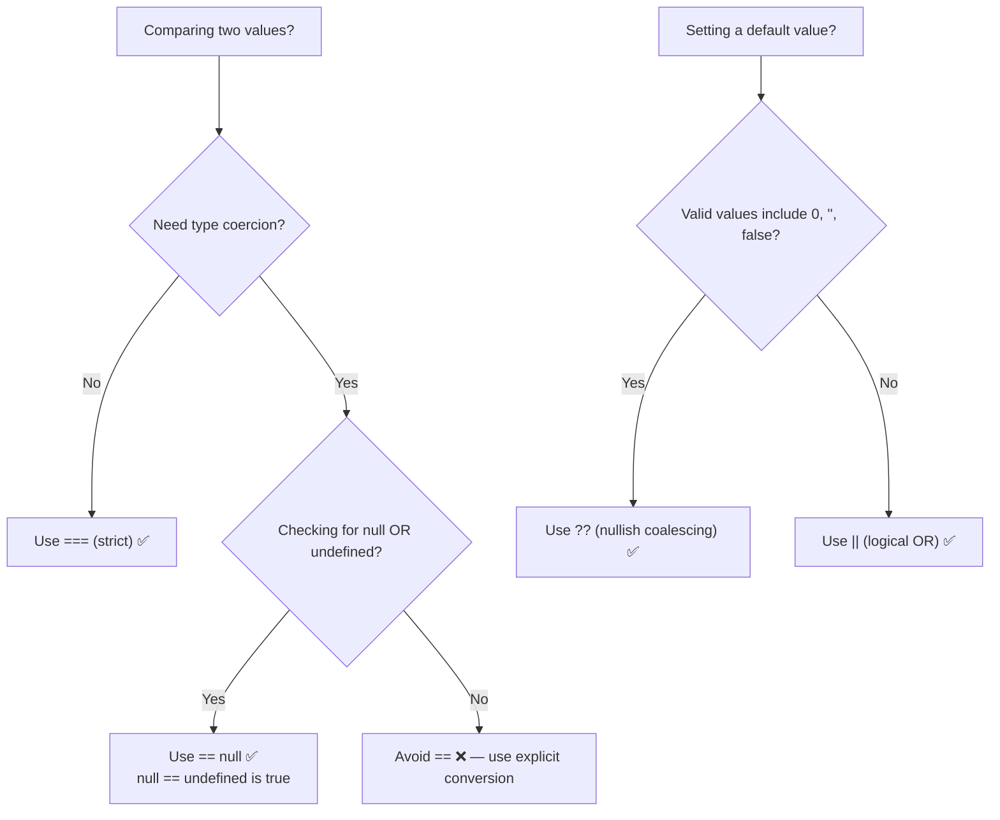

# 05 — Operators: Complete Interview & Reference Guide

## Overview

Operators are symbols or keywords that perform operations on values (operands). JavaScript has an extensive operator set: assignment (`=`), arithmetic (`+`, `-`, `*`, `/`, `%`, `**`), comparison (`==`, `===`, `!=`, `!==`, `>`, `<`, `>=`, `<=`), logical (`&&`, `||`, `!`, `??`), ternary (`?:`), `typeof`, string concatenation, increment/decrement (`++`, `--`), and the nullish coalescing operator (`??`). Mastering operators is essential for writing correct, efficient JavaScript code.

---

## Table of Contents

1. [Syntax Reference — End to End](#1-syntax-reference--end-to-end)
2. [Built-in Functions & Methods](#2-built-in-functions--methods)
3. [Deep Insights & Gotchas](#3-deep-insights--gotchas)
4. [Interview-Ready Definitions](#4-interview-ready-definitions)
5. [Tricky Interview Questions](#5-tricky-interview-questions)
6. [Controversial Topics & Ongoing Debates](#6-controversial-topics--ongoing-debates)
7. [Quick Reference Cheat Sheet](#7-quick-reference-cheat-sheet)
8. [Memory Map & Visual Flowchart](#8-memory-map--visual-flowchart)
9. [LinkedIn-Style Post](#9-linkedin-style-post)
10. [Summary & Individual Notes Index](#10-summary--individual-notes-index)

---

## 1. Syntax Reference — End to End

### 1.1 Assignment Operators

```javascript
let x = 10;    // simple assignment
x += 5;        // x = x + 5  → 15
x -= 3;        // x = x - 3  → 12
x *= 2;        // x = x * 2  → 24
x /= 4;        // x = x / 4  → 6
x %= 4;        // x = x % 4  → 2
x **= 3;       // x = x ** 3 → 8
```

### 1.2 Arithmetic Operators

```javascript
console.log(10 + 3);   // 13
console.log(10 - 3);   // 7
console.log(10 * 3);   // 30
console.log(10 / 3);   // 3.333...
console.log(10 % 3);   // 1  (remainder)
console.log(2 ** 10);  // 1024 (exponentiation, ES2016)

// String concatenation with +
console.log("Hello" + " " + "World"); // "Hello World"
console.log("5" + 3);                 // "53" (coercion to string)
console.log("5" - 3);                 // 2   (coercion to number)
```

### 1.3 Comparison Operators

```javascript
// Loose equality (==) — does type coercion
console.log(5 == "5");   // true  — coerces string to number
console.log(5 == 5);     // true
console.log(null == undefined); // true (special rule)

// Strict equality (===) — no coercion
console.log(5 === "5");  // false — different types
console.log(5 === 5);    // true

// Inequality
console.log(5 != "5");   // false — loose (same after coercion)
console.log(5 !== "5");  // true  — strict

// Relational
console.log(3 > 4);    // false
console.log(3 < 4);    // true
console.log(4 >= 4);   // true  (4 > 4 OR 4 == 4)
console.log(3 <= 4);   // true
```

### 1.4 Logical Operators

```javascript
// AND — true if BOTH are truthy
console.log(true && true);   // true
console.log(true && false);  // false
console.log(false && true);  // false (short-circuit: doesn't evaluate right side)

// OR — true if EITHER is truthy
console.log(true || false);  // true
console.log(false || false); // false
console.log(false || true);  // true (short-circuit: right side evaluated)

// NOT — inverts the boolean
console.log(!true);   // false
console.log(!false);  // true
console.log(!0);      // true  (0 is falsy)
console.log(!"");     // true  ("" is falsy)
```

### 1.5 Ternary Operator

```javascript
// condition ? valueIfTrue : valueIfFalse
let age = 20;
let status = age >= 18 ? "adult" : "minor";
console.log(status); // "adult"

// Playwright / test assertion pattern
let result = (actualText === expectedText) ? "PASS" : "FAIL";

// Nested ternary (2 levels — use sparingly)
let score = 85;
let grade = score >= 90 ? "A"
           : score >= 80 ? "B"
           : score >= 70 ? "C"
           : "F";
```

### 1.6 `typeof` Operator

```javascript
typeof "hello"      // "string"
typeof 42           // "number"
typeof true         // "boolean"
typeof undefined    // "undefined"
typeof null         // "object" ⚠️
typeof {}           // "object"
typeof []           // "object"
typeof function(){} // "function"
```

### 1.7 Increment & Decrement

```javascript
let a = 5;
let b = a++;  // b = 5 (post), a = 6
let c = ++a;  // a = 7 (pre), c = 7
let d = a--;  // d = 7 (post), a = 6
let e = --a;  // a = 5 (pre), e = 5
```

### 1.8 Nullish Coalescing (`??`)

```javascript
let apiResponse = null;
let data = apiResponse ?? "{}";   // "{}" — null/undefined only
console.log(data); // "{}"

let count = 0;
let result = count ?? "default";
console.log(result); // 0 — 0 is NOT null/undefined

// vs OR (||) which catches all falsy values
let result2 = count || "default";
console.log(result2); // "default" — 0 is falsy ⚠️
```

### 1.9 String Operator

```javascript
"Hello" + " World"   // "Hello World"
"5" + 3              // "53"  (+ prefers string concat when left is string)
5 + "3"              // "53"
5 + 3 + "x"          // "8x"  (left to right: 5+3=8, then 8+"x"="8x")
"x" + 5 + 3          // "x53" (string first, then all + is concat)
```

---

## 2. Built-in Functions & Methods

### `Math` object (key methods for operators chapter)

```javascript
Math.abs(-5)      // 5
Math.pow(2, 10)   // 1024 (same as 2**10)
Math.sqrt(16)     // 4
Math.floor(3.9)   // 3
Math.ceil(3.1)    // 4
Math.round(3.5)   // 4
Math.max(1,2,3)   // 3
Math.min(1,2,3)   // 1
Math.trunc(3.9)   // 3 (removes decimal, towards zero)
```

---

## 3. Deep Insights & Gotchas

### 3.1 `==` Transitivity Is Broken

```javascript
"" == 0    // true  → "" coerced to Number → 0
"0" == 0   // true  → "0" coerced to Number → 0
"" == "0"  // false → both strings, compared as-is

// By transitivity: A == B and B == C should mean A == C
// But "" == "0" is false even though "" == 0 and "0" == 0
// This is why == is dangerous
```

### 3.2 `+` Is Both Arithmetic and String Concatenation

```javascript
console.log(5 + 3);       // 8   — arithmetic
console.log("5" + 3);     // "53" — string concat (left is string)
console.log(5 + "3");     // "53" — string concat (right is string)
console.log(5 - "3");     // 2   — arithmetic (- has no string mode)
console.log(5 * "3");     // 15  — arithmetic (* has no string mode)
```

### 3.3 Short-Circuit Evaluation — `&&` and `||` Return Values, Not Just Booleans

```javascript
// && returns first FALSY value, or last value if all truthy
console.log(1 && 2 && 3);    // 3
console.log(1 && 0 && 3);    // 0
console.log(false && "x");   // false

// || returns first TRUTHY value, or last value if all falsy
console.log(0 || "" || 42);  // 42
console.log(0 || false || "");// ""
console.log(1 || 99);        // 1

// Practical: default value with ||
let port = userPort || 3000; // 3000 if userPort is falsy
```

### 3.4 `??` Only Checks `null`/`undefined` — NOT All Falsy Values

```javascript
let x = 0;
x || "default"   // "default" ⚠️ — 0 is falsy
x ?? "default"   // 0 ✅ — 0 is not null/undefined
```
Use `??` when `0`, `""`, or `false` are valid values you want to preserve.

### 3.5 Nested Ternary — Readability vs Correctness

```javascript
// OK (readable):
let result = a > b ? "greater" : "not greater";

// Risky (hard to read, error-prone):
let grade = s >= 90 ? "A" : s >= 80 ? "B" : s >= 70 ? "C" : "F";

// Prefer if/else for 3+ branches
```

---

## 4. Interview-Ready Definitions

### `==` (Loose Equality)
> **Definition (say this):** "`==` compares two values after performing type coercion — converting one or both operands to a common type. This leads to surprising results like `"" == 0` being `true`. It should generally be avoided."
> **Follow-up:** "When would you use `==` instead of `===`?"
> **Answer:** "One valid case: `value == null` checks for both `null` and `undefined` in one expression, since `null == undefined` is `true`."

### `===` (Strict Equality)
> **Definition (say this):** "`===` compares both value and type without any coercion. If types differ, it returns `false` immediately. This is almost always what you want."

### `??` (Nullish Coalescing)
> **Definition (say this):** "`??` returns the right-hand side only when the left-hand side is `null` or `undefined`. Unlike `||`, it does not treat `0`, `""`, or `false` as 'missing values', making it safer for default fallbacks when these values are valid."

### Ternary Operator
> **Definition (say this):** "The ternary operator `condition ? trueValue : falseValue` is JavaScript's only three-operand operator. It evaluates the condition and returns one of two expressions. It's an expression (produces a value), unlike `if/else` which is a statement."

### `typeof`
> **Definition (say this):** "`typeof` is a unary operator that returns a string describing the runtime type of its operand. Known quirks: `typeof null === 'object'` and `typeof NaN === 'number'`."

---

## 5. Tricky Interview Questions

---

**Q1:** What is the output?
```javascript
console.log("5" + 3);
console.log("5" - 3);
```
**A:** `"53"` then `2`. The `+` operator prefers string concatenation when either operand is a string. The `-` operator always does arithmetic — it coerces the string to a number.
**Difficulty:** Medium

---

**Q2:** What is the output?
```javascript
console.log("" == 0);
console.log("0" == 0);
console.log("" == "0");
```
**A:** `true`, `true`, `false`. The first two loose comparisons coerce to number (0 == 0). The third compares two strings directly — `""` ≠ `"0"`. Transitivity is broken with `==`.
**Difficulty:** Hard

---

**Q3:** What is the output?
```javascript
let x = 0;
console.log(x || "default");
console.log(x ?? "default");
```
**A:** `"default"` then `0`. `||` treats `0` as falsy and returns the fallback. `??` only triggers on `null`/`undefined`, so `0` is kept.
**Difficulty:** Medium

---

**Q4:** What is the output?
```javascript
let a = 5;
console.log(a++);
console.log(a);
console.log(++a);
```
**A:** `5`, `6`, `7`. Post-increment returns old value; pre-increment returns new value.
**Difficulty:** Medium

---

**Q5 — Spot the Bug:**
```javascript
let isAdmin = false;
let access = isAdmin == true ? "granted" : "denied";
```
**A:** The `== true` comparison is redundant but technically not a bug (it evaluates correctly). The real issue is style: `isAdmin == true` should be just `isAdmin`. And using `==` instead of `===` is a code smell. Fix: `let access = isAdmin ? "granted" : "denied"`.
**Difficulty:** Easy

---

**Q6:** What is the output?
```javascript
console.log(5 + 3 + "x");
console.log("x" + 5 + 3);
```
**A:** `"8x"` then `"x53"`. JS evaluates left to right: `5+3=8`, then `8+"x"="8x"`. For the second: `"x"+5="x5"`, then `"x5"+3="x53"`.
**Difficulty:** Medium

---

**Q7:** What does short-circuit mean for `&&`?
```javascript
let x = false && someUndefinedFunction();
```
**A:** `x` is `false`. `&&` short-circuits when the left side is falsy — it never evaluates `someUndefinedFunction()`. This prevents a potential ReferenceError. Same principle: `&&` returns the first falsy value it encounters.
**Difficulty:** Medium

---

**Q8:** When should you use `??` instead of `||`?
**A:** Use `??` when `0`, `""`, or `false` are valid values you want to preserve. `||` would incorrectly replace them with the fallback. Example: `let port = config.port ?? 3000` — if `config.port = 0`, `||` would give `3000` (wrong), `??` gives `0` (correct).
**Difficulty:** Medium

---

**Q9:** What is the output?
```javascript
console.log(2 ** 10);
console.log(10 % 3);
```
**A:** `1024` and `1`. `**` is the exponentiation operator (ES2016). `%` returns the remainder, not modulo (important distinction for negative numbers: `-7 % 3 === -1` in JS).
**Difficulty:** Easy

---

**Q10:** Is the ternary operator an expression or a statement?
**A:** An **expression** — it produces a value that can be assigned, returned, or used inline. This is different from `if/else` which is a statement. That's why ternary works inside template literals but `if/else` doesn't: `` `${isAdmin ? 'admin' : 'user'}` ``.
**Difficulty:** Medium

---

## 6. Controversial Topics & Ongoing Debates

### `==` vs `===` — Is `==` Ever Acceptable?

**The debate:** Should `==` be completely banned in favour of `===`?

**One side:** ESLint's `eqeqeq` rule and most style guides require `===` everywhere. `==` produces too many surprising results.

**Other side:** `value == null` is a legitimate shorthand for `value === null || value === undefined`. It's explicit and intentional.

**Current consensus:** Use `===` everywhere by default. The one accepted exception: `value == null` to check for null-or-undefined in one shot.

---

### `??` vs `||` for Default Values

**The debate:** Before `??` existed (ES2020), developers used `||` for defaults. Should `||` still be used?

**Problem with `||`:** It rejects `0`, `""`, `false` — all valid values — as "missing".

**Solution:** Use `??` for default values. Use `||` only when you genuinely want to treat all falsy values as "missing".

**Current consensus:** Prefer `??` for default value patterns. `||` is for actual boolean logic.

---

### Nested Ternary — Banned or Allowed?

**The debate:** Most style guides (Airbnb, Google) ban nested ternary. But TypeScript's own compiler uses it internally.

**Argument to ban:** After two levels it's nearly unreadable, and a bug in nesting order silently produces wrong results.

**Argument to allow:** Concise, functional-style code; works well when formatted vertically.

**Current consensus:** Avoid nesting ternary more than 2 levels. Use `if/else if/else` for complex branching.

---

## 7. Quick Reference Cheat Sheet

### Operator Precedence (High → Low, Simplified)

| Priority | Operators |
|----------|----------|
| Highest | `()` grouping |
| | `!`, `++`, `--`, `typeof` (prefix) |
| | `**` |
| | `*`, `/`, `%` |
| | `+`, `-` |
| | `<`, `>`, `<=`, `>=` |
| | `==`, `!=`, `===`, `!==` |
| | `&&` |
| | `\|\|`, `??` |
| | `?:` (ternary) |
| Lowest | `=`, `+=`, `-=`, ... (assignment) |

### `==` vs `===`

| Check | `==` | `===` |
|-------|------|-------|
| Type coercion? | ✅ Yes | ❌ No |
| `"5" == 5` | `true` | `false` |
| `null == undefined` | `true` | `false` |
| Use when | `value == null` only | Everywhere else |

### `||` vs `??`

| Expression | `\|\|` result | `??` result |
|-----------|------------|----------|
| `0 \|\| "def"` | `"def"` ⚠️ | — |
| `0 ?? "def"` | — | `0` ✅ |
| `"" \|\| "def"` | `"def"` ⚠️ | — |
| `null \|\| "def"` | `"def"` ✅ | `"def"` ✅ |
| `undefined ?? "def"` | — | `"def"` ✅ |

---

## 8. Memory Map & Visual Flowchart

### A) Mind Map

```
[JavaScript Operators]
  ├── Arithmetic: + - * / % **
  │     └── + is ALSO string concat ⚠️
  ├── Assignment: = += -= *= /= %= **=
  ├── Comparison
  │     ├── == loose → type coercion ⚠️ (avoid except == null)
  │     └── === strict → no coercion ✅ (always prefer)
  ├── Logical
  │     ├── && → returns first FALSY, short-circuits ✅
  │     ├── || → returns first TRUTHY, short-circuits ✅
  │     └── ! → inverts boolean
  ├── Nullish Coalescing (??)
  │     └── Only null/undefined triggers fallback ✅ (vs || which uses all falsy)
  ├── Ternary (?:)
  │     ├── Expression (not statement) ✅
  │     └── Nested > 2 levels → use if/else ⚠️
  ├── typeof
  │     ├── typeof null = "object" ⚠️ (bug)
  │     └── typeof NaN  = "number" ⚠️ (counterintuitive)
  └── Increment/Decrement (++ / --)
        ├── post (a++) → return old, then increment
        └── pre (++a)  → increment first, return new
```

### B) Flowchart — `==` vs `===` vs `??` Decision



### C) Execution Trace — `+` Operator Type Coercion

```javascript
5 + 3 + "x"  // → "8x"
"x" + 5 + 3  // → "x53"
```

| Expression | Left | Right | Operation | Result |
|-----------|------|-------|-----------|--------|
| `5 + 3` | `5` (number) | `3` (number) | arithmetic | `8` |
| `8 + "x"` | `8` (number) | `"x"` (string) | concat | `"8x"` |
| `"x" + 5` | `"x"` (string) | `5` (number) | concat | `"x5"` |
| `"x5" + 3` | `"x5"` (string) | `3` (number) | concat | `"x53"` |

---

## 9. LinkedIn-Style Post

### 📢 LinkedIn Post

> **One operator, two completely different behaviours. Most JS bugs start here.**
>
> ```javascript
> console.log("5" + 3);  // "53"  ← string concat
> console.log("5" - 3);  // 2     ← arithmetic
> ```
>
> The `+` operator checks: "Is either side a string?" → yes → concatenate.
> Every other arithmetic operator (`-`, `*`, `/`) coerces strings to numbers.
>
> And then there's the `==` vs `===` trap:
>
> ```javascript
> "" == 0    // true ← coercion
> "0" == 0   // true ← coercion
> "" == "0"  // false ← string comparison
> ```
>
> `A == B` and `B == C` doesn't mean `A == C`. Transitivity is broken.
>
> ⚠️ And `||` vs `??`:
>
> ```javascript
> 0 || "default"  // "default" ← 0 is falsy
> 0 ?? "default"  // 0         ← 0 is not null/undefined
> ```
>
> If `0` or `""` are valid values, always use `??`.
>
> **Key Takeaway:** Use `===` over `==` (except `== null`). Use `??` over `||` when 0, empty string, or false are valid values. Know that `+` does string concat — `-` doesn't.
>
> #JavaScript #Operators #WebDev #ProgrammingTips #LearnToCode

---

## 10. Summary & Individual Notes Index

| File | Topic |
|------|-------|
| [13_Operators_IQ.md](./13_Operators_IQ.md) | Full operator overview — assignment, arithmetic, comparison, logical |
| [21_String_Operator_IQ.md](./21_String_Operator_IQ.md) | `+` as string concat — coercion rules |
| [22_Ternary_Operator_Basics_IQ.md](./22_Ternary_Operator_Basics_IQ.md) | Basic ternary syntax |
| [23_Ternary_Test_Assertion_Pattern_IQ.md](./23_Ternary_Test_Assertion_Pattern_IQ.md) | Ternary in test assertions |
| [24_Ternary_CI_Browser_Mode_IQ.md](./24_Ternary_CI_Browser_Mode_IQ.md) | Ternary for CI/browser mode selection |
| [25_Ternary_SLA_Check_Template_Literal_IQ.md](./25_Ternary_SLA_Check_Template_Literal_IQ.md) | Ternary inside template literals |
| [26_Ternary_Environment_URL_Selection_IQ.md](./26_Ternary_Environment_URL_Selection_IQ.md) | Environment-based URL selection |
| [27_Ternary_Redundant_Boolean_Antipattern_IQ.md](./27_Ternary_Redundant_Boolean_Antipattern_IQ.md) | `isAdmin == true` antipattern |
| [28_Nested_Ternary_Two_Level_IQ.md](./28_Nested_Ternary_Two_Level_IQ.md) | Two-level nested ternary |
| [29_Nested_Ternary_HTTP_Status_Category_IQ.md](./29_Nested_Ternary_HTTP_Status_Category_IQ.md) | HTTP status classification |
| [30_Nested_Ternary_Temperature_Scale_IQ.md](./30_Nested_Ternary_Temperature_Scale_IQ.md) | Temperature scale via ternary |
| [31_Type_Operator_typeof_Deep_Dive_IQ.md](./31_Type_Operator_typeof_Deep_Dive_IQ.md) | `typeof` deep dive + quirks |
| [32_Increment_Decrement_Operators_IQ.md](./32_Increment_Decrement_Operators_IQ.md) | Pre/post increment/decrement |
| [33_Advanced_Increment_Expression_IQ.md](./33_Advanced_Increment_Expression_IQ.md) | `++` in expressions |
| [34_Increment_Multiple_Expressions_IQ.md](./34_Increment_Multiple_Expressions_IQ.md) | Multiple increment in one statement |
| [35_Decrement_Operator_Pre_Post_IQ.md](./35_Decrement_Operator_Pre_Post_IQ.md) | Decrement operator |
| [36_Nullish_Coalescing_Operator_IQ.md](./36_Nullish_Coalescing_Operator_IQ.md) | `??` operator vs `\|\|` |

---

## Summary

**Key Takeaway:** Use `===` for comparison (strict), never `==`. Understand operator precedence — multiplication before addition, comparison before logical AND. Remember: `??` (nullish coalescing) checks only for `null` and `undefined`, while `||` treats all falsy values the same.
