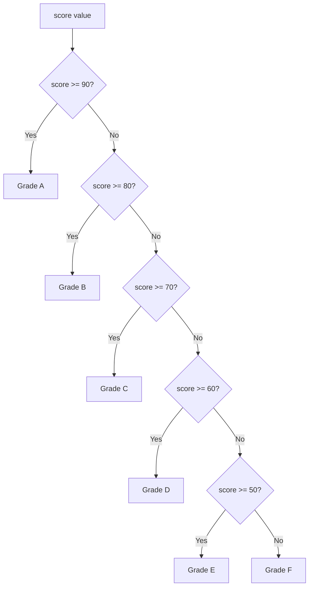

# 06 — Conditional Statements: Complete Interview & Reference Guide

> Conditional statements control which block of code runs based on whether a condition is truthy or falsy. JavaScript provides `if`, `if/else`, the `else if` ladder, and nested `if/else`. These are fundamental to all decision-making in code — from a simple browser check to a multi-tier grade calculator.

---

## Table of Contents

1. [Syntax Reference — End to End](#1-syntax-reference--end-to-end)
2. [Built-in Functions & Methods](#2-built-in-functions--methods)
3. [Deep Insights & Gotchas](#3-deep-insights--gotchas)
4. [Interview-Ready Definitions](#4-interview-ready-definitions)
5. [Tricky Interview Questions](#5-tricky-interview-questions)
6. [Controversial Topics & Ongoing Debates](#6-controversial-topics--ongoing-debates)
7. [Quick Reference Cheat Sheet](#7-quick-reference-cheat-sheet)
8. [Memory Map & Visual Flowchart](#8-memory-map--visual-flowchart)
9. [LinkedIn-Style Post](#9-linkedin-style-post)
10. [Summary & Individual Notes Index](#10-summary--individual-notes-index)

---

## 1. Syntax Reference — End to End

### 1.1 Simple `if`

```javascript
let age = 20;
if (age >= 18) {
    console.log("Adult");
}
// If condition is false, nothing happens — no else
```

### 1.2 `if / else`

```javascript
let isLoggedIn = false;
if (isLoggedIn) {
    console.log("Welcome back!");
} else {
    console.log("Please log in.");
}
```

### 1.3 `else if` Ladder

```javascript
let score = 78;

if (score >= 90) {
    console.log("Grade: A — Excellent");
} else if (score >= 80 && score < 90) {
    console.log("Grade: B — Good");
} else if (score >= 70 && score < 80) {
    console.log("Grade: C — Can do better");
} else if (score >= 60 && score < 70) {
    console.log("Grade: D — Needs Improvement");
} else if (score >= 50 && score < 60) {
    console.log("Grade: E — Bring Parents");
} else {
    console.log("Grade: F — Fail");
}
```

### 1.4 Nested `if / else`

```javascript
let user = "admin";
let isLoggedIn = true;

if (isLoggedIn) {
    if (user === "admin") {
        console.log("Admin dashboard");
    } else {
        console.log("User dashboard");
    }
} else {
    console.log("Please log in");
}
```

### 1.5 Truthy and Falsy Values

```javascript
// FALSY values — these make if conditions skip the block:
if (false)     { /* skipped */ }
if (0)         { /* skipped */ }
if (-0)        { /* skipped */ }
if ("")        { /* skipped */ }
if (null)      { /* skipped */ }
if (undefined) { /* skipped */ }
if (NaN)       { /* skipped */ }

// Everything else is TRUTHY — including:
if ("0")       { console.log("runs"); } // non-empty string
if ([])        { console.log("runs"); } // empty array
if ({})        { console.log("runs"); } // empty object
if (-1)        { console.log("runs"); } // any non-zero number
```

---

## 2. Built-in Functions & Methods

> Conditional statements are pure syntax — no specific built-in methods. Key operators used inside conditions:

```javascript
// typeof in condition
if (typeof x === "string") { }

// instanceof in condition
if (x instanceof Array) { }

// Checking null/undefined
if (x == null) { }     // true for both null and undefined
if (x !== null && x !== undefined) { }

// Checking NaN
if (Number.isNaN(x)) { }
```

---

## 3. Deep Insights & Gotchas

### 3.1 Falsy vs Falsy — `0` vs `""` vs `null` vs `undefined`

All falsy, but different meanings:
```javascript
let x = 0;          // might be a valid zero value
let y = "";         // might be a valid empty string
let z = null;       // intentional absence
let w = undefined;  // unset

// A generic if(x) fails to distinguish between them
// Use explicit checks when the value matters:
if (x !== undefined && x !== null) { }
if (x !== 0) { }
```

### 3.2 `=` vs `==` vs `===` in Conditions — Classic Bug

```javascript
let status = "pass";
if (status = "fail") {  // ⚠️ ASSIGNMENT not comparison!
    console.log("fail"); // always runs — "fail" is truthy
}
// Fix: if (status === "fail")
```

### 3.3 Missing Braces — Dangling `else` Problem

```javascript
if (a > 0)
    if (b > 0)
        console.log("both");
else
    console.log("which condition?"); // binds to inner if, not outer if!
```
**Always use braces** — even for single-statement `if` bodies.

### 3.4 Redundant Boolean Check Anti-pattern

```javascript
// ❌ Bad — comparing boolean to true/false is redundant
if (isLoggedIn === true) { }
if (isAdmin == true) { }

// ✅ Good — let the boolean be the condition
if (isLoggedIn) { }
if (!isAdmin) { }
```

### 3.5 `else if` Is Not a Keyword — It's Two Keywords

```javascript
if (a) {
} else if (b) {  // this is: else { if (b) { } }
}
// They are not a combined keyword — they just happen to look like one
```

---

## 4. Interview-Ready Definitions

### Conditional Statement
> **Definition (say this):** "A conditional statement evaluates a boolean expression and executes one of two (or more) code blocks depending on whether the expression is truthy or falsy."

### `if / else if / else`
> **Definition (say this):** "An `else if` ladder evaluates conditions top to bottom, executing the first matching branch and skipping the rest. The `else` at the end is the catch-all for when no condition matched."
> **Follow-up:** "What's the difference between chained `if` statements and an `else if` ladder?"
> **Answer:** "Chained `if` statements check every condition regardless — all blocks might run. An `else if` ladder exits after the first matching condition — at most one block runs."

### Truthy / Falsy
> **Definition (say this):** "In JavaScript, every value has an inherent boolean meaning. Falsy values are: `false`, `0`, `-0`, `""`, `null`, `undefined`, `NaN`. Everything else — including `"0"`, `[]`, `{}`, and `-1` — is truthy."
> **Follow-up:** "Is an empty array truthy or falsy?"
> **Answer:** "Truthy. An empty array `[]` is an object in memory — only `null` and `undefined` are 'no object'. This trips up almost every JS beginner."

### Nested `if`
> **Definition (say this):** "A nested `if` is an `if` statement inside another `if` block. It checks a secondary condition only when the outer condition passes. It should be kept shallow — 2 levels maximum — to maintain readability."

---

## 5. Tricky Interview Questions

---

**Q1:** What is the output?
```javascript
if ("0") {
    console.log("truthy");
} else {
    console.log("falsy");
}
```
**A:** `"truthy"`. `"0"` is a non-empty string — it is truthy even though `Number("0") === 0` is falsy.
**Difficulty:** Medium

---

**Q2 — Spot the Bug:**
```javascript
let score = 85;
if (score = 90) {
    console.log("90");
}
```
**A:** `=` is assignment, not comparison. `score` is reassigned to `90` (truthy), so the block always runs regardless of the original `score`. Fix: `score === 90`.
**Difficulty:** Medium

---

**Q3:** What is the output?
```javascript
let x;
if (x) {
    console.log("truthy");
} else {
    console.log("falsy");
}
```
**A:** `"falsy"`. `x` is `undefined` (declared but not assigned), which is falsy.
**Difficulty:** Easy

---

**Q4:** What is the output?
```javascript
let score = 78;
if (score >= 70) console.log("C");
if (score >= 80) console.log("B");
if (score >= 90) console.log("A");
```
**A:** Only `"C"` — wait, let me check. `score = 78`, so `78 >= 70` is true → prints `"C"`. `78 >= 80` is false → skipped. `78 >= 90` is false → skipped. Output: `"C"`.

Now compare with `else if`:
```javascript
if (score >= 90) console.log("A");
else if (score >= 80) console.log("B");
else if (score >= 70) console.log("C");
```
Same output for 78, but the `else if` exits after first match — the `if` chain checks all three conditions.
**Difficulty:** Medium

---

**Q5:** What is the output?
```javascript
if (null) {
    console.log("null is truthy");
} else if (undefined) {
    console.log("undefined is truthy");
} else if (0) {
    console.log("0 is truthy");
} else {
    console.log("all falsy");
}
```
**A:** `"all falsy"`. All three conditions are falsy values.
**Difficulty:** Easy

---

**Q6:** What is the difference between these two?
```javascript
// Version A:
if (a > 0) { if (b > 0) { doThis(); } }

// Version B:
if (a > 0 && b > 0) { doThis(); }
```
**A:** Functionally identical — both run `doThis()` only when both `a > 0` and `b > 0`. Version B is more readable. The nested version can become confusing with `else` clauses due to the dangling else problem.
**Difficulty:** Easy

---

**Q7:** Is `[]` truthy or falsy? What about `{}`?
**A:** Both `[]` and `{}` are truthy. In JavaScript, only `null` and `undefined` represent "no object". An empty array and empty object are real objects in memory — they are truthy. This is one of the most common interview gotchas.
**Difficulty:** Medium

---

**Q8:** What are all 7 falsy values in JavaScript?
**A:** `false`, `0`, `-0`, `0n` (BigInt zero), `""` (empty string), `null`, `undefined`, `NaN`. (Some lists include `document.all` — a legacy browser quirk, rarely asked.)
**Difficulty:** Medium

---

## 6. Controversial Topics & Ongoing Debates

### Braces — Required or Optional for Single-Line `if`?

**The debate:** JavaScript allows `if (x) doThis();` without braces. Is this acceptable?

**One side:** Braces always — even for one-liners. A second `console.log` added later will silently fall outside the block.

**Other side:** For truly trivial one-liners, no braces are readable and concise.

**Current consensus:** Most style guides (Airbnb, Google) require braces always. ESLint's `curly` rule enforces this. Use braces.

---

### `else if` Ladder vs `switch` — When to Prefer Which?

**The debate:** When does a long `else if` chain become a `switch` candidate?

**Rule of thumb:**
- Use `else if` when conditions are ranges or complex expressions (`score >= 80 && score < 90`)
- Use `switch` when comparing a single value against many exact literal values (`case "GET":`, `case "POST":`)

**Current consensus:** `switch` for exact-value branching on one variable. `else if` for range checks or complex multi-variable conditions.

---

## 7. Quick Reference Cheat Sheet

### Falsy Values (All 7)

```javascript
false, 0, -0, 0n, "", null, undefined, NaN
```

### Truthy Gotchas

```javascript
"0"   // truthy (non-empty string)
[]    // truthy (empty array is still an object)
{}    // truthy (empty object is still an object)
-1    // truthy (any non-zero number)
```

### If/Else Patterns

```javascript
// Single condition
if (x) { }
if (!x) { }  // inverse

// Null check
if (x == null) { }       // covers both null and undefined
if (x !== null && x !== undefined) { }

// Type guard
if (typeof x === "string") { }

// Grade ladder pattern
if (score >= 90) { grade = "A"; }
else if (score >= 80) { grade = "B"; }
else if (score >= 70) { grade = "C"; }
else { grade = "F"; }
```

### Chained `if` vs `else if`

| Pattern | Checks all? | Multiple can run? |
|---------|-----------|-----------------|
| Chained `if` | ✅ Always | ✅ Yes |
| `else if` ladder | Stops at first match | ❌ No — at most one |

---

## 8. Memory Map & Visual Flowchart

### A) Mind Map

```
[Conditional Statements]
  ├── if
  │     └── Only runs if condition is truthy
  ├── if / else
  │     └── Guaranteed: one branch always runs
  ├── else if ladder
  │     ├── Checks top to bottom, stops at first match
  │     └── else at bottom = catch-all
  ├── Nested if
  │     ├── Secondary condition checked only if outer passes
  │     └── Max 2 levels for readability ⚠️
  ├── Truthy / Falsy
  │     ├── Falsy: false, 0, -0, 0n, "", null, undefined, NaN
  │     ├── Truthy: everything else (incl "0", [], {}, -1) ⚠️
  │     └── Redundant: if (x === true) → just if (x) ✅
  └── Common bugs
        ├── = instead of == or === in condition ❌
        ├── Missing braces → dangling else ❌
        └── Chained if when else if intended → multiple branches run ⚠️
```

### B) Flowchart — Grade Calculator



### C) Execution Trace — Truthy Gotcha

```javascript
if ("0") { console.log("runs"); }
```

| Check | Value | Falsy? | Runs? |
|-------|-------|--------|-------|
| `"0"` | Non-empty string | No | ✅ Yes |
| `0` | Number zero | Yes | ❌ No |

`"0"` (string) and `0` (number) have the same *lookahead* but opposite truthiness.

---

## 9. LinkedIn-Style Post

### 📢 LinkedIn Post

> **Quick quiz: is `"0"` truthy or falsy in JavaScript?**
>
> Most people say falsy. The answer is **truthy**.
>
> JavaScript has exactly 7 falsy values:
> ```
> false, 0, -0, 0n, "", null, undefined, NaN
> ```
>
> Notice `"0"` is NOT in that list. It's a non-empty string → truthy.
>
> This trips up every developer eventually:
>
> ```javascript
> if ("0") console.log("runs"); // ✅ runs
> if (0)   console.log("runs"); // ❌ skipped
> ```
>
> And two more truthy surprises:
> ```javascript
> if ([]) console.log("empty array is truthy"); // ✅
> if ({}) console.log("empty object is truthy"); // ✅
> ```
>
> ⚠️ **The classic bug:**
> ```javascript
> if (status = "fail") { } // = is assignment! Always truthy
> // Fix:
> if (status === "fail") { }
> ```
>
> 💡 And use `else if` (not chained `if`) when you want only ONE branch to run.
>
> **Key Takeaway:** 7 falsy values, everything else is truthy. `"0"`, `[]`, and `{}` are all truthy — they are real objects in memory.
>
> #JavaScript #WebDev #CodingTips #Debugging #LearnToCode

---

## 10. Summary & Individual Notes Index

| File | Topic |
|------|-------|
| [37_If_Else_Statement_Basics_IQ.md](./37_If_Else_Statement_Basics_IQ.md) | `if/else` basics, truthy/falsy |
| [38_If_Else_If_Ladder_Grade_Calculator_IQ.md](./38_If_Else_If_Ladder_Grade_Calculator_IQ.md) | `else if` ladder — grade calculator with range checks |
| [38_Nested_If_Else_Statement_IQ.md](./38_Nested_If_Else_Statement_IQ.md) | Nested `if/else` — login + role check pattern |
