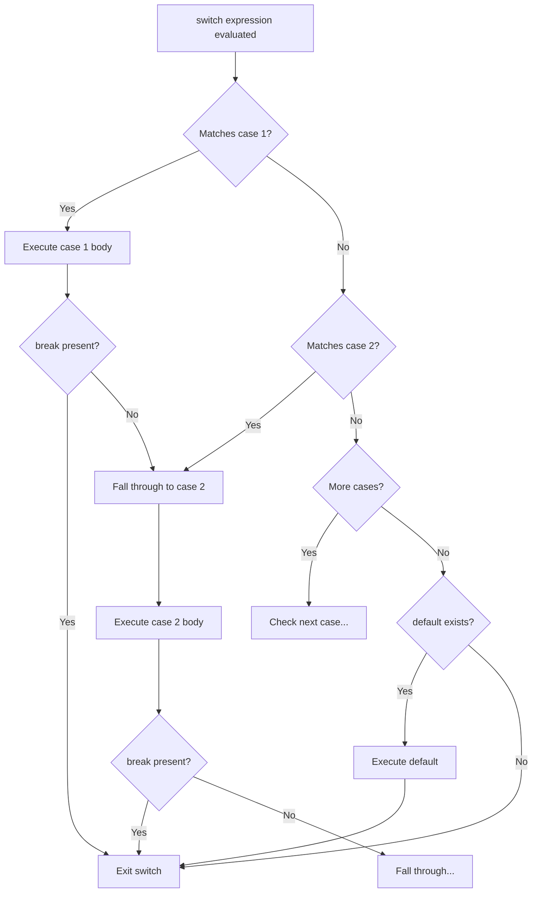

# 07 — Switch Statement: Complete Interview & Reference Guide

## Overview

The `switch` statement evaluates an expression and compares it against a series of `case` values using **strict equality (`===`)**. It is the go-to alternative to long `else if` chains when matching a single variable against multiple exact values. Key concepts: `break` to prevent fallthrough, `default` as catch-all, case grouping, the `switch(true)` pattern, and common bugs like missing `break` or duplicate cases are covered thoroughly.

---

## Table of Contents

1. [Syntax Reference — End to End](#1-syntax-reference--end-to-end)
2. [Built-in Functions & Methods](#2-built-in-functions--methods)
3. [Deep Insights & Gotchas](#3-deep-insights--gotchas)
4. [Interview-Ready Definitions](#4-interview-ready-definitions)
5. [Tricky Interview Questions](#5-tricky-interview-questions)
6. [Controversial Topics & Ongoing Debates](#6-controversial-topics--ongoing-debates)
7. [Quick Reference Cheat Sheet](#7-quick-reference-cheat-sheet)
8. [Memory Map & Visual Flowchart](#8-memory-map--visual-flowchart)
9. [LinkedIn-Style Post](#9-linkedin-style-post)
10. [Summary & Individual Notes Index](#10-summary--individual-notes-index)

---

## 1. Syntax Reference — End to End

### 1.1 Basic Switch

```javascript
let day = 2;

switch (day) {
    case 1:
        console.log("Monday");
        break;
    case 2:
        console.log("Tuesday");
        let a = 10;
        let b = 30;
        console.log(a + b); // 40
        break;
    case 3:
        console.log("Wednesday");
        break;
    default:
        console.log("Unknown day");
}
// Output: Tuesday  40
```

### 1.2 Fallthrough — No `break`

```javascript
let x = 1;
switch (x) {
    case 1:
        console.log("case 1");
        // no break — falls through!
    case 2:
        console.log("case 2");
        break;
    case 3:
        console.log("case 3");
}
// Output: "case 1"  "case 2"  — both run!
```

### 1.3 `default` Case

```javascript
let status = "pending";
switch (status) {
    case "pass":
        console.log("Test passed");
        break;
    case "fail":
        console.log("Test failed");
        break;
    default:
        console.log("Unknown status:", status);
}
// Output: "Unknown status: pending"
```

### 1.4 Case Grouping (Intentional Fallthrough)

```javascript
let browser = "Brave";
switch (browser) {
    case "Chrome":
    case "Edge":
    case "Brave":
    case "Opera":
        console.log("Chromium Project!");
        break;
    case "Firefox":
        console.log("Mozilla Project!");
        break;
    case "Safari":
        console.log("Apple — JavaScriptCore engine");
        break;
    default:
        console.log("Unknown browser");
}
// Output: "Chromium Project!"
```

### 1.5 Duplicate Case Values

```javascript
let x = 1;
switch (x) {
    case 1:
        console.log("first case 1");
        break;
    case 1:  // ← duplicate — second case 1 is NEVER reached
        console.log("second case 1");
        break;
}
// Output: "first case 1"
```

### 1.6 `switch(true)` Pattern — Range Checks

```javascript
let score = 85;
switch (true) {
    case score >= 90:
        console.log("A");
        break;
    case score >= 80:
        console.log("B");
        break;
    case score >= 70:
        console.log("C");
        break;
    default:
        console.log("F");
}
// Output: "B"
```

### 1.7 API Status Code — Real-World Pattern

```javascript
let method = "POST";
switch (method) {
    case "GET":
        console.log("Fetch data");
        break;
    case "POST":
        console.log("Create resource");
        break;
    case "PUT":
        console.log("Update resource");
        break;
    case "DELETE":
        console.log("Delete resource");
        break;
    default:
        console.log("Unknown HTTP method");
}
```

---

## 2. Built-in Functions & Methods

> `switch` is pure syntax — no specific built-ins. The key underlying operation:

```javascript
// switch compares using ===
switch (x) {
    case 1: break; // checks: x === 1
}

// This means:
switch (1) {
    case "1": break; // NEVER matches — 1 !== "1" (strict)
    case 1:   break; // MATCHES — 1 === 1
}
```

---

## 3. Deep Insights & Gotchas

### 3.1 Switch Uses `===` (Strict Equality) — NOT `==`

```javascript
let x = "1";
switch (x) {
    case 1:    console.log("number 1"); break;  // ❌ "1" !== 1
    case "1":  console.log("string 1"); break;  // ✅ "1" === "1"
}
// Output: "string 1"
```

### 3.2 Missing `break` — Silent Fallthrough Bug

The #1 switch bug: forgetting `break` causes all subsequent cases to execute until a `break` is found.

```javascript
let x = 1;
switch (x) {
    case 1:
        console.log("case 1"); // ← runs
    case 2:
        console.log("case 2"); // ← ALSO runs (no break in case 1!)
    case 3:
        console.log("case 3"); // ← ALSO runs
        break;
}
// Output: "case 1"  "case 2"  "case 3"
```

### 3.3 `default` Can Be Anywhere — But Run Last If No Match

```javascript
let x = 5;
switch (x) {
    default:        // ← put first, but runs last if no match
        console.log("default");
        break;
    case 1:
        console.log("one");
        break;
}
// Output: "default" — x=5 matches no case, so default runs
```

But if `default` has no `break` and is placed in the middle:
```javascript
switch (x) {
    case 1: console.log("one"); break;
    default: console.log("default"); // falls through!
    case 2: console.log("two"); break;
}
```

### 3.4 `let` and `const` in `case` Blocks — Scope Gotcha

All `case` clauses in a `switch` share the same block scope. Declaring `let x` in case 1 and `let x` in case 2 causes a `SyntaxError`.

```javascript
switch (n) {
    case 1:
        let x = 1; // ← declared in switch block scope
        break;
    case 2:
        let x = 2; // ❌ SyntaxError: 'x' already declared
        break;
}

// Fix: wrap each case in its own block
switch (n) {
    case 1: {
        let x = 1;
        break;
    }
    case 2: {
        let x = 2;  // ✅ separate block scope
        break;
    }
}
```

### 3.5 Duplicate Cases — Silent Dead Code

```javascript
switch (x) {
    case 1: console.log("first"); break;
    case 1: console.log("unreachable"); break; // ⚠️ dead code — never reached
}
```

### 3.6 `switch(true)` Is Legitimate for Range Checks

```javascript
switch (true) {
    case score >= 90: console.log("A"); break;
    case score >= 80: console.log("B"); break;
}
// Legitimate pattern — each case is a boolean expression
```

---

## 4. Interview-Ready Definitions

### `switch` Statement
> **Definition (say this):** "A `switch` statement evaluates one expression and compares it against multiple `case` values using strict equality (`===`). It's cleaner than a long `else if` chain when matching a single variable against many exact values."
> **Follow-up:** "Does `switch` use `==` or `===`?"
> **Answer:** "Strict equality `===` — no type coercion. `switch ('1')` will NOT match `case 1`."

### Fallthrough
> **Definition (say this):** "Fallthrough occurs when a `case` block has no `break` statement — execution continues into the next `case` block regardless of whether it matches. This is usually a bug, but is sometimes intentional for case grouping."
> **Follow-up:** "When is intentional fallthrough acceptable?"
> **Answer:** "Case grouping — stacking multiple `case:` labels before a single block to handle all of them the same way."

### `break` in Switch
> **Definition (say this):** "`break` in a `switch` exits the switch block immediately after the current case executes. Without it, all remaining cases execute until the end of the switch or the next `break` is found."

### `default`
> **Definition (say this):** "`default` is the catch-all case in a `switch` — it runs when no `case` value matches the expression. It can be placed anywhere in the switch but conventionally goes last."

---

## 5. Tricky Interview Questions

---

**Q1:** What is the output?
```javascript
let x = 2;
switch (x) {
    case 1:
        console.log("one");
    case 2:
        console.log("two");
    case 3:
        console.log("three");
        break;
    case 4:
        console.log("four");
}
```
**A:** `"two"` and `"three"`. Execution starts at `case 2` (match), then falls through to `case 3` (no break in case 2), then breaks. `case 4` is not reached.
**Difficulty:** Medium

---

**Q2:** What is the output?
```javascript
let x = "1";
switch (x) {
    case 1:
        console.log("number one");
        break;
    case "1":
        console.log("string one");
        break;
}
```
**A:** `"string one"`. Switch uses `===` — `"1" !== 1` (different types).
**Difficulty:** Medium

---

**Q3 — Spot the Bug:**
```javascript
let status = "pass";
switch (status) {
    case "pass":
        console.log("Passed");
    case "fail":
        console.log("Failed");
        break;
}
```
**A:** Both `"Passed"` and `"Failed"` are printed. Missing `break` after `case "pass"` causes fallthrough.
**Difficulty:** Medium

---

**Q4:** Can `default` be placed at the top?
```javascript
let x = 5;
switch (x) {
    default:
        console.log("default");
        break;
    case 1:
        console.log("one");
        break;
}
```
**A:** Yes — `default` can be anywhere. With `x = 5`, it outputs `"default"`. However, if `default` has no `break` and is in the middle, it can fall through to subsequent cases.
**Difficulty:** Medium

---

**Q5:** What happens with duplicate case values?
```javascript
let x = 1;
switch (x) {
    case 1: console.log("first"); break;
    case 1: console.log("second"); break;
}
```
**A:** Only `"first"` prints. The second `case 1` is unreachable dead code — the switch matches the first occurrence and breaks. No error is thrown.
**Difficulty:** Medium

---

**Q6:** What is the `switch(true)` pattern and when would you use it?
**A:** `switch(true)` evaluates boolean expressions in each case. It's useful for range checks:
```javascript
switch (true) {
    case score >= 90: console.log("A"); break;
    case score >= 80: console.log("B"); break;
}
```
It's a legitimate pattern when you want switch syntax for non-exact-value matching.
**Difficulty:** Hard

---

**Q7 — Spot the Bug:**
```javascript
switch (n) {
    case 1:
        let result = "one";
        break;
    case 2:
        let result = "two";  // ← same variable name
        break;
}
```
**A:** `SyntaxError: Identifier 'result' has already been declared`. All `case` clauses share the same block scope in `switch`. Fix: wrap each case body in `{ }`.
**Difficulty:** Hard

---

**Q8:** When would you use `switch` instead of `if/else`?
**A:** Use `switch` when:
- Comparing one variable against many exact literal values (HTTP methods, day names, HTTP status codes)
- Readability matters — a 10-way `else if` is hard to scan, a `switch` is clear

Use `if/else` when:
- Conditions are ranges or complex expressions
- Multiple variables are involved in conditions
**Difficulty:** Easy

---

## 6. Controversial Topics & Ongoing Debates

### Is `switch` Considered Bad Practice?

**The debate:** Many functional programmers and some style guides argue `switch` is error-prone (fallthrough bugs, mutable shared scope).

**Arguments against:**
- Fallthrough is a silent bug if `break` is forgotten
- `let`/`const` in adjacent cases cause scope errors
- Doesn't work with pattern matching (unlike Rust/TypeScript's exhaustive `switch`)

**Arguments for:**
- Cleaner than 10+ `else if` branches for exact-value matching
- Well-understood by all JS developers
- Explicit fallthrough (case grouping) is useful

**Current consensus:** `switch` is valid for exact-value branching. Use braces `{ }` around case bodies that declare variables. Use `default` always. ESLint's `no-fallthrough` rule catches missing breaks.

---

### Fallthrough — Feature or Bug?

**The debate:** C-style languages (C, Java, JS) all have fallthrough. Is it useful or just a legacy mistake?

**Reality:** Intentional fallthrough (case grouping) is a legitimate pattern. Accidental fallthrough is a bug.

**Best practice:** Enable ESLint's `no-fallthrough` rule, which allows intentional fallthrough only with a comment `// falls through`.

---

## 7. Quick Reference Cheat Sheet

### Switch Structure

```javascript
switch (expression) {
    case value1:
        // code
        break;         // ← required to stop fallthrough
    case value2:
    case value3:       // ← grouping: same block for both
        // code
        break;
    default:           // ← optional catch-all
        // code
}
```

### Key Rules

| Rule | Detail |
|------|--------|
| Comparison | Uses `===` (strict, no coercion) |
| `break` | Exits switch — omit = fallthrough (usually a bug) |
| `default` | Optional; runs when no case matches; can be anywhere |
| Scope | All cases share one scope — use `{ }` for let/const |
| Duplicate cases | First one wins; second is dead code |

### `switch` vs `else if` Decision

| Scenario | Use |
|---------|-----|
| One value vs many exact values | `switch` |
| Range checks (`>= 90`, `< 80`) | `else if` or `switch(true)` |
| Multiple variables in condition | `else if` |
| HTTP methods, day names, status codes | `switch` |

---

## 8. Memory Map & Visual Flowchart

### A) Mind Map

```
[Switch Statement]
  ├── Syntax
  │     ├── switch(expression)
  │     ├── case value: ... break;
  │     ├── default: ... (optional catch-all)
  │     └── Uses === (strict equality) ⚠️
  ├── Fallthrough
  │     ├── Missing break → runs next cases ⚠️
  │     ├── Intentional → case grouping ✅
  │     └── ESLint no-fallthrough catches accidental ones
  ├── Patterns
  │     ├── Case grouping → multiple labels, one block ✅
  │     ├── switch(true) → range checks ✅
  │     └── API method routing → GET/POST/PUT/DELETE ✅
  ├── Gotchas
  │     ├── === not == → type matters ⚠️
  │     ├── let/const shared scope → use { } per case ⚠️
  │     ├── Duplicate cases → first wins, second = dead code ⚠️
  │     └── default can be anywhere ⚠️
  └── vs else if
        ├── switch → exact value matching
        └── else if → ranges, complex conditions
```

### B) Flowchart — Switch Execution Flow



### C) Execution Trace — Fallthrough Bug

```javascript
let x = 1;
switch (x) {
    case 1: console.log("one");
    case 2: console.log("two");
    case 3: console.log("three"); break;
}
```

| Step | Current case | Matched? | break? | Action |
|------|-------------|---------|--------|--------|
| 1 | `case 1` | ✅ Yes | ❌ No | Execute, fall through |
| 2 | `case 2` | — (fallthrough) | ❌ No | Execute, fall through |
| 3 | `case 3` | — (fallthrough) | ✅ Yes | Execute, exit switch |

Output: `"one"  "two"  "three"`

---

## 9. LinkedIn-Style Post

### 📢 LinkedIn Post

> **The switch statement bug that ships to production more than any other.**
>
> ```javascript
> let status = "pass";
> switch (status) {
>     case "pass":
>         console.log("Test Passed");
>         // ← forgot break here
>     case "fail":
>         console.log("Test Failed");
>         break;
> }
> ```
>
> Output: `"Test Passed"` **and** `"Test Failed"`.
>
> That's fallthrough. When `break` is missing, execution doesn't stop — it falls into the next case, even if it doesn't match.
>
> Three more switch gotchas:
>
> ⚠️ Switch uses `===` (strict) — `switch("1")` will NOT match `case 1:`
>
> ⚠️ `let` in adjacent cases share scope → wrap in `{ }`:
> ```javascript
> case 1: { let x = 1; break; }
> case 2: { let x = 2; break; }  // ✅
> ```
>
> ⚠️ Duplicate `case 1:` labels? First one wins, second is dead code.
>
> 💡 Use `switch` for exact value matching (HTTP methods, day names).
> Use `else if` for ranges or complex conditions.
>
> **Key Takeaway:** Always add `break` to every case unless you intentionally want fallthrough. And switch compares with `===` — types must match.
>
> #JavaScript #Switch #WebDev #DebuggingTips #LearnToCode

---

## 10. Summary & Individual Notes Index

| File | Topic |
|------|-------|
| [39_Switch_Statement_Basics_IQ.md](./39_Switch_Statement_Basics_IQ.md) | Basic switch syntax — case, break, default |
| [40_Switch_Fallthrough_No_Break_IQ.md](./40_Switch_Fallthrough_No_Break_IQ.md) | Intentional vs accidental fallthrough |
| [41_Switch_Default_Case_IQ.md](./41_Switch_Default_Case_IQ.md) | `default` placement and behaviour |
| [42_Switch_API_Status_Code_IQ.md](./42_Switch_API_Status_Code_IQ.md) | HTTP method routing with switch |
| [43_Switch_Case_Grouping_IQ.md](./43_Switch_Case_Grouping_IQ.md) | Case grouping — Chromium browser example |
| [44_Switch_Unintentional_Fallthrough_Bug_IQ.md](./44_Switch_Unintentional_Fallthrough_Bug_IQ.md) | Fallthrough bug pattern |
| [45_Switch_True_Pattern_IQ.md](./45_Switch_True_Pattern_IQ.md) | `switch(true)` for range checks |
| [46_Switch_Duplicate_Case_Values_IQ.md](./46_Switch_Duplicate_Case_Values_IQ.md) | Duplicate case — dead code |
| [47_Switch_Strict_Equality_IQ.md](./47_Switch_Strict_Equality_IQ.md) | `===` in switch — type matching |

---

## Summary

**Key Takeaway:** `switch` uses strict equality (`===`) to match cases. Always add `break` or `return` to prevent fallthrough. Use `default` as a catch-all for unmatched cases, and remember the `switch(true)` pattern for range checks when an `if/else if` ladder would be verbose.
