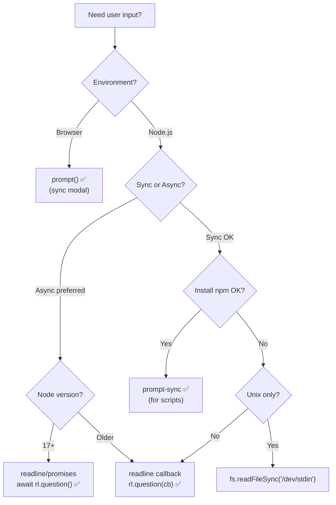

# 08 — User Inputs: Complete Interview & Reference Guide

## Overview

User input is how a program receives data at runtime. In JavaScript, the mechanism differs entirely between environments: browser-side uses `window.prompt()` (synchronous, modal), while Node.js has three main approaches: `readline` (async callback-based), `prompt-sync` (npm package, synchronous), and `fs.readFileSync('/dev/stdin')` (file system, synchronous). For Playwright testers, understanding Node.js input methods is essential for writing CLI test-data scripts and interactive automation helpers.

---

## Table of Contents

1. [Syntax Reference — End to End](#1-syntax-reference--end-to-end)
2. [Built-in Functions & Methods](#2-built-in-functions--methods)
3. [Deep Insights & Gotchas](#3-deep-insights--gotchas)
4. [Interview-Ready Definitions](#4-interview-ready-definitions)
5. [Tricky Interview Questions](#5-tricky-interview-questions)
6. [Controversial Topics & Ongoing Debates](#6-controversial-topics--ongoing-debates)
7. [Quick Reference Cheat Sheet](#7-quick-reference-cheat-sheet)
8. [Memory Map & Visual Flowchart](#8-memory-map--visual-flowchart)
9. [LinkedIn-Style Post](#9-linkedin-style-post)
10. [Summary & Individual Notes Index](#10-summary--individual-notes-index)

---

## 1. Syntax Reference — End to End

### 1.1 Browser — `window.prompt()` (Synchronous)

```javascript
// Only available in a browser — NOT in Node.js
let name = prompt("Enter your name:");
let age  = prompt("Enter your age:");
let ageNum = Number(age); // convert string → number

console.log(`Hello ${name}, you are ${ageNum} years old.`);

// prompt with default value
let country = prompt("Enter country:", "India");

// User clicks Cancel → returns null
let input = prompt("Enter value:");
if (input === null) {
    console.log("User cancelled");
}
```

### 1.2 Node.js — `readline` (Async, Built-in)

```javascript
const readline = require("readline");

const rl = readline.createInterface({
    input: process.stdin,
    output: process.stdout
});

rl.question("Enter a number: ", (input) => {
    let num = Number(input);

    if (num % 2 === 0) {
        console.log(num + " is Even");
    } else {
        console.log(num + " is Odd");
    }

    rl.close(); // must close or process hangs
});
```

### 1.3 Node.js — `prompt-sync` (Synchronous, npm)

```javascript
// Install: npm install prompt-sync
const prompt = require("prompt-sync")();

let name = prompt("Enter your name: ");
let age  = prompt("Enter your age: ");
let ageNum = Number(age);

console.log(`Hello ${name}, you are ${ageNum} years old.`);
```

### 1.4 Node.js — `fs.readFileSync` (Synchronous, stdin)

```javascript
const fs = require("fs");

// Read all stdin as one block — useful for competitive programming
let input = fs.readFileSync("/dev/stdin", "utf8").trim();
let lines  = input.split("\n");

console.log("First line:", lines[0]);
```

### 1.5 Type Conversion for Input

```javascript
// ALL input methods return STRINGS — always convert!
let rl_input = "42";        // from readline callback
let num = Number(rl_input); // 42 — number
let int = parseInt(rl_input, 10); // 42 — integer
let flt = parseFloat("3.14");     // 3.14 — float

// Common gotcha:
console.log("5" + 3);   // "53" ❌ — string concat
console.log(5 + 3);     // 8   ✅ — after Number() conversion
```

---

## 2. Built-in Functions & Methods

### `readline` Module (Node.js Built-in)

```javascript
readline.createInterface({ input, output })
  // Creates an Interface object

rl.question(prompt, callback)
  // Displays prompt, reads one line, calls callback with the line

rl.close()
  // IMPORTANT: closes stdin — process exits cleanly

rl.on("line", callback)
  // Event-based: fires for every line of stdin
```

### `prompt()` (Browser Global)

```javascript
prompt(message)           // modal dialog, returns string or null
prompt(message, default)  // with pre-filled default value
```

### `fs.readFileSync` (Node.js)

```javascript
fs.readFileSync("/dev/stdin", "utf8")
  // Returns entire stdin as a UTF-8 string
  // .trim() removes trailing newline
  // .split("\n") splits into lines
```

### Type Conversion Built-ins

```javascript
Number(value)       // converts to number, returns NaN if invalid
parseInt(str, 10)   // parses integer with base 10
parseFloat(str)     // parses float
String(value)       // converts to string
```

---

## 3. Deep Insights & Gotchas

### 3.1 ALL Input Methods Return Strings

The most important rule: every user input API gives you a **string**. Mathematical operations require explicit conversion.

```javascript
rl.question("Enter number: ", (input) => {
    console.log(input + 5);       // "105" ← string concat bug
    console.log(Number(input) + 5); // 15  ✅
});
```

### 3.2 `rl.close()` Is Mandatory

Forgetting `rl.close()` leaves the readline interface open, which keeps `process.stdin` open, which prevents the Node.js process from exiting naturally — it hangs forever.

```javascript
rl.question("Enter: ", (input) => {
    console.log(input);
    rl.close(); // ← without this, terminal hangs
});
```

### 3.3 `prompt()` Returns `null` on Cancel

```javascript
let input = prompt("Enter name:");
if (input === null) {
    // User clicked Cancel — input is null, not ""
    console.log("Cancelled");
}
```

### 3.4 `readline` Is Async — Subsequent Code Runs Before the Answer

```javascript
rl.question("Enter: ", (input) => {
    console.log("Inside callback:", input); // runs SECOND
});
console.log("Outside callback");            // runs FIRST
```

Any code that depends on the input must be inside the callback (or use `async/await` with `rl[Symbol.asyncIterator]()`).

### 3.5 `prompt-sync` Blocks the Event Loop

`prompt-sync` is synchronous and blocking — it freezes Node.js until input is provided. Fine for learning/CLI scripts, but should never be used in production servers or async code.

### 3.6 `/dev/stdin` Doesn't Exist on Windows

`fs.readFileSync("/dev/stdin")` works on Linux/macOS but NOT on Windows (no `/dev/stdin` path). Use `process.stdin` or platform-specific alternatives for cross-platform code.

---

## 4. Interview-Ready Definitions

### `prompt()` (Browser)
> **Definition (say this):** "`window.prompt()` is a synchronous browser API that displays a modal dialog box with a text input. It blocks JavaScript execution until the user clicks OK or Cancel. OK returns the string the user entered; Cancel returns `null`. It is NOT available in Node.js."
> **Follow-up:** "Why is `prompt()` generally avoided in production?"
> **Answer:** "It blocks the entire page, provides no styling/customization, and cannot be automated by test frameworks. Custom modal dialogs (HTML/CSS/JS) are used instead."

### `readline` (Node.js)
> **Definition (say this):** "`readline` is a built-in Node.js module that provides an interface for reading data from a readable stream (like `process.stdin`) line by line. It's asynchronous — the callback-based `rl.question()` reads one line and returns it in a callback. `rl.close()` must be called to end the interface."

### `prompt-sync` (npm)
> **Definition (say this):** "`prompt-sync` is a third-party npm package that wraps Node.js's synchronous I/O to provide a `prompt()` function similar to the browser's. It blocks the event loop until the user provides input — useful for learning/CLI scripts but inappropriate for async/production code."

### Type Coercion in Input
> **Definition (say this):** "All user input APIs return strings. Arithmetic operations on string inputs cause type coercion bugs — `'5' + 3` produces `'53'` instead of `8`. Always convert input explicitly with `Number()`, `parseInt()`, or `parseFloat()` before performing arithmetic."

---

## 5. Tricky Interview Questions

---

**Q1:** What does `rl.question()` return?
**A:** `undefined`. It doesn't return the input — the input is passed to the callback function as the first argument. The return value of `rl.question()` itself is `undefined`.
**Difficulty:** Medium

---

**Q2 — Spot the Bug:**
```javascript
rl.question("Enter number: ", (input) => {
    console.log(input + 10);
    rl.close();
});
```
**A:** If user enters `5`, output is `"510"` not `15`. `input` is a string. Fix: `console.log(Number(input) + 10)`.
**Difficulty:** Easy

---

**Q3:** What is the output order?
```javascript
rl.question("Enter: ", (input) => {
    console.log("B:", input);
    rl.close();
});
console.log("A");
```
**A:** `"A"` prints first, then `"B"` (after user input). `rl.question` is async — it registers the callback and immediately returns. Code after `rl.question()` runs before the user responds.
**Difficulty:** Medium

---

**Q4:** What happens if `rl.close()` is not called?
**A:** The Node.js process hangs — it keeps waiting for more input from `process.stdin` and never exits, even after the callback finishes. The terminal appears frozen.
**Difficulty:** Medium

---

**Q5:** What does `prompt()` return if the user clicks Cancel?
**A:** `null`. If the user presses OK with an empty field, it returns `""` (empty string). If Cancel is clicked, it returns exactly `null`. Always check for null before using the result.
**Difficulty:** Easy

---

**Q6:** Can `prompt()` be used in Node.js?
**A:** No — `prompt()` is a browser-only global (`window.prompt`). Node.js doesn't have a DOM or browser globals. In Node.js use `readline` (built-in async) or `prompt-sync` (npm synchronous).
**Difficulty:** Easy

---

**Q7:** What is the difference between `readline` and `prompt-sync`?
**A:**
| | `readline` | `prompt-sync` |
|-|-----------|--------------|
| Module | Built-in (no install) | npm package (install needed) |
| Execution | Async (callback) | Synchronous (blocks) |
| Event loop | Non-blocking | Blocks until input |
| Use case | Production CLI tools | Learning/scripts |
**Difficulty:** Medium

---

**Q8:** How would you read multiple lines of input in Node.js?
```javascript
const rl = readline.createInterface({ input: process.stdin, output: process.stdout });
let lines = [];

rl.on("line", (line) => {
    lines.push(line.trim());
});

rl.on("close", () => {
    console.log("All lines:", lines);
    // Process lines here
});
```
**A:** Use `rl.on("line", ...)` to collect each line into an array. Process the data in the `rl.on("close", ...)` handler which fires when stdin ends (EOF / Ctrl+D).
**Difficulty:** Medium

---

**Q9:** Why does `/dev/stdin` not work on Windows?
**A:** `/dev/stdin` is a Unix/Linux special file that refers to the standard input stream. Windows doesn't have this path. Use `process.stdin` directly or platform-specific alternatives. For cross-platform CLI tools, `readline` or `prompt-sync` are better choices.
**Difficulty:** Easy

---

**Q10:** How do you convert user input to a number safely?
```javascript
let input = "42abc";
console.log(Number(input));     // NaN
console.log(parseInt(input, 10)); // 42 — parses until non-digit
```
**A:** `Number()` converts the whole string — returns `NaN` if any non-numeric character is present. `parseInt(str, 10)` parses characters until the first non-digit — useful for strings like `"42px"`. Always validate with `Number.isNaN()` after conversion.
**Difficulty:** Medium

---

## 6. Controversial Topics & Ongoing Debates

### `readline` Callback Hell vs `async/await`

**The debate:** `readline`'s callback-based API leads to nesting when reading multiple inputs sequentially.

**Problem:**
```javascript
rl.question("Name: ", (name) => {
    rl.question("Age: ", (age) => {
        rl.question("City: ", (city) => {
            // 3 levels deep — callback hell
        });
    });
});
```

**Modern solution (Node.js 17+):**
```javascript
const { createInterface } = require("readline/promises");
const rl = createInterface({ input: process.stdin, output: process.stdout });

const name = await rl.question("Name: ");
const age  = await rl.question("Age: ");
rl.close();
```
`readline/promises` returns Promises, so `async/await` works cleanly.

---

### `prompt-sync` in Production — Is It Ever OK?

**The debate:** Is `prompt-sync` ever acceptable in non-learning code?

**Reality:** Blocking the Node.js event loop is almost never acceptable in production servers. However, for one-shot CLI scripts (build tools, data migration, admin tools), synchronous input is perfectly fine and simpler.

**Current consensus:** `prompt-sync` for CLI scripts and learning. `readline` (or `readline/promises`) for anything that needs to be non-blocking.

---

## 7. Quick Reference Cheat Sheet

### Input Methods Comparison

| Method | Environment | Sync? | Install? | Returns |
|--------|------------|-------|---------|---------|
| `prompt()` | Browser only | ✅ Sync | Built-in | `string` or `null` |
| `readline` | Node.js | ❌ Async | Built-in | Callback arg |
| `readline/promises` | Node.js 17+ | `await` | Built-in | Promise\<string\> |
| `prompt-sync` | Node.js | ✅ Sync | npm | `string` |
| `fs.readFileSync('/dev/stdin')` | Node.js (Unix) | ✅ Sync | Built-in | Full stdin string |

### `readline` Skeleton

```javascript
const readline = require("readline");
const rl = readline.createInterface({
    input: process.stdin,
    output: process.stdout
});

rl.question("Prompt: ", (input) => {
    let num = Number(input); // ← always convert!
    console.log(num);
    rl.close();              // ← always close!
});
```

### Type Conversion

```javascript
Number("42")        → 42
Number("42abc")     → NaN
parseInt("42px", 10) → 42
parseFloat("3.14x") → 3.14
String(42)          → "42"
```

---

## 8. Memory Map & Visual Flowchart

### A) Mind Map

```
[User Inputs in JavaScript]
  ├── Browser
  │     └── prompt() → synchronous modal, string or null ⚠️
  │           ├── Cancel → null (not "") ⚠️
  │           └── NOT available in Node.js ❌
  └── Node.js
        ├── readline (built-in, async)
        │     ├── createInterface(stdin, stdout)
        │     ├── rl.question(prompt, callback) → async ⚠️
        │     ├── rl.close() → mandatory ⚠️
        │     └── rl.on("line") → multi-line input
        ├── readline/promises (Node 17+, async with await)
        │     └── await rl.question("Prompt: ") → clean ✅
        ├── prompt-sync (npm, synchronous)
        │     └── Blocks event loop ⚠️ — OK for scripts only
        └── fs.readFileSync("/dev/stdin") → Unix only ⚠️
  
  ALL inputs return STRINGS → always convert to number ⚠️
  ├── Number(input) → full conversion (NaN if invalid)
  └── parseInt(input, 10) → parses until non-digit
```

### B) Flowchart — Which Input Method?



### C) Execution Trace — Async vs Sync Order

```javascript
// readline (async)
rl.question("Enter: ", (input) => {
    console.log("B:", input);
});
console.log("A");
```

| Step | What runs | Output |
|------|-----------|--------|
| 1 | `rl.question(...)` registers callback, returns immediately | — |
| 2 | `console.log("A")` — next synchronous line | `"A"` |
| 3 | User types input, presses Enter | — |
| 4 | Callback fires: `console.log("B:", input)` | `"B: <input>"` |

---

## 9. LinkedIn-Style Post

### 📢 LinkedIn Post

> **Everyone who starts Node.js makes this mistake. Did you?**
>
> ```javascript
> rl.question("Enter number: ", (input) => {
>     console.log(input + 10);
> });
> ```
>
> If you enter `5`, the output is `"510"` — not `15`.
>
> `readline` gives you a **string**. So does `prompt()`. So does every input API in JavaScript.
>
> Always convert first:
> ```javascript
> let num = Number(input);
> console.log(num + 10); // 15 ✅
> ```
>
> And two more things that bite beginners:
>
> ⚠️ Forget `rl.close()` → your Node.js process hangs forever.
>
> ⚠️ Code after `rl.question(...)` runs **before** the user answers:
> ```javascript
> rl.question("Enter: ", (input) => {
>     console.log("B"); // prints SECOND
> });
> console.log("A"); // prints FIRST
> ```
>
> readline is asynchronous. The callback only fires after the user hits Enter.
>
> 💡 For modern Node.js (v17+), use `readline/promises` with `async/await` — no callback nesting, no confusion.
>
> **Key Takeaway:** All JS input APIs return strings. Always convert. And with `readline`, always `rl.close()`.
>
> #JavaScript #NodeJS #WebDev #CodingTips #LearnToCode

---

## 10. Summary & Individual Notes Index

| File | Topic |
|------|-------|
| [48_Browser_Prompt_Function_IQ.md](./48_Browser_Prompt_Function_IQ.md) | `window.prompt()` — browser sync modal, null on Cancel |
| [49_Node_Readline_Input_IQ.md](./49_Node_Readline_Input_IQ.md) | `readline` — async callback, rl.close() |
| [50_Node_Prompt_Sync_Input_IQ.md](./50_Node_Prompt_Sync_Input_IQ.md) | `prompt-sync` — synchronous npm package |
| [51_Node_Fs_Stdin_Input_IQ.md](./51_Node_Fs_Stdin_Input_IQ.md) | `fs.readFileSync('/dev/stdin')` — Unix stdin |

---

## Summary

**Key Takeaway:** Browser uses `window.prompt()` (synchronous, returns string or null). Node.js has three options: `readline` (async, production-standard), `prompt-sync` (sync, npm package), and `fs.readFileSync('/dev/stdin')` (sync, works on Unix). Always validate user input before using it.
