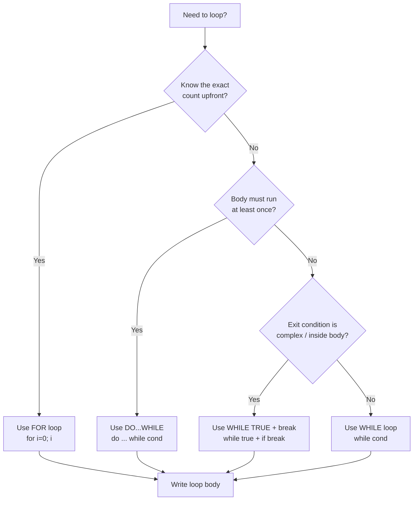

# 09 — Loops: Complete Interview & Reference Guide

> Loops are JavaScript's mechanism for executing a block of code repeatedly until a condition is met. This chapter covers every loop construct — `for`, `while`, `do...while`, and nested loops — along with the increment/decrement operators that drive them. Mastery of loops is fundamental for any developer or tester: they power iteration over data, retry logic, and all time-based or count-based control flow.

---

## Table of Contents

1. [Syntax Reference — End to End](#1-syntax-reference--end-to-end)
2. [Built-in Functions & Methods](#2-built-in-functions--methods)
3. [Deep Insights & Gotchas](#3-deep-insights--gotchas)
4. [Interview-Ready Definitions](#4-interview-ready-definitions)
5. [Tricky Interview Questions](#5-tricky-interview-questions)
6. [Controversial Topics & Ongoing Debates](#6-controversial-topics--ongoing-debates)
7. [Quick Reference Cheat Sheet](#7-quick-reference-cheat-sheet)
8. [Memory Map & Visual Flowchart](#8-memory-map--visual-flowchart)
9. [LinkedIn-Style Post](#9-linkedin-style-post)
10. [Summary & Individual Notes Index](#10-summary--individual-notes-index)

---

## 1. Syntax Reference — End to End

### 1.1 `for` Loop — All Variations

```javascript
// Standard for loop (ICU: Init, Condition, Update)
for (let i = 0; i < 10; i++) {
    console.log(i); // 0 to 9
}

// Using <= for inclusive upper bound
for (let i = 1; i <= 10; i++) {
    console.log(i); // 1 to 10
}

// Pre-increment in update slot (identical output)
for (let i = 0; i < 10; ++i) {
    console.log(i);
}

// Custom variable name — any valid identifier works
for (let count = 0; count < 5; count++) {
    console.log(count);
}

// Empty init slot (when counter declared outside)
let i = 0;
for (; i < 5; i++) {
    console.log(i);
}

// Infinite loop (missing condition — AVOID unless intentional)
// for (let i = 0; ; i++) { ... }

// Condition that never runs (0 > 1 is immediately false)
// for (let x = 0; x > 1; x++) { ... }
```

### 1.2 `for` with Logic Inside

```javascript
for (let i = 0; i < 18; i++) {
    if (i > 15) {
        console.log("Condition met at", i);
    } else {
        console.log("Not yet:", i);
    }
}
```

### 1.3 `while` Loop

```javascript
// Standard while
let j = 0;
while (j < 10) {
    console.log(j);
    j++;
}

// Counted retry pattern
let attempts = 0;
while (attempts < 3) {
    console.log("Attempt", attempts);
    attempts++;
}

// while(true) with break — intentional infinite loop
let age = 7;
while (true) {
    if (age > 10) break;
    console.log(age);
    age++;
}
```

### 1.4 `do...while` Loop

```javascript
// Executes at least once — condition checked AFTER the body
let retry = 0;
do {
    console.log("Executing, retry:", retry);
    retry++;
} while (retry < 3);

// Even when condition is immediately false, body runs once
let n = 100;
do {
    console.log("This runs once"); // prints despite 100 < 0 being false
} while (n < 0);
```

### 1.5 Nested `for` Loops

```javascript
// 2D grid — every (i, j) pair
for (let i = 0; i < 3; i++) {
    for (let j = 0; j < 3; j++) {
        console.log(i, j);
    }
}
// Total iterations: 3 × 3 = 9

// Multiplication table
for (let i = 1; i <= 5; i++) {
    for (let j = 1; j <= 5; j++) {
        process.stdout.write(`${i * j}\t`);
    }
    console.log();
}
```

### 1.6 `break` and `continue`

```javascript
// break — exit the loop immediately
for (let i = 0; i < 10; i++) {
    if (i === 5) break;
    console.log(i); // 0 1 2 3 4
}

// continue — skip this iteration
for (let i = 0; i < 10; i++) {
    if (i % 2 === 0) continue;
    console.log(i); // 1 3 5 7 9
}

// Labelled break — exit outer loop from inner
outer: for (let i = 0; i < 3; i++) {
    for (let j = 0; j < 3; j++) {
        if (i === 1 && j === 1) break outer;
        console.log(i, j);
    }
}
```

### 1.7 Increment / Decrement Operators

```javascript
let a = 5;

// Post-increment: use value THEN increment
let b = a++;  // b = 5, a = 6

// Pre-increment: increment THEN use value
let c = ++a;  // a = 7, c = 7

// Post-decrement
let d = a--;  // d = 7, a = 6

// Pre-decrement
let e = --a;  // a = 5, e = 5
```

---

## 2. Built-in Functions & Methods

> The loop chapter itself doesn't introduce new built-in methods, but the operators and control-flow keywords used in loops are part of the JS language core.

### `break`
- **Syntax:** `break;` or `break label;`
- **Effect:** Immediately exits the nearest enclosing loop (or labelled loop).
- **Returns:** Nothing — it's a statement.
- **Gotcha:** Cannot be used inside a `forEach` callback — use a regular `for` loop instead.

```javascript
for (let i = 0; i < 5; i++) {
    if (i === 3) break;
    console.log(i); // 0 1 2
}
```

### `continue`
- **Syntax:** `continue;` or `continue label;`
- **Effect:** Skips the rest of the current iteration and moves to the next.
- **Gotcha:** In a `while` loop, the update expression (`i++`) must still be reached — place `continue` after the update or you'll create an infinite loop.

```javascript
for (let i = 0; i < 5; i++) {
    if (i === 2) continue;
    console.log(i); // 0 1 3 4
}

// DANGER in while: infinite loop if update is before continue
let i = 0;
while (i < 5) {
    if (i === 2) { i++; continue; } // must increment BEFORE continue
    console.log(i);
    i++;
}
```

### `++` / `--` Operators
- **Prefix (`++x`):** Increment first, return new value.
- **Postfix (`x++`):** Return current value, then increment.
- **In loop update slot:** Both are equivalent (return value is discarded).

---

## 3. Deep Insights & Gotchas

### 3.1 Missing `i++` → Infinite Loop
The single most common loop bug: forgetting the update step.

```javascript
let i = 0;
while (i < 5) {
    console.log(i);
    // i++ missing → runs forever
}
```

### 3.2 `for(;;)` is Valid — and Dangerous
An empty condition in a `for` loop evaluates as `true` forever:
```javascript
for (;;) {
    // infinite loop — requires a break to exit
}
```

### 3.3 `++i` vs `i++` in Expressions (Not Just Update Slots)
In the update slot both are identical. But in expressions the difference is critical:
```javascript
let a = 5;
console.log(a++); // prints 5 (old value), then a becomes 6
console.log(++a); // a becomes 7, prints 7 (new value)
```

### 3.4 `do...while` Semicolon Is Required
Omitting the semicolon after `while(condition)` is a syntax error in strict mode:
```javascript
do { ... } while (x < 5)   // ← WRONG — missing ;
do { ... } while (x < 5);  // ← CORRECT
```

### 3.5 `for...in` on Arrays Gives String Keys, Not Numbers
```javascript
let arr = [10, 20, 30];
for (let key in arr) {
    console.log(typeof key); // "string" — "0", "1", "2"
    console.log(key);        // "0", "1", "2"
}
// If array has custom properties added, for...in iterates those too!
arr.extra = "oops";
for (let k in arr) console.log(k); // "0", "1", "2", "extra"
```

### 3.6 Nested Loop Performance — O(N²)
Nesting two loops over an array of size N gives N² iterations:
```javascript
for (let i = 0; i < n; i++)       // N times
    for (let j = 0; j < n; j++)   // N × N total
```
For N = 1000, that's 1,000,000 iterations. Always ask: can this be flattened?

### 3.7 `break` Cannot Exit `forEach`
```javascript
[1, 2, 3].forEach(n => {
    if (n === 2) break; // SyntaxError — break is not valid inside a callback
});
// Solution: use for...of or a regular for loop
```

### 3.8 Loop Variable Leak with `var`
```javascript
for (var i = 0; i < 3; i++) { }
console.log(i); // 3 — var leaks out of the loop block!

for (let j = 0; j < 3; j++) { }
console.log(j); // ReferenceError — let is block-scoped ✅
```
**Always use `let` (not `var`) as your loop counter.**

---

## 4. Interview-Ready Definitions

### Loop
> **Definition (say this):** "A loop is a control-flow structure that repeatedly executes a block of code as long as a specified condition remains true, or for a fixed number of iterations."
> **Follow-up:** "What are the three types of loops in JavaScript?"
> **Answer:** "`for`, `while`, and `do...while`. `for` is best when the iteration count is known; `while` when it depends on a runtime condition; `do...while` when the body must run at least once."

### `for` Loop
> **Definition (say this):** "A `for` loop has three parts in its header — init, condition, and update — that define how the counter starts, when the loop exits, and how the counter changes each iteration."
> **Follow-up:** "What does ICU stand for?"
> **Answer:** "Init, Condition, Update — the three header slots of a `for` loop."

### Pre-increment vs Post-increment
> **Definition (say this):** "`++i` (pre-increment) increments the variable before the expression is evaluated, so the expression sees the new value. `i++` (post-increment) returns the current value first, then increments."
> **Follow-up:** "Does it matter which you use in a `for` loop update slot?"
> **Answer:** "No — in the update slot, the return value is discarded, so `i++` and `++i` produce identical behaviour."

### `do...while`
> **Definition (say this):** "A `do...while` loop always executes its body at least once because the condition is checked after the body runs, not before."
> **Follow-up:** "Name a real-world use case."
> **Answer:** "User input validation — you must ask the user at least once before you can check if their input is valid."

### `break` and `continue`
> **Definition (say this):** "`break` exits the loop immediately; `continue` skips the rest of the current iteration and moves to the next one."
> **Follow-up:** "Can you use `break` inside `forEach`?"
> **Answer:** "No — `break` is a statement that only works inside loop constructs. `forEach` uses a callback function, so `break` would cause a SyntaxError. Use `for...of` or a regular `for` loop when you need early exit."

---

## 5. Tricky Interview Questions

---

**Q1:** What is the output?
```javascript
let a = 5;
let b = a++;
console.log(a, b);
```
**A:** `6  5`. Post-increment: `b` gets the old value (`5`), then `a` becomes `6`.
**Difficulty:** Medium

---

**Q2:** What is the output?
```javascript
let a = 5;
let b = ++a;
console.log(a, b);
```
**A:** `6  6`. Pre-increment: `a` becomes `6` first, then `b = 6`.
**Difficulty:** Medium

---

**Q3:** What is the output?
```javascript
for (var i = 0; i < 3; i++) { }
console.log(i);
```
**A:** `3`. `var` is function-scoped, so `i` leaks out of the `for` block.
**Difficulty:** Medium

---

**Q4:** What is the output?
```javascript
let x = 10;
do {
    console.log(x);
    x++;
} while (x < 10);
```
**A:** `10`. Even though `10 < 10` is false, the body runs once before the condition is checked.
**Difficulty:** Medium

---

**Q5 — Spot the Bug:**
```javascript
let i = 0;
while (i < 5) {
    if (i === 2) continue;
    console.log(i);
    i++;
}
```
**A:** Infinite loop. When `i === 2`, `continue` skips `i++`, so `i` is stuck at `2` forever. Fix: move `i++` before `continue`.
**Difficulty:** Hard

---

**Q6:** What is the output of this nested loop?
```javascript
for (let i = 0; i < 3; i++) {
    for (let j = 0; j < 3; j++) {
        if (i === j) continue;
        console.log(i, j);
    }
}
```
**A:** All `(i, j)` pairs where `i !== j`:
`0 1`, `0 2`, `1 0`, `1 2`, `2 0`, `2 1` — 6 lines total.
**Difficulty:** Medium

---

**Q7 — Spot the Bug:**
```javascript
for (let i = 0; i < 5; i++);
{
    console.log("Hello");
}
```
**A:** `"Hello"` prints exactly **once**. The `;` after the `)` makes the loop body empty. The `{}` block is a standalone block statement, not the loop body.
**Difficulty:** Hard

---

**Q8:** When would you choose `while` over `for`?
**A:** "When the number of iterations isn't known upfront and depends on a runtime condition — for example, reading lines from a file until EOF, waiting for a network condition, or retrying until success. `for` is better when the count is known."
**Difficulty:** Easy

---

**Q9:** What is the output?
```javascript
let i = 1;
for (; i <= 3; ) {
    console.log(i);
    i++;
}
```
**A:** `1  2  3`. Both init and update slots are empty; the loop is valid — it behaves exactly like a `while(i <= 3)` loop.
**Difficulty:** Medium

---

**Q10:** What happens with labelled `break`?
```javascript
outer: for (let i = 0; i < 3; i++) {
    for (let j = 0; j < 3; j++) {
        if (j === 1) break outer;
        console.log(i, j);
    }
}
```
**A:** Only `0 0` is printed. When `j === 1`, `break outer` exits the outer loop entirely, not just the inner one.
**Difficulty:** Hard

---

**Q11:** `for...in` vs `for...of` on an array — what's different?
```javascript
let arr = [10, 20, 30];
for (let k in arr) console.log(typeof k, k);
for (let v of arr) console.log(typeof v, v);
```
**A:**
- `for...in`: `"string" "0"`, `"string" "1"`, `"string" "2"` — iterates enumerable property *keys* (as strings).
- `for...of`: `"number" 10`, `"number" 20`, `"number" 30` — iterates *values* directly.
**Difficulty:** Medium

---

**Q12:** What is the output?
```javascript
let sum = 0;
for (let i = 1; i <= 100; i++) {
    if (i % 2 !== 0) continue;
    sum += i;
}
console.log(sum);
```
**A:** `2550` — sum of all even numbers from 2 to 100. `n*(n/2+1)/2` where n=100: `50*51=2550`.
**Difficulty:** Hard

---

## 6. Controversial Topics & Ongoing Debates

### `for...in` on Arrays — Use or Avoid?

**The debate:** Should you ever use `for...in` to iterate over an array?

**One side:** It works — `for (let k in arr)` gives you the indexes and `arr[k]` gives the values.

**Other side:** `for...in` iterates **all enumerable properties**, including non-index ones added to the array or inherited from `Array.prototype`. It also gives string keys, not numbers. Library code that extends `Array.prototype` (old jQuery, etc.) will cause surprise iterations.

**Current consensus:** Never use `for...in` on arrays. Use `for...of` for values, `arr.forEach` for index+value, or a classic `for(i=0;i<arr.length;i++)` loop.

---

### `var` vs `let` in Loop Counters

**The debate:** Classic JS used `var i` everywhere. Is it still acceptable?

**One side:** `var` works fine — the loop behaves identically.

**Other side:** `var` leaks outside the loop block and causes the famous "closure in a loop" bug:
```javascript
for (var i = 0; i < 3; i++) {
    setTimeout(() => console.log(i), 100);
}
// Prints: 3  3  3 (not 0 1 2!)
// Because all callbacks share the same `var i` reference.

for (let i = 0; i < 3; i++) {
    setTimeout(() => console.log(i), 100);
}
// Prints: 0  1  2 ✅ — let creates a new binding per iteration
```

**Current consensus:** Always use `let` in loop counters. `var` in loops is considered a legacy pattern and a source of subtle bugs.

---

### `break` vs `return` to Exit a Loop Early

**The debate:** Inside a function, should you use `break` or `return` to exit a loop early?

**One side:** Use `break` to exit the loop, then handle the result after — keeps the loop's purpose separate.

**Other side:** Using `return` directly exits both the loop and the function — simpler, fewer variables needed.

**Current consensus:** Both are acceptable. If the sole purpose of the loop is to find something, `return` inside the loop is clean and common. If you need to do something with the found value before returning, `break` and a variable are clearer.

---

## 7. Quick Reference Cheat Sheet

### Loop Types

| Loop | Best for | Condition checked |
|------|---------|------------------|
| `for (init; cond; update)` | Known iteration count | Before each iteration |
| `while (cond)` | Unknown iteration count | Before each iteration |
| `do { } while (cond)` | Must run at least once | **After** first iteration |

### ICU Locations

| Part | `for` | `while` | `do...while` |
|------|-------|---------|-------------|
| Init | Header slot 1 | Before the loop | Before the loop |
| Condition | Header slot 2 | In `while()` header | In trailing `while()` |
| Update | Header slot 3 | **Inside loop body** | **Inside loop body** |

### Increment / Decrement

| Expression | Value used in expression | Variable after |
|-----------|------------------------|---------------|
| `a++` | Old value | Old + 1 |
| `++a` | New value | Old + 1 |
| `a--` | Old value | Old − 1 |
| `--a` | New value | Old − 1 |
| In `for` update: `i++` = `++i` | Discarded | Same either way |

### `break` / `continue` Scope

```javascript
break;           // exit nearest loop
break label;     // exit labelled outer loop
continue;        // skip current iteration of nearest loop
continue label;  // skip current iteration of labelled outer loop
// Neither works inside forEach / map / filter callbacks!
```

### `var` vs `let` Loop Counter

```javascript
for (var i ...)  // ❌ leaks out, shared closure, avoid
for (let i ...)  // ✅ block-scoped, new binding per iteration
```

---

---

## 8. Memory Map & Visual Flowchart

### A) Mind Map

```
[JavaScript Loops]
  ├── for loop
  │     ├── ICU: Init ; Condition ; Update
  │     ├── i++ vs ++i in update slot → identical ✅
  │     ├── < vs <= → off-by-one risk ⚠️
  │     ├── Empty condition → Infinite loop ❌
  │     └── Nested for → O(N²) complexity ⚠️
  ├── while loop
  │     ├── Condition checked BEFORE body
  │     ├── Init lives OUTSIDE loop
  │     ├── Update lives INSIDE body ← forget = infinite loop ❌
  │     └── while(true) + break → intentional infinite ✅
  ├── do...while loop
  │     ├── Body runs AT LEAST ONCE ✅
  │     ├── Condition checked AFTER body
  │     └── Semicolon after while(cond); required ⚠️
  ├── break / continue
  │     ├── break → exit loop now
  │     ├── continue → skip this iteration
  │     ├── label: break/continue outer loop
  │     └── ❌ Neither works inside forEach/map callbacks
  └── Increment / Decrement
        ├── ++i (pre)  → increment FIRST, use new value
        ├── i++ (post) → use old value, increment after
        ├── In for update slot → both identical (value discarded)
        └── var loop counter → leaks out ❌ | let → block-scoped ✅
```

### B) Flowchart — Which Loop Should I Use?



### C) Execution Trace — `++i` vs `i++` (The Trickiest Concept)

```javascript
let a = 5;
let b = a++;  // post
let c = ++a;  // pre
```

| Step | Expression | `a` before | Value used | `a` after | Assigned to |
|------|-----------|-----------|------------|-----------|-------------|
| 1 | `a++` | 5 | **5** (old) | **6** | `b = 5` |
| 2 | `++a` | 6 | **7** (new) | **7** | `c = 7` |

**Result:** `a = 7`, `b = 5`, `c = 7`

---

## 9. LinkedIn-Style Post

### 📢 LinkedIn Post

> **Most JS developers get this wrong. Do you?** 🤔
>
> ```javascript
> let a = 5;
> let b = a++;  // What is b?
> let c = ++a;  // What is c?
> ```
>
> Most people say b = 6, c = 7.
>
> The real answer: **b = 5, c = 7** (and a = 7).
>
> Here's why:
>
> `a++` is post-increment — it returns the **old value first**, THEN increments.
> `++a` is pre-increment — it increments FIRST, then returns the **new value**.
>
> In a for loop update slot (`for (let i = 0; i < 10; i++)`) it doesn't matter.
> The return value is discarded. But in an expression? It changes everything.
>
> 💡 **Three loops, three rules:**
> - `for` → when you know the count
> - `while` → when you don't
> - `do...while` → when it must run at least once
>
> ⚠️ One more trap: `for (var i = 0 ...)` — var leaks outside the loop.
> Always use `let`.
>
> **Key Takeaway:** `i++` and `++i` look the same in loops but behave differently in expressions. Pre-increment = increment first. Post-increment = use first.
>
> #JavaScript #WebDev #Coding #ProgrammingTips #LearnToCode

---

## 10. Summary & Individual Notes Index

| File | Topic |
|------|-------|
| [52_Loops_IQ.md](./52_Loops_IQ.md) | Why loops exist — the motivation |
| [53_For_Loop_IQ.md](./53_For_Loop_IQ.md) | ICU pattern, `i++` vs `++i` in update slot |
| [54_Increment_IQ.md](./54_Increment_IQ.md) | Pre-increment trace table |
| [55_For_Loops2_IQ.md](./55_For_Loops2_IQ.md) | `<` vs `<=`, custom variable names |
| [56_For_Loops3_IQ.md](./56_For_Loops3_IQ.md) | `if/else` inside loop, never-running & infinite-loop edge cases |
| [57_While_IQ.md](./57_While_IQ.md) | `while` vs `for` equivalence |
| [58_While2_IQ.md](./58_While2_IQ.md) | Counted retry loop |
| [59_Example1_IQ.md](./59_Example1_IQ.md) | `while` practice exercise |
| [60_While_Vs_for_IQ.md](./60_While_Vs_for_IQ.md) | `while(true)` + `break` idiom |
| [61_Do_while_IQ.md](./61_Do_while_IQ.md) | `do...while` syntax reference |
| [62_DoWhile_Vs_While_IQ.md](./62_DoWhile_Vs_While_IQ.md) | At-least-once guarantee proven |
| [63_Nested_For_Loops_IQ.md](./63_Nested_For_Loops_IQ.md) | 2D grid iteration, O(N²) complexity |
