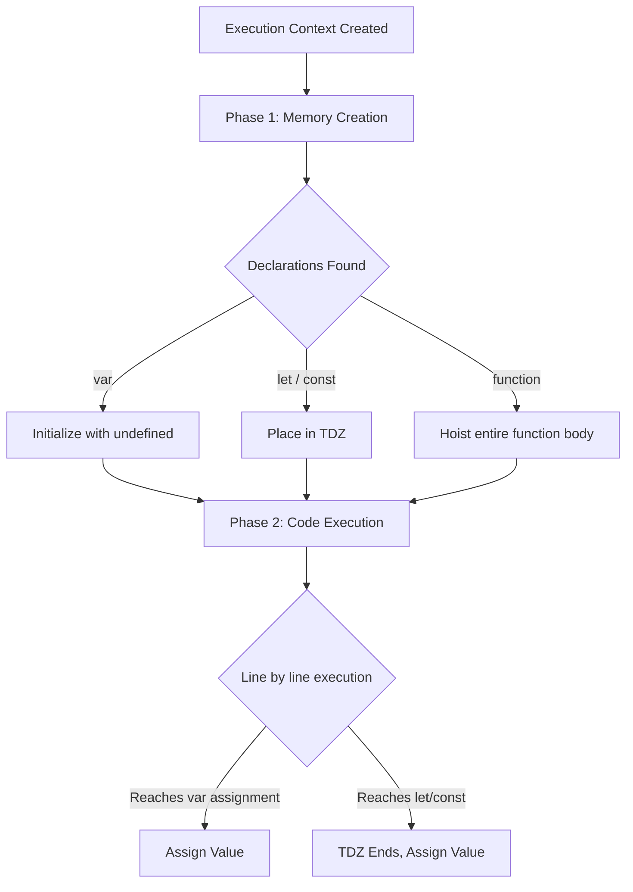

# MASTER IQ: Functions, Scope, and Hoisting

This document is the master reference for Chapter 11, strictly adhering to the 9-section format required by the Go Pikachu quality standards.

---

## 1. Syntax Reference — End to End

### Function Declaration
```javascript
function greet(name) {
    return `Hello, ${name}`;
}
```

### Function Expression
```javascript
const greet = function(name) {
    return `Hello, ${name}`;
};
```

### Arrow Function
```javascript
const greet = (name) => `Hello, ${name}`;
```

### IIFE (Immediately Invoked Function Expression)
```javascript
(function() {
    console.log("Runs immediately!");
})();
```

### Rest & Spread Operators
```javascript
// Rest (gathering arguments into an array)
function sum(...numbers) {
    return numbers.reduce((acc, curr) => acc + curr, 0);
}

// Spread (unpacking an array into arguments)
const arr = [1, 2, 3];
console.log(sum(...arr)); 
```

---

## 2. Built-in Functions & Methods

JavaScript provides several built-in mechanisms regarding functions:
- `Function.prototype.call(thisArg, arg1, arg2)`: Calls a function with a given `this` value and arguments provided individually.
- `Function.prototype.apply(thisArg, [argsArray])`: Calls a function with a given `this` value and arguments provided as an array.
- `Function.prototype.bind(thisArg, arg1, arg2)`: Creates a new function that, when called, has its `this` keyword set to the provided value.

---

## 3. Deep Insights & Gotchas

### The Temporal Dead Zone (TDZ)
When using `let` and `const`, the variables are hoisted but remain uninitialized until their declaration line is executed. This window is the TDZ. Accessing the variable in this zone throws a `ReferenceError`.

### Var Scope Leakage
`var` is function-scoped. If declared inside an `if` block or a `for` loop, it leaks to the outer function scope. This can lead to bugs, especially with asynchronous callbacks inside loops.

### Shadowing
A block-scoped variable (`let` or `const`) will shadow a variable with the same name in an outer scope. If accessed before initialization within that block, it triggers a TDZ error, rather than falling back to the outer scope.

---

## 4. Interview-Ready Definitions

- **Hoisting:** The JavaScript engine's behavior of moving declarations to the top of the current scope during the compilation phase, before execution begins.
- **Temporal Dead Zone (TDZ):** The period in block scope between the start of the block and the actual initialization of a `let` or `const` variable, during which the variable cannot be accessed.
- **Closure:** A function that remembers the variables from its lexical scope even after that outer function has executed.
- **First-Class Functions:** Functions in JavaScript are treated as values; they can be assigned to variables, passed as arguments, and returned from other functions.

---

## 5. Tricky Interview Questions

**Q1: What is the output of the following code?**
```javascript
console.log(a);
var a = 10;
console.log(b);
let b = 20;
```
*Answer:* `undefined` for `a` because `var` is hoisted and initialized with `undefined`. `ReferenceError` for `b` because `let` is hoisted but resides in the TDZ.

**Q2: What will this output?**
```javascript
let x = 1;
if (true) {
    console.log(x);
    let x = 2;
}
```
*Answer:* `ReferenceError`. The `let x = 2` inside the block shadows the global `x`. The `console.log(x)` hits the local `x` while it's still in the TDZ.

**Q3: Can a `const` object be modified?**
```javascript
const user = { name: "John" };
user.name = "Doe";
```
*Answer:* Yes. `const` prevents the reassignment of the variable binding itself, not the mutation of the underlying object.

---

## 6. Controversial Topics & Ongoing Debates

### Arrow Functions vs. Regular Functions
There is an ongoing debate about when to exclusively use Arrow functions. Proponents argue they offer cleaner syntax and lexical `this` binding, preventing context issues in React or event listeners. Opponents argue they make stack traces harder to read (if unnamed) and shouldn't be used for object methods where dynamic `this` is necessary.

### `let` vs `const` by Default
Many developers enforce a strict "use `const` for everything unless it strictly needs reassignment" rule. Others argue this dilutes the meaning of `const` (since objects/arrays can still mutate) and prefer `let` for better cognitive flow.

---

## 7. Quick Reference Cheat Sheet

| Keyword/Feature | Hoisted? | Initialized? | Scope | Can Reassign? |
|-----------------|----------|--------------|-------|---------------|
| `var`           | Yes      | `undefined`  | Function| Yes           |
| `let`           | Yes      | No (TDZ)     | Block | Yes           |
| `const`         | Yes      | No (TDZ)     | Block | No            |
| `function() {}` | Yes      | Fully loaded | Function| Yes           |
| `() => {}`      | Follows var/let/const | Follows var/let/const | Block | Follows var/let/const |

---

## 8. Memory Map & Visual Flowchart



---

## 9. LinkedIn-Style Post

💡 **Mastering Scope, Hoisting, and the TDZ in JavaScript!** 💡

Ever wondered why `console.log(a)` prints `undefined` before a `var` declaration, but crashes completely with `let`? 🤔

The answer lies in the **Temporal Dead Zone (TDZ)** and **Hoisting**! 

When JS compiles your code, it hoists declarations to the top. But here is the catch:
👉 `var` gets initialized with `undefined`.
👉 `let` and `const` get hoisted too, but they are placed in the TDZ until execution reaches their line. Touch them early? BOOM! ReferenceError! 💥

This ES6 feature isn't a bug; it's a strict quality control mechanism to catch poorly structured code. 

**Pro Tip:** Always use `const` by default, `let` when you must reassign, and pretend `var` doesn't exist anymore! 🚀

#JavaScript #WebDevelopment #CodingInterviews #Frontend #SoftwareEngineering
