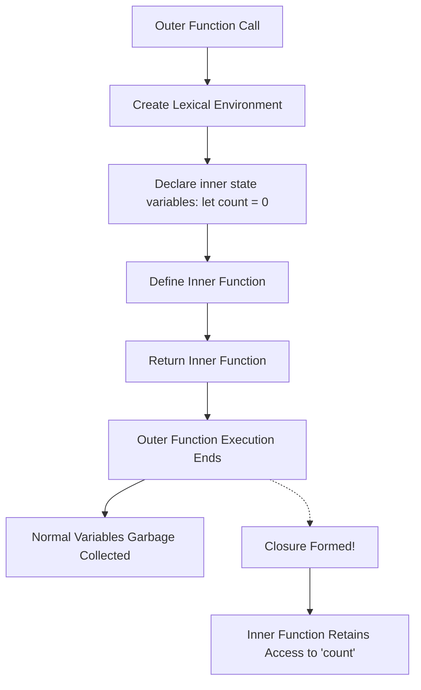

# MASTER IQ: Closures and Lexical Scope

This document is the master reference for Chapter 12, strictly adhering to the 9-section format required by the Go Pikachu quality standards.

---

## 1. Syntax Reference — End to End

### Basic Closure
```javascript
function makeCounter() {
    let count = 0;
    return function() {
        count++;
        return count;
    };
}
const counter = makeCounter();
console.log(counter()); // 1
```

### Factory Function Closure
```javascript
function makeRateLimiter(limit) {
    let calls = 0;
    return function() {
        calls++;
        return calls <= limit;
    }
}
```

---

## 2. Built-in Functions & Methods

Closures aren't built-in methods, but they are heavily utilized by built-in browser APIs:
- `setTimeout()`: Callbacks often form closures over variables defined outside the timeout.
- Event Listeners: `button.addEventListener('click', () => { count++; })` relies on closures to access `count`.
- Module Patterns: Prior to ES6 modules, IIFEs (Immediately Invoked Function Expressions) returning objects were the standard way to create private module state via closures.

---

## 3. Deep Insights & Gotchas

### Memory Leaks
Because closures maintain references to their outer lexical environment, the garbage collector cannot clear those outer variables from memory as long as the inner function is still accessible. Careless use of closures in large applications or DOM nodes can lead to memory leaks.

### Stale Closures (React Hook Gotcha)
In frameworks like React, closures capture variables exactly as they were at the time of creation. If state updates, an older closure might reference "stale" data unless carefully managed with dependencies.

---

## 4. Interview-Ready Definitions

- **Closure:** A closure is the combination of a function bundled together (enclosed) with references to its surrounding state (the lexical environment). In other words, a closure gives you access to an outer function's scope from an inner function.
- **Lexical Scoping:** A variable's scope is determined statically by its physical location in the source code.
- **Encapsulation:** The bundling of data (variables) and methods that operate on that data into a single unit, hiding the internal state from the outside.

---

## 5. Tricky Interview Questions

**Q1: What is the output of the following code?**
```javascript
function createFunctions() {
    var result = [];
    for (var i = 0; i < 3; i++) {
        result.push(function() { console.log(i); });
    }
    return result;
}
var funcs = createFunctions();
funcs[0](); funcs[1](); funcs[2]();
```
*Answer:* `3, 3, 3`. Because `var` is function-scoped, all three closures share the exact same `i` variable, which equals 3 after the loop finishes. (Fix by using `let`).

**Q2: How do you create private variables in JavaScript?**
*Answer:* Before ES2022 private class fields (`#`), closures were the standard way. You wrap a variable inside a function and return an object with methods that interact with it, preventing direct outside access.

---

## 6. Controversial Topics & Ongoing Debates

### Closures vs Classes
With the introduction of ES6 Classes and `#private` fields, a debate continues about whether to use the traditional functional Closure pattern (factory functions) or the Object-Oriented Class pattern for state encapsulation. Functional proponents argue closures are safer as they don't rely on the confusing `this` keyword. OOP proponents argue classes are more memory-efficient due to prototype sharing.

---

## 7. Quick Reference Cheat Sheet

| Feature | Description | Example Use Case |
|---------|-------------|------------------|
| Lexical Scope | Inner functions can access outer variables. | General nested logic. |
| State Encapsulation | Variables hidden inside outer function. | `let count = 0; return () => count++;` |
| Factory Functions | Returning objects/functions tailored by arguments. | `maxRetryTracker(3)` |
| Module Pattern | IIFE returning public API. | `(function(){ let p=1; return {get:()=>p} })()` |

---

## 8. Memory Map & Visual Flowchart



---

## 9. LinkedIn-Style Post

💡 **Demystifying JavaScript Closures!** 💡

Closures are often seen as the final boss of JavaScript basics, but they are incredibly powerful once they click! 🧠

At its core, a **Closure** simply means that an inner function "remembers" the variables of its outer function—even *after* the outer function has finished running! 

Why is this useful? 
🔒 **Private State:** You can hide variables (like API keys or retry counters) inside an outer function, making them completely inaccessible from the global scope. 
♻️ **Factories:** You can generate specialized functions on the fly, like a Rate Limiter or a Retry Tracker.

Next time you write a React `useEffect` or an `addEventListener`, remember—you're using closures! 🚀

#JavaScript #WebDevelopment #SoftwareEngineering #CodingInterviews #Frontend
