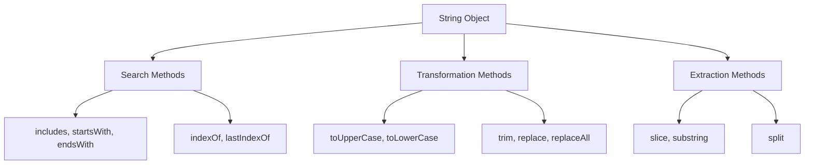

# MASTER IQ: Strings and Manipulation

This document is the master reference for Chapter 13, strictly adhering to the 9-section format required by the Go Pikachu quality standards.

---

## 1. Syntax Reference — End to End

### Declarations
```javascript
let single = 'hello';
let double = "world";
let template = `Hello, ${single} ${double}`; // Evaluates to "Hello, hello world"
```

### Checking & Searching
```javascript
let url = "https://staging.app.com";
url.includes("staging");   // true
url.startsWith("https");   // true
url.endsWith(".com");      // true
url.indexOf("a");          // 10
url.lastIndexOf("a");      // 18
```

### Accessing Characters
```javascript
let str = "Hello";
str[0];        // "H"
str.at(-1);    // "o" (Modern ES2022)
str.charAt(0); // "H"
```

---

## 2. Built-in Functions & Methods

JavaScript Strings have a massive prototype of built-in methods. Key categories include:
- **Transformations:** `toUpperCase()`, `toLowerCase()`, `trim()`, `trimStart()`, `trimEnd()`
- **Substrings:** `slice(start, end)`, `substring(start, end)`
- **Modifications:** `replace(pattern, replacement)`, `replaceAll(pattern, replacement)`
- **Array Conversions:** `split(separator)` (converts string to array)

---

## 3. Deep Insights & Gotchas

### Strings are Immutable
In JavaScript, primitive strings are immutable. Methods like `replace()` or `toUpperCase()` do **not** modify the original string; they return an entirely new string. 

### indexOf as a Boolean
Using `indexOf()` in an `if` statement can lead to logical bugs. 
`if (str.indexOf("http"))` evaluates to false if the string *starts* with "http", because `indexOf` returns `0`, which is falsy. You must explicitly check `!== -1` or use `includes()`.

---

## 4. Interview-Ready Definitions

- **Template Literal:** String literals allowing embedded expressions and multi-line strings, defined using backtick (`) characters.
- **Immutability:** The principle that an object's state (or in this case, a primitive string's value) cannot be modified after it is created.
- **Zero-Indexed:** Like arrays, strings start counting characters at position `0`.

---

## 5. Tricky Interview Questions

**Q1: How do you reverse a string in JavaScript?**
*Answer:* There is no built-in `reverse()` method for strings. You must split it into an array, reverse the array, and join it back: 
`str.split('').reverse().join('')`

**Q2: What is the difference between `slice` and `substring`?**
*Answer:* Both extract parts of a string. `slice()` accepts negative indices (which count from the end of the string). `substring()` treats negative indices as `0`. 

**Q3: How do you get the last character of a string?**
*Answer:* The old way is `str[str.length - 1]`. The modern, preferred ES2022 way is `str.at(-1)`.

---

## 6. Controversial Topics & Ongoing Debates

### Single vs. Double Quotes
JavaScript does not differentiate between single and double quotes functionally (unlike PHP or Bash). The choice is purely stylistic. Many modern codebases enforce single quotes via ESLint/Prettier for Javascript, reserving double quotes for HTML attributes and JSON. However, the rise of Template Literals (backticks) has led some to advocate for exclusively using backticks everywhere to avoid quote-escaping headaches.

---

## 7. Quick Reference Cheat Sheet

| Need to... | Method to use | Example |
|------------|---------------|---------|
| Inject variables | Template Literals | `` `Hi ${name}` `` |
| Check if string contains | `includes()` | `str.includes('test')` |
| Find position | `indexOf()` | `str.indexOf('a')` |
| Get last char | `at()` | `str.at(-1)` |
| Extract part | `slice()` | `str.slice(0, 5)` |
| Remove whitespace | `trim()` | `str.trim()` |

---

## 8. Memory Map & Visual Flowchart



---

## 9. LinkedIn-Style Post

💡 **Mastering JavaScript Strings!** 💡

Strings seem simple until you hit a weird bug! Here are 3 quick tips for modern JS Strings:

1️⃣ **Stop using `indexOf` for boolean checks!** 
Don't use `if (str.indexOf("x") !== -1)`. Use `str.includes("x")` — it's much cleaner!
2️⃣ **Getting the last character?** 
Forget `str[str.length - 1]`. ES2022 introduced `.at()`. Just use `str.at(-1)`!
3️⃣ **Template Literals > Concat!**
Stop doing `"Hello " + name + "!"`. Use backticks `` `Hello ${name}!` ``. It even supports multi-line text out of the box! 

Keep your code clean and modern! 🚀

#JavaScript #WebDevelopment #Frontend #CodingTips #SoftwareEngineering
