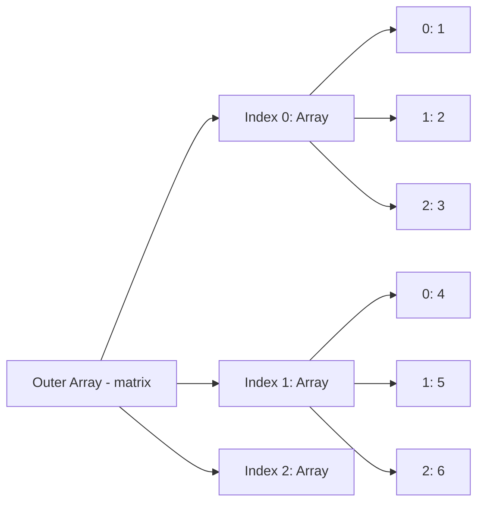

# MASTER IQ: Multi-Dimensional Arrays

This document is the master reference for Chapter 15, strictly adhering to the 9-section format required by the Go Pikachu quality standards.

---

## 1. Syntax Reference — End to End

### Declaration
```javascript
let matrix = [
    [1, 2, 3], // Row 0
    [4, 5, 6], // Row 1
    [7, 8, 9]  // Row 2
];
```

### Traversal with `for` loops
```javascript
for(let i = 0; i < matrix.length; i++) {
    for(let j = 0; j < matrix[i].length; j++) {
        process.stdout.write(matrix[i][j] + " ");
    }
    console.log();
}
```

### Traversal with `for...of` loops
```javascript
for(let row of matrix) {
    for(let cell of row) {
        process.stdout.write(cell + " ");
    }
    console.log();
}
```

---

## 2. Built-in Functions & Methods

Multi-dimensional arrays are just standard Arrays, so they inherit all Array prototype methods. Key functional methods for dealing with 2D structures:
- `array.map()`: Iterate over the outer array to process rows.
- `array.reduce()`: Often used inside a `.map()` to aggregate data per row.
- `array.flat(depth)`: Creates a new 1-dimensional array with all sub-array elements concatenated into it recursively up to the specified depth. `matrix.flat(1)` turns a 2D array into a 1D array.

---

## 3. Deep Insights & Gotchas

### Reference Traps
If you initialize a 2D array by filling it with the same array reference, you will create a bug where modifying one row modifies all rows.
```javascript
// BAD ❌
let badGrid = new Array(3).fill([0, 0, 0]);
badGrid[0][0] = 99; // Changes [0][0], [1][0], and [2][0] to 99!

// GOOD ✅
let goodGrid = Array.from({length: 3}, () => [0, 0, 0]);
```
This happens because `.fill()` passes the exact same array memory reference to every slot.

---

## 4. Interview-Ready Definitions

- **Multi-Dimensional Array:** An array containing one or more arrays as its elements. Often used to represent grids, tables, or matrices.
- **Nested Loop:** A loop placed inside another loop. Essential for traversing multi-dimensional structures. The inner loop completes all its iterations for every single iteration of the outer loop.
- **Jagged Array:** A 2D array where the inner arrays (rows) do not all have the same length. 

---

## 5. Tricky Interview Questions

**Q1: How do you transpose a 2D matrix (turn rows into columns)?**
*Answer:* Using `.map()` along with the index.
```javascript
let transposed = matrix[0].map((_, colIndex) => matrix.map(row => row[colIndex]));
```

**Q2: How do you print a left-leaning pyramid?**
*Answer:* By padding the left side of the row with spaces based on `n - i` before printing the stars `i`.

**Q3: How do you flatten a deeply nested array without using `.flat()`?**
*Answer:* Using recursion and `reduce`.
```javascript
const flatten = (arr) => arr.reduce((acc, val) => 
    Array.isArray(val) ? acc.concat(flatten(val)) : acc.concat(val), []
);
```

---

## 6. Controversial Topics & Ongoing Debates

### Performance: `.forEach()` vs `for` loops
When dealing with massive matrices (e.g., image processing, Canvas APIs, WebGL data), standard `for` loops `for(let i=0;...)` are often faster than functional loops like `.forEach()` or `.map()` because they avoid the overhead of function context creation and callbacks on millions of pixels. However, for most standard web applications, the readability of functional programming (`forEach`) is vastly preferred over micro-optimizations.

---

## 7. Quick Reference Cheat Sheet

| Task | Snippet |
|------|---------|
| Get Row Count | `grid.length` |
| Get Column Count | `grid[0].length` |
| Flatten 2D to 1D | `grid.flat()` |
| Print string in Node | `process.stdout.write("x")` |
| Access last cell | `grid[grid.length-1][grid[0].length-1]` |

---

## 8. Memory Map & Visual Flowchart



---

## 9. LinkedIn-Style Post

💡 **Conquering Multi-Dimensional Arrays!** 💡

Ever tried to build a chess board, a calendar, or process table data? You need a **2D Array**! ♟️

A 2D array is just an array *inside* an array. Instead of `grid[x]`, you use `grid[row][col]`.

**Pro-Tip:** Don't initialize an empty grid using `.fill([])`. Because JavaScript arrays are passed by reference, you'll accidentally fill your grid with clones pointing to the *exact same array* in memory! Change cell [0][0], and you change the whole column! 🤯

Instead, use `Array.from()` to map brand new arrays for every row: 
`Array.from({length: 3}, () => [0, 0, 0])` ✅

#JavaScript #WebDevelopment #CodingInterviews #Frontend #SoftwareEngineering
