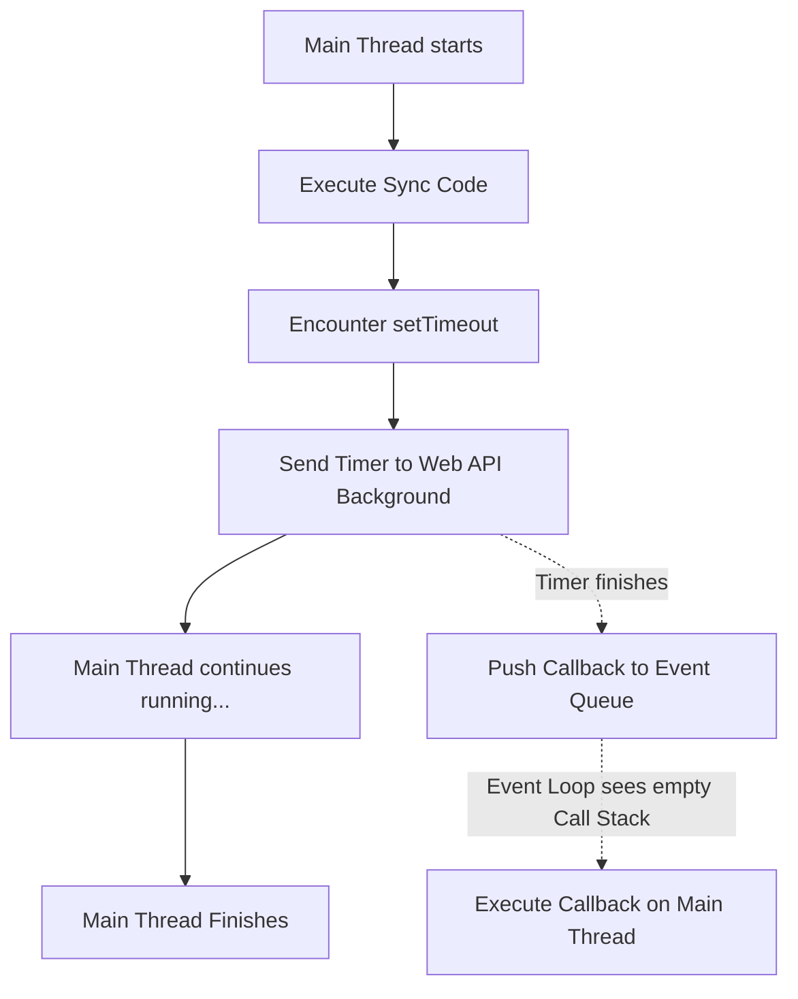

# MASTER IQ: Callbacks

This document is the master reference for Chapter 16, strictly adhering to the 9-section format required by the Go Pikachu quality standards.

---

## 1. Syntax Reference — End to End

### Passing Named Functions
```javascript
function greet() { console.log("Hello!"); }
function runAction(callback) { callback(); }
runAction(greet); // Notice: NO PARENTHESES after greet
```

### Passing Anonymous Functions (Common in testing)
```javascript
runAction(function() {
    console.log("Executing inline callback");
});
```

### Error-First Callback Pattern (Node.js standard)
```javascript
function fetchData(callback) {
    // Simulated failure
    callback(new Error("Network down"), null);
}

fetchData(function(err, data) {
    if (err) return console.error(err);
    console.log(data);
});
```

---

## 2. Built-in Functions & Methods

Many core JavaScript methods rely entirely on callbacks:
- **Array Iteration:** `.map()`, `.filter()`, `.forEach()`, `.reduce()`. These use *synchronous* callbacks.
- **Timers:** `setTimeout(callback, ms)`, `setInterval(callback, ms)`. These use *asynchronous* callbacks.
- **DOM Events:** `button.addEventListener("click", callback)`.
- **Node.js File System:** `fs.readFile("file.txt", callback)`.

---

## 3. Deep Insights & Gotchas

### Loss of `this` context
When you pass a standard function or an object method as a callback, it loses its `this` context because it is executed by a different part of the system.
```javascript
const user = {
    name: "John",
    sayHi() { console.log(this.name); }
}
setTimeout(user.sayHi, 100); // Prints undefined! 
```
*Fix:* Use `.bind()` (`setTimeout(user.sayHi.bind(user), 100)`) or wrap it in an arrow function (`setTimeout(() => user.sayHi(), 100)`).

---

## 4. Interview-Ready Definitions

- **Callback:** A function passed as an argument to another function, intended to be executed later (either synchronously or asynchronously).
- **Higher-Order Function:** A function that takes one or more functions as arguments, or returns a function.
- **Synchronous Callback:** Executed immediately, blocking the thread until it completes (e.g., inside `.forEach()`).
- **Asynchronous Callback:** Scheduled to execute later, allowing the main thread to continue running (e.g., inside `setTimeout`).
- **Callback Hell (Pyramid of Doom):** A situation where multiple sequential asynchronous operations are nested deeply, creating unreadable and unmaintainable code.

---

## 5. Tricky Interview Questions

**Q1: What will print first?**
```javascript
console.log("A");
setTimeout(() => console.log("B"), 0);
console.log("C");
```
*Answer:* `A`, `C`, `B`. Even though the timeout is `0` milliseconds, `setTimeout` pushes the callback to the Task Queue. It must wait until the main Call Stack is empty before executing.

**Q2: Is the callback in `.map()` synchronous or asynchronous?**
*Answer:* Synchronous. It blocks execution until it has iterated over the entire array.

**Q3: How do you solve Callback Hell?**
*Answer:* By refactoring the code to use Promises, or modern `async/await` syntax, which flattens the execution flow.

---

## 6. Controversial Topics & Ongoing Debates

### Are Callbacks Dead?
With the advent of Promises and `async/await`, some developers argue that callbacks should never be used for asynchronous control flow anymore. However, callbacks are still the absolute best pattern for *event handling* (like clicking a button) where an event might happen zero times, one time, or multiple times. Promises resolve only once, making them unsuitable for continuous event listeners.

---

## 7. Quick Reference Cheat Sheet

| Use Case | Snippet |
|----------|---------|
| Array Method (Sync) | `arr.forEach(item => console.log(item))` |
| Timeout (Async) | `setTimeout(() => console.log("Done"), 1000)` |
| Event Listener | `btn.addEventListener("click", () => alert("Hi"))` |
| Test Framework | `test("Login", async ({page}) => { /* steps */ })` |

---

## 8. Memory Map & Visual Flowchart



---

## 9. LinkedIn-Style Post

💡 **The Truth About Callbacks!** 💡

Are callbacks always asynchronous? NO! ❌

Many devs think passing a function into another function automatically makes it run in the background. But take a look at `.forEach()`!

```javascript
[1,2,3].forEach(num => console.log(num));
console.log("Done!");
```
"Done!" will ALWAYS print last. The callback inside `forEach` is 100% synchronous and blocks the thread. 

Callbacks only become asynchronous when passed to specific Web APIs like `setTimeout` or `fetch`. Know the difference! 🚀

#JavaScript #WebDevelopment #CodingInterviews #Frontend #SoftwareEngineering
