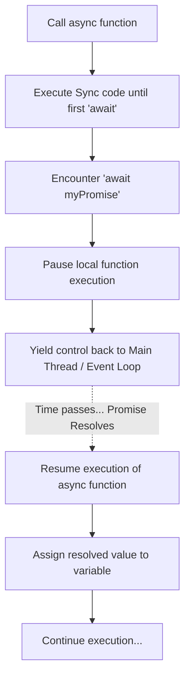

# MASTER IQ: Async & Await

This document is the master reference for Chapter 18, strictly adhering to the 9-section format required by the Go Pikachu quality standards.

---

## 1. Syntax Reference — End to End

### Basic Async Function
```javascript
async function fetchUser() {
    // Await pauses execution until the Promise resolves
    let response = await fetch('https://api.example.com/user');
    let data = await response.json();
    return data; 
}
```

### Arrow Function Syntax (Used in Playwright)
```javascript
test('Basic Test', async ({ page }) => {
    await page.goto('https://example.com');
    await page.click('#login-btn');
});
```

### Unified Error Handling (Try/Catch)
```javascript
async function safeFetch() {
    try {
        let res = await fetch('/api/data');
        console.log(res);
    } catch (error) {
        // Catches both sync errors and async Promise rejections!
        console.error("Fetch failed:", error);
    } finally {
        console.log("Cleanup...");
    }
}
```

---

## 2. Built-in Functions & Methods

`async/await` doesn't have methods itself—it is a language keyword feature applied *to* Promises. However, it integrates heavily with `Promise` static methods:
- `await Promise.all([task1(), task2()])`: Waits for multiple async tasks to finish in parallel before continuing.

---

## 3. Deep Insights & Gotchas

### The Return Value is ALWAYS a Promise
If you have an `async` function and you `return 5;`, the function actually returns `Promise.resolve(5)`. Because of this, if you call an `async` function from a *synchronous* function, you cannot get the value out of it without using `.then()`.

### The `forEach` Trap
`await` does NOT work correctly inside a standard `.forEach()` loop. The loop will fire off all iterations simultaneously without waiting for the internal `await`s to finish.
**Fix:** Use a standard `for...of` loop when you need sequential async execution inside a loop.

---

## 4. Interview-Ready Definitions

- **Async/Await:** Syntactic sugar built on top of Promises that allows asynchronous code to be written in a sequential, synchronous-looking format.
- **Async keyword:** Added to a function declaration to indicate that the function will handle asynchronous operations and will automatically return a Promise.
- **Await keyword:** Pauses the execution of the `async` function until a Promise settles (resolves or rejects), then extracts the resolved value. Can only be used inside an `async` function.

---

## 5. Tricky Interview Questions

**Q1: What happens if you forget to put `await` before a fetch call?**
```javascript
async function getData() {
    let data = fetch('/api'); 
    console.log(data);
}
```
*Answer:* It logs a `<Pending Promise>` object, not the actual API response data, because execution did not pause to wait for the network request to finish.

**Q2: How do you handle errors with async/await?**
*Answer:* You wrap the `await` calls in a standard `try/catch` block. This is a massive benefit over Promises because a single `try/catch` can catch both standard JS runtime errors AND asynchronous network rejections.

---

## 6. Controversial Topics & Ongoing Debates

### Top-Level Await
Historically, you couldn't use `await` outside of an `async` function. This forced developers to write dummy wrapper functions called IIFEs (Immediately Invoked Function Expressions) just to start their app: `(async () => { await init(); })();`.
Modern ES Modules (and recent Node.js versions) now support "Top-Level Await," allowing you to use `await` directly in the root of a script without a wrapper function. Some purists dislike this, arguing it can unintentionally block the entire module loading sequence of an application.

---

## 7. Quick Reference Cheat Sheet

| Task | Syntax |
|------|--------|
| Create Async Fn | `async function doWork() {}` |
| Wait for Promise | `let result = await myPromise;` |
| Handle Errors | `try { await myPromise } catch(e) {}` |
| Parallel Await | `await Promise.all([p1, p2])` |
| Loop Await (Sequential)| `for(let item of arr) { await process(item); }`|

---

## 8. Memory Map & Visual Flowchart



---

## 9. LinkedIn-Style Post

💡 **The `forEach` Async Trap in JavaScript!** 💡

Have you ever written this code expecting it to wait for each upload to finish before printing "Done"?

```javascript
async function uploadAll(files) {
    files.forEach(async (file) => {
        await upload(file);
    });
    console.log("All Done!"); // Prints IMMEDIATELY! 😱
}
```

**The Trap:** `Array.forEach` is strictly synchronous. It fires off all the `async` callbacks instantly and finishes the loop. It does NOT wait for the `await` inside the callback!

**The Fix:** Use a modern `for...of` loop for sequential awaiting, or `Promise.all` for parallel awaiting!

```javascript
for (let file of files) {
    await upload(file); // Actually waits! ✅
}
console.log("All Done!");
```
#JavaScript #WebDevelopment #CodingInterviews #Frontend #SoftwareEngineering
