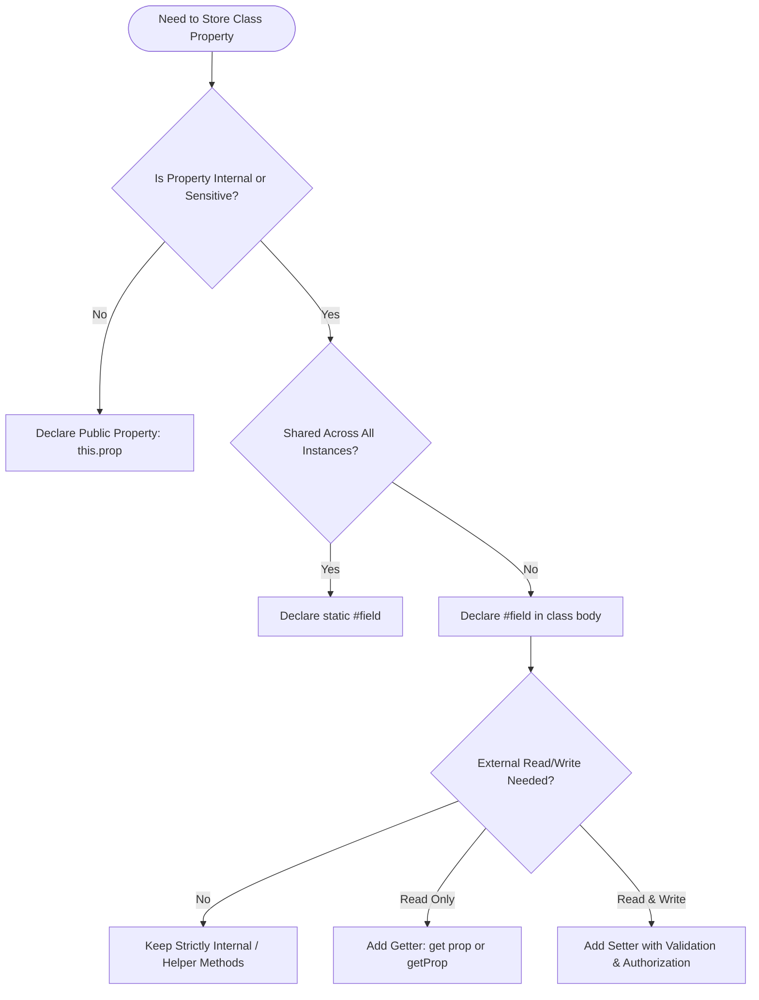

# 21 — Encapsulation : Complete Interview & Reference Guide

> One-paragraph elevator pitch: Encapsulation is the fundamental Object-Oriented Programming (OOP) pillar of bundling data and behaviors into cohesive class units while strictly controlling external access. In modern JavaScript (ES2022+), hard private fields (`#`), private static members, and guarded getter/setter methods provide true engine-level data protection, eliminating unauthorized state mutation and laying the architectural foundation for robust Page Object Models in Playwright test frameworks.

---

## Table of Contents
1. [Syntax Reference — End to End](#1-syntax-reference--end-to-end)
2. [Built-in Functions & Methods](#2-built-in-functions--methods)
3. [Deep Insights & Gotchas](#3-deep-insights--gotchas)
4. [Interview-Ready Definitions](#4-interview-ready-definitions)
5. [Tricky Interview Questions](#5-tricky-interview-questions)
6. [Controversial Topics & Ongoing Debates](#6-controversial-topics--ongoing-debates)
7. [Quick Reference Cheat Sheet](#7-quick-reference-cheat-sheet)
8. [Memory Map & Visual Flowchart](#8-memory-map--visual-flowchart)
9. [LinkedIn-Style Post](#9-linkedin-style-post)
10. [Summary](#summary)

---

## Overview
Encapsulation enables developers to hide internal representation and state while exposing only a clean, controlled public interface. In JavaScript, encapsulation evolved from legacy closure/IIFE workarounds and convention-based underscore prefixes (`_prop`) to native, hard-private class fields (`#field`), private methods (`#method()`), and private static members (`static #count`). This chapter explores how encapsulation guarantees data integrity, validates mutations, manages configuration, and empowers modular test automation architectures.

---

## 1. Syntax Reference — End to End

### 1.1 Private Instance Fields & Declaration
Private fields MUST be declared in the class body before they can be assigned in the constructor or methods.
```javascript
class Person {
    #child1; // Must be declared upfront
    #child2;

    constructor(name, ch1, ch2) {
        this.name = name;      // Public property
        this.#child1 = ch1;    // Private property initialization
        this.#child2 = ch2;
    }

    getChild1() {
        return this.#child1;
    }

    setChild1(changedName) {
        this.#child1 = changedName;
    }
}

const p = new Person("Pramod", "Vrad", "Jenny");
console.log(p.getChild1()); // "Vrad"
p.setChild1("VIRAD");
console.log(p.getChild1()); // "VIRAD"
```

### 1.2 Encapsulation with Role-Based Authorization & Guarded Setters
Setters can intercept incoming mutations to validate values, check user permissions, or reject invalid inputs.
```javascript
class ICICI {
    #balance;

    constructor(name, balance) {
        this.#balance = balance;
        this.name = name;
    }

    getBalance() {
        return this.#balance;
    }

    setBalance(newBalance, isCashier) {
        if (isCashier && newBalance >= 0) {
            this.#balance = newBalance;
        } else {
            console.log("Not allowed: Unauthorized or invalid balance");
        }
    }
}

const account = new ICICI("Pramod", 1000);
account.setBalance(50000, false); // Rejected
console.log(account.getBalance()); // 1000
account.setBalance(50000, true);  // Authorized
console.log(account.getBalance()); // 50000
```

### 1.3 Private Static Members & Class-Wide Telemetry
Private static properties belong to the class constructor rather than individual instances, enabling class-wide metric tracking without external tampering.
```javascript
class TestCase {
    #status = "not run";
    static #count = 0;

    constructor(name) {
        this.name = name;
        TestCase.#count++;
    }

    run(pass) {
        this.#status = pass ? "PASSED" : "FAILED";
    }

    getStatus() {
        return this.#status;
    }

    static getCount() {
        return TestCase.#count;
    }
}

const tc1 = new TestCase("login");
tc1.run(true);
const tc2 = new TestCase("checkout");
console.log(tc1.getStatus());      // "PASSED"
console.log(TestCase.getCount()); // 2
```

### 1.4 Native Getters and Setters (`get` and `set` Keywords)
```javascript
class Wallet {
    #funds = 0;

    constructor(initial) {
        this.#funds = initial;
    }

    get balance() {
        return `$${this.#funds.toFixed(2)}`;
    }

    set balance(amount) {
        if (typeof amount !== "number" || amount < 0) {
            throw new TypeError("Balance must be a positive number");
        }
        this.#funds = amount;
    }
}

const wallet = new Wallet(50);
console.log(wallet.balance); // "$50.00"
wallet.balance = 120.5;
console.log(wallet.balance); // "$120.50"
```

### 1.5 Private Methods & Internal Helper Functions
```javascript
class PaymentGateway {
    #apiKey;

    constructor(key) {
        this.#apiKey = key;
    }

    #hashToken(token) {
        // Internal cryptographic helper
        return `hashed_${token}_${this.#apiKey.slice(0, 4)}`;
    }

    processPayment(amount, rawToken) {
        const secureToken = this.#hashToken(rawToken);
        return `Processed $${amount} with token: ${secureToken}`;
    }
}

const pg = new PaymentGateway("secret-key-9988");
console.log(pg.processPayment(100, "user_card_xyz"));
```

---

## 2. Built-in Functions & Methods

| Built-in / Method | Signature | Return Value | Minimal Runnable Example | Gotcha / Caveat |
| :--- | :--- | :--- | :--- | :--- |
| `Object.hasOwn` | `Object.hasOwn(obj, propKey)` | `boolean` | `Object.hasOwn(user, 'name') // true` | Returns `false` for private `#` fields. |
| `Object.keys` | `Object.keys(obj)` | `string[]` | `Object.keys(p) // ['name']` | Never enumerates private `#` fields. |
| `Object.getOwnPropertyNames` | `Object.getOwnPropertyNames(obj)` | `string[]` | `Object.getOwnPropertyNames(p)` | Does not include `#` private fields. |
| `Object.getOwnPropertySymbols` | `Object.getOwnPropertySymbols(obj)` | `symbol[]` | `Object.getOwnPropertySymbols(p)` | `#` fields are not Symbols and won't appear. |
| `JSON.stringify` | `JSON.stringify(value)` | `string` | `JSON.stringify(tesla) // "{"name":"Tesla"}"` | Silently ignores all `#` private members. |
| `in` operator (Private Brand Check) | `#field in obj` | `boolean` | `#balance in account // true` | Throws `TypeError` if `obj` is not an object. |

---

## 3. Deep Insights & Gotchas

### Insight 1: Private Fields Use Internal Slots (Brand Checks), Not Property Descriptors
Private identifiers (`#field`) are not stored as property keys on the object's property table. Instead, they are stored in hidden internal slots attached to the instance when constructed.
```javascript
class Safe {
    #secret = 42;
    static isSafe(obj) {
        return #secret in obj; // ES2022 Private brand check
    }
}
const s = new Safe();
console.log(Safe.isSafe(s));     // true
console.log(Safe.isSafe({}));    // false
```

### Insight 2: Bracket Notation Fails on Private Fields
You cannot dynamically access a private field with bracket syntax (`obj['#field']`).
```javascript
class Account {
    #pin = 1234;
    getPin(key) {
        return this[key]; // Returns undefined, cannot resolve #pin
    }
}
const acc = new Account();
console.log(acc.getPin("#pin")); // undefined
```

### Insight 3: Hard Privacy vs Soft Privacy (Convention vs Reality)
Before `#`, developers used `_property` (convention only) or `Symbol()` (hidden but discoverable via `Object.getOwnPropertySymbols`). Native `#` fields cannot be penetrated via reflection, `eval` outside the class, or proxy inspection.

### Insight 4: Private Fields are NOT Inherited into Subclass Public Scopes
Subclasses cannot access `#field` directly from a superclass. Private fields are strictly scoped to the exact class lexical declaration where they were defined.

---

## 4. Interview-Ready Definitions

### Encapsulation
> **Definition (say this):** "Encapsulation is an OOP principle that bundles an object's internal state (properties) and behaviors (methods) together while restricting direct unauthorized outside access to its critical data."
> **Follow-up the interviewer will ask:** "How does modern JavaScript enforce encapsulation compared to older ES5 techniques?"
> **Answer:** "In ES5, developers used closures and IIFEs for encapsulation, or naming conventions like `_var`. In modern JavaScript (ES2022+), the hash `#` syntax creates hard private instance and static members enforced at the engine level via internal slots, throwing a compile-time SyntaxError if accessed outside the class lexical body."

### Private Class Field (`#`)
> **Definition (say this):** "A private class field is a class member declared with a `#` prefix that is inaccessible and invisible outside the class declaration."
> **Follow-up the interviewer will ask:** "Can you access a private field dynamically using `this['#field']`?"
> **Answer:** "No. Private field identifiers are not string or symbol property keys. Bracket notation resolves to standard object properties and returns `undefined`."

### Data Hiding vs Abstraction
> **Definition (say this):** "Data hiding (encapsulation) focuses on restricting access to internal implementation details to protect state integrity, whereas abstraction focuses on hiding complexity by providing a simple, high-level interface."
> **Follow-up the interviewer will ask:** "Give an example in test automation."
> **Answer:** "In a Playwright Page Object Model, encapsulation hides private locators and API tokens (`#apiKey`, `#passwordSelector`), while abstraction exposes high-level actions like `login(user, pass)`."

---

## 5. Tricky Interview Questions

### Q1: What is the output of attempting to access `#child1` outside the class?
```javascript
class Person {
    #child1 = "Vrad";
}
const p = new Person();
console.log(p.#child1);
```
**A:** It throws a compile-time `SyntaxError: Private field '#child1' must be declared in an enclosing class`. It does NOT return `undefined`.  
**Difficulty:** Easy

---

### Q2: What does `Object.keys()` and `JSON.stringify()` return for an object with private fields?
```javascript
class Car {
    #engine = "V8";
    constructor(name) {
        this.name = name;
    }
}
const c = new Car("Mustang");
console.log(Object.keys(c));
console.log(JSON.stringify(c));
```
**A:** `['name']` and `'{"name":"Mustang"}'`. Private fields are completely omitted from enumeration, serialization, and reflection.  
**Difficulty:** Medium

---

### Q3: What happens when accessing `#field in obj` on an instance vs a plain object?
```javascript
class Node {
    #val;
    constructor(v) { this.#val = v; }
    static check(o) { return #val in o; }
}
console.log(Node.check(new Node(5)));
console.log(Node.check({ val: 5 }));
```
**A:** `true` for `new Node(5)` and `false` for `{ val: 5 }`. The `in` keyword performs an official brand check. If `o` were a primitive like `null` or `42`, it would throw a `TypeError`.  
**Difficulty:** Hard

---

### Q4: Can a subclass access a private field of its superclass directly?
```javascript
class Parent {
    #secret = 99;
}
class Child extends Parent {
    getSecret() {
        return this.#secret;
    }
}
```
**A:** No. It throws a `SyntaxError: Private field '#secret' must be declared in an enclosing class`. Private fields are strictly scoped to `Parent`. The child can only read it if `Parent` provides a public or protected-like method (e.g. `getSecret()`).  
**Difficulty:** Medium

---

### Q5: What happens if you declare a private field twice in the same class?
```javascript
class A {
    #x = 1;
    #x = 2;
}
```
**A:** Throws a `SyntaxError: Identifier '#x' has already been declared`.  
**Difficulty:** Easy

---

### Q6: Can you dynamically declare private fields at runtime inside the constructor?
```javascript
class User {
    constructor(name) {
        this.#dynamicPrivate = name;
    }
}
```
**A:** No. Private fields must be explicitly declared in the class body upfront. Omitting `#dynamicPrivate;` in the class body causes a `SyntaxError`.  
**Difficulty:** Easy

---

### Q7: What is the output of the following static private code?
```javascript
class Counter {
    static #c = 0;
    constructor() { Counter.#c++; }
    static get count() { return Counter.#c; }
}
new Counter();
new Counter();
const c = new Counter();
console.log(c.count);
console.log(Counter.count);
```
**A:** `undefined` followed by `3`. Static getters/fields are attached to the `Counter` constructor, not instance `c`.  
**Difficulty:** Medium

---

### Q8: Spot the bug in this setter implementation:
```javascript
class Bank {
    #balance = 0;
    set balance(val) {
        if (val > 0) this.balance = val;
    }
}
const b = new Bank();
b.balance = 500;
```
**A:** Infinite recursion / `RangeError: Maximum call stack size exceeded`. `this.balance = val` calls the setter recursively. It should be `this.#balance = val;`.  
**Difficulty:** Medium

---

### Q9: Can an arrow function inside a class method access private fields?
```javascript
class Engine {
    #rpm = 3000;
    start() {
        const getRPM = () => this.#rpm;
        return getRPM();
    }
}
console.log(new Engine().start());
```
**A:** Yes, outputs `3000`. Arrow functions lexically bind `this` and maintain access to private class scope.  
**Difficulty:** Easy

---

### Q10: How do closures achieve encapsulation in ES5?
```javascript
function createCounter() {
    let count = 0; // Private via closure
    return {
        increment() { return ++count; },
        get() { return count; }
    };
}
```
**A:** The `count` variable lives in the lexical environment of `createCounter`. External code can only interact via `increment` and `get`.  
**Difficulty:** Medium

---

### Q11: What is the difference between `#` fields and `Object.freeze()`?
**A:** `#` fields hide properties and prevent external access/mutation while allowing internal methods to modify them. `Object.freeze()` prevents external and internal mutations on public properties, but all properties remain visible.  
**Difficulty:** Medium

---

### Q12: What happens if two different classes have private fields with the same name `#id`?
```javascript
class A {
    #id = 1;
    check(other) { return #id in other; }
}
class B {
    #id = 1;
}
const a = new A();
const b = new B();
console.log(a.check(b));
```
**A:** Outputs `false`. Each class creates a unique internal brand for its private `#id` field. `#id` in `A` is completely distinct from `#id` in `B`.  
**Difficulty:** Hard

---

## 6. Controversial Topics & Ongoing Debates

### Topic 1: Native `#` Syntax vs TypeScript `private` Keyword
**The debate:** TypeScript has long provided the `private` modifier, but it only offers compile-time type checking and compiles down to standard public JavaScript properties. Native `#` provides runtime hard privacy.  
**One side:** TypeScript purists prefer `private prop: string` because it looks cleaner without `#` clutter.  
**Other side:** Engineers requiring true security and test isolation demand `#` because TS `private` can be bypassed at runtime via `(obj as any).prop`.  
**Current consensus:** Use `#` for true runtime isolation (e.g. security tokens, private internal state) and TS `private` for structural typing when runtime enforcement is unnecessary.

### Topic 2: Encapsulation vs Testability
**The debate:** Should unit tests be able to inspect and assert private state?  
**One side:** Tests should only verify public behavior (black-box testing); asserting private fields violates encapsulation.  
**Other side:** In complex state machines, inspecting internal state makes tests faster and failures easier to diagnose.  
**Current consensus:** Test through public interfaces. If internal state needs testing, expose diagnostic read-only getters or telemetry methods.

---

## 7. Quick Reference Cheat Sheet

```
┌───────────────────────────────────────────────────────────────────────────┐
│                     JAVASCRIPT ENCAPSULATION CHEATSHEET                   │
├──────────────────────────┬──────────────────────┬─────────────────────────┤
│ Syntax / Technique       │ Privacy Level        │ Reflection / Access     │
├──────────────────────────┼──────────────────────┼─────────────────────────┤
│ publicProp               │ None (Public)        │ Object.keys(), in, .    │
│ _protectedProp           │ None (Convention)    │ Object.keys(), in, .    │
│ Symbol('prop')           │ Soft Privacy         │ Object.getOwnPropertySymbols │
│ Closure (let x inside)   │ Hard Function Scope  │ None (unreachable)      │
│ #privateField            │ Hard Class Scope     │ #field in obj (inside)  │
│ static #privateStatic    │ Hard Class Scope     │ ClassName.#field (inside)│
└──────────────────────────┴──────────────────────┴─────────────────────────┘
```

### Decision Rule: When to Use Encapsulation
- **Use `#` Private Fields:** When protecting passwords, internal buffers, authentication tokens, or preventing invalid state overrides.
- **Use Public Getters/Setters:** When modifications require validation, transformations, or logging.
- **Use Static Private Fields:** When tracking shared counts, registries, or singletons across instances.

---

## 8. Memory Map & Visual Flowchart

### A) ASCII Mind Map
```
[Encapsulation in JavaScript]
  ├── State Protection
  │     ├── #privateInstanceField ⚠️ Must declare in class body
  │     └── static #privateStaticField ⚠️ Bound to constructor
  ├── Access Control
  │     ├── Getter (get prop() / getProp()) ✅ Controlled Read
  │     └── Setter (set prop(v) / setProp(v)) ✅ Validation & Authorization
  ├── Hard Privacy Mechanics
  │     ├── Internal Slots (No Object.keys / JSON.stringify)
  │     ├── Private Brand Checks (#field in instance)
  │     └── ❌ Cannot access via this['#field']
  └── Testing & POM Architecture
        ├── Page Object Model (Encapsulate Locators)
        └── Telemetry & Counters (TestCase.#count)
```

### B) Decision Flowchart (Mermaid)


### C) Execution Trace Box: Guarded Setter Execution
| Step | Action | Variable / Member | Value | Note |
| :--- | :--- | :--- | :--- | :--- |
| 1 | `new ICICI("Pramod", 1000)` | `pramod.#balance` | `1000` | Private field initialized |
| 2 | `pramod.setBalance(5000, false)` | `isCashier` | `false` | Unauthorized caller |
| 3 | Guard Condition Check | `if (isCashier)` | `false` | Mutation blocked; logged warning |
| 4 | `pramod.getBalance()` | Return value | `1000` | State intact and protected |
| 5 | `pramod.setBalance(5000, true)` | `isCashier` | `true` | Authorized cashier |
| 6 | State Mutation | `pramod.#balance` | `5000` | Successfully updated |

---

## 9. LinkedIn-Style Post

### 📢 LinkedIn Post
> Stop using `_privateProperty` in modern JavaScript and hoping no one touches it. 🛑
>
> In 2026, JavaScript has true, engine-level encapsulation with native private class fields (`#`).
>
> 💡 Here's why you need to upgrade:
>
> ❌ Old Convention:
> `this._balance = 1000;` 
> 👉 Still 100% public. Anyone can mutate it with `account._balance = 0`.
>
> ✅ Modern Hard Privacy:
> ```javascript
> class BankAccount {
>   #balance = 0;
>   constructor(init) { this.#balance = init; }
>   getBalance() { return this.#balance; }
> }
> ```
>
> What happens if someone tries `account.#balance = 0` outside the class?
> 💥 Instant `SyntaxError` at parse time!
>
> 3 Rules to Remember:
> 1. Private `#` fields must be declared at the top of the class body.
> 2. `Object.keys()` and `JSON.stringify()` completely ignore `#` members.
> 3. Dynamic bracket notation `account['#balance']` returns `undefined`.
>
> **Key Takeaway:** Real encapsulation protects data integrity and stops bugs before they reach production.
>
> #JavaScript #WebDevelopment #SoftwareEngineering #CleanCode #OOP
>

---

## Summary
**Key Takeaway:** Encapsulation in JavaScript unites data and behaviors while establishing strict access boundaries. By utilizing native private fields (`#`), private static telemetry, and guarded getter/setter methods, developers build secure, resilient, and maintainable systems.

### Related Individual Chapter Notes:
- [174__IQ.md](file:///c:/Users/rajap/OneDrive/%E0%B9%80%E0%B8%AD%E0%B8%81%E0%B8%AA%E0%B8%B2%E0%B8%A3/LEARNINGPLAYWRIGHT3X/IQ_Notes/Chapter_Notes/21/174__IQ.md) — Private Fields and Data Encapsulation
- [175_Car_IQ.md](file:///c:/Users/rajap/OneDrive/%E0%B9%80%E0%B8%AD%E0%B8%81%E0%B8%AA%E0%B8%B2%E0%B8%A3/LEARNINGPLAYWRIGHT3X/IQ_Notes/Chapter_Notes/21/175_Car_IQ.md) — Encapsulating Object State with Getter/Setter Methods
- [176_Bank_IQ.md](file:///c:/Users/rajap/OneDrive/%E0%B9%80%E0%B8%AD%E0%B8%81%E0%B8%AA%E0%B8%B2%E0%B8%A3/LEARNINGPLAYWRIGHT3X/IQ_Notes/Chapter_Notes/21/176_Bank_IQ.md) — Business Logic & Authorization in Encapsulation
- [177_IQ1_IQ.md](file:///c:/Users/rajap/OneDrive/%E0%B9%80%E0%B8%AD%E0%B8%81%E0%B8%AA%E0%B8%B2%E0%B8%A3/LEARNINGPLAYWRIGHT3X/IQ_Notes/Chapter_Notes/21/177_IQ1_IQ.md) — Private Static Members & Test Counters
- [178_IQ2_IQ.md](file:///c:/Users/rajap/OneDrive/%E0%B9%80%E0%B8%AD%E0%B8%81%E0%B8%AA%E0%B8%B2%E0%B8%A3/LEARNINGPLAYWRIGHT3X/IQ_Notes/Chapter_Notes/21/178_IQ2_IQ.md) — Bug Modeling & Behavioral Encapsulation
- [179_IQ3_IQ.md](file:///c:/Users/rajap/OneDrive/%E0%B9%80%E0%B8%AD%E0%B8%81%E0%B8%AA%E0%B8%B2%E0%B8%A3/LEARNINGPLAYWRIGHT3X/IQ_Notes/Chapter_Notes/21/179_IQ3_IQ.md) — Config Encapsulation with Default Parameters
- [180_IQ4_IQ.md](file:///c:/Users/rajap/OneDrive/%E0%B9%80%E0%B8%AD%E0%B8%81%E0%B8%AA%E0%B8%B2%E0%B8%A3/LEARNINGPLAYWRIGHT3X/IQ_Notes/Chapter_Notes/21/180_IQ4_IQ.md) — Instance Independence and Prototype Methods
