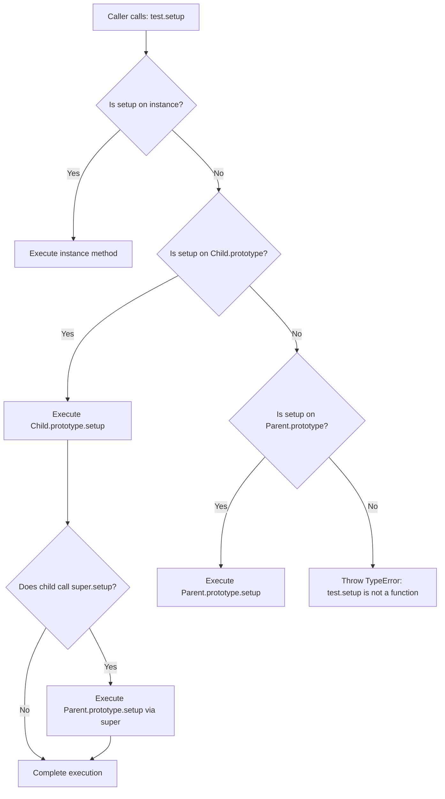

# 23 — Polymorphism : Complete Interview & Reference Guide

> One-paragraph elevator pitch: Polymorphism ("many forms") is one of the foundational pillars of Object-Oriented Programming, enabling distinct objects to respond to the identical method invocation in their own specialized manner. In JavaScript, polymorphism manifests primarily through subtype polymorphism (method overriding via prototype delegation) and duck typing. In test automation frameworks like Playwright, polymorphism eliminates brittle conditional logic (`if/switch`), orchestrating dynamic test runners, unified browser fixtures, and multi-channel reporting through clean, interchangeable interfaces.

---

## Table of Contents
1. [Syntax Reference — End to End](#1-syntax-reference--end-to-end)
2. [Built-in Functions & Methods](#2-built-in-functions--methods)
3. [Deep Insights & Gotchas](#3-deep-insights--gotchas)
4. [Interview-Ready Definitions](#4-interview-ready-definitions)
5. [Tricky Interview Questions](#5-tricky-interview-questions)
6. [Controversial Topics & Ongoing Debates](#6-controversial-topics--ongoing-debates)
7. [Quick Reference Cheat Sheet](#7-quick-reference-cheat-sheet)
8. [Memory Map & Visual Flowchart](#8-memory-map--visual-flowchart)
9. [LinkedIn-Style Post](#9-linkedin-style-post)
10. [Summary](#summary)

---

## Overview
Polymorphism allows code to be written to an abstract interface rather than a concrete implementation. In JavaScript, method overriding allows child classes (`APIPage`, `UIPage`) to redefine methods defined on a parent class (`BaseTest`), creating flexible architectures where calling `test.setup()` executes the exact initialization routine tailored to that test type. This guide covers Subtype Polymorphism, Duck Typing, Method Overriding, super delegation, polymorphic collections, and how polymorphism is leveraged across test runners and Page Object Models.

---

## 1. Syntax Reference — End to End

### 1.1 Classic Method Overriding (Subtype Polymorphism)
A child class provides its own implementation of a method declared in the parent class.
```javascript
class BaseTest {
    setup() {
        console.log("Base: open browser window");
    }
}

class APIPage extends BaseTest {
    setup() {
        console.log("APITest: initialize REST client and auth token");
    }
}

const btest = new BaseTest();
const apiTest = new APIPage();

btest.setup();   // "Base: open browser window"
apiTest.setup(); // "APITest: initialize REST client and auth token"
```

### 1.2 Method Extension via `super`
Polymorphic overriding can extend rather than replace parent logic by invoking `super.methodName()`.
```javascript
class BaseReporter {
    generate(testName, status) {
        console.log(`[TEST REPORT] ${testName}: ${status}`);
    }
}

class SlackReporter extends BaseReporter {
    generate(testName, status) {
        super.generate(testName, status); // Call parent logging
        console.log(`📡 Sending webhook payload to #qa-alerts channel for ${testName}`);
    }
}

const reporter = new SlackReporter();
reporter.generate("CheckoutFlow", "PASSED");
```

### 1.3 Polymorphic Collections (Iterating Over Mixed Types)
A single loop executes polymorphic methods across diverse objects without type checks.
```javascript
class ChromeRunner {
    launch() { return "Launching Chromium headless"; }
}
class FirefoxRunner {
    launch() { return "Launching Firefox nightly"; }
}
class WebKitRunner {
    launch() { return "Launching WebKit browser engine"; }
}

const runners = [new ChromeRunner(), new FirefoxRunner(), new WebKitRunner()];
runners.forEach(r => console.log(r.launch()));
```

### 1.4 Duck Typing Polymorphism
In JavaScript's dynamic type system, if an object walks like a duck and quacks like a duck, it is treated as a duck. Classes do not need a common ancestor to act polymorphically.
```javascript
function executeTest(testInstance) {
    if (typeof testInstance.setup === "function") {
        testInstance.setup();
    } else {
        throw new TypeError("Test instance must define setup()");
    }
}

const mockSuite = { setup: () => console.log("Mock setup complete") };
executeTest(mockSuite); // Works seamlessly via duck typing
```

---

## 2. Built-in Functions & Methods

### 2.1 `instanceof` Operator
- **Signature:** `object instanceof Constructor`
- **Return value:** `boolean`
- **Example:**
```javascript
class Parent {}
class Child extends Parent {}
const c = new Child();
console.log(c instanceof Child);  // true
console.log(c instanceof Parent); // true (up the prototype chain)
```
- **Gotcha:** `instanceof` fails across different execution realms (e.g., across `<iframe>` boundaries or Node `vm` contexts) because each realm has its own constructor prototypes.

### 2.2 `Object.getPrototypeOf()`
- **Signature:** `Object.getPrototypeOf(target)`
- **Return value:** Prototype object or `null`
- **Example:**
```javascript
class BaseTest {}
class SubTest extends BaseTest {}
const s = new SubTest();
console.log(Object.getPrototypeOf(s) === SubTest.prototype); // true
console.log(Object.getPrototypeOf(SubTest.prototype) === BaseTest.prototype); // true
```
- **Gotcha:** Never use the legacy `__proto__` property in production code; use standard `Object.getPrototypeOf()`.

### 2.3 `Function.prototype.call()` and `Function.prototype.apply()`
- **Signature:** `func.call(thisArg, ...args)` / `func.apply(thisArg, [args])`
- **Return value:** Result of calling the function with the specified `this`
- **Example:**
```javascript
const base = { log() { console.log(this.name); } };
const custom = { name: "Custom Suite" };
base.log.call(custom); // "Custom Suite" (Dynamic dispatch borrowing)
```

---

## 3. Deep Insights & Gotchas

### 3.1 JavaScript Has No Method Overloading
In compiled languages (Java, C++), multiple methods can share a name with different parameter signatures (compile-time polymorphism). In JavaScript, re-declaring a method name simply overwrites the previous definition:
```javascript
class Calculator {
    add(a, b) { return a + b; }
    add(a, b, c) { return a + b + c; } // Overwrites add(a, b)!
}
const calc = new Calculator();
console.log(calc.add(2, 3)); // NaN! Because 'c' is undefined (2 + 3 + undefined)
```
*Solution:* Simulate overloading by checking argument count (`arguments.length`) or types inside a single method, or use TypeScript function overloads.

### 3.2 Shadowing vs Mutation
Defining `setup()` on a derived class does NOT mutate the parent class. It simply defines `setup` on `APIPage.prototype`. When resolving `test.setup()`, JavaScript finds it on `APIPage.prototype` and stops searching, effectively "shadowing" `BaseTest.prototype.setup`.

### 3.3 The Fragile Base Class Problem
If a method in `BaseTest` calls another method in `BaseTest` that a child overrides, unexpected recursion or premature execution can occur:
```javascript
class Base {
    init() { this.log(); }
    log() { console.log("Base log"); }
}
class Child extends Base {
    log() { console.log("Child log with " + this.data.length); } // TypeError if this.data not ready!
}
```

---

## 4. Interview-Ready Definitions

### Polymorphism
> **Definition (say this):** "Polymorphism is an object-oriented principle where disparate classes provide their own distinct implementations of a common interface or method name, allowing uniform client code to execute different behaviors at runtime based on the calling object's type."  
> **Follow-up the interviewer will ask:** "How does JavaScript implement polymorphism without interfaces?"  
> **Answer:** "JavaScript achieves polymorphism through prototype-based method overriding (subtype polymorphism) and duck typing, where any object that exposes the required method names can be consumed polymorphically regardless of its inheritance lineage."

### Method Overriding
> **Definition (say this):** "Method overriding occurs when a derived class defines a method with the exact same name as a method in its superclass, shadowing the parent's implementation during prototype chain resolution."  
> **Follow-up the interviewer will ask:** "How do you access the original parent method from inside the overridden child method?"  
> **Answer:** "By using `super.methodName()`, which looks up the prototype of the current class to find the superclass's method and invokes it bound to the current `this` instance."

---

## 5. Tricky Interview Questions

### Q1: What is the output of this code?
```javascript
class A {
    show() { return "A"; }
}
class B extends A {
    show() { return "B"; }
}
class C extends B {}

const items = [new A(), new B(), new C()];
console.log(items.map(i => i.show()).join(","));
```
**A:** `"A,B,B"`. `A` outputs `"A"`. `B` overrides `show()` to return `"B"`. `C` does not override `show()`, so it delegates up the prototype chain to `B.prototype.show()`, returning `"B"`.  
**Difficulty:** Easy

### Q2: What happens when trying to overload methods in JavaScript?
```javascript
class Runner {
    run(distance) { return `Ran ${distance}m`; }
    run(distance, speed) { return `Ran ${distance}m at ${speed}km/h`; }
}
console.log(new Runner().run(100));
```
**A:** Returns `"Ran 100m at undefinedkm/h"`. JavaScript classes do not support signature-based method overloading. The second `run` declaration replaces the first on `Runner.prototype`.  
**Difficulty:** Medium

### Q3: How do you achieve true method overloading in vanilla JavaScript?
**A:** By inspecting `arguments.length` or parameter types dynamically within a single method:
```javascript
class Runner {
    run(distance, speed) {
        if (arguments.length === 1) {
            return `Ran ${distance}m`;
        }
        return `Ran ${distance}m at ${speed}km/h`;
    }
}
```
**Difficulty:** Medium

### Q4: Spot the bug in this polymorphic POM implementation:
```javascript
class BasePage {
    constructor() { this.validate(); }
    validate() { console.log("Base validation"); }
}
class LoginPage extends BasePage {
    constructor() {
        super();
        this.title = "Login";
    }
    validate() {
        console.log("Validating: " + this.title.toUpperCase());
    }
}
new LoginPage();
```
**A:** Throws `TypeError: Cannot read properties of undefined (reading 'toUpperCase')`. When `super()` runs, it calls `validate()`. Because `LoginPage` overrides `validate()`, the child version executes *before* `this.title = "Login"` has executed in the child constructor.  
**Difficulty:** Hard

### Q5: What is the difference between static polymorphism and dynamic polymorphism?
**A:** Static (compile-time) polymorphism is method overloading or template instantiation, resolved by the compiler before execution. Dynamic (runtime) polymorphism is method overriding and dynamic dispatch, resolved at runtime via object prototypes or virtual method tables. JavaScript only supports dynamic runtime polymorphism.  
**Difficulty:** Medium

### Q6: Can arrow functions be overridden polymorphically on a class?
```javascript
class Parent {
    action = () => "Parent Action";
}
class Child extends Parent {
    action = () => "Child Action";
}
```
**A:** Yes, but they exist as **instance field properties**, not prototype methods. Every instantiation creates a new closure, consuming more memory than prototype methods.  
**Difficulty:** Hard

### Q7: Does duck typing require classes?
**A:** No. Plain object literals with matching method signatures can be consumed polymorphically: `{ setup: () => ... }`.  
**Difficulty:** Easy

### Q8: What does `super.method()` resolve to if the parent does not define that method?
**A:** If no ancestor in the prototype chain defines that method, it evaluates to `undefined` and attempting to invoke it throws `TypeError: super.method is not a function`.  
**Difficulty:** Medium

### Q9: What is the Liskov Substitution Principle (LSP) and how does it relate to polymorphism?
**A:** LSP states that objects of a superclass should be replaceable with objects of its subclasses without breaking application correctness. Subclasses must honor parent method contracts, accept compatible arguments, and return compatible types.  
**Difficulty:** Hard

### Q10: How does prototype resolution find an overridden method?
**A:** The engine performs prototype lookup starting at the instance, then `Child.prototype`, then `Parent.prototype`. The first matching method found is executed with `this` set to the instance.  
**Difficulty:** Easy

### Q11: Can a subclass method have a different return type than the parent method in JS?
**A:** JavaScript does not enforce return types at runtime, but doing so violates LSP and leads to runtime crashes in client code expecting the parent's contract.  
**Difficulty:** Medium

### Q12: How can TypeScript prevent polymorphic contract violations?
**A:** By defining strict `interface` contracts or `abstract class` signatures, enforcing identical parameter and return types across all implementations at compile time.  
**Difficulty:** Medium

---

## 6. Controversial Topics & Ongoing Debates

### Topic 1: Subtype Polymorphism (Inheritance) vs Duck Typing (Composition)
**The debate:** Should polymorphic code rely on class hierarchies (`extends`) or structural duck typing (`{ execute() }`)?  
**One side:** Class inheritance guarantees prototype sharing, memory efficiency, and clear semantic lineage (`instanceof`).  
**Other side:** Duck typing promotes decoupling; components only depend on method signatures rather than deep class hierarchies.  
**Current consensus:** Use shallow class inheritance for core domain hierarchies (Page Objects, Test Fixtures) and duck typing/interfaces for decoupled plugin architectures and strategy patterns.

### Topic 2: Method Overriding vs Composition Hooks
**The debate:** Overriding whole methods often requires calling `super.method()`, which couples the child to the parent's internal lifecycle order.  
**One side:** Template method patterns with explicit hooks (`beforeSetup()`, `afterSetup()`) are safer than open method overriding.  
**Other side:** Direct method overriding is simpler and idiomatic JavaScript.  
**Current consensus:** In enterprise test frameworks, prefer lifecycle hooks (`beforeEach`, `afterEach`) over arbitrary base class method overrides to prevent lifecycle bugs.

---

## 7. Quick Reference Cheat Sheet

```
┌───────────────────────────────────────────────────────────────────────────┐
│                     POLYMORPHISM IN JAVASCRIPT CHEATSHEET                 │
├──────────────────────────┬────────────────────────────────────────────────┤
│ Mechanism                │ Example / Description                          │
├──────────────────────────┼────────────────────────────────────────────────┤
│ Subtype Polymorphism     │ class Child extends Parent { method() { ... } }│
│ Super Delegation         │ super.method(...args) inside child method      │
│ Overloading Alternative  │ Check arguments.length / typeof inside method  │
│ Duck Typing Check        │ typeof obj.method === 'function'               │
│ Prototype Chain Search   │ instance -> Child.prototype -> Parent.prototype│
│ Polymorphic Collection   │ [new UI(), new API()].forEach(t => t.setup())  │
│ Instance Validation      │ obj instanceof BaseClass                       │
└──────────────────────────┴────────────────────────────────────────────────┘
```

---

## 8. Memory Map & Visual Flowchart

### A) ASCII Mind Map
```
[Polymorphism in JavaScript]
  ├── Subtype Polymorphism (Class Overriding)
  │     ├── Base Definition (BaseTest.prototype.setup)
  │     ├── Derived Shadowing (APIPage.prototype.setup)
  │     └── Delegation (super.setup() via prototype link)
  ├── Ad-Hoc Polymorphism (Duck Typing)
  │     ├── Signature Compatibility ({ setup() })
  │     └── Interface Emulation (Checking typeof method === 'function')
  ├── Gotchas & Traps
  │     ├── ❌ No Native Method Overloading (last definition wins)
  │     ├── ⚠️ Calling virtual method in constructor before child state init
  │     └── ⚠️ Violating Liskov Substitution Principle (LSP)
  └── Automation Use Cases
        ├── Dynamic Test Fixtures (API vs UI vs Mobile setup)
        ├── Multi-Target Reporters (Console, Slack, HTML, JUnit)
        └── Cross-Browser Drivers (Chromium, Firefox, WebKit runners)
```

### B) Decision Flowchart (Mermaid)


### C) Execution Trace Box: Polymorphic Dispatch
| Step | Code Executed | Scope / Target | Lookup Result | Value / Output |
| :--- | :--- | :--- | :--- | :--- |
| 1 | `test = new APIPage()` | Heap allocation | `APIPage.prototype` linked | `test` instance created |
| 2 | `btest = new BaseTest()` | Heap allocation | `BaseTest.prototype` linked | `btest` instance created |
| 3 | `test.setup()` | `test` instance | Found on `APIPage.prototype` | Prints: `"APITest: open browser"` |
| 4 | `btest.setup()` | `btest` instance | Found on `BaseTest.prototype` | Prints: `"Base: open browser"` |
| 5 | Prototype link check | `Object.getPrototypeOf(APIPage.prototype)` | Matches `BaseTest.prototype` | Prototype chain valid |

---

## 9. LinkedIn-Style Post

### 📢 LinkedIn Post
> Stop writing massive `switch` statements to manage test environments! Use polymorphism instead. 💡
>
> When scaling a test framework across Web, Mobile, and API tests, conditional branching quickly turns into unmaintainable spaghetti:
>
> ❌ Brittle Approach:
> ```javascript
> if (type === "API") initAPI();
> else if (type === "UI") initBrowser();
> ```
>
> ✅ Clean Polymorphic Architecture:
> ```javascript
> class BaseTest { setup() { console.log("🌐 Browser setup"); } }
> class APITest extends BaseTest { setup() { console.log("⚡ REST client setup"); } }
>
> [new BaseTest(), new APITest()].forEach(test => test.setup());
> ```
>
> Why this transforms your automation:
> 1. Open-Closed Principle: Add a `MobileTest` class without touching existing runner logic.
> 2. Zero runtime conditional clutter.
> 3. Unified test runner interfaces across all test categories.
>
> **Key Takeaway:** Polymorphism turns disparate test types into interchangeable, clean building blocks.
>
> #JavaScript #SoftwareArchitecture #Playwright #TestAutomation #OOP #CleanCode

---

## Summary
**Key Takeaway:** Polymorphism in JavaScript empowers objects of diverse classes to fulfill a shared interface via prototype method overriding and duck typing, replacing fragile conditional logic with scalable, extensible architectures.

### Related Individual Chapter Notes:
- [192_Polymorphism_Method_Overriding_IQ.md](file:///c:/Users/rajap/OneDrive/%E0%B9%80%E0%B8%AD%E0%B8%81%E0%B8%AA%E0%B8%B2%E0%B8%A3/LEARNINGPLAYWRIGHT3X/IQ_Notes/Chapter_Notes/23/192_Polymorphism_Method_Overriding_IQ.md) — Polymorphism and Method Overriding in Test Automation
