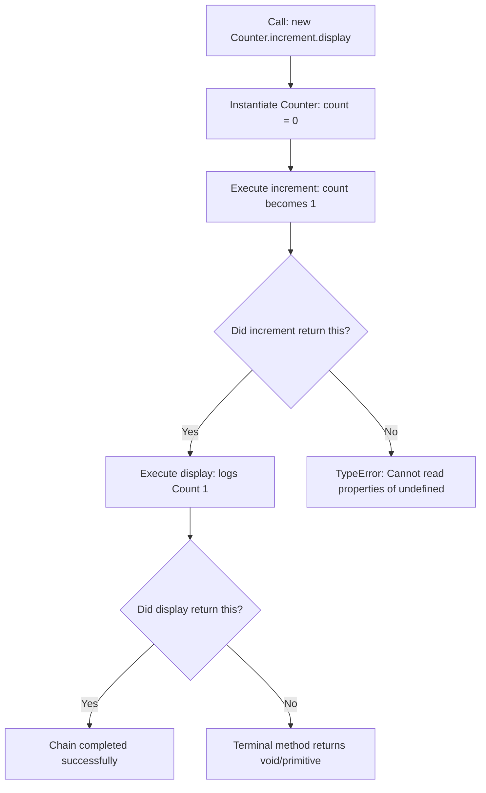

# 24 — OOPS Interview : Complete Interview & Reference Guide

> One-paragraph elevator pitch: Mastering Object-Oriented Programming (OOP) in JavaScript and TypeScript is essential for building robust, scalable test automation architectures like Playwright Page Object Models, Test Runners, and Reporting Pipelines. This chapter consolidates high-frequency technical interview patterns: class encapsulation, default parameters, instance property isolation, method chaining (fluent interface design), multi-tier `super` delegation chains, and the transition into static typing with TypeScript function and array annotations.

---

## Table of Contents
1. [Syntax Reference — End to End](#1-syntax-reference--end-to-end)
2. [Built-in Functions & Methods](#2-built-in-functions--methods)
3. [Deep Insights & Gotchas](#3-deep-insights--gotchas)
4. [Interview-Ready Definitions](#4-interview-ready-definitions)
5. [Tricky Interview Questions](#5-tricky-interview-questions)
6. [Controversial Topics & Ongoing Debates](#6-controversial-topics--ongoing-debates)
7. [Quick Reference Cheat Sheet](#7-quick-reference-cheat-sheet)
8. [Memory Map & Visual Flowchart](#8-memory-map--visual-flowchart)
9. [LinkedIn-Style Post](#9-linkedin-style-post)
10. [Summary](#summary)

---

## Overview
This chapter brings together the core OOP concepts tested in senior engineering and SDET interviews. We analyze how JavaScript's class syntax maps to prototype delegation, examine how `this` context behaves across instances, demonstrate fluent method chaining (`return this`), trace cascading `super` call stacks across deep inheritance hierarchies, and explore initial TypeScript static type annotations (`number[]`, parameter types, return types, and `void`).

---

## 1. Syntax Reference — End to End

### 1.1 Class Declaration and Instance Properties
```javascript
class Bug {
    constructor(title, severity) {
        this.title = title;
        this.severity = severity;
    }

    display() {
        console.log(`[${this.severity}] ${this.title}`);
    }
}

const b1 = new Bug("NullPointer on Login", "Critical");
b1.display(); // "[Critical] NullPointer on Login"
```

### 1.2 Constructor Default Parameters
```javascript
class Environment {
    constructor(name = "staging", port = 3000) {
        this.name = name;
        this.port = port;
    }

    getURL() {
        return `http://${this.name}:${this.port}`;
    }
}

const defaultEnv = new Environment();
const prodEnv = new Environment("production", 8080);
console.log(defaultEnv.getURL()); // "http://staging:3000"
console.log(prodEnv.getURL());    // "http://production:8080"
```

### 1.3 Fluent Method Chaining (`return this`)
```javascript
class Counter {
    constructor() {
        this.count = 0;
    }

    increment() {
        this.count++;
        return this; // Return instance for chaining
    }

    display() {
        console.log("Count:", this.count);
        return this;
    }
}

new Counter().increment().increment().increment().display(); // "Count: 3"
```

### 1.4 Multi-Tier `super` Delegation Chains
```javascript
class A {
    who() { return "A"; }
}
class B extends A {
    who() { return "B>" + super.who(); }
}
class C extends B {
    who() { return "C>" + super.who(); }
}

console.log(new C().who()); // "C>B>A"
```

### 1.5 TypeScript Function and Array Type Annotations
```typescript
function buildEndpoint(base: string, path: string): string {
    return base + path;
}

function isSuccessCode(code: number): boolean {
    return code >= 200 && code < 300;
}

function logTestStep(step: string): void {
    console.log("[STEP] " + step);
}

const responseCodes: number[] = [200, 201, 404, 500];
const failedCodes: number[] = responseCodes.filter((code: number): boolean => code >= 400);
```

---

## 2. Built-in Functions & Methods

### 2.1 `Object.create()`
- **Signature:** `Object.create(proto, [propertiesObject])`
- **Return value:** New object with specified prototype
- **Example:**
```javascript
const proto = { greet() { return "Hello"; } };
const obj = Object.create(proto);
console.log(obj.greet()); // "Hello"
```

### 2.2 `Array.prototype.filter()`
- **Signature:** `array.filter(callbackFn(element, index, array), thisArg)`
- **Return value:** Shallow copy of portion of array passing test
- **Example:**
```javascript
const codes = [200, 404, 500];
const errs = codes.filter(c => c >= 400); // [404, 500]
```

### 2.3 `Function.prototype.bind()`
- **Signature:** `func.bind(thisArg, ...argArray)`
- **Return value:** New function bound permanently to `thisArg`
- **Example:**
```javascript
class User {
    constructor(name) { this.name = name; }
    greet() { console.log(this.name); }
}
const u = new User("Alice");
const boundGreet = u.greet.bind(u);
setTimeout(boundGreet, 100); // "Alice"
```

---

## 3. Deep Insights & Gotchas

### 3.1 `[[HomeObject]]` and How `super` Works Internally
Unlike `this`, which is dynamically resolved at call-site, `super` uses an internal slot named `[[HomeObject]]` assigned to methods at declaration time. `super.method()` looks up `Object.getPrototypeOf([[HomeObject]])`.
- This means borrowing a method that uses `super` and attaching it to another class will still reference the original ancestor!

### 3.2 There Is No `super.super`
JavaScript only allows referencing the immediate parent via `super`. Calling `super.super.who()` is a `SyntaxError`. If you need grandparent functionality, the parent class must expose it or mediate the call.

### 3.3 Default Parameters Only Trigger on `undefined`
Passing `null` does NOT trigger the default parameter:
```javascript
class Environment {
    constructor(name = "staging") { this.name = name; }
}
console.log(new Environment(null).name);      // null (NOT "staging"!)
console.log(new Environment(undefined).name); // "staging"
```

### 3.4 Method Chaining Breaks on Forgotten `return this`
If any intermediate method in a fluent chain fails to return `this`, JavaScript returns `undefined`, triggering `TypeError: Cannot read properties of undefined` on the next chained call.

---

## 4. Interview-Ready Definitions

### Method Chaining (Fluent Interface)
> **Definition (say this):** "Method chaining is an OOP design pattern where instance methods mutate or configure an object and subsequently return `this`, allowing multiple method calls to be chained in a single pipeline without intermediate variables."  
> **Follow-up the interviewer will ask:** "What is the trade-off with method chaining?"  
> **Answer:** "While method chaining improves readability for builders and locator actions, it can complicate line-by-line debugging and stack trace analysis if multiple chained steps fail in a single line."

### Static Type Checking vs Dynamic Typing
> **Definition (say this):** "Dynamic typing checks data types at runtime during execution (JavaScript), whereas static typing verifies type correctness at compile time before execution (TypeScript), catching syntax and type contract errors early in development."  
> **Follow-up the interviewer will ask:** "Does TypeScript alter runtime JavaScript execution?"  
> **Answer:** "No. TypeScript types are erased during compilation (`tsc`). At runtime, only standard JavaScript executes; types exist purely for compile-time safety and tooling support."

---

## 5. Tricky Interview Questions

### Q1: What is the output of this chain?
```javascript
class A { who() { return "A"; } }
class B extends A { who() { return "B>" + super.who(); } }
class C extends B { who() { return "C>" + super.who(); } }
console.log(new C().who());
```
**A:** `"C>B>A"`. Each level executes its prefix and delegates to `super.who()`, walking up the prototype chain from `C` to `B` to `A`.  
**Difficulty:** Medium

### Q2: What happens if you reassign `this` inside a constructor?
```javascript
class Test {
    constructor() {
        this = {}; // What happens?
    }
}
```
**A:** `SyntaxError: Invalid left-hand side in assignment`. In JavaScript, `this` is a read-only keyword; you cannot assign a new value directly to `this`.  
**Difficulty:** Easy

### Q3: What is the output and why?
```javascript
class Env {
    constructor(port = 8080) {
        this.port = port;
    }
}
console.log(new Env(null).port, new Env(undefined).port, new Env(0).port);
```
**A:** `null`, `8080`, `0`. Default parameters only evaluate when the passed argument is strictly `undefined`. Both `null` and `0` are treated as valid provided arguments.  
**Difficulty:** Medium

### Q4: Spot the bug in this chainable query builder:
```javascript
class QueryBuilder {
    select(fields) { this.fields = fields; }
    from(table) { this.table = table; return this; }
}
new QueryBuilder().select(["id", "name"]).from("users");
```
**A:** Throws `TypeError: Cannot read properties of undefined (reading 'from')`. `select()` forgot to `return this;`, so it returned `undefined`.  
**Difficulty:** Easy

### Q5: How does TypeScript differentiate `void` from `undefined` in function returns?
**A:** A function with a `void` return indicates that the caller should ignore the return value (even though JS returns `undefined` under the hood). A function annotated with `: undefined` requires an explicit `return undefined;` statement in its body.  
**Difficulty:** Hard

### Q6: Can you achieve multiple inheritance using `super`?
**A:** No. `super` strictly delegates up a single linear prototype chain. To achieve multiple inheritance, one must use the Mixin pattern (higher-order class factories).  
**Difficulty:** Medium

### Q7: Are methods defined in a class copied to each instance?
**A:** No. Methods defined inside a `class` body reside on `ClassName.prototype` and are shared by all instances through prototypical inheritance.  
**Difficulty:** Easy

### Q8: What happens if an arrow function is defined as a class field?
```javascript
class Handler {
    onClick = () => { console.log(this); }
}
```
**A:** The arrow function is created and bound on every *instance* during constructor execution, NOT on the prototype. It preserves `this` permanently, but consumes extra memory per instance.  
**Difficulty:** Medium

### Q9: What is the output of `typeof (class {})`?
**A:** `"function"`. Classes in JavaScript are first-class functions under the hood (special constructor functions with prototype methods).  
**Difficulty:** Easy

### Q10: How do you declare an array of numbers in TypeScript?
**A:** Two ways: `number[]` or `Array<number>`. Both are syntactically and semantically identical in TypeScript.  
**Difficulty:** Easy

### Q11: What error will TypeScript throw for `isSuccessCode("200")`?
**A:** `Argument of type 'string' is not assignable to parameter of type 'number'`. TypeScript catches type mismatches before any JavaScript runs.  
**Difficulty:** Easy

### Q12: Why does `new Bug("Auth", "High")` work, but `Bug("Auth", "High")` fails?
**A:** ES6 classes have an internal `[[IsClassConstructor]]: true` flag. Attempting to call a class constructor without `new` throws `TypeError: Class constructor Bug cannot be invoked without 'new'`.  
**Difficulty:** Medium

---

## 6. Controversial Topics & Ongoing Debates

### Topic 1: Method Chaining (Fluent) vs Imperative Separate Calls
**The debate:** Does method chaining improve readability or hinder maintainability?  
**One side:** Fluent APIs provide clean, declarative expressions perfect for builders, assertions, and test scripts (e.g., `expect(a).toBeVisible().toHaveText("foo")`).  
**Other side:** Long chains make it difficult to inspect intermediate state in debuggers, and stack traces often identify only the line number of the entire chain.  
**Current consensus:** Use method chaining for configurations, builders, and DSL-like test commands, but break chains across multiple lines for easier debugging.

### Topic 2: Classes vs Functional Closures in JavaScript
**The debate:** Should modern JavaScript codebases use `class` OOP or pure functional programming with closures?  
**One side:** Classes provide standard mental models for developers from Java/C# backgrounds, and V8 engines optimize class prototypes via hidden classes and inline caches.  
**Other side:** Closures provide true encapsulation (data hiding) without needing `#private` fields or `this` binding concerns.  
**Current consensus:** Classes dominate UI frameworks and test automation frameworks (Playwright, Cypress POM), while functional paradigms dominate data transformations.

---

## 7. Quick Reference Cheat Sheet

```
┌───────────────────────────────────────────────────────────────────────────┐
│                          OOPS INTERVIEW CHEATSHEET                        │
├──────────────────────────┬────────────────────────────────────────────────┤
│ Concept                  │ Code / Syntax                                  │
├──────────────────────────┼────────────────────────────────────────────────┤
│ Class Declaration        │ class Bug { constructor(title) { ... } }       │
│ Instance Property        │ this.property = value;                         │
│ Constructor Default      │ constructor(port = 3000) { ... }               │
│ Method Chaining          │ method() { ...; return this; }                 │
│ Super Method Call        │ super.methodName(...args)                      │
│ Multi-Level Super        │ C calls super (B) which calls super (A)        │
│ TS Parameter Typing      │ function fn(a: string, b: number): boolean     │
│ TS Void Return           │ function log(msg: string): void                │
│ TS Array Typing          │ let codes: number[] = [200, 404]               │
└──────────────────────────┴────────────────────────────────────────────────┘
```

---

## 8. Memory Map & Visual Flowchart

### A) ASCII Mind Map
```
[OOP Interview Concepts]
  ├── Class Architecture
  │     ├── Constructor (Initializes instance state: this.prop)
  │     ├── Prototype Methods (Shared on Class.prototype)
  │     └── Default Parameters (Evaluated only on undefined)
  ├── Fluent Interface Pattern
  │     ├── Mutate State (this.count++)
  │     └── return this (Enables chained dot calls: .a().b().c())
  ├── Multi-Tier Inheritance
  │     ├── Prototype Chain (C.prototype -> B.prototype -> A.prototype)
  │     └── super.method() (Delegates up prototype chain)
  └── TypeScript Typing Fundamentals
        ├── Primitive Types (string, number, boolean)
        ├── Return Annotations (: void, : boolean, : string)
        └── Typed Collections (number[], Array<string>)
```

### B) Decision Flowchart: Method Chaining Execution (Mermaid)


### C) Execution Trace Box: Multi-Tier `super.who()` Call Stack
| Stack Frame | Level | Class | Code Line | Return Value |
| :--- | :--- | :--- | :--- | :--- |
| 1 (Top) | Level 1 | `C` | `return "C>" + super.who()` | Pauses, calls `B.prototype.who()` |
| 2 | Level 2 | `B` | `return "B>" + super.who()` | Pauses, calls `A.prototype.who()` |
| 3 | Level 3 | `A` | `return "A"` | Returns `"A"` |
| 4 | Level 2 | `B` | Resumes: `"B>" + "A"` | Returns `"B>A"` |
| 5 (Unwound) | Level 1 | `C` | Resumes: `"C>" + "B>A"` | Final Output: `"C>B>A"` |

---

## 9. LinkedIn-Style Post

### 📢 LinkedIn Post
> Fluent APIs make test automation code look like poetry. But do you know how they work under the hood? 🏗️
>
> Look at this Playwright-style method chaining:
>
> ```javascript
> class Counter {
>   constructor() { this.count = 0; }
>   increment() { this.count++; return this; }
>   display() { console.log(this.count); return this; }
> }
> new Counter().increment().increment().display(); // Count: 2
> ```
>
> The magic lies in two words: `return this;`.
>
> 💡 3 Rules for Writing Fluent APIs in QA Frameworks:
> 1. Always return `this` from mutator and action methods.
> 2. Reserve non-`this` return values for terminal assertions or extractors.
> 3. Break long chains across separate lines for clear breakpoint debugging.
>
> **Key Takeaway:** Returning `this` enables expressive, fluent DSLs that transform test suites into readable business specifications.
>
> #JavaScript #TypeScript #Playwright #TestAutomation #OOP #SoftwareEngineering #CleanCode

---

## Summary
**Key Takeaway:** Object-oriented patterns in JavaScript combine constructor initialization, instance property binding, fluent method chaining (`return this`), and hierarchical `super` delegation, forming the foundation for modern statically-typed TypeScript architectures.

### Related Individual Chapter Notes:
- [193_Function_Type_Annotations_IQ.md](file:///c:/Users/rajap/OneDrive/%E0%B9%80%E0%B8%AD%E0%B8%81%E0%B8%AA%E0%B8%B2%E0%B8%A3/LEARNINGPLAYWRIGHT3X/IQ_Notes/Chapter_Notes/24/193_Function_Type_Annotations_IQ.md) — Function Type Annotations and Return Types
- [194_Array_Filtering_Types_IQ.md](file:///c:/Users/rajap/OneDrive/%E0%B9%80%E0%B8%AD%E0%B8%81%E0%B8%AA%E0%B8%B2%E0%B8%A3/LEARNINGPLAYWRIGHT3X/IQ_Notes/Chapter_Notes/24/194_Array_Filtering_Types_IQ.md) — Typed Arrays and Predicate Callbacks
- [EX1_Bug_Class_IQ.md](file:///c:/Users/rajap/OneDrive/%E0%B9%80%E0%B8%AD%E0%B8%81%E0%B8%AA%E0%B8%B2%E0%B8%A3/LEARNINGPLAYWRIGHT3X/IQ_Notes/Chapter_Notes/24/EX1_Bug_Class_IQ.md) — Modeling Defects with the Bug Class
- [EX2_Environment_Class_IQ.md](file:///c:/Users/rajap/OneDrive/%E0%B9%80%E0%B8%AD%E0%B8%81%E0%B8%AA%E0%B8%B2%E0%B8%A3/LEARNINGPLAYWRIGHT3X/IQ_Notes/Chapter_Notes/24/EX2_Environment_Class_IQ.md) — Configurable Test Environments with Default Parameters
- [EX3_User_Class_IQ.md](file:///c:/Users/rajap/OneDrive/%E0%B9%80%E0%B8%AD%E0%B8%81%E0%B8%AA%E0%B8%B2%E0%B8%A3/LEARNINGPLAYWRIGHT3X/IQ_Notes/Chapter_Notes/24/EX3_User_Class_IQ.md) — Instance Property Binding and User Class Modeling
- [EX4_Counter_Method_Chaining_IQ.md](file:///c:/Users/rajap/OneDrive/%E0%B9%80%E0%B8%AD%E0%B8%81%E0%B8%AA%E0%B8%B2%E0%B8%A3/LEARNINGPLAYWRIGHT3X/IQ_Notes/Chapter_Notes/24/EX4_Counter_Method_Chaining_IQ.md) — Method Chaining and Fluent Interface Design
- [ex5_Super_Call_Chain_IQ.md](file:///c:/Users/rajap/OneDrive/%E0%B9%80%E0%B8%AD%E0%B8%81%E0%B8%AA%E0%B8%B2%E0%B8%A3/LEARNINGPLAYWRIGHT3X/IQ_Notes/Chapter_Notes/24/ex5_Super_Call_Chain_IQ.md) — Multi-Tier Super Delegation and Method Call Chains
