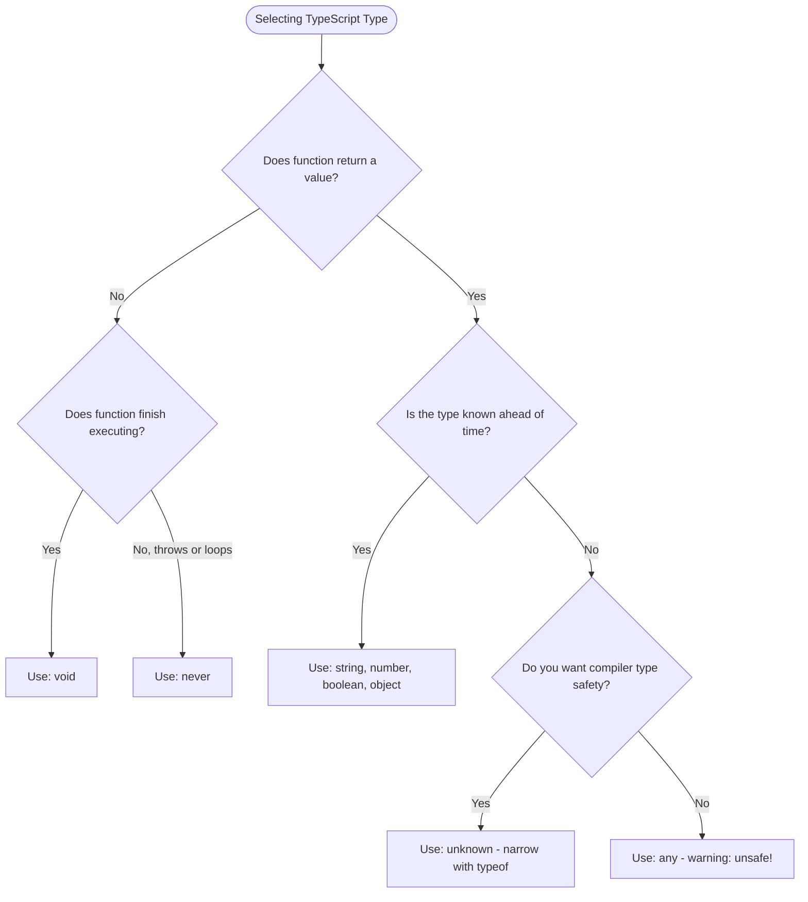

# 25 — TypeScript : Complete Interview & Reference Guide

> One-paragraph elevator pitch: TypeScript is an open-source, strongly-typed superset of JavaScript developed by Microsoft that compiles down to clean, standards-compliant JavaScript. By introducing compile-time static type checking, type inference, structural typing, and advanced types (such as `unknown`, `never`, and union types), TypeScript prevents entire classes of runtime errors before code ever hits execution. In enterprise test automation with Playwright and modern web development, TypeScript is the industry gold standard for creating robust Page Object Models, self-documenting test fixtures, and bulletproof automation frameworks.

---

## Table of Contents
1. [Syntax Reference — End to End](#1-syntax-reference--end-to-end)
2. [Built-in Functions & Methods](#2-built-in-functions--methods)
3. [Deep Insights & Gotchas](#3-deep-insights--gotchas)
4. [Interview-Ready Definitions](#4-interview-ready-definitions)
5. [Tricky Interview Questions](#5-tricky-interview-questions)
6. [Controversial Topics & Ongoing Debates](#6-controversial-topics--ongoing-debates)
7. [Quick Reference Cheat Sheet](#7-quick-reference-cheat-sheet)
8. [Memory Map & Visual Flowchart](#8-memory-map--visual-flowchart)
9. [LinkedIn-Style Post](#9-linkedin-style-post)
10. [Summary](#summary)

---

## Overview
This chapter marks the transition from dynamically-typed JavaScript to statically-typed TypeScript. We explore how the TypeScript compiler (`tsc`) compiles TypeScript down to JavaScript via **Type Erasure**, examine the primitive type system (`string`, `number`, `boolean`, `null`, `undefined`), contrast unrestricted `any` with type-safe `unknown`, perform type narrowing via `typeof`, annotate functions and arrow expressions with parameter and return types (`void`, `string`, `never`), and establish structural object contracts.

---

## 1. Syntax Reference — End to End

### 1.1 Primitive Type Annotations
```typescript
let username: string = "John";
let age: number = 30;
let pi: number = 3.14; // Note: TypeScript has no float/int, only number
let isActive: boolean = true;
let nothing: null = null;
let notDefined: undefined = undefined;
```

### 1.2 Typed Arrays
```typescript
// Square bracket notation
let scores: number[] = [95, 88, 72];

// Generic Array notation
let userList: Array<string> = ["Alice", "Bob", "Charlie"];

// Readonly arrays (immutable)
let readonlyCodes: readonly number[] = [200, 201, 204];
```

### 1.3 `any` vs `unknown`
```typescript
// 'any' disables type checking (unsafe)
let anyVal: any = "hello";
anyVal.nonExistent(); // Compiles fine, crashes at runtime!

// 'unknown' enforces type checking (safe top type)
let unknownVal: unknown = "hello";
// unknownVal.toUpperCase(); // ❌ Compile error: Object is of type 'unknown'

if (typeof unknownVal === "string") {
    console.log(unknownVal.toUpperCase()); // ✅ Allowed: Narrowed to string
}
```

### 1.4 Function Parameter and Return Type Annotations
```typescript
// Named function with parameter and return types
function add(a: number, b: number): number {
    return a + b;
}

// Function returning void (action / side-effect)
function logStep(step: string): void {
    console.log(`[STEP] ${step}`);
}

// Arrow function with concise body
const multiply = (a: number, b: number): number => a * b;
```

### 1.5 Inline Object Type Annotations
```typescript
let user: { name: string; age: number; email?: string } = {
    name: "John",
    age: 30
};
```

### 1.6 The `never` Type (Non-Returning Functions)
```typescript
// Function that throws an exception
function throwError(message: string): never {
    throw new Error(message);
}

// Function with an infinite loop
function infiniteLoop(): never {
    while (true) { }
}
```

---

## 2. Built-in Functions & Methods

### 2.1 The TypeScript Compiler (`tsc`) CLI
- **`tsc file.ts`**: Compiles `file.ts` into `file.js` in the same directory.
- **`tsc --init`**: Generates a standard `tsconfig.json` configuration file.
- **`tsc --noEmit`**: Performs type checking across the project without emitting `.js` files.
- **`tsc --watch`**: Runs the compiler in watch mode, recompiling on file save.

### 2.2 Global `typeof` Operator (Runtime + Type Query)
In TypeScript, `typeof` operates in two spaces:
1. **Value Space (Runtime):** `typeof val === "string"` checks the runtime type.
2. **Type Space (Compile-time):** `type UserType = typeof user;` captures the shape of a JavaScript variable as a TypeScript type.

### 2.3 `Array.prototype.filter()` with Typed Predicates
TypeScript provides rich type definitions for standard JavaScript array operations:
```typescript
let codes: number[] = [200, 201, 404, 500];
let failed: number[] = codes.filter((code: number): boolean => code >= 400);
```

---

## 3. Deep Insights & Gotchas

### 3.1 Type Erasure (Types Do Not Exist at Runtime)
TypeScript's type system is completely erased during compilation. There are no runtime type checks performed by the generated JavaScript.
```typescript
// TypeScript source:
function greet(name: string): string { return `Hi, ${name}`; }

// Emitted JavaScript:
"use strict";
function greet(name) { return `Hi, ${name}`; }
```
If untrusted external data (e.g., an API response) returns an unexpected shape, TypeScript cannot protect you at runtime without schema validators (like Zod).

### 3.2 `void` vs `undefined` in Return Types
- `: void` tells the compiler that the function's return value is not intended to be used. A function returning `void` can omit `return` or write `return;`.
- `: undefined` requires an explicit `return undefined;` statement in the body!
- Under JavaScript runtime, a function that returns `void` actually evaluates to `undefined`.

### 3.3 `never` is the Bottom Type
`never` is the subtype of all types. No type is a subtype of `never` (except `never` itself).
- Because `never` is assignable to any type, a function that returns `never` (like `throwError()`) can be called inside an expression expecting any type:
```typescript
function getPort(env: string): number {
    if (env === "prod") return 443;
    if (env === "dev") return 3000;
    return throwError("Unknown environment"); // Valid! 'never' satisfies 'number'
}
```

### 3.4 TypeScript Has No `int`, `float`, or `double`
All numbers in TypeScript are represented by the IEEE 754 floating-point type `number` (or `bigint` for arbitrary precision integers). Writing `let x: float = 3.14` produces a compiler error.

---

## 4. Interview-Ready Definitions

### TypeScript
> **Definition (say this):** "TypeScript is a statically-typed superset of JavaScript developed by Microsoft that adds optional static typing, type inference, and compile-time verification, compiling down to standard JavaScript with zero runtime overhead via type erasure."  
> **Follow-up the interviewer will ask:** "What is the difference between static typing and dynamic typing?"  
> **Answer:** "In dynamic typing (JavaScript), types are checked at runtime during execution. In static typing (TypeScript), types are verified at compile time before code runs, catching bugs, typos, and signature mismatches during development."

### Type Erasure
> **Definition (say this):** "Type erasure is the process where the TypeScript compiler (`tsc`) removes all type annotations, interfaces, type aliases, and type assertions from source code, producing pure, standard ECMAScript code executable by any JavaScript engine."  
> **Follow-up the interviewer will ask:** "Does TypeScript slow down runtime application performance?"  
> **Answer:** "No. Because of type erasure, the emitted JavaScript contains no TypeScript artifacts, resulting in zero performance degradation or memory penalty at runtime."

### Unknown vs Any
> **Definition (say this):** "`any` disables all type checking, allowing arbitrary property access and method calls. `unknown` is the type-safe top type that represents any value, but strictly prohibits accessing properties or calling methods until its type has been narrowed via type guards like `typeof`."  
> **Follow-up the interviewer will ask:** "When should you use `unknown` instead of `any`?"  
> **Answer:** "Always prefer `unknown` when handling unverified input (such as API payloads, external configs, or user input) to force safe narrowing before consumption."

---

## 5. Tricky Interview Questions

### Q1: What is the compiled output of this TypeScript code?
```typescript
interface User { id: number; name: string; }
let u: User = { id: 1, name: "Alice" };
```
**A:**
```javascript
"use strict";
let u = { id: 1, name: "Alice" };
```
The `interface User` is completely erased; only the JavaScript object assignment remains.  
**Difficulty:** Easy

### Q2: Why does this function fail to compile?
```typescript
function getMessage(): undefined {
    console.log("Processing...");
}
```
**A:** `A function whose declared type is neither 'void' nor 'any' must return a value`. When annotated with `: undefined`, the function must explicitly execute `return undefined;`. If the intention is to return nothing, `: void` must be used.  
**Difficulty:** Hard

### Q3: What happens when you assign a value to a variable of type `never`?
```typescript
let x: never = 123;
```
**A:** Compiler error: `Type 'number' is not assignable to type 'never'`. Nothing can be assigned to `never` except another `never` value.  
**Difficulty:** Medium

### Q4: Spot the error in this arrow function annotation:
```typescript
const calculate = (a: number, b: number) => number => a + b;
```
**A:** Syntax error. In arrow function expressions, return type annotations use a colon `:`, not an arrow: `(a: number, b: number): number => a + b`.  
**Difficulty:** Medium

### Q5: How does TypeScript perform type narrowing on `unknown`?
```typescript
function process(val: unknown) {
    if (typeof val === "string") {
        console.log(val.length);
    }
}
```
**A:** Through Control Flow Analysis. Inside the `if` block, TypeScript automatically refines the type of `val` from `unknown` to `string`, enabling access to `.length`.  
**Difficulty:** Easy

### Q6: Can a function annotated with `: never` reach a `return` statement?
**A:** No. If a function annotated with `: never` reaches a return statement (or the end of its body), TypeScript throws `A function returning 'never' cannot have a reachable end point`.  
**Difficulty:** Medium

### Q7: What is the difference between `Array<string>` and `string[]`?
**A:** They are completely identical in semantics and type checking. `string[]` is idiomatic syntactic sugar for the generic `Array<string>` type.  
**Difficulty:** Easy

### Q8: What error occurs if you pass 3 arguments to `function add(a: number, b: number): number`?
**A:** `Expected 2 arguments, but got 3`. Unlike JavaScript which silently ignores excess arguments, TypeScript enforces exact argument counts unless optional parameters (`?`) or rest parameters (`...args`) are declared.  
**Difficulty:** Easy

### Q9: What is Structural Typing (Duck Typing in TypeScript)?
**A:** TypeScript checks types based on their shape/structure rather than nominal inheritance. If object `A` has at least all the required properties of object type `B`, `A` is assignable to `B`.  
**Difficulty:** Medium

### Q10: What is the purpose of `tsconfig.json`?
**A:** It specifies the root files and compiler options required to compile the TypeScript project (e.g., target ECMAScript version, module system, strict mode flags).  
**Difficulty:** Easy

### Q11: What does `"strict": true` enable in `tsconfig.json`?
**A:** It enables a suite of strict type checking flags, including `noImplicitAny`, `strictNullChecks`, `strictFunctionTypes`, `strictBindCallApply`, and `noImplicitThis`.  
**Difficulty:** Medium

### Q12: Why does TypeScript disallow `let pi: float = 3.14`?
**A:** TypeScript follows JavaScript's ECMAScript specification, which only has a single numeric IEEE 754 type: `number`. There are no `int` or `float` types in TypeScript.  
**Difficulty:** Easy

---

## 6. Controversial Topics & Ongoing Debates

### Topic 1: `any` vs `unknown` in Enterprise Codebases
**The debate:** Should `any` ever be permitted, or should `unknown` be enforced unconditionally?  
**One side:** `any` is useful during rapid prototyping and when migrating legacy JavaScript codebases incrementally.  
**Other side:** `any` creates silent "type viral infection" where untyped values bypass compiler safety across the entire dependency graph.  
**Current consensus:** Modern enterprise guidelines ban `any` (enforcing `no-explicit-any` in ESLint), requiring `unknown` paired with type guards.

### Topic 2: Explicit Return Types vs Type Inference
**The debate:** Should developers write explicit return types on all functions, or let TypeScript infer them?  
**One side:** Explicit return types prevent accidental signature changes during refactoring and provide clearer API documentation.  
**Other side:** Type inference reduces visual clutter and boilerplate, making code faster to write.  
**Current consensus:** Require explicit return types on exported module functions, public API boundaries, and test helpers; allow inference for internal arrow callbacks.

---

## 7. Quick Reference Cheat Sheet

```
┌───────────────────────────────────────────────────────────────────────────┐
│                        TYPESCRIPT BASICS CHEATSHEET                       │
├──────────────────────────┬────────────────────────────────────────────────┤
│ Feature                  │ Syntax / Example                               │
├──────────────────────────┼────────────────────────────────────────────────┤
│ Primitives               │ string, number, boolean, null, undefined       │
│ Arrays                   │ number[] or Array<number>                      │
│ Unsafe Any               │ let x: any = "val"; (Bypasses checking)        │
│ Safe Unknown             │ let x: unknown = "val"; (Requires narrowing)   │
│ Function Typing          │ function add(a: number, b: number): number     │
│ Void Return              │ function log(msg: string): void                │
│ Never Return             │ function fail(): never { throw new Error(); }  │
│ Arrow Function           │ const mult = (a: number, b: number): number => a * b │
│ Object Shape             │ let user: { name: string; age: number }        │
│ Compile Command          │ tsc filename.ts                                │
└──────────────────────────┴────────────────────────────────────────────────┘
```

---

## 8. Memory Map & Visual Flowchart

### A) ASCII Mind Map
```
[TypeScript Type System Fundamentals]
  ├── Top Types (Accepts everything)
  │     ├── any ❌ Disables type safety (unsafe)
  │     └── unknown ✅ Safe (requires type narrowing before use)
  ├── Primitive Types
  │     ├── string (Textual data)
  │     ├── number (IEEE 754 floats, integers - no float/int!)
  │     ├── boolean (true / false)
  │     ├── null & undefined
  │     └── symbol & bigint
  ├── Object & Collection Types
  │     ├── Arrays (type[] or Array<type>)
  │     └── Structural Objects ({ prop: type })
  ├── Function Typing
  │     ├── Parameter Types ((a: number, b: string))
  │     ├── Standard Return (: string, : number)
  │     ├── void (Function returns nothing of value)
  │     └── never (Function never returns - throws or infinite loop)
  └── Compiler Architecture
        ├── tsc (Type checking + Transpilation)
        └── Type Erasure (Emits clean JavaScript with zero runtime cost)
```

### B) Decision Flowchart: Any vs Unknown vs Void vs Never (Mermaid)


### C) Execution Trace Box: TypeScript Compilation Pipeline
| Stage | Tool / Phase | Input File | Operations Performed | Output Artifact |
| :--- | :--- | :--- | :--- | :--- |
| 1 | Parser | `196.ts` | Builds Abstract Syntax Tree (AST) | AST in memory |
| 2 | Binder | AST | Associates symbols with declarations | Scoped symbol table |
| 3 | Type Checker | AST + Symbols | Validates type contracts, assigns errors | Diagnostic errors (if any) |
| 4 | Emitter | AST | Type Erasure: strips types, converts syntax | `196.js` ("use strict") |
| 5 | Execution | Node.js / V8 | Runs emitted JavaScript | Runtime console output |

---

## 9. LinkedIn-Style Post

### 📢 LinkedIn Post
> If you're using `any` in TypeScript, you're not using TypeScript. You're just writing JavaScript with extra steps! 🛑
>
> Meet `unknown`: the safe, production-grade alternative to `any`.
>
> ❌ The `any` trap:
> ```typescript
> let data: any = JSON.parse(response);
> data.nonExistentMethod(); // Compiles! Crashes in production! 💥
> ```
>
> ✅ The `unknown` pattern:
> ```typescript
> let data: unknown = JSON.parse(response);
> // data.nonExistentMethod(); // ❌ Compiler stops you immediately!
>
> if (typeof data === "string") {
>   console.log(data.toUpperCase()); // ✅ Safe! Type narrowed to string.
> }
> ```
>
> Why this matters for Playwright & test automation:
> 1. External API responses are unpredictable; `unknown` forces you to validate before asserting.
> 2. Zero silent crashes in CI/CD pipelines.
> 3. Clean type narrowing using standard JavaScript `typeof` guards.
>
> **Key Takeaway:** Stop bypassing the compiler with `any`. Use `unknown` and let TypeScript protect your production builds.
>
> #TypeScript #JavaScript #Playwright #WebDevelopment #SoftwareEngineering #CleanCode #QualityAssurance

---

## Summary
**Key Takeaway:** TypeScript brings compile-time static type safety to JavaScript through type annotations, structural object shapes, function contracts (`void`, `never`), and type-safe top types (`unknown`), erasing all type artifacts during compilation to deliver pure, high-performance JavaScript.

### Related Individual Chapter Notes:
- [195_JS_Baseline_IQ.md](file:///c:/Users/rajap/OneDrive/%E0%B9%80%E0%B8%AD%E0%B8%81%E0%B8%AA%E0%B8%B2%E0%B8%A3/LEARNINGPLAYWRIGHT3X/IQ_Notes/Chapter_Notes/25/195_JS_Baseline_IQ.md) — Dynamic Typing Baseline in JavaScript
- [196_TS_Compilation_Basics_IQ.md](file:///c:/Users/rajap/OneDrive/%E0%B9%80%E0%B8%AD%E0%B8%81%E0%B8%AA%E0%B8%B2%E0%B8%A3/LEARNINGPLAYWRIGHT3X/IQ_Notes/Chapter_Notes/25/196_TS_Compilation_Basics_IQ.md) — TypeScript Compilation Pipeline and Type Erasure
- [197_Void_Function_Type_IQ.md](file:///c:/Users/rajap/OneDrive/%E0%B9%80%E0%B8%AD%E0%B8%81%E0%B8%AA%E0%B8%B2%E0%B8%A3/LEARNINGPLAYWRIGHT3X/IQ_Notes/Chapter_Notes/25/197_Void_Function_Type_IQ.md) — Function Parameter Typing and Void Return Type
- [198_Primitive_Types_IQ.md](file:///c:/Users/rajap/OneDrive/%E0%B9%80%E0%B8%AD%E0%B8%81%E0%B8%AA%E0%B8%B2%E0%B8%A3/LEARNINGPLAYWRIGHT3X/IQ_Notes/Chapter_Notes/25/198_Primitive_Types_IQ.md) — TypeScript Primitive Types, Arrays, and Any vs Unknown
- [199_Unknown_Narrowing_IQ.md](file:///c:/Users/rajap/OneDrive/%E0%B9%80%E0%B8%AD%E0%B8%81%E0%B8%AA%E0%B8%B2%E0%B8%A3/LEARNINGPLAYWRIGHT3X/IQ_Notes/Chapter_Notes/25/199_Unknown_Narrowing_IQ.md) — Type Narrowing with Unknown and Uninitialized Declarations
- [200_Function_Annotations_IQ.md](file:///c:/Users/rajap/OneDrive/%E0%B9%80%E0%B8%AD%E0%B8%81%E0%B8%AA%E0%B8%B2%E0%B8%A3/LEARNINGPLAYWRIGHT3X/IQ_Notes/Chapter_Notes/25/200_Function_Annotations_IQ.md) — Function Parameter and Return Type Annotations
- [201_Arrow_Functions_IQ.md](file:///c:/Users/rajap/OneDrive/%E0%B9%80%E0%B8%AD%E0%B8%81%E0%B8%AA%E0%B8%B2%E0%B8%A3/LEARNINGPLAYWRIGHT3X/IQ_Notes/Chapter_Notes/25/201_Arrow_Functions_IQ.md) — Arrow Function Annotations and Concise Body Typing
- [202_Object_Annotations_IQ.md](file:///c:/Users/rajap/OneDrive/%E0%B9%80%E0%B8%AD%E0%B8%81%E0%B8%AA%E0%B8%B2%E0%B8%A3/LEARNINGPLAYWRIGHT3X/IQ_Notes/Chapter_Notes/25/202_Object_Annotations_IQ.md) — Inline Object Type Annotations and Structural Typing
- [203_Void_Return_IQ.md](file:///c:/Users/rajap/OneDrive/%E0%B9%80%E0%B8%AD%E0%B8%81%E0%B8%AA%E0%B8%B2%E0%B8%A3/LEARNINGPLAYWRIGHT3X/IQ_Notes/Chapter_Notes/25/203_Void_Return_IQ.md) — Void Return in Logging and Action Helpers
- [204_String_Return_IQ.md](file:///c:/Users/rajap/OneDrive/%E0%B9%80%E0%B8%AD%E0%B8%81%E0%B8%AA%E0%B8%B2%E0%B8%A3/LEARNINGPLAYWRIGHT3X/IQ_Notes/Chapter_Notes/25/204_String_Return_IQ.md) — Enforcing String Return Types
- [205_Never_Type_IQ.md](file:///c:/Users/rajap/OneDrive/%E0%B9%80%E0%B8%AD%E0%B8%81%E0%B8%AA%E0%B8%B2%E0%B8%A3/LEARNINGPLAYWRIGHT3X/IQ_Notes/Chapter_Notes/25/205_Never_Type_IQ.md) — The Never Type: Unreachable Code and Non-Returning Functions
