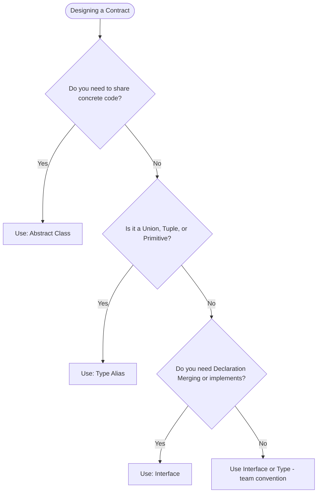

# 26 — Abstractions & Interfaces : Complete Interview & Reference Guide

> One-paragraph elevator pitch: Abstraction is the cornerstone of scalable software architecture, separating the definition of *what* an operation does from *how* it is executed. In TypeScript, Interfaces are the primary vehicle for abstraction, defining clear contracts for object shapes, callable functions, class implementations via `implements`, and dynamic dictionaries with index signatures. In test automation with Playwright, interfaces establish unified Page Object Model contracts, strongly-typed environment configurations, and interchangeable test fixtures that eliminate brittle coupling and runtime errors.

---

## Table of Contents
1. [Syntax Reference — End to End](#1-syntax-reference--end-to-end)
2. [Built-in Functions & Methods](#2-built-in-functions--methods)
3. [Deep Insights & Gotchas](#3-deep-insights--gotchas)
4. [Interview-Ready Definitions](#4-interview-ready-definitions)
5. [Tricky Interview Questions](#5-tricky-interview-questions)
6. [Controversial Topics & Ongoing Debates](#6-controversial-topics--ongoing-debates)
7. [Quick Reference Cheat Sheet](#7-quick-reference-cheat-sheet)
8. [Memory Map & Visual Flowchart](#8-memory-map--visual-flowchart)
9. [LinkedIn-Style Post](#9-linkedin-style-post)
10. [Summary](#summary)

---

## Overview
Abstraction enables developers to design complex systems by hiding concrete details behind clean, immutable contracts. This chapter covers the complete spectrum of TypeScript Interfaces: Object Configuration Interfaces with optional (`?`) and readonly properties, Callable Interfaces for test lifecycle hooks, Class Contracts enforced via the `implements` keyword, Index Signatures for dynamic dictionaries, Declaration Merging, and the crucial architectural contrasts between Interfaces in TypeScript and un-enforced constructor patterns in vanilla JavaScript.

---

## 1. Syntax Reference — End to End

### 1.1 Object Shape Interfaces with Optional and Readonly Properties
```typescript
interface TestConfig {
    readonly id: string;     // Readonly: cannot be mutated after assignment
    browser: string;         // Mandatory property
    headless: boolean;       // Mandatory property
    baseURL: string;         // Mandatory property
    timeout?: number;        // Optional property (number | undefined)
    retries?: number;        // Optional property (number | undefined)
}

const config: TestConfig = {
    id: "cfg_01",
    browser: "Chrome",
    headless: true,
    baseURL: "https://staging.app.com"
    // timeout and retries omitted safely
};
```

### 1.2 Callable Interfaces (Function Signatures)
An interface can define the signature of a callable function:
```typescript
interface TestHook {
    (testName: string): void;
}

const beforeEachHook: TestHook = function (testName: string): void {
    console.log(`[BEFORE] Setting up fixture for: ${testName}`);
};

const afterEachHook: TestHook = (testName: string): void => {
    console.log(`[AFTER] Tearing down resources for: ${testName}`);
};

beforeEachHook("Payment Verification");
```

### 1.3 Class Contracts via `implements`
A class uses `implements` to guarantee it fulfills an interface:
```typescript
interface Executable {
    name: string;
    run(): void;
    getStatus(): string;
}

class TestCase implements Executable {
    name: string;

    constructor(name: string) {
        this.name = name;
    }

    run(): void {
        console.log(`[RUNNING] ${this.name}`);
    }

    getStatus(): string {
        return "PASS";
    }
}
```

### 1.4 Index Signatures (Dynamic Dictionaries)
```typescript
interface StringDictionary {
    [key: string]: string;
}

const headers: StringDictionary = {
    "Content-Type": "application/json",
    "Authorization": "Bearer token123"
};
```

### 1.5 Interface Inheritance (`extends`)
Interfaces can extend one or more other interfaces:
```typescript
interface Identifiable {
    id: string;
}

interface Loggable {
    log(): void;
}

interface TestReport extends Identifiable, Loggable {
    status: "PASS" | "FAIL";
    duration: number;
}
```

---

## 2. Built-in Functions & Methods

### 2.1 Interface Declaration Merging
Unlike `type` aliases, multiple interface declarations with the same name automatically merge their member definitions into a single interface:
```typescript
interface UserProfile {
    name: string;
}

interface UserProfile {
    roles: string[];
}

// Resulting UserProfile requires both 'name' and 'roles':
const admin: UserProfile = {
    name: "Alex",
    roles: ["admin", "tester"]
};
```

### 2.2 Extending Interfaces into Classes (`interface extends class`)
In advanced TypeScript, an interface can extend a class, inheriting its member declarations but not their implementations:
```typescript
class Control {
    private state: any;
}
interface SelectableControl extends Control {
    select(): void;
}
```

### 2.3 `Object.keys()` and `Object.entries()` with Index Signatures
Working with dynamic dictionaries:
```typescript
const dict: StringDictionary = { a: "1", b: "2" };
Object.entries(dict).forEach(([key, value]) => {
    console.log(`${key}: ${value}`);
});
```

---

## 3. Deep Insights & Gotchas

### 3.1 Interfaces Have Zero Runtime Existence (Pure Type Erasure)
Like all types in TypeScript, interfaces are completely erased during compilation. They leave zero JavaScript artifacts in emitted `.js` files:
```typescript
// Source (.ts):
interface Runner { run(): void; }
class Test implements Runner { run() {} }

// Emitted JavaScript (.js):
"use strict";
class Test { run() {} }
```
Because of this, you cannot use `instanceof` with an interface (`obj instanceof Runner` is a compiler error: `'Runner' only refers to a type, but is being used as a value here`).

### 3.2 Excess Property Checking Trap
When an object literal is assigned directly to an interface, TypeScript applies **Excess Property Checking**:
```typescript
interface Box { width: number; }
// ❌ Error: Object literal may only specify known properties, and 'height' does not exist in type 'Box'
const b1: Box = { width: 10, height: 20 };

// ✅ Workaround (by design): assigning an intermediate variable bypasses excess checks
const temp = { width: 10, height: 20 };
const b2: Box = temp; // Allowed due to structural typing!
```

### 3.3 `implements` Only Checks the Instance Side
The `implements` clause only validates the *public instance* properties and methods of a class. It does NOT check static methods or the constructor signature:
```typescript
interface ClockConstructor {
    new (hour: number, minute: number): any;
}
// ❌ Error: Class 'Clock' incorrectly implements interface 'ClockConstructor'
// class Clock implements ClockConstructor { ... }
```

### 3.4 Index Signatures Require Consistent Explicit Properties
If an interface defines an index signature, all explicit properties must conform to the index signature's value type:
```typescript
interface InvalidConfig {
    [key: string]: string;
    port: number; // ❌ Compile Error: Property 'port' of type 'number' is not assignable to 'string' index type 'string'
}
```

---

## 4. Interview-Ready Definitions

### Interface
> **Definition (say this):** "An interface in TypeScript is a compile-time syntactic contract that defines the structural shape of an object, function, or class, establishing required and optional properties, method signatures, and index accessors without providing runtime implementation."  
> **Follow-up the interviewer will ask:** "How does a TypeScript interface differ from a Java or C# interface?"  
> **Answer:** "In Java/C#, interfaces are nominal types that exist in compiled bytecode and support runtime reflection. In TypeScript, interfaces are purely structural and compile away entirely via type erasure, leaving zero runtime memory or performance footprint."

### Abstraction
> **Definition (say this):** "Abstraction is the OOP principle of exposing essential capabilities and interactions through high-level contracts while concealing concrete implementation details, enabling decoupling, modular testing, and component interchangeability."  
> **Follow-up the interviewer will ask:** "How do interfaces support abstraction in automated testing?"  
> **Answer:** "By typing Page Objects and Test Runners against interfaces (e.g., `interface Page { open(): Promise<void>; }`), test scripts depend on high-level contracts rather than specific browser drivers or locator implementations."

---

## 5. Tricky Interview Questions

### Q1: What is the difference between `interface` and `type` in TypeScript?
**A:** 
1. **Declaration Merging:** Interfaces can be declared multiple times and will merge into a single definition; `type` aliases cannot be re-declared.
2. **Extending:** Interfaces extend using `extends`; types combine using intersection operators (`&`).
3. **Unions and Primitives:** `type` can represent unions (`type Status = "A" | "B"`), tuples, and primitives directly; interfaces can only represent object and function shapes.  
**Difficulty:** Medium

### Q2: Can an interface have both a callable signature and properties?
**A:** Yes. This is called a **Hybrid Type**, commonly used to model functions that have properties attached (like JavaScript's `fetch` or Express middleware):
```typescript
interface Counter {
    (start: number): string;
    interval: number;
    reset(): void;
}
```
**Difficulty:** Hard

### Q3: Why does `instanceof` fail when checking against an interface?
**A:** Interfaces exist exclusively in the compile-time type system and are erased during compilation to JavaScript. Because no constructor function or prototype exists in runtime JavaScript for an interface, `obj instanceof MyInterface` is an illegal runtime reference.  
**Difficulty:** Easy

### Q4: What is the output of compiling this file?
```typescript
interface Excetable {
    run(): void;
}
class TestCase implements Excetable {
    run() { console.log("running"); }
}
```
**A:** In emitted JavaScript:
```javascript
"use strict";
class TestCase {
    run() { console.log("running"); }
}
```
The `interface` and the `implements` keyword are completely stripped.  
**Difficulty:** Easy

### Q5: What is Declaration Merging and why is it useful?
**A:** Declaration merging allows multiple interface declarations with identical identifiers to merge into a single interface. It is essential for extending third-party libraries (like augmenting the `Window` object or Express `Request` with custom session data) without modifying original source code.  
**Difficulty:** Medium

### Q6: How do optional properties (`?`) behave when accessed in TypeScript?
**A:** Optional properties are typed as `T | undefined`. When accessed, the compiler forces developers to handle the possibility of `undefined`, typically through optional chaining (`obj.prop?.method()`) or nullish coalescing (`obj.prop ?? defaultVal`).  
**Difficulty:** Easy

### Q7: Spot the bug in this interface definition:
```typescript
interface ResponseMap {
    [key: string]: number;
    status: string;
}
```
**A:** Compile error: `Property 'status' of type 'string' is not assignable to 'string' index type 'number'`. In an interface with an index signature, all explicit property return types must be subtypes of the index signature's value type.  
**Difficulty:** Medium

### Q8: Can a class implement multiple interfaces?
**A:** Yes. Unlike single inheritance with `extends`, a class can implement any number of comma-separated interfaces: `class TestSuite implements Executable, Loggable, Disposable`.  
**Difficulty:** Easy

### Q9: What happens if a class implements an interface but declares a method as `private`?
```typescript
interface Worker { doWork(): void; }
class Employee implements Worker {
    private doWork() {} // What happens?
}
```
**A:** Compiler error: `Class 'Employee' incorrectly implements interface 'Worker'. Property 'doWork' is private in type 'Employee' but not in type 'Worker'`. Interface members are inherently public contracts.  
**Difficulty:** Hard

### Q10: How can you achieve runtime type validation for an interface?
**A:** Since interfaces are erased at runtime, developers use **User-Defined Type Guards** (`function isConfig(obj: any): obj is TestConfig`) or schema validation libraries (like Zod) that generate runtime validators alongside TypeScript types.  
**Difficulty:** Medium

### Q11: What is the difference between `readonly` in an interface and `const`?
**A:** `const` is for variable declarations, preventing variable reassignment. `readonly` is for interface and class properties, preventing property modification after object creation.  
**Difficulty:** Easy

### Q12: Can an interface extend a type alias?
**A:** Yes, an interface can extend a type alias as long as the type alias resolves to a statically-known object shape (not a union type).  
**Difficulty:** Medium

---

## 6. Controversial Topics & Ongoing Debates

### Topic 1: `interface` vs `type` — Which Should You Default To?
**The debate:** The TypeScript community has long debated whether teams should default to `interface` or `type`.  
**One side (Interface-first):** Recommended by the official TypeScript handbook for object shapes. Interfaces support declaration merging, have slightly faster compiler lookup caching, and mirror traditional OOP conventions.  
**Other side (Type-first):** Advocates prefer `type` for consistency because type aliases can represent everything (unions, primitives, tuples, intersections, object shapes) with a uniform syntax.  
**Current consensus:** Use `interface` for public APIs, libraries, and class contracts via `implements`; use `type` for unions, intersections, primitives, and internal component state.

### Topic 2: Interface (`implements`) vs Abstract Class (`extends`)
**The debate:** When defining base contracts, should you use an interface or an abstract class?  
**One side (Interface):** Zero runtime overhead, supports multiple inheritance (`implements A, B, C`), completely decoupled from implementation.  
**Other side (Abstract Class):** Can contain shared concrete method implementations, protected members, and constructor logic that child classes inherit.  
**Current consensus:** Use interfaces when defining pure contracts across unrelated classes; use abstract classes when child classes share common boilerplate implementation logic.

---

## 7. Quick Reference Cheat Sheet

```
┌───────────────────────────────────────────────────────────────────────────┐
│                      TYPESCRIPT INTERFACES CHEATSHEET                     │
├──────────────────────────┬────────────────────────────────────────────────┤
│ Feature                  │ Syntax / Example                               │
├──────────────────────────┼────────────────────────────────────────────────┤
│ Object Interface         │ interface User { name: string; age: number; }  │
│ Optional Property        │ interface Config { timeout?: number; }         │
│ Readonly Property        │ interface Item { readonly id: string; }        │
│ Callable Interface       │ interface Hook { (testName: string): void; }   │
│ Class Implementation     │ class Test implements Executable { ... }       │
│ Multi-Interface Impl     │ class Test implements Runnable, Loggable       │
│ Interface Extension      │ interface Child extends Parent1, Parent2       │
│ Index Signature          │ interface Map { [key: string]: string; }       │
│ Declaration Merging      │ Declare same interface twice to merge fields   │
└──────────────────────────┴────────────────────────────────────────────────┘
```

---

## 8. Memory Map & Visual Flowchart

### A) ASCII Mind Map
```
[TypeScript Abstraction & Interfaces]
  ├── Interface Contract Types
  │     ├── Object Shapes ({ key: type })
  │     │     ├── Mandatory Properties (browser: string)
  │     │     ├── Optional Properties ⚠️ (timeout?: number)
  │     │     └── Readonly Properties 🔒 (readonly id: string)
  │     ├── Callable Signatures ((param: type): returnType)
  │     └── Index Signatures ([key: string]: valueType)
  ├── Class Binding
  │     ├── implements Keyword (Enforces compile-time structural match)
  │     └── Multiple Interfaces (class X implements A, B, C)
  ├── Advanced Mechanics
  │     ├── Declaration Merging (Augmenting existing interfaces)
  │     ├── Interface Inheritance (interface Child extends Parent)
  │     └── Type Erasure ⚡ (0 bytes in compiled JavaScript)
  └── Test Automation Use Cases
        ├── Playwright TestConfig (Local vs CI configurations)
        ├── Test Lifecycle Hooks (beforeEachHook, afterEachHook)
        └── Polymorphic Test Execution (Executable[] test suites)
```

### B) Decision Flowchart: Interface vs Type vs Abstract Class (Mermaid)


### C) Execution Trace Box: Interface Contract Checking Pipeline
| Stage | Input Construct | Compiler Action | Result / Output |
| :--- | :--- | :--- | :--- |
| 1 | `interface Executable { run(): void; }` | Stores structural signature in Symbol Table | No JS generated |
| 2 | `class TestCase implements Executable` | Inspects `TestCase.prototype` for `run(): void` | Verified: Match found |
| 3 | `test1: Executable = new TestCase(...)` | Validates instance assignment | Assigned safely |
| 4 | Compilation (`tsc`) | Type Erasure: strips `interface` & `implements` | Emits clean ES6 class in `.js` |
| 5 | Execution (Node.js) | Executes `test1.run()` via standard prototype dispatch | Outputs: `[RUN] ...` |

---

## 9. LinkedIn-Style Post

### 📢 LinkedIn Post
> Why do top test automation architectures rely heavily on TypeScript interfaces? 🏗️
>
> Because loose, untyped configurations are a recipe for CI/CD pipeline disasters.
>
> Look at this Playwright configuration interface:
>
> ```typescript
> interface TestConfig {
>   browser: "chromium" | "firefox" | "webkit";
>   headless: boolean;
>   baseURL: string;
>   timeout?: number;
>   retries?: number;
> }
> ```
>
> 💡 3 Superpowers Interfaces bring to your Test Framework:
> 1. **Zero Runtime Cost:** Interfaces vanish completely during compilation (`tsc`), leaving pure, optimized JavaScript.
> 2. **Bulletproof Contracts:** Classes implementing test interfaces (`class SmokeTest implements Executable`) cannot forget required methods.
> 3. **Typo Protection:** Misspelling `retriess` or passing a string to `timeout` is caught before tests ever run.
>
> **Key Takeaway:** Interfaces turn implicit agreements into strict compile-time contracts, eliminating runtime configuration bugs across enterprise test frameworks.
>
> #TypeScript #Playwright #TestAutomation #SoftwareEngineering #CleanCode #OOP #QualityAssurance

---

## Summary
**Key Takeaway:** Interfaces in TypeScript provide lightweight, zero-runtime abstraction contracts for object configurations, callable functions, class implementations via `implements`, and dynamic dictionaries, safeguarding large-scale codebases from structural and signature mismatches.

### Related Individual Chapter Notes:
- [206_Test_hooks_IQ.md](file:///c:/Users/rajap/OneDrive/%E0%B9%80%E0%B8%AD%E0%B8%81%E0%B8%AA%E0%B8%B2%E0%B8%A3/LEARNINGPLAYWRIGHT3X/IQ_Notes/Chapter_Notes/26/206_Test_hooks_IQ.md) — Callable Interfaces and Test Hook Signatures
- [207_REAL_IQ.md](file:///c:/Users/rajap/OneDrive/%E0%B9%80%E0%B8%AD%E0%B8%81%E0%B8%AA%E0%B8%B2%E0%B8%A3/LEARNINGPLAYWRIGHT3X/IQ_Notes/Chapter_Notes/26/207_REAL_IQ.md) — Configuration Interfaces with Mandatory and Optional Properties
- [208_CLASS_REAL_IQ.md](file:///c:/Users/rajap/OneDrive/%E0%B9%80%E0%B8%AD%E0%B8%81%E0%B8%AA%E0%B8%B2%E0%B8%A3/LEARNINGPLAYWRIGHT3X/IQ_Notes/Chapter_Notes/26/208_CLASS_REAL_IQ.md) — Implementing Interfaces in Classes with the Implements Keyword
- [209_Interface_Mics_IQ.md](file:///c:/Users/rajap/OneDrive/%E0%B9%80%E0%B8%AD%E0%B8%81%E0%B8%AA%E0%B8%B2%E0%B8%A3/LEARNINGPLAYWRIGHT3X/IQ_Notes/Chapter_Notes/26/209_Interface_Mics_IQ.md) — Index Signatures and Dynamic Key Dictionaries
- [210_Real_IQ.md](file:///c:/Users/rajap/OneDrive/%E0%B9%80%E0%B8%AD%E0%B8%81%E0%B8%AA%E0%B8%B2%E0%B8%A3/LEARNINGPLAYWRIGHT3X/IQ_Notes/Chapter_Notes/26/210_Real_IQ.md) — Parameterized Constructors and Method Stubs in Vanilla JavaScript
- [210_Interface_IQ.md](file:///c:/Users/rajap/OneDrive/%E0%B9%80%E0%B8%AD%E0%B8%81%E0%B8%AA%E0%B8%B2%E0%B8%A3/LEARNINGPLAYWRIGHT3X/IQ_Notes/Chapter_Notes/26/210_Interface_IQ.md) — User Interface Modeling and Object Literal Contracts
- [211_Readonly_IQ.md](file:///c:/Users/rajap/OneDrive/%E0%B9%80%E0%B8%AD%E0%B8%81%E0%B8%AA%E0%B8%B2%E0%B8%A3/LEARNINGPLAYWRIGHT3X/IQ_Notes/Chapter_Notes/26/211_Readonly_IQ.md) — Readonly Properties in Interfaces
- [212_Interface_PageObjects_IQ.md](file:///c:/Users/rajap/OneDrive/%E0%B9%80%E0%B8%AD%E0%B8%81%E0%B8%AA%E0%B8%B2%E0%B8%A3/LEARNINGPLAYWRIGHT3X/IQ_Notes/Chapter_Notes/26/212_Interface_PageObjects_IQ.md) — Interface Inheritance and Page Object Architecture
- [213_Page_objects_IQ.md](file:///c:/Users/rajap/OneDrive/%E0%B9%80%E0%B8%AD%E0%B8%81%E0%B8%AA%E0%B8%B2%E0%B8%A3/LEARNINGPLAYWRIGHT3X/IQ_Notes/Chapter_Notes/26/213_Page_objects_IQ.md) — API Response Modeling with Optional Headers
- [214_Method_Interface_IQ.md](file:///c:/Users/rajap/OneDrive/%E0%B9%80%E0%B8%AD%E0%B8%81%E0%B8%AA%E0%B8%B2%E0%B8%A3/LEARNINGPLAYWRIGHT3X/IQ_Notes/Chapter_Notes/26/214_Method_Interface_IQ.md) — Method Signatures in Interfaces and Object Implementation
- [215_Enum_IQ.md](file:///c:/Users/rajap/OneDrive/%E0%B9%80%E0%B8%AD%E0%B8%81%E0%B8%AA%E0%B8%B2%E0%B8%A3/LEARNINGPLAYWRIGHT3X/IQ_Notes/Chapter_Notes/26/215_Enum_IQ.md) — String Enums and Test Execution Status Modeling
- [216_Enum2_IQ.md](file:///c:/Users/rajap/OneDrive/%E0%B9%80%E0%B8%AD%E0%B8%81%E0%B8%AA%E0%B8%B2%E0%B8%A3/LEARNINGPLAYWRIGHT3X/IQ_Notes/Chapter_Notes/26/216_Enum2_IQ.md) — Defect Severity Levels and Enum Constants
- [217_Real_Enum_IQ.md](file:///c:/Users/rajap/OneDrive/%E0%B9%80%E0%B8%AD%E0%B8%81%E0%B8%AA%E0%B8%B2%E0%B8%A3/LEARNINGPLAYWRIGHT3X/IQ_Notes/Chapter_Notes/26/217_Real_Enum_IQ.md) — Environment URL Mapping via Enums
- [218_REAL_Browser_PW_IQ.md](file:///c:/Users/rajap/OneDrive/%E0%B9%80%E0%B8%AD%E0%B8%81%E0%B8%AA%E0%B8%B2%E0%B8%A3/LEARNINGPLAYWRIGHT3X/IQ_Notes/Chapter_Notes/26/218_REAL_Browser_PW_IQ.md) — Browser Selection and Exhaustive Dispatch in Playwright
- [219_REAL_API_IQ.md](file:///c:/Users/rajap/OneDrive/%E0%B9%80%E0%B8%AD%E0%B8%81%E0%B8%AA%E0%B8%B2%E0%B8%A3/LEARNINGPLAYWRIGHT3X/IQ_Notes/Chapter_Notes/26/219_REAL_API_IQ.md) — HTTP Method Enums and Request Dispatching
- [220_Abstract_IQ.md](file:///c:/Users/rajap/OneDrive/%E0%B9%80%E0%B8%AD%E0%B8%81%E0%B8%AA%E0%B8%B2%E0%B8%A3/LEARNINGPLAYWRIGHT3X/IQ_Notes/Chapter_Notes/26/220_Abstract_IQ.md) — Abstract Classes and Template Method Pattern in Test Frameworks

