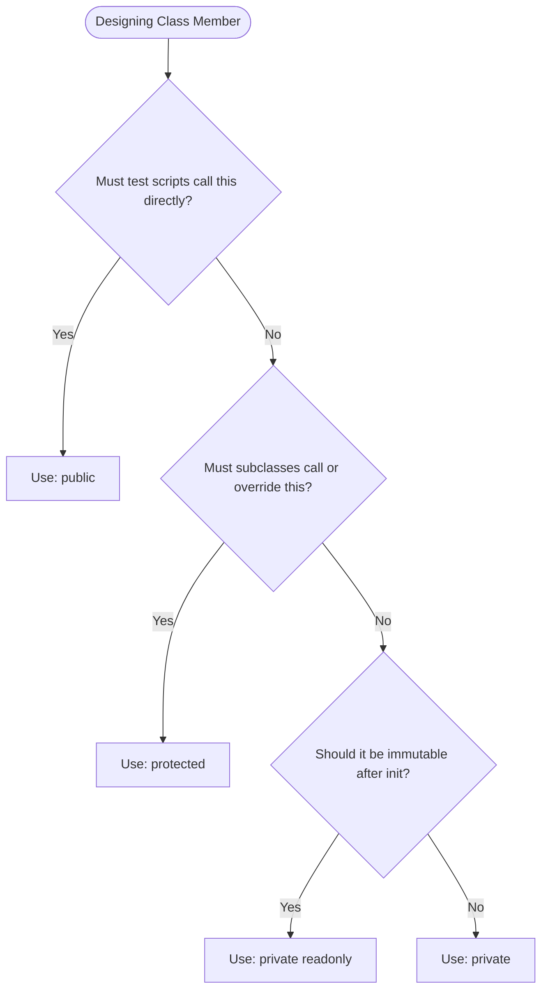

# 28 — Access Modifiers : Complete Interview & Reference Guide

> One-paragraph elevator pitch: Access Modifiers are the bedrock of Object-Oriented Encapsulation in TypeScript, providing granular compile-time visibility controls for class members through `public`, `private`, and `protected`. Combined with the `readonly` modifier, access modifiers guarantee that sensitive credentials, driver connections, and internal lifecycle procedures remain strictly hidden from test consumer scripts while safely facilitating subclass inheritance across Page Object Models and API clients.

---

## Table of Contents
1. [Syntax Reference — End to End](#1-syntax-reference--end-to-end)
2. [Built-in Functions & Methods](#2-built-in-functions--methods)
3. [Deep Insights & Gotchas](#3-deep-insights--gotchas)
4. [Interview-Ready Definitions](#4-interview-ready-definitions)
5. [Tricky Interview Questions](#5-tricky-interview-questions)
6. [Controversial Topics & Ongoing Debates](#6-controversial-topics--ongoing-debates)
7. [Quick Reference Cheat Sheet](#7-quick-reference-cheat-sheet)
8. [Memory Map & Visual Flowchart](#8-memory-map--visual-flowchart)
9. [LinkedIn-Style Post](#9-linkedin-style-post)
10. [Summary](#summary)

---

## Overview
Encapsulation shields an object's internal representation from direct external manipulation, reducing coupling and preventing bugs. In TypeScript, access modifiers dictate who can view, call, or modify class properties and methods. This guide explores the complete access control ecosystem: `public` interfaces, `private` implementation hiding, `protected` hierarchical sharing, `readonly` immutability, parameter properties, and the architectural differences between TypeScript's compile-time visibility and ECMAScript's hard `#private` fields.

---

## 1. Syntax Reference — End to End

### 1.1 `public`, `private`, and `protected`
```typescript
class APIClient {
    public baseURL: string;       // Public: accessible anywhere
    private apiKey: string;       // Private: accessible ONLY within APIClient
    protected timeout: number;    // Protected: accessible in APIClient and subclasses

    constructor(baseURL: string, apiKey: string, timeout: number) {
        this.baseURL = baseURL;
        this.apiKey = apiKey;
        this.timeout = timeout;
    }

    private getAuthHeader(): string {
        return `Bearer ${this.apiKey}`;
    }

    public sendRequest(path: string): void {
        console.log(`Sending request to ${this.baseURL}${path} with auth: ${this.getAuthHeader()}`);
    }
}
```

### 1.2 Subclass Inheritance with `protected`
```typescript
class UserAPIClient extends APIClient {
    getUsers(): void {
        // ✅ Allowed: 'baseURL' is public, 'timeout' is protected
        console.log(`Querying ${this.baseURL}/users with timeout ${this.timeout}ms`);

        // ❌ Compiler Error: 'apiKey' is private to APIClient
        // console.log(this.apiKey);
    }
}
```

### 1.3 `private readonly` Configuration Immutability
```typescript
class PlaywrightConfig {
    private readonly baseURL: string;
    private readonly timeout: number;
    private readonly retries: number;

    constructor(url: string, timeout: number, retries: number) {
        this.baseURL = url;
        this.timeout = timeout;
        this.retries = retries;
    }

    showConfig(): void {
        console.log(`URL: ${this.baseURL} | Timeout: ${this.timeout}ms | Retries: ${this.retries}`);
    }
}
```

### 1.4 Parameter Properties Shorthand
TypeScript allows declaring and assigning class properties directly inside constructor parameters:
```typescript
class CompactConfig {
    constructor(
        public readonly env: string,
        private readonly token: string,
        protected timeout: number = 5000
    ) {
        // Automatically creates and assigns this.env, this.token, and this.timeout!
    }
}
```

---

## 2. Built-in Functions & Methods

### 2.1 Native JavaScript Private Fields (`#private`)
TypeScript supports ECMAScript's native `#` prefix for hard private state:
```typescript
class SecureStore {
    #secretKey: string; // True runtime private field

    constructor(key: string) {
        this.#secretKey = key;
    }

    reveal(): string {
        return this.#secretKey;
    }
}
```

### 2.2 Getters and Setters (`get` / `set`) with Access Modifiers
Pairing private storage with public or protected accessors:
```typescript
class Account {
    private _balance: number = 0;

    public get balance(): number {
        return this._balance;
    }

    protected set balance(val: number) {
        if (val < 0) throw new Error("Negative balance disallowed");
        this._balance = val;
    }
}
```

### 2.3 `Object.getOwnPropertyDescriptor()`
Used in JavaScript reflection to inspect property descriptors (configurable, enumerable, writable). Note that TypeScript's `private` does not alter these descriptor flags in emitted JS.

---

## 3. Deep Insights & Gotchas

### 3.1 TypeScript `private` vs ECMAScript `#private`
- **TypeScript `private`:** A purely **compile-time** safety mechanism. During compilation, the modifier is erased. In JavaScript runtime, the property is a standard enumerable field (accessible via bracket notation: `instance["apiKey"]`).
- **ECMAScript `#private`:** Enforced by the **JavaScript engine runtime** using WeakMaps/private symbols. Attempting to access `#apiKey` from outside throws a runtime `SyntaxError`, and bracket notation cannot bypass it.

### 3.2 `protected` Constructors (Abstract Class Alternative)
Marking a constructor as `protected` prevents external callers from instantiating the class directly, while allowing subclasses to instantiate it via `super()`:
```typescript
class BaseRunner {
    protected constructor(public name: string) {}
}
// const r = new BaseRunner("Test"); // ❌ Compile error: Constructor of class 'BaseRunner' is protected!
class UIRunner extends BaseRunner {
    constructor() { super("UI"); }   // ✅ Allowed!
}
```

### 3.3 Subclasses Can Weaken Visibility (Access Modifier Widening)
A derived class can override a `protected` method and make it `public`:
```typescript
class Base {
    protected execute(): void {}
}
class Child extends Base {
    public execute(): void {} // ✅ Allowed: widening protected to public!
}
```
However, a derived class **cannot** narrow visibility (making a `public` method `private` or `protected` is a compiler error).

---

## 4. Interview-Ready Definitions

### Encapsulation
> **Definition (say this):** "Encapsulation is the fundamental OOP principle of bundling data and methods inside a class while restricting direct external access to internal state using access modifiers, exposing only a controlled public interface."  
> **Follow-up the interviewer will ask:** "How do access modifiers benefit Page Object Models in test automation?"  
> **Answer:** "By keeping low-level locators and driver navigation methods `private` or `protected`, tests are forced to interact through high-level business methods (`login()`, `checkout()`), ensuring tests do not break when underlying UI selectors change."

### Protected Modifier
> **Definition (say this):** "The `protected` modifier restricts visibility to the declaring class and any derived subclasses, preventing external consumption while allowing shared infrastructure inheritance."  
> **Follow-up the interviewer will ask:** "When would you use `protected` instead of `private` in a base class?"  
> **Answer:** "Use `protected` for shared helpers, base URLs, or logger utilities that derived page classes need to execute, but which external test specs should not invoke directly."

---

## 5. Tricky Interview Questions

### Q1: Is a TypeScript `private` property truly private at runtime?
**A:** No. TypeScript access modifiers are erased during compilation to JavaScript. At runtime, the property is a normal property that can be accessed using bracket notation (`obj["privateProperty"]`). For true runtime privacy, use ECMAScript `#private` syntax.  
**Difficulty:** Medium

### Q2: Can a subclass access a `private` member of its superclass?
**A:** No. `private` members are strictly accessible only within the declaring class body. Subclasses require the member to be `protected` or `public` to access it.  
**Difficulty:** Easy

### Q3: What is a Parameter Property in TypeScript?
**A:** It is a constructor shorthand that automatically creates and initializes a class member when an access modifier or `readonly` is prefixed to a constructor argument:
```typescript
class User {
    constructor(public name: string) {} // Creates this.name = name
}
```
**Difficulty:** Easy

### Q4: Spot the compilation error in this class definition:
```typescript
class Config {
    private readonly timeout: number = 5000;
    updateTimeout(t: number) {
        this.timeout = t;
    }
}
```
**A:** Compile error: `Cannot assign to 'timeout' because it is a read-only property`. `readonly` properties can only be assigned during declaration or inside the `constructor`.  
**Difficulty:** Medium

### Q5: What is the default access modifier in TypeScript classes if none is specified?
**A:** `public`. All class members without an explicit modifier are public by default.  
**Difficulty:** Easy

### Q6: Can you mark interface members with `private` or `protected`?
**A:** No. Interfaces define public contracts; members in an interface cannot have access modifiers (`public`, `private`, `protected`). Attempting to do so causes a syntax error.  
**Difficulty:** Medium

### Q7: What happens when a class constructor is declared `private`?
**A:** The class cannot be instantiated via `new` from anywhere outside the class, and cannot be extended. This is the classic pattern used to implement the **Singleton Pattern**:
```typescript
class Singleton {
    private static instance: Singleton;
    private constructor() {}
    static getInstance(): Singleton {
        return this.instance ??= new Singleton();
    }
}
```
**Difficulty:** Hard

### Q8: What error occurs when accessing `protected` members externally?
**A:** `Property '...' is protected and only accessible within class '...' and its subclasses`.  
**Difficulty:** Easy

### Q9: Can an overridden method in a subclass be more restrictive than in the parent?
**A:** No. In TypeScript, an overridden method cannot reduce the visibility of a parent method (e.g., overriding a `public` parent method with a `private` or `protected` child method triggers a compiler error). Widening (`protected` -> `public`) is permitted.  
**Difficulty:** Hard

### Q10: How does `readonly` interact with object mutability?
**A:** `readonly` prevents reassigning the property reference itself. If the property holds an object or array, the internal contents of that object/array can still be mutated unless typed as `Readonly<T>` or `readonly T[]`.  
**Difficulty:** Medium

### Q11: Can static members have access modifiers?
**A:** Yes. Static members can be `public static`, `private static`, or `protected static`, controlling whether static helpers are available globally, within the class, or across derived classes.  
**Difficulty:** Easy

### Q12: What is the difference between `readonly` in a class and `Object.freeze()`?
**A:** `readonly` is a compile-time check enforced by TypeScript. `Object.freeze()` is a runtime JavaScript API that prevents runtime modifications to object properties.  
**Difficulty:** Medium

---

## 6. Controversial Topics & Ongoing Debates

### Topic 1: TypeScript `private` vs ECMAScript `#private`
**The debate:** Should modern TypeScript teams use the `private` keyword or `#private` fields?  
**One side (TypeScript `private`):** Cleaner syntax, works seamlessly with constructor parameter properties (`constructor(private name: string)`), compatible with older ECMAScript compilation targets.  
**Other side (`#private`):** Guarantees true runtime hard privacy, prevents reflective access via bracket notation, impossible to accidentally leak sensitive tokens.  
**Current consensus:** Use `private` for general domain models and Page Object Models; use `#private` for security-sensitive tokens, cryptographic keys, and library internals.

### Topic 2: Getters/Setters vs Public Properties
**The debate:** Should classes use `public` fields directly, or wrap everything in getters and setters?  
**One side:** Direct public fields are cleaner, faster, and avoid boilerplate.  
**Other side:** Getters and setters allow validation, lazy computation, and logging without changing the external consumer syntax (`obj.balance`).  
**Current consensus:** Keep properties public if they are simple state; introduce private backing fields with getters/setters when validation or telemetry is needed.

---

## 7. Quick Reference Cheat Sheet

```
┌───────────────────────────────────────────────────────────────────────────┐
│                     ACCESS MODIFIERS IN TYPESCRIPT                        │
├──────────────────────────┬────────────────────────────────────────────────┤
│ Modifier                 │ Visibility Scope                               │
├──────────────────────────┼────────────────────────────────────────────────┤
│ public (default)         │ Everywhere (Inside, Subclasses, External)      │
│ protected                │ Inside declaring class and derived subclasses  │
│ private                  │ Inside declaring class ONLY                    │
│ readonly                 │ Cannot be reassigned after constructor init    │
│ private readonly         │ Strictly internal and immutable                │
│ #private                 │ Hard runtime private field (ECMAScript)        │
│ Parameter Properties     │ constructor(public a: string, private b: num)  │
│ protected constructor    │ Cannot be instantiated directly (subclass only)│
│ private constructor      │ Singleton pattern (instantiate via static)     │
└──────────────────────────┴────────────────────────────────────────────────┘
```

---

## 8. Memory Map & Visual Flowchart

### A) ASCII Mind Map
```
[TypeScript Access Modifiers]
  ├── Access Levels
  │     ├── public (Default: open access everywhere)
  │     ├── protected (Hierarchical access: class + derived subclasses)
  │     └── private (Strict access: declaring class only)
  ├── Immutability Controls
  │     ├── readonly (Assignment restricted to constructor)
  │     └── private readonly (Encapsulated and immutable)
  ├── Advanced Mechanics
  │     ├── Parameter Properties (constructor(private url: string))
  │     ├── Static Modifiers (private static instance: Singleton)
  │     └── ECMAScript #private (True runtime engine privacy)
  └── Test Framework Architectures
        ├── BasePage (protected baseURL, protected navigate())
        ├── LoginPage (public login(), private userLocator)
        └── PlaywrightConfig (private readonly timeout: number)
```

### B) Decision Flowchart: Access Modifier Selection (Mermaid)


### C) Execution Trace Box: Accessibility Matrix
| Calling Location | `public` Member | `protected` Member | `private` Member | `#private` Field |
| :--- | :--- | :--- | :--- | :--- |
| Inside Class Body | ✅ Allowed | ✅ Allowed | ✅ Allowed | ✅ Allowed |
| Inside Subclass Body | ✅ Allowed | ✅ Allowed | ❌ Compile Error | ❌ Syntax Error |
| External Script / Test | ✅ Allowed | ❌ Compile Error | ❌ Compile Error | ❌ Syntax Error |
| Runtime JS (via `obj["prop"]`) | ✅ Allowed | ✅ Allowed | ✅ Allowed (Erased) | ❌ Disallowed |

---

## 9. LinkedIn-Style Post

### 📢 LinkedIn Post
> The biggest mistake in test automation frameworks? Making all Page Object members `public`. 🛑
>
> When test scripts can reach in and touch raw locators or driver instances:
> ❌ Tests bypass business logic.
> ❌ Minor UI refactors break dozens of test specs.
> ❌ Accidental state mutations cause flaky tests.
>
> Look at this clean Page Object Model architecture using TypeScript access modifiers:
>
> ```typescript
> class BasePage {
>   protected baseURL: string;
>   protected navigate(path: string) { ... } // Subclasses only!
> }
>
> class LoginPage extends BasePage {
>   private usernameSelector = "#username"; // Fully hidden!
>   
>   public login(user: string) { // Clean public contract!
>     this.navigate("/login");
>     ...
>   }
> }
> ```
>
> 💡 3 Rules for Robust Automation Encapsulation:
> 1. Make locators `private` — tests should only call business action methods.
> 2. Make base page drivers and utilities `protected` — shared with pages, hidden from tests.
> 3. Combine `private readonly` for configs (`timeout`, `retries`) so parallel workers can't mutate them.
>
> **Key Takeaway:** Proper encapsulation shields test specs from UI churn, transforming fragile tests into resilient test suites.
>
> #TypeScript #Playwright #TestAutomation #SoftwareEngineering #CleanCode #OOP #QualityAssurance

---

## Summary
**Key Takeaway:** Access modifiers (`public`, `private`, `protected`) combined with `readonly` enforce encapsulation and architectural boundaries in TypeScript classes, protecting internal state and structuring scalable Page Object Models.

### Related Individual Chapter Notes:
- [224_PPP_IQ.md](file:///c:/Users/rajap/OneDrive/%E0%B9%80%E0%B8%AD%E0%B8%81%E0%B8%AA%E0%B8%B2%E0%B8%A3/LEARNINGPLAYWRIGHT3X/IQ_Notes/Chapter_Notes/28/224_PPP_IQ.md) — Public, Private, and Protected Access Modifiers in TypeScript
- [225_PageObjectModel_IQ.md](file:///c:/Users/rajap/OneDrive/%E0%B9%80%E0%B8%AD%E0%B8%81%E0%B8%AA%E0%B8%B2%E0%B8%A3/LEARNINGPLAYWRIGHT3X/IQ_Notes/Chapter_Notes/28/225_PageObjectModel_IQ.md) — Protected Members and Encapsulation in Page Object Models
- [226_readonly_IQ.md](file:///c:/Users/rajap/OneDrive/%E0%B9%80%E0%B8%AD%E0%B8%81%E0%B8%AA%E0%B8%B2%E0%B8%A3/LEARNINGPLAYWRIGHT3X/IQ_Notes/Chapter_Notes/28/226_readonly_IQ.md) — Combining Private and Readonly for Immutable Class State
