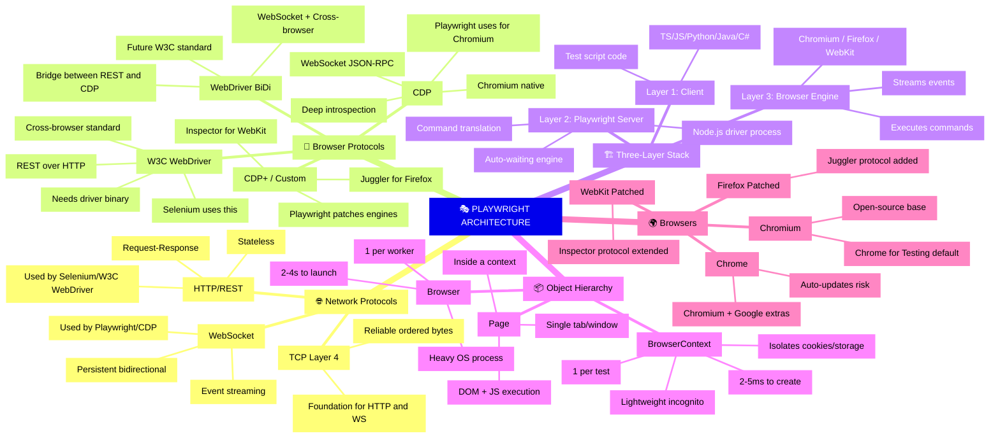
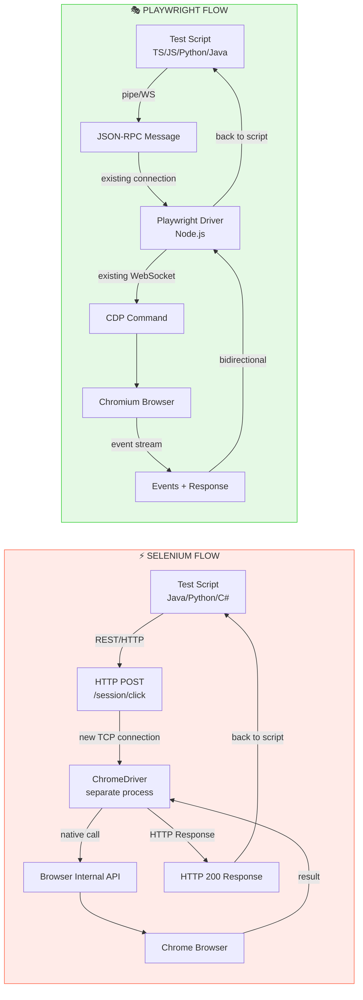
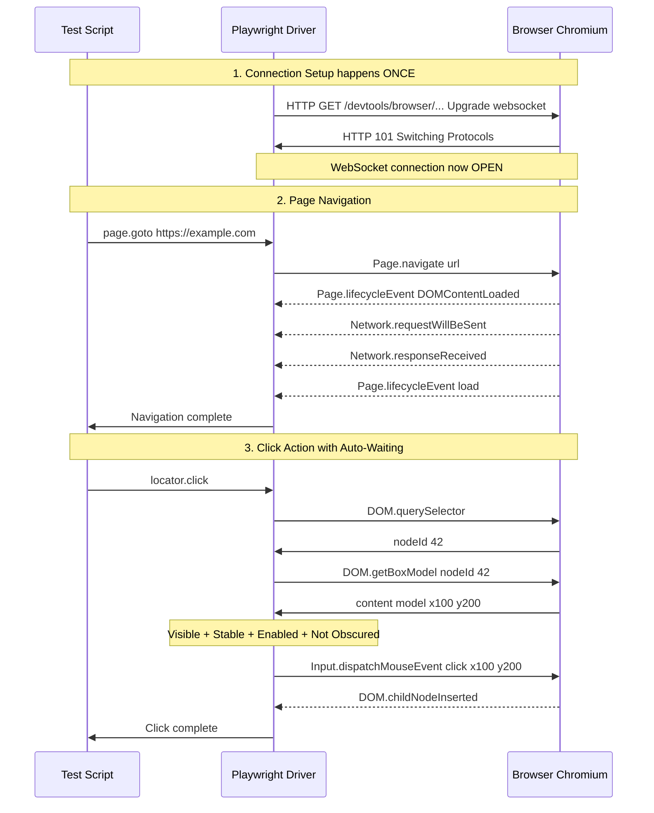
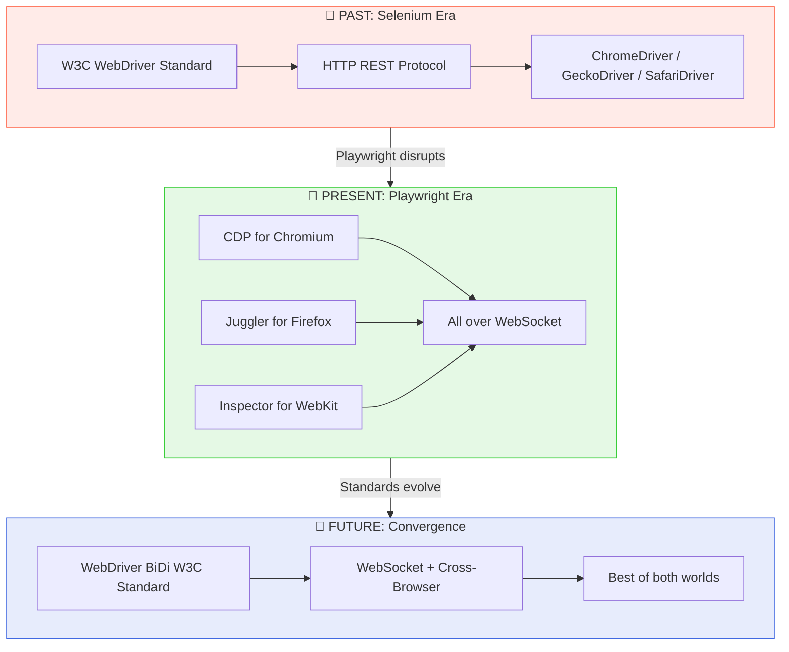

# 230 — Playwright Architecture Deep Dive : Protocols, Internals & The Complete Picture

> **One-Paragraph Elevator Pitch:** Playwright's revolutionary speed and reliability stem from a fundamentally different architectural philosophy—instead of talking to browsers through a slow, synchronous HTTP REST middleman (like Selenium's W3C WebDriver), Playwright opens a **single persistent WebSocket pipe** speaking the browser's native debugging protocol (CDP for Chromium, custom patches for Firefox/WebKit), enabling real-time bidirectional event streaming, zero-latency command dispatch, and features like auto-waiting that are architecturally impossible in REST-based tools.

---

## Table of Contents
1. [The Network Protocol Stack — From TCP to Browser Automation](#1-the-network-protocol-stack)
2. [Selenium Architecture vs Playwright Architecture](#2-selenium-architecture-vs-playwright-architecture)
3. [The Protocols: W3C WebDriver, REST API, CDP, CDP+, WebDriver BiDi](#3-the-protocols)
4. [Playwright's Three-Layer Internal Architecture](#4-playwrights-three-layer-internal-architecture)
5. [The WebSocket Connection — How Playwright Actually Talks to Browsers](#5-the-websocket-connection)
6. [Browser → Context → Page Object Hierarchy](#6-browser--context--page-object-hierarchy)
7. [Chromium vs Chrome — The Critical Difference](#7-chromium-vs-chrome)
8. [Playwright Server & Remote Execution](#8-playwright-server--remote-execution)
9. [Mind Map Flowcharts](#9-mind-map-flowcharts)
10. [Interview-Ready Q&A](#10-interview-ready-qa)
11. [Quick Reference Comparison Table](#11-quick-reference-comparison-table)

---

## 1. The Network Protocol Stack

> Understanding the **network layers** is essential to grasping *why* Playwright is fundamentally faster than Selenium.

### 1.1 The OSI/TCP-IP Stack Relevant to Browser Automation

```
┌─────────────────────────────────────────────────────────────────┐
│  Layer 7 — APPLICATION                                          │
│  ┌───────────────────────────────────────────────────────────┐  │
│  │  CDP (Chrome DevTools Protocol)   — JSON-RPC over WS     │  │
│  │  W3C WebDriver                    — REST over HTTP        │  │
│  │  WebDriver BiDi                   — JSON-RPC over WS     │  │
│  └───────────────────────────────────────────────────────────┘  │
├─────────────────────────────────────────────────────────────────┤
│  Layer 6/5 — SESSION / PRESENTATION                             │
│  ┌───────────────────────────────────────────────────────────┐  │
│  │  WebSocket (ws://) / HTTP (http://)                       │  │
│  │  TLS/SSL for encrypted variants (wss://, https://)        │  │
│  └───────────────────────────────────────────────────────────┘  │
├─────────────────────────────────────────────────────────────────┤
│  Layer 4 — TRANSPORT                                            │
│  ┌───────────────────────────────────────────────────────────┐  │
│  │  TCP (Transmission Control Protocol)                      │  │
│  │  → Reliable, ordered, connection-oriented byte stream     │  │
│  │  → Both HTTP and WebSocket ride on TCP                    │  │
│  └───────────────────────────────────────────────────────────┘  │
├─────────────────────────────────────────────────────────────────┤
│  Layer 3 — NETWORK                                              │
│  │  IP (Internet Protocol)                                   │  │
├─────────────────────────────────────────────────────────────────┤
│  Layer 1-2 — PHYSICAL / DATA LINK                               │
│  │  Ethernet, Wi-Fi, etc.                                    │  │
└─────────────────────────────────────────────────────────────────┘
```

### 1.2 TCP — The Foundation

**TCP (Transmission Control Protocol)** is the transport layer that both HTTP and WebSocket are built on.

| Property | What It Means |
| :--- | :--- |
| **Connection-Oriented** | A 3-way handshake (SYN → SYN-ACK → ACK) establishes the connection before any data flows |
| **Reliable** | Lost packets are automatically retransmitted; data arrives intact |
| **Ordered** | Packets arrive in the exact sequence they were sent |
| **Stream-Based** | TCP sees data as a continuous stream of bytes—no concept of "messages" |

> **Key Insight:** Both REST APIs (HTTP) and WebSockets ultimately use TCP. The difference is in *how* they utilize the TCP connection.

### 1.3 HTTP (REST API) vs WebSocket — The Core Difference

```
HTTP REST (What Selenium Uses):
─────────────────────────────────────────────────────────
Client                                    Server
  │── POST /session/123/element ──────────▶│
  │◀── 200 OK { "elementId": "abc" } ─────│  ← Connection CLOSED
  │                                        │
  │── POST /session/123/element/abc/click ▶│
  │◀── 200 OK ────────────────────────────│  ← Connection CLOSED again
  │                                        │
  ⚡ Each command = new TCP handshake + HTTP overhead
  ⚡ Server CANNOT push data to client


WebSocket (What Playwright Uses):
─────────────────────────────────────────────────────────
Client                                    Server
  │── GET /ws (Upgrade: websocket) ───────▶│
  │◀── 101 Switching Protocols ────────────│  ← Connection STAYS OPEN
  │                                        │
  │══ {"method":"click","id":1} ══════════▶│
  │◀══ {"id":1,"result":"ok"} ════════════│  ← Same connection!
  │◀══ {"event":"domChanged"} ════════════│  ← Server PUSHES event!
  │◀══ {"event":"networkIdle"} ═══════════│  ← Another push!
  │══ {"method":"getText","id":2} ════════▶│
  │◀══ {"id":2,"result":"Hello"} ═════════│
  │                                        │
  ⚡ Single persistent TCP connection for ALL communication
  ⚡ Server CAN push events in real-time (bidirectional!)
```

> **💡 The "Aha" Insight:**  
> Playwright's auto-waiting is **architecturally impossible** in a pure REST model. Auto-waiting requires the browser to *push* DOM mutation events, network idle signals, and rendering completion events to Playwright in real-time. In Selenium's REST model, the client must *poll* the server repeatedly ("Are we there yet? Are we there yet?"). In Playwright's WebSocket model, the browser *tells* Playwright "I'm ready now."

---

## 2. Selenium Architecture vs Playwright Architecture

### 2.1 Selenium's Architecture (W3C WebDriver Protocol)

```
┌──────────────────────────────────────────────────────────┐
│                   SELENIUM ARCHITECTURE                   │
│                                                          │
│  ┌──────────────┐     HTTP/REST      ┌──────────────┐   │
│  │  Test Script  │ ───────────────▶  │ Browser       │   │
│  │  (Java/       │    (W3C WebDriver) │ Driver        │   │
│  │   Python/     │ ◀─────────────── │ (chromedriver/ │   │
│  │   C#/JS)      │     JSON Response  │  geckodriver/  │   │
│  └──────────────┘                    │  safaridriver) │   │
│                                      └──────┬───────┘   │
│                                             │            │
│                                    Native Browser API    │
│                                             │            │
│                                      ┌──────▼───────┐   │
│                                      │   Browser     │   │
│                                      │ (Chrome/FF/   │   │
│                                      │  Safari/Edge) │   │
│                                      └──────────────┘   │
│                                                          │
│  ⚠ THREE separate processes                             │
│  ⚠ HTTP round-trip for EVERY command                    │
│  ⚠ Driver binary MUST match browser version             │
│  ⚠ Stateless — no event streaming                       │
└──────────────────────────────────────────────────────────┘
```

**How a single `click()` works in Selenium:**
1. Test script serializes command → `POST /session/{id}/element/{elementId}/click`
2. New TCP handshake (or reused keep-alive connection)
3. HTTP request travels to ChromeDriver (a separate OS process)
4. ChromeDriver translates W3C command → browser-specific internal API call
5. Browser executes click
6. Browser returns result → ChromeDriver
7. ChromeDriver serializes JSON response → HTTP 200
8. Response travels back to test script
9. **Total round-trip: ~5-20ms per command**

### 2.2 Playwright's Architecture (CDP / WebSocket)

```
┌───────────────────────────────────────────────────────────┐
│                  PLAYWRIGHT ARCHITECTURE                   │
│                                                           │
│  ┌──────────────┐                    ┌─────────────────┐ │
│  │  Test Script  │                    │ Playwright       │ │
│  │  (TypeScript/ │   JSON-RPC over    │ Server / Driver  │ │
│  │   Python/     │   Local Pipe or    │ (Node.js)        │ │
│  │   Java/C#)    │   WebSocket        │                  │ │
│  └──────┬───────┘                    └────────┬────────┘ │
│         │                                     │          │
│         │          Unified Channel             │          │
│         └──────────────────────────────────────┘          │
│                          │                                │
│              Persistent WebSocket / Pipe                  │
│              (Bidirectional, Event-Driven)                 │
│                          │                                │
│         ┌────────────────┼───────────────────┐            │
│         │                │                   │            │
│    ┌────▼────┐    ┌──────▼──────┐    ┌──────▼──────┐     │
│    │Chromium  │    │  Firefox    │    │   WebKit    │     │
│    │(via CDP) │    │(via custom  │    │(via custom  │     │
│    │          │    │ protocol)   │    │ protocol)   │     │
│    └─────────┘    └─────────────┘    └─────────────┘     │
│                                                           │
│  ✅ DIRECT connection — no middleman driver binary        │
│  ✅ Single persistent WebSocket for ALL commands          │
│  ✅ Browser pushes events in real-time                    │
│  ✅ Playwright ships its own browser binaries             │
└───────────────────────────────────────────────────────────┘
```

**How a single `click()` works in Playwright:**
1. Test script calls `locator.click()` → Playwright client marshals a JSON-RPC message
2. Message travels through the **already-open** WebSocket/pipe (zero connection setup)
3. Playwright driver sends CDP command to browser over the **already-open** debugging channel
4. Browser executes click **and** streams back DOM events, rendering events
5. Playwright's auto-waiting engine listens to the event stream to confirm actionability
6. Result returns through the same open channel
7. **Total round-trip: ~0.5-2ms per command**

---

## 3. The Protocols

### 3.1 W3C WebDriver Protocol

| Property | Detail |
| :--- | :--- |
| **Full Name** | W3C WebDriver (W3C Recommendation) |
| **Transport** | HTTP REST (JSON over HTTP) |
| **Directionality** | Unidirectional (Client → Server → Client, request-response only) |
| **Standardization** | W3C official standard — all major browsers implement it |
| **Used By** | Selenium, WebDriverIO (legacy mode) |
| **Strengths** | Cross-browser standard, mature, widely supported |
| **Weaknesses** | Synchronous, no event streaming, requires separate driver binaries |

```
W3C WebDriver Request Anatomy:
───────────────────────────────
POST /session HTTP/1.1
Host: localhost:9515
Content-Type: application/json

{
  "capabilities": {
    "browserName": "chrome",
    "goog:chromeOptions": { "args": ["--headless"] }
  }
}

Response:
HTTP/1.1 200 OK
{ "value": { "sessionId": "abc-123", "capabilities": { ... } } }
```

### 3.2 REST API — The Transport Mechanism for WebDriver

**REST (Representational State Transfer)** is an architectural style for HTTP-based APIs:

| REST Principle | How WebDriver Uses It |
| :--- | :--- |
| **Resources as URLs** | `/session/{id}`, `/session/{id}/element/{id}`, `/session/{id}/url` |
| **HTTP Verbs** | `POST` (create/action), `GET` (read), `DELETE` (close) |
| **Stateless** | Each request carries all needed context (session ID) |
| **JSON Payloads** | Commands and responses are JSON-encoded |

> **Key Insight:** REST was designed for web APIs (like GitHub API, Twitter API) where occasional latency is acceptable. It was never designed for the real-time, sub-millisecond command loop needed by browser automation. This is the fundamental mismatch that makes Selenium slower.

### 3.3 CDP — Chrome DevTools Protocol

| Property | Detail |
| :--- | :--- |
| **Full Name** | Chrome DevTools Protocol |
| **Transport** | WebSocket (persistent, bidirectional) |
| **Directionality** | **Bidirectional** — browser pushes events to client |
| **Standardization** | NOT a W3C standard — Chromium/Google specific |
| **Used By** | Playwright (for Chromium), Puppeteer, Chrome DevTools |
| **Port** | Typically exposed on `localhost:9222` (remote debugging) |
| **Message Format** | JSON-RPC 2.0 over WebSocket frames |

```
CDP Message Anatomy:
───────────────────────────────
Command (Client → Browser):
{
  "id": 1,
  "method": "Runtime.evaluate",
  "params": { "expression": "document.title" }
}

Response (Browser → Client):
{
  "id": 1,
  "result": { "result": { "type": "string", "value": "My Page" } }
}

Event (Browser → Client, UNSOLICITED PUSH!):
{
  "method": "Network.requestWillBeSent",
  "params": {
    "requestId": "req-42",
    "request": { "url": "https://api.example.com/data", "method": "GET" }
  }
}
```

**CDP Domains (Key ones Playwright uses):**

| CDP Domain | What It Controls |
| :--- | :--- |
| `Page` | Navigation, lifecycle events, screenshots |
| `DOM` | DOM tree inspection and manipulation |
| `Runtime` | JavaScript execution in the page |
| `Network` | Request interception, response modification |
| `Input` | Mouse clicks, keyboard events, touch simulation |
| `Emulation` | Viewport, geolocation, device simulation |
| `Target` | Browser contexts, new pages/tabs/workers |
| `Performance` | Performance metrics collection |
| `Tracing` | Timeline/profiling trace collection |

### 3.4 CDP+ — Playwright's Extended Protocol for Non-Chromium Browsers

> **This is a concept that trips up even experienced engineers.** CDP is Chromium-specific. Firefox and WebKit do NOT natively support CDP. So how does Playwright achieve a **unified API** across all three engines?

**The answer: Playwright patches the browser engines.**

```
┌──────────────────────────────────────────────────────────────┐
│               HOW PLAYWRIGHT HANDLES EACH ENGINE             │
│                                                              │
│  ┌────────────┐                                              │
│  │  Chromium   │ ← Uses NATIVE CDP protocol                  │
│  │             │   (no patches needed for protocol layer)     │
│  └────────────┘                                              │
│                                                              │
│  ┌────────────┐                                              │
│  │  Firefox    │ ← Playwright applies PATCHES to Firefox      │
│  │  (Patched)  │   source code that expose a CDP-like         │
│  │             │   WebSocket debugging interface              │
│  │             │   (Juggler protocol — custom Playwright      │
│  │             │    protocol built into patched Firefox)       │
│  └────────────┘                                              │
│                                                              │
│  ┌────────────┐                                              │
│  │  WebKit     │ ← Playwright applies PATCHES to WebKit       │
│  │  (Patched)  │   source code that expose a similar          │
│  │             │   WebSocket debugging interface              │
│  │             │   (WebKit Inspector Protocol, extended)      │
│  └────────────┘                                              │
│                                                              │
│  Result: ALL three engines speak a WebSocket-based protocol  │
│  that Playwright's driver can communicate with uniformly.     │
└──────────────────────────────────────────────────────────────┘
```

**Why this matters:**
- Playwright **does NOT use W3C WebDriver** for Firefox/WebKit (unlike Selenium)
- Playwright **does NOT use geckodriver or safaridriver**
- Playwright ships its **own patched builds** of Firefox and WebKit
- This is why `npx playwright install` downloads browser binaries—they are **Playwright-specific patched versions**

> **Interview Gem:** "Playwright achieves cross-browser uniformity NOT by using a cross-browser standard (W3C), but by patching each browser engine to speak a Playwright-compatible WebSocket debugging protocol. This gives Playwright deeper control than any standard-based approach."

### 3.5 WebDriver BiDi — The Future Standard

WebDriver BiDi (Bidirectional) is the W3C's attempt to modernize the WebDriver standard by adding WebSocket-based bidirectional communication:

| Property | WebDriver Classic | WebDriver BiDi |
| :--- | :--- | :--- |
| **Transport** | HTTP REST | **WebSocket** |
| **Direction** | Unidirectional | **Bidirectional** |
| **Events** | No event streaming | Real-time event subscription |
| **Speed** | Slower (per-command overhead) | Faster (persistent connection) |
| **Status** | Stable, widely deployed | Emerging standard (in progress) |
| **Goal** | — | Combine W3C cross-browser reach with CDP-like performance |

> **The Bridge:** Selenium 4+ is adopting WebDriver BiDi to close the performance gap with Playwright. However, the standard is still evolving and doesn't yet cover all the capabilities that CDP provides.

---

## 4. Playwright's Three-Layer Internal Architecture

```
┌────────────────────────────────────────────────────────────────┐
│                                                                │
│  LAYER 1 — CLIENT (Your Test Code)                             │
│  ┌──────────────────────────────────────────────────────────┐  │
│  │  import { test, expect } from '@playwright/test';        │  │
│  │  test('example', async ({ page }) => {                   │  │
│  │    await page.goto('https://example.com');                │  │
│  │    await page.getByRole('button').click();                │  │
│  │  });                                                      │  │
│  │                                                          │  │
│  │  ► Language: TypeScript / JavaScript / Python / Java / C# │  │
│  │  ► Generates JSON-RPC commands                            │  │
│  │  ► Receives results and events                            │  │
│  └──────────────────────────────────────────────────────────┘  │
│                          │                                     │
│                    JSON-RPC over                                │
│                  Local Pipe / WebSocket                         │
│                          │                                     │
│  LAYER 2 — PLAYWRIGHT SERVER (Driver Process)                  │
│  ┌──────────────────────────────────────────────────────────┐  │
│  │  Node.js process that:                                    │  │
│  │  ► Receives high-level commands from client               │  │
│  │  ► Translates them into browser-specific protocol msgs    │  │
│  │  ► Manages browser lifecycle (launch, close)              │  │
│  │  ► Implements auto-waiting logic                          │  │
│  │  ► Manages BrowserContexts and Pages                      │  │
│  │  ► Routes events from browser back to client              │  │
│  │                                                          │  │
│  │  For Python/Java/C#: runs as separate process             │  │
│  │  For Node.js: runs in-process (same Node.js instance)     │  │
│  └──────────────────────────────────────────────────────────┘  │
│                          │                                     │
│               Native Browser Protocol                          │
│          (CDP / Juggler / WebKit Inspector)                     │
│              over WebSocket or Pipe                             │
│                          │                                     │
│  LAYER 3 — BROWSER ENGINE                                      │
│  ┌──────────────────────────────────────────────────────────┐  │
│  │  Actual browser process:                                  │  │
│  │  ► Chromium (Chrome for Testing) — native CDP             │  │
│  │  ► Firefox (patched) — Juggler protocol                   │  │
│  │  ► WebKit (patched) — Inspector protocol                  │  │
│  │                                                          │  │
│  │  Renders pages, executes JavaScript, handles network,     │  │
│  │  fires DOM events, paints pixels                          │  │
│  └──────────────────────────────────────────────────────────┘  │
│                                                                │
└────────────────────────────────────────────────────────────────┘
```

### 4.1 Communication Channels by Language

| Client Language | Client ↔ Driver Channel | Driver ↔ Browser Channel |
| :--- | :--- | :--- |
| **Node.js / TypeScript** | In-process (same Node.js runtime) | WebSocket or Pipe to browser |
| **Python** | JSON-RPC over Subprocess Pipe | WebSocket or Pipe to browser |
| **Java** | JSON-RPC over Subprocess Pipe | WebSocket or Pipe to browser |
| **C# (.NET)** | JSON-RPC over Subprocess Pipe | WebSocket or Pipe to browser |

> **Key Insight for Non-Node Languages:** When you use Playwright in Python/Java/C#, a **hidden Node.js process** (`playwright-core/cli.js`) is spawned as a subprocess. Your Python/Java/C# client communicates with this Node.js driver over a local pipe. The Node.js driver then communicates with the browser. This is why Playwright always requires Node.js installed, even for Python/Java/C# bindings.

---

## 5. The WebSocket Connection

### 5.1 How the WebSocket Handshake Works

```
Step 1: HTTP Upgrade Request
────────────────────────────
GET /devtools/browser/abc-123 HTTP/1.1
Host: localhost:9222
Upgrade: websocket
Connection: Upgrade
Sec-WebSocket-Key: dGhlIHNhbXBsZSBub25jZQ==
Sec-WebSocket-Version: 13

Step 2: Server Accepts
────────────────────────────
HTTP/1.1 101 Switching Protocols
Upgrade: websocket
Connection: Upgrade
Sec-WebSocket-Accept: s3pPLMBiTxaQ9kYGzzhZRbK+xOo=

Step 3: Connection is now WebSocket
────────────────────────────
┌──────────────────────────────────────────────────────┐
│  PERSISTENT BIDIRECTIONAL CHANNEL NOW OPEN           │
│                                                      │
│  ◀═══════════ Commands flow both ways ══════════▶   │
│                                                      │
│  No more HTTP overhead                               │
│  No more TCP handshakes for each message             │
│  Browser can PUSH events at any time                 │
└──────────────────────────────────────────────────────┘
```

### 5.2 What Flows Through the WebSocket

```
Playwright                                         Browser
    │                                                 │
    │──── Page.navigate("https://example.com") ──────▶│
    │◀─── Page.lifecycleEvent("DOMContentLoaded") ────│  ← PUSH
    │◀─── Network.requestWillBeSent(main.js) ─────────│  ← PUSH
    │◀─── Network.responseReceived(main.js, 200) ─────│  ← PUSH
    │◀─── Page.lifecycleEvent("load") ────────────────│  ← PUSH
    │◀─── Page.lifecycleEvent("networkidle") ─────────│  ← PUSH
    │                                                 │
    │──── DOM.querySelector("button#submit") ────────▶│
    │◀─── {nodeId: 42} ──────────────────────────────│
    │                                                 │
    │──── Input.dispatchMouseEvent(click, x, y) ─────▶│
    │◀─── DOM.childNodeInserted (toast appeared) ─────│  ← PUSH
    │◀─── Network.requestWillBeSent(api/submit) ──────│  ← PUSH
    │◀─── Network.responseReceived(api/submit,200) ───│  ← PUSH
    │                                                 │
```

> **💡 This diagram is the KEY to understanding why Playwright has auto-waiting.** The browser is continuously streaming events. Playwright's engine listens to these events and knows *exactly* when the DOM is ready, when the network is idle, when an element is visible and stable.

---

## 6. Browser → Context → Page Object Hierarchy

### 6.1 The Complete Hierarchy

```
┌─────────────────────────────────────────────────────────────────┐
│  PLAYWRIGHT TEST RUNNER                                         │
│  ┌───────────────────────────────────────────────────────────┐  │
│  │  playwright.config.ts                                     │  │
│  │  ├── projects: [Chromium, Firefox, WebKit]                │  │
│  │  ├── workers: 4 (parallel OS processes)                   │  │
│  │  └── fullyParallel: true                                  │  │
│  └───────────────────────────────────────────────────────────┘  │
│                                                                 │
│  ┌──────────────┐ ┌──────────────┐ ┌──────────────┐           │
│  │  Worker 1     │ │  Worker 2     │ │  Worker 3     │ ...      │
│  │  (OS Process) │ │  (OS Process) │ │  (OS Process) │          │
│  └──────┬───────┘ └──────┬───────┘ └──────┬───────┘           │
│         │                │                │                    │
│  ┌──────▼───────┐ ┌──────▼───────┐ ┌──────▼───────┐           │
│  │  Browser      │ │  Browser      │ │  Browser      │          │
│  │  (1 per       │ │  (1 per       │ │  (1 per       │          │
│  │   worker)     │ │   worker)     │ │   worker)     │          │
│  │               │ │               │ │               │          │
│  │  ┌─────────┐  │ │  ┌─────────┐  │ │  ┌─────────┐  │          │
│  │  │Context 1│  │ │  │Context 3│  │ │  │Context 5│  │          │
│  │  │(Test A) │  │ │  │(Test C) │  │ │  │(Test E) │  │          │
│  │  │ ┌─────┐ │  │ │  │ ┌─────┐ │  │ │  │ ┌─────┐ │  │          │
│  │  │ │Page │ │  │ │  │ │Page │ │  │ │  │ │Page │ │  │          │
│  │  │ └─────┘ │  │ │  │ └─────┘ │  │ │  │ └─────┘ │  │          │
│  │  └─────────┘  │ │  └─────────┘  │ │  └─────────┘  │          │
│  │               │ │               │ │               │          │
│  │  ┌─────────┐  │ │  ┌─────────┐  │ │  ┌─────────┐  │          │
│  │  │Context 2│  │ │  │Context 4│  │ │  │Context 6│  │          │
│  │  │(Test B) │  │ │  │(Test D) │  │ │  │(Test F) │  │          │
│  │  │ ┌─────┐ │  │ │  │ ┌─────┐ │  │ │  │ ┌─────┐ │  │          │
│  │  │ │Page │ │  │ │  │ │Page │ │  │ │  │ │Page │ │  │          │
│  │  │ └─────┘ │  │ │  │ └─────┘ │  │ │  │ └─────┘ │  │          │
│  │  └─────────┘  │ │  └─────────┘  │ │  └─────────┘  │          │
│  └──────────────┘ └──────────────┘ └──────────────┘           │
└─────────────────────────────────────────────────────────────────┘
```

### 6.2 What Each Level Owns

| Entity | What It Is | Lifecycle Cost | What It Isolates |
| :--- | :--- | :--- | :--- |
| **Browser** | A single OS-level browser process (e.g., `chromium.launch()`) | **Heavy** (~2-4 seconds to launch) | Process memory, GPU process |
| **BrowserContext** | An in-memory incognito-like session inside the browser | **Ultralight** (~2-5 ms to create!) | Cookies, localStorage, sessionStorage, IndexedDB, cache, service workers |
| **Page** | A single browser tab/window inside a context | **Light** (~10-50 ms) | DOM, JavaScript execution, navigation state |

### 6.3 Why BrowserContext Is Playwright's Secret Weapon

```typescript
// Instead of launching a NEW browser for each test (slow!):
// ❌ const browser = await chromium.launch();  // 2-4 seconds EACH TIME

// Playwright creates a new CONTEXT for each test (instant!):
// ✅ const context = await browser.newContext();  // 2-5 milliseconds

// This is what the test runner does automatically:
test('test A', async ({ page }) => {
  // page lives inside a fresh, isolated BrowserContext
  // → clean cookies, clean storage, clean cache
  // → created in ~5ms, NOT 2-4 seconds
});
```

> **Interview Answer:** "The reason Playwright tests are 10x faster than Selenium is NOT just the WebSocket protocol. It's the combination of (1) WebSocket for zero-latency commands AND (2) lightweight BrowserContext isolation that avoids the need to restart the entire browser process for each test."

---

## 7. Chromium vs Chrome

### 7.1 The Relationship

```
┌──────────────────────────────────────────────────────────────┐
│                                                              │
│  CHROMIUM (Open-Source Project)                              │
│  ┌──────────────────────────────────────────────────────┐    │
│  │  Core rendering engine (Blink)                       │    │
│  │  V8 JavaScript engine                                │    │
│  │  Network stack                                        │    │
│  │  Multi-process architecture                           │    │
│  │  DevTools Protocol (CDP)                              │    │
│  │  Extensions API                                       │    │
│  │  ~28 million lines of code (open source)              │    │
│  └──────────────────────────────────────────────────────┘    │
│           │                    │                    │         │
│     ┌─────▼─────┐     ┌──────▼──────┐      ┌─────▼──────┐  │
│     │  Google    │     │  Microsoft  │      │  Brave     │  │
│     │  Chrome    │     │  Edge       │      │  Browser   │  │
│     │            │     │             │      │            │  │
│     │ + Google   │     │ + Bing      │      │ + Privacy  │  │
│     │   Account  │     │   Account   │      │   Shield   │  │
│     │ + Sync     │     │ + Sidebar   │      │ + Ad Block │  │
│     │ + Widevine │     │ + Copilot   │      │ + Crypto   │  │
│     │ + Auto-    │     │ + Auto-     │      │   Wallet   │  │
│     │   update   │     │   update    │      │            │  │
│     │ + Crash    │     │             │      │            │  │
│     │   reports  │     │             │      │            │  │
│     └───────────┘     └─────────────┘      └────────────┘  │
│                                                              │
└──────────────────────────────────────────────────────────────┘
```

### 7.2 What Playwright Ships (Since v1.57)

| Setting | What You Get | Updates | Best For |
| :--- | :--- | :--- | :--- |
| `chromium` (default) | **Chrome for Testing (CfT)** — a Google-provided, automation-ready Chromium build | Pinned to Playwright version | 99% of testing (deterministic, no auto-update drift) |
| `channel: 'chrome'` | Your **locally installed** Google Chrome | Auto-updates independently | Testing browser extensions, Widevine DRM |
| `channel: 'msedge'` | Your **locally installed** Microsoft Edge | Auto-updates independently | Edge-specific testing |

> **Key Difference:** Chromium is the open-source base. Chrome = Chromium + Google's proprietary additions. For testing, you almost always want the default `chromium` (CfT) because its version is pinned and reproducible.

---

## 8. Playwright Server & Remote Execution

### 8.1 Local vs Remote Architecture

```
LOCAL EXECUTION (Default):
─────────────────────────────────────
┌──────────┐  Pipe   ┌──────────┐  CDP/WS  ┌─────────┐
│  Test     │ ──────▶ │ Driver   │ ────────▶│ Browser │
│  Script   │ ◀────── │ (Node.js)│ ◀────────│         │
└──────────┘         └──────────┘          └─────────┘
     Same machine — all three in one OS


REMOTE EXECUTION (Playwright Server):
─────────────────────────────────────
┌──────────┐  WebSocket   ┌──────────────────────────────────┐
│  Test     │ ════════════▶│  REMOTE HOST                     │
│  Script   │ ◀════════════│  ┌──────────┐  CDP  ┌─────────┐│
│  (Client) │              │  │ Playwright│ ─────▶│ Browser ││
└──────────┘              │  │  Server   │ ◀─────│         ││
  Your machine             │  └──────────┘       └─────────┘│
                           └──────────────────────────────────┘
                             Remote server / cloud / CI
```

### 8.2 Code Examples

```typescript
// ═══════════════════════════════════════
// On the REMOTE HOST (Server Side)
// ═══════════════════════════════════════
import { chromium } from 'playwright';

const browserServer = await chromium.launchServer({
  headless: true,
  port: 3000
});

const wsEndpoint = browserServer.wsEndpoint();
console.log('Connect to:', wsEndpoint);
// Output: ws://localhost:3000/abc123...


// ═══════════════════════════════════════
// On the LOCAL MACHINE (Client Side)
// ═══════════════════════════════════════
import { chromium } from 'playwright';

const browser = await chromium.connect({
  wsEndpoint: 'ws://remote-host:3000/abc123...'
});

const context = await browser.newContext();
const page = await context.newPage();
await page.goto('https://example.com');


// ═══════════════════════════════════════
// Alternative: Connect over CDP (Chromium-only)
// ═══════════════════════════════════════
const browser2 = await chromium.connectOverCDP({
  endpointURL: 'http://localhost:9222'
});
// Lower fidelity — for debugging/attaching to existing Chrome
```

### 8.3 `connect()` vs `connectOverCDP()`

| Method | Protocol | Browsers | Fidelity | Use Case |
| :--- | :--- | :--- | :--- | :--- |
| `chromium.connect()` | Playwright's own protocol | All three | Full | Remote test execution, CI/CD |
| `chromium.connectOverCDP()` | Raw CDP | Chromium only | Lower | Attaching to running Chrome, debugging |

---

## 9. Mind Map Flowcharts

### 9.1 Grand Unified Architecture Mind Map



### 9.2 Selenium vs Playwright — Protocol Flow Comparison



### 9.3 WebSocket API — How Playwright Talks to CDP



### 9.4 Protocol Evolution Timeline



---

## 10. Interview-Ready Q&A

### Q1: What is the fundamental architectural difference between Selenium and Playwright?
**Answer:**  
Selenium uses the **W3C WebDriver protocol**, which is a **REST API over HTTP**. Every command (click, find element, navigate) is a separate HTTP request-response round trip through a mandatory browser driver binary (ChromeDriver/GeckoDriver). This is synchronous, stateless, and introduces latency.

Playwright uses **native browser debugging protocols** (CDP for Chromium, custom Juggler for Firefox, custom Inspector for WebKit) over a **persistent WebSocket connection**. This is bidirectional, event-driven, and zero-latency. The browser can push events to Playwright without being asked, enabling auto-waiting and real-time DOM observation.

### Q2: What is CDP and why is it important?
**Answer:**  
CDP (Chrome DevTools Protocol) is the same protocol that Chrome DevTools uses internally. It operates over WebSocket, uses JSON-RPC 2.0 messaging, and is organized into "domains" (Page, DOM, Network, Runtime, Input, etc.). Playwright leverages CDP to gain **deep, low-level access** to Chromium's internals—far deeper than what W3C WebDriver exposes. This includes network interception, performance tracing, JavaScript coverage, and real-time DOM event streaming.

### Q3: If CDP is Chromium-specific, how does Playwright support Firefox and WebKit?
**Answer:**  
Playwright **patches** the source code of Firefox and WebKit to add their own WebSocket-based debugging protocols:
- **Firefox** gets the **Juggler** protocol — a custom Playwright-specific automation protocol built directly into a patched Firefox build
- **WebKit** gets an extended **WebKit Inspector Protocol**

This is why `npx playwright install` downloads browser binaries—they are Playwright-specific patched versions, NOT the stock Firefox/Safari from the official release channels.

### Q4: What is a WebSocket and how does it differ from HTTP?
**Answer:**  
A WebSocket starts as an HTTP request with an `Upgrade: websocket` header. The server responds with `101 Switching Protocols`, and the underlying TCP connection is **kept open** and repurposed for full-duplex, bidirectional communication. Unlike HTTP (which is request-response and creates overhead per message), WebSocket uses lightweight message framing, allowing both sides to send data independently at any time. Crucially, the server can **push** data to the client without being asked—this is what enables Playwright's auto-waiting.

### Q5: What is the difference between `BrowserContext` and `Browser` in Playwright?
**Answer:**  
A `Browser` is a heavyweight OS process (takes 2-4 seconds to launch). A `BrowserContext` is an ultralight in-memory incognito session inside that browser process (takes ~2-5ms to create). Each context has its own isolated cookies, localStorage, sessionStorage, IndexedDB, and cache. Playwright creates a **fresh context for each test**, providing complete isolation without the cost of restarting the entire browser.

### Q6: What is the difference between Chromium and Chrome?
**Answer:**  
**Chromium** is the open-source browser project. **Google Chrome** is Chromium + Google's proprietary additions (Google account sync, auto-update, Widevine DRM, crash reporting, etc.). Since Playwright v1.57, the default `chromium` channel ships **Chrome for Testing (CfT)**, which is a Google-provided, automation-ready build. Unlike the regular Chrome on your system, CfT's version is pinned to your Playwright version and does not auto-update, ensuring reproducible tests.

### Q7: What is WebDriver BiDi and why does it matter?
**Answer:**  
WebDriver BiDi (Bidirectional) is a new W3C standard that adds **WebSocket-based, bidirectional communication** to the WebDriver specification. It aims to combine the cross-browser standardization of W3C WebDriver with the real-time event-streaming performance of CDP. This is Selenium's path to closing the performance gap with Playwright. However, BiDi is still evolving and doesn't yet cover all CDP capabilities.

### Q8: What is the Playwright Server and when would you use it?
**Answer:**  
The Playwright Server (`browserType.launchServer()`) launches a browser instance and exposes a WebSocket endpoint (`ws://host:port/...`). Remote test scripts can then connect to this endpoint using `browserType.connect({ wsEndpoint })`. This enables:
- **Remote test execution** — tests run on machine A, browser runs on machine B
- **Cloud browser farms** — centralized browser management in CI/CD
- **Resource optimization** — multiple test runners share browser instances

---

## 11. Quick Reference Comparison Table

| Dimension | Selenium (W3C WebDriver) | Playwright (CDP/Custom) |
| :--- | :--- | :--- |
| **Protocol** | HTTP REST (W3C WebDriver) | WebSocket (CDP / Juggler / Inspector) |
| **Transport** | TCP → HTTP | TCP → WebSocket |
| **Communication** | Unidirectional (request-response) | **Bidirectional** (event-driven) |
| **Connection** | New per command (or keep-alive) | **Single persistent connection** |
| **Browser Driver** | Separate binary (chromedriver, geckodriver) | **No separate driver** — built into Playwright |
| **Browser Binaries** | Use system-installed browsers | **Ships own patched browsers** |
| **Auto-Waiting** | ❌ Manual waits / polling | ✅ Built-in (event stream powered) |
| **Event Streaming** | ❌ Must poll | ✅ Real-time push from browser |
| **Multi-Tab** | Limited / no native support | ✅ Full multi-tab, multi-window |
| **Network Interception** | Limited (Selenium 4 + BiDi) | ✅ Deep, route-level interception |
| **Speed (per command)** | ~5-20ms round trip | ~0.5-2ms round trip |
| **Context Isolation** | New browser per test (~2-4s) | New BrowserContext per test (~2-5ms) |
| **Supported Languages** | Java, Python, C#, Ruby, JS | TypeScript/JS, Python, Java, C# |
| **Cross-Browser** | Standard-based (W3C) | Patched browser builds |
| **Standards Compliance** | ✅ W3C standard | ❌ Proprietary protocols |

---

## Summary

**Key Takeaway:** Playwright's architectural advantage is not a single feature—it's a **stack of compounding advantages**:

1. **TCP** provides reliable transport
2. **WebSocket** (over TCP) provides persistent, bidirectional communication
3. **CDP/Custom Protocols** (over WebSocket) provide deep, event-driven browser control
4. **Playwright Server/Driver** translates high-level commands into protocol-specific messages
5. **BrowserContext** provides instant test isolation without browser restart
6. **Patched Browser Builds** ensure cross-engine uniformity without depending on W3C standardization speed

Each layer multiplies the speed and reliability advantage, resulting in an automation tool that is architecturally a generation ahead of the REST-based WebDriver model.
