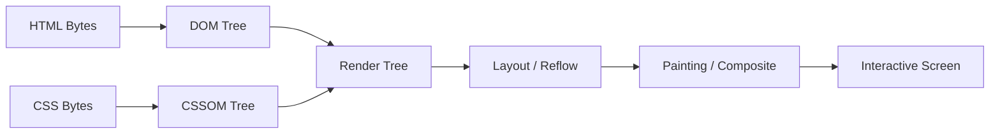
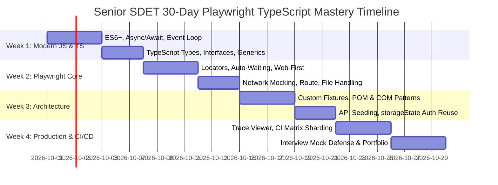

# HTML Elements in QA Automation & The Ultimate Selenium C# to Playwright TypeScript Transition Blueprint

> **Author / Perspective:** 9+ Years Senior QA Automation Specialist / SDET Lead  
> **Target Audience:** Senior Automation Engineers, Lead SDETs, and QA Architects transitioning from legacy stacks (Selenium C#, Java, NUnit/TestNG) to modern engineering (Playwright, TypeScript, Node.js, BiDi, Cloud CI/CD).  
> **Scope:** From zero-level DOM fundamentals to enterprise-grade Playwright framework architecture, staff-level interview defense, and market demand strategy.

---

## Table of Contents
1. [Executive Summary & 9+ YOE Transition Manifesto](#1-executive-summary--9-yoe-transition-manifesto)
2. [HTML & The DOM: Deep Foundations for QA Specialists](#2-html--the-dom-deep-foundations-for-qa-specialists)
3. [Exhaustive HTML Element Encyclopedia for QA Automation](#3-exhaustive-html-element-encyclopedia-for-qa-automation)
   - [3.1 Text Inputs, Passwords, Numbers & Search](#31-text-inputs-passwords-numbers--search)
   - [3.2 Checkboxes, Radio Groups & Toggle Switches](#32-checkboxes-radio-groups--toggle-switches)
   - [3.3 Buttons, Submit Triggers & Semantic Links](#33-buttons-submit-triggers--semantic-links)
   - [3.4 Select Dropdowns & Custom ARIA Listboxes](#34-select-dropdowns--custom-aria-listboxes)
   - [3.5 Textareas, Rich Text Editors & contenteditable](#35-textareas-rich-text-editors--contenteditable)
   - [3.6 File Uploaders & Downloads](#36-file-uploaders--downloads)
   - [3.7 Date, Time & Range Controls](#37-date-time--range-controls)
   - [3.8 Tabular Data & Complex Grids](#38-tabular-data--complex-grids)
   - [3.9 Interactive Dialogs, Modals & Popovers](#39-interactive-dialogs-modals--popovers)
   - [3.10 Embedded Browsing Contexts (iframes)](#310-embedded-browsing-contexts-iframes)
   - [3.11 Shadow DOM & Web Components](#311-shadow-dom--web-components)
   - [3.12 Scalable Vector Graphics (SVG) & Canvas](#312-scalable-vector-graphics-svg--canvas)
   - [3.13 The Accessibility Tree (AOM) & WAI-ARIA](#313-the-accessibility-tree-aom--wai-aria)
4. [Side-by-Side Rosetta Stone: Selenium C# vs Playwright TypeScript](#4-side-by-side-rosetta-stone-selenium-c-vs-playwright-typescript)
5. [The C# to TypeScript Mental Model Bridge](#5-the-c-to-typescript-mental-model-bridge)
6. [Enterprise Framework Blueprint: From Scratch to Production-Grade](#6-enterprise-framework-blueprint-from-scratch-to-production-grade)
7. [The 30-Day Upskilling Roadmap for a 9+ YOE Lead](#7-the-30-day-upskilling-roadmap-for-a-9-yoe-lead)
8. [Staff / Lead Level Interview Preparation & Defense](#8-staff--lead-level-interview-preparation--defense)
9. [Market Demand Analysis & Career Positioning Strategy](#9-market-demand-analysis--career-positioning-strategy)

---

## 1. Executive Summary & 9+ YOE Transition Manifesto

### 1.1 The Senior SDET Mindset: From "Tool Driver" to "Quality Platform Architect"
When you have 9+ years of experience in automation with Selenium and C# (.NET Core, NUnit, SpecFlow, Azure DevOps), you are **not** starting from scratch. You already possess the hardest competencies to acquire in software engineering:
- **Test Strategy & Risk Analysis:** You know *what* to test, *where* tests fail, and how to prevent redundant automation.
- **Enterprise Flakiness Intuition:** You have debugged race conditions, stale DOM states, dynamic AJAX re-renders, and distributed grid bottlenecks.
- **Architecture & Maintainability:** You understand abstraction layers, Page Object Models, test data isolation, and CI/CD pipelines.

The transition from **Selenium C#** to **Playwright TypeScript** is not a downgrade or an abandonment of your experience—it is a **force multiplier**. You are trading a 20-year-old synchronous HTTP REST proxy protocol for an asynchronous, event-driven, WebSocket-powered automation engine built specifically for modern single-page applications (React, Angular, Vue, Next.js).

```
┌────────────────────────────────────────────────────────────────────────┐
│                        THE EVOLUTION PARADIGM                          │
├───────────────────────────────────┬────────────────────────────────────┤
│   LEGACY STACK (Selenium C#)      │   MODERN STACK (Playwright TS)     │
├───────────────────────────────────┼────────────────────────────────────┤
│ • W3C WebDriver (HTTP REST / JSON)│ • Native Chrome DevTools (WebSocket)│
│ • Synchronous, blocking calls     │ • Non-blocking Event-Loop (async)  │
│ • Thread.Sleep / WebDriverWait    │ • Automatic Actionability Waiting  │
│ • Heavy OS Browser Processes      │ • Micro-BrowserContexts (~2ms)    │
│ • Flaky IFrame / Stale Elements   │ • Self-healing, Auto-retrying DOM  │
│ • Third-party Grid (Selenium Grid)│ • Native Parallel Worker Sharding  │
│ • Separate API/Reporting packages │ • Built-in API client, Trace GUI   │
└───────────────────────────────────┴────────────────────────────────────┘
```

---

## 2. HTML & The DOM: Deep Foundations for QA Specialists

To master automation, an SDET must understand how browsers process code before writing a single locator.

### 2.1 The Browser Rendering Pipeline
When a browser receives an HTML document over HTTP/HTTPS, it goes through 5 distinct phases:



1. **DOM Construction:** Raw bytes $\to$ Characters $\to$ Tokens $\to$ Nodes $\to$ **DOM Tree** (Document Object Model).
2. **CSSOM Construction:** CSS rules parsed into style nodes.
3. **Render Tree:** Combines DOM and CSSOM, omitting hidden elements (e.g., `display: none`).
4. **Layout (Reflow):** Computes exact geometry, coordinates, and bounding boxes ($x, y, \text{width}, \text{height}$).
5. **Painting & Compositing:** Rasterizes pixels onto screen layers.

### 2.2 DOM vs Accessibility Tree (AOM)
Modern test automation focuses on **User-Facing Behavior** rather than implementation details.
- **The DOM:** Technical document tree (`<div>`, `<span>`, `<input id="u_0_b">`). Changes frequently with refactors.
- **The AOM (Accessibility Object Model):** The semantic tree exposed to assistive technologies (screen readers). Contains **Roles**, **Names**, **States**, and **Values**.

> **Crucial Rule:** Modern QA frameworks (Playwright) prioritize the Accessibility Tree via `getByRole()` and `getByLabel()`. If an element is accessible to a disabled user via screen reader, it is resilient to code refactoring in automated tests!

---

## 3. Exhaustive HTML Element Encyclopedia for QA Automation

### 3.1 Text Inputs, Passwords, Numbers & Search

#### Anatomy
```html
<!-- Standard Text Input -->
<input type="text" id="username" name="user_name" class="form-control" placeholder="Enter username" maxlength="50" required />

<!-- Password Input (Masked text) -->
<input type="password" id="passwd" autocomplete="current-password" />

<!-- Number Input (Constrained numeric entry) -->
<input type="number" id="quantity" min="1" max="100" step="1" value="5" />
```

#### Automation Mechanics & Quirks
- **Selenium C#:**
  ```csharp
  IWebElement userField = driver.FindElement(By.Id("username"));
  userField.Clear(); // Can fail silently or trigger unexpected blur/focus events
  userField.SendKeys("admin_user");
  ```
- **Playwright TypeScript:**
  ```typescript
  // 1. Accessibility-first (Recommended)
  await page.getByLabel('Enter username').fill('admin_user');
  
  // 2. CSS / ID Fallback
  await page.locator('#username').fill('admin_user');
  ```
- **Deep Gotcha (`fill()` vs `type()` / `pressSequentially()`):**
  - `locator.fill('abc')`: Instantly sets value property and fires `input` and `change` events. It automatically clears previous text!
  - `locator.pressSequentially('abc', { delay: 100 })`: Types character-by-character, firing `keydown`, `keypress`, and `keyup` for autocomplete search bars.

---

### 3.2 Checkboxes, Radio Groups & Toggle Switches

#### Anatomy
```html
<!-- Checkbox (Multi-select Boolean) -->
<label>
  <input type="checkbox" id="terms" name="agreement" value="agreed" />
  I accept the terms and conditions
</label>

<!-- Radio Group (Mutually exclusive selection sharing the same 'name') -->
<fieldset>
  <legend>Select Shipping Speed</legend>
  <label><input type="radio" name="shipping" value="standard" checked /> Standard (3-5 days)</label>
  <label><input type="radio" name="shipping" value="express" /> Express (Overnight)</label>
</fieldset>

<!-- Custom Toggle Switch (CSS-styled DIV or SPAN mimicking a checkbox) -->
<div role="switch" aria-checked="false" tabindex="0" id="dark-mode-toggle">
  <span class="slider"></span>
</div>
```

#### Automation Mechanics
- **Selenium C#:**
  ```csharp
  IWebElement terms = driver.FindElement(By.Id("terms"));
  if (!terms.Selected) {
      terms.Click();
  }
  ```
- **Playwright TypeScript:**
  ```typescript
  // Native semantic check/uncheck with built-in auto-verification
  await page.getByRole('checkbox', { name: 'I accept the terms' }).check();
  await page.getByRole('radio', { name: 'Express (Overnight)' }).check();

  // Custom ARIA switch
  const toggle = page.getByRole('switch');
  await toggle.click();
  await expect(toggle).toHaveAttribute('aria-checked', 'true');
  ```

---

### 3.3 Buttons, Submit Triggers & Semantic Links

#### Anatomy
```html
<!-- Standard Button -->
<button type="button" id="btn-save" class="btn btn-primary">Save Changes</button>

<!-- Submit Button (Triggers form submission) -->
<button type="submit">Submit Order</button>

<!-- Semantic Link (Navigates to URL) -->
<a href="/dashboard" id="nav-dash" target="_blank">Go to Dashboard</a>

<!-- Anti-Pattern: Clickable DIV (Requires ARIA role for accessibility) -->
<div class="custom-btn" onclick="submitData()" role="button" tabindex="0">Click Me</div>
```

#### Automation Mechanics
- **Playwright TypeScript:**
  ```typescript
  // Accessible, strict role matching
  await page.getByRole('button', { name: 'Save Changes' }).click();
  await page.getByRole('link', { name: 'Go to Dashboard' }).click();

  // Modifiers and double clicks
  await page.getByRole('button', { name: 'Delete' }).click({ modifiers: ['Control'] });
  await page.locator('.row-item').dblclick();
  ```

---

### 3.4 Select Dropdowns & Custom ARIA Listboxes

#### Anatomy
```html
<!-- Standard Native HTML Select -->
<select id="country-select" name="country">
  <option value="">Select a Country</option>
  <option value="US">United States</option>
  <option value="IN" selected>India</option>
  <option value="UK">United Kingdom</option>
</select>

<!-- Custom React/Angular Dropdown (Div-based pseudo-select) -->
<div class="dropdown-wrapper">
  <button aria-haspopup="listbox" aria-expanded="false" id="dropdown-trigger">Select Role</button>
  <ul role="listbox" id="roles-list" class="hidden">
    <li role="option" aria-selected="false">Admin</li>
    <li role="option" aria-selected="true">Editor</li>
  </ul>
</div>
```

#### Automation Mechanics
- **Selenium C#:**
  ```csharp
  // Requires specialized OpenQA.Selenium.Support.UI.SelectElement
  SelectElement select = new SelectElement(driver.FindElement(By.Id("country-select")));
  select.SelectByValue("US");
  select.SelectByText("United Kingdom");
  ```
- **Playwright TypeScript:**
  ```typescript
  // Native Select: Single line handles value, label, or index
  await page.locator('#country-select').selectOption('US');
  await page.locator('#country-select').selectOption({ label: 'United Kingdom' });

  // Custom Div/React Dropdown: Two-step user action simulation
  await page.getByRole('button', { name: 'Select Role' }).click();
  await page.getByRole('option', { name: 'Admin' }).click();
  ```

---

### 3.5 Textareas, Rich Text Editors & contenteditable

#### Anatomy
```html
<!-- Native Multi-line Textarea -->
<textarea id="comments" rows="4" cols="50" placeholder="Feedback..."></textarea>

<!-- Rich Text Editor (TinyMCE, Quill, Draft.js, CKEditor) -->
<div id="editor" contenteditable="true" role="textbox" aria-multiline="true">
  <p>Initial rich text content...</p>
</div>
```

#### Automation Mechanics
- **Playwright TypeScript:**
  ```typescript
  // Standard textarea
  await page.locator('#comments').fill('Detailed feedback across multiple lines.\nLine 2.');

  // contenteditable elements
  const richEditor = page.locator('#editor');
  await richEditor.click();
  await richEditor.pressSequentially('Added automated audit note.');
  ```

---

### 3.6 File Uploaders & Downloads

#### Anatomy
```html
<!-- Standard hidden/visible file input -->
<input type="file" id="file-upload" name="resume" accept=".pdf,.docx" multiple />
```

#### Automation Mechanics
- **Selenium C#:**
  ```csharp
  // Sends local file path directly into <input type="file">
  driver.FindElement(By.Id("file-upload")).SendKeys(@"C:\docs\resume.pdf");
  // Cannot handle modern drag-and-drop or custom OS file dialogs without AutoIt/WinAppDriver
  ```
- **Playwright TypeScript:**
  ```typescript
  // 1. Direct file input setter (Handles hidden inputs automatically)
  await page.locator('#file-upload').setInputFiles('tests/fixtures/sample.pdf');

  // 2. Multiple file uploads
  await page.locator('#file-upload').setInputFiles([
    'tests/fixtures/file1.png',
    'tests/fixtures/file2.png'
  ]);

  // 3. Listening for asynchronous File Chooser dialog event
  const fileChooserPromise = page.waitForEvent('filechooser');
  await page.getByRole('button', { name: 'Upload Document' }).click();
  const fileChooser = await fileChooserPromise;
  await fileChooser.setFiles('tests/fixtures/contract.pdf');

  // 4. Verifying File Downloads
  const downloadPromise = page.waitForEvent('download');
  await page.getByRole('button', { name: 'Export CSV' }).click();
  const download = await downloadPromise;
  await download.saveAs('./downloads/' + download.suggestedFilename());
  ```

---

### 3.7 Date, Time & Range Controls

#### Anatomy
```html
<input type="date" id="start-date" value="2026-09-16" min="2026-01-01" max="2026-12-31" />
<input type="time" id="meeting-time" value="14:30" />
<input type="range" id="volume" min="0" max="100" step="5" value="70" />
```

#### Automation Mechanics
```typescript
// Best practice for date/time inputs: Fill ISO format string (YYYY-MM-DD)
await page.locator('#start-date').fill('2026-10-25');
await page.locator('#meeting-time').fill('09:15');

// For range slider: Use evaluate or keyboard arrows
await page.locator('#volume').focus();
await page.keyboard.press('ArrowRight');
```

---

### 3.8 Tabular Data & Complex Grids

#### Anatomy
```html
<table id="users-table" class="data-grid">
  <thead>
    <tr>
      <th>User ID</th>
      <th>Name</th>
      <th>Role</th>
      <th>Actions</th>
    </tr>
  </thead>
  <tbody>
    <tr data-user-id="101">
      <td>101</td>
      <td class="name-cell">Alice Vance</td>
      <td>Administrator</td>
      <td><button class="edit-btn">Edit</button></td>
    </tr>
    <tr data-user-id="102">
      <td>102</td>
      <td class="name-cell">Bob Smith</td>
      <td>Viewer</td>
      <td><button class="edit-btn">Edit</button></td>
    </tr>
  </tbody>
</table>
```

#### Automation Mechanics: Locating inside Dynamic Rows
- **Playwright's `.filter()` Chaining API (Eliminates fragile XPath):**
  ```typescript
  // Find the row containing 'Bob Smith', then click the Edit button inside THAT row
  const bobRow = page.getByRole('row').filter({ hasText: 'Bob Smith' });
  await bobRow.getByRole('button', { name: 'Edit' }).click();

  // Validate tabular cell data without relying on static column indices
  await expect(bobRow.getByRole('cell', { name: 'Viewer' })).toBeVisible();
  ```

---

### 3.9 Interactive Dialogs, Modals & Popovers

#### Anatomy
```html
<!-- Modern HTML5 Dialog Tag -->
<dialog id="confirm-modal" open>
  <h2>Confirm Deletion</h2>
  <p>Are you sure you want to permanently delete this project?</p>
  <button id="cancel-btn">Cancel</button>
  <button id="confirm-btn">Confirm</button>
</dialog>
```

#### Automation Mechanics: Native Browser Dialogs vs HTML Modals
1. **JavaScript Alerts (`window.alert`, `window.confirm`, `window.prompt`):**
   ```typescript
   // Playwright auto-dismisses dialogs by default to avoid hanging!
   // To handle and accept:
   page.on('dialog', async dialog => {
       console.log(`Alert message: ${dialog.message()}`);
       await dialog.accept('Prompt response');
   });
   await page.getByRole('button', { name: 'Trigger Alert' }).click();
   ```
2. **HTML `<dialog>` or Overlay Modals:**
   ```typescript
   const modal = page.locator('#confirm-modal');
   await expect(modal).toBeVisible();
   await modal.getByRole('button', { name: 'Confirm' }).click();
   await expect(modal).toBeHidden();
   ```

---

### 3.10 Embedded Browsing Contexts (iframes)

#### Anatomy
```html
<!-- Primary Document -->
<h1>Parent Application</h1>
<iframe id="payment-frame" src="https://secure.paygate.com/checkout" name="payFrame">
  <!-- Embedded Document (Separate DOM & Origin) -->
  <html>
    <body>
      <input type="text" id="credit-card-num" placeholder="Card Number" />
    </body>
  </html>
</iframe>
```

#### Automation Mechanics
- **Selenium C# (Stateful Context Switching):**
  ```csharp
  // Must switch execution context
  driver.SwitchTo().Frame("payment-frame");
  driver.FindElement(By.Id("credit-card-num")).SendKeys("4111222233334444");
  // Must remember to switch back, or subsequent tests fail!
  driver.SwitchTo().DefaultContent();
  ```
- **Playwright TypeScript (Stateless `frameLocator()` with Deep Auto-Waiting):**
  ```typescript
  // Zero switching back and forth! frameLocator chains naturally.
  const paymentFrame = page.frameLocator('#payment-frame');
  await paymentFrame.getByPlaceholder('Card Number').fill('4111222233334444');

  // Nested iframes (frame inside frame)
  const nestedFrame = page.frameLocator('#parent-frame').frameLocator('#child-frame');
  await nestedFrame.getByRole('button', { name: 'Authorize' }).click();
  ```

---

### 3.11 Shadow DOM & Web Components

#### Anatomy
```html
<user-card>
  #shadow-root (open)
    <style>.title { color: blue; }</style>
    <div class="user-container">
      <span class="name">Raja Priyan</span>
      <button id="msg-btn">Send Message</button>
    </div>
</user-card>
```

#### Automation Mechanics
- **Selenium C#:**
  ```csharp
  // Prior to Selenium 4: Requires raw JavaScript Executor
  IWebElement host = driver.FindElement(By.TagName("user-card"));
  IJavaScriptExecutor js = (IJavaScriptExecutor)driver;
  IWebElement shadowRoot = (IWebElement)js.ExecuteScript("return arguments[0].shadowRoot", host);
  IWebElement btn = shadowRoot.FindElement(By.CssSelector("#msg-btn"));
  btn.Click();
  ```
- **Playwright TypeScript (Native Transparent Piercing):**
  ```typescript
  // Playwright pierces open shadow roots BY DEFAULT in all CSS and role locators!
  // No special syntax or JS executor needed!
  await page.locator('user-card #msg-btn').click();
  await page.getByRole('button', { name: 'Send Message' }).click();
  ```

---

### 3.12 Scalable Vector Graphics (SVG) & Canvas

#### Anatomy
```html
<svg width="24" height="24" viewBox="0 0 24 24" class="icon-close" aria-label="Close dialog">
  <path d="M19 6.41L17.59 5 12 10.59 6.41 5 5 6.41 10.59 12 5 17.59 6.41 19 12 13.41 17.59 19 19 17.59 13.41 12z" />
</svg>
<canvas id="chart-canvas" width="600" height="400"></canvas>
```

#### Automation Mechanics
- **Selenium C#:**
  SVG elements do not belong to HTML namespace (`http://www.w3.org/1999/xhtml`), but rather XML SVG namespace (`http://www.w3.org/2000/svg`). Selenium standard XPath `//svg` fails!
  ```csharp
  // Tortuous XPath required in Selenium
  IWebElement closeBtn = driver.FindElement(By.XPath("//*[name()='svg' and contains(@class,'icon-close')]"));
  closeBtn.Click();
  ```
- **Playwright TypeScript:**
  ```typescript
  // 1. Accessibility label on SVG
  await page.getByLabel('Close dialog').click();

  // 2. Direct CSS selector (Playwright handles SVG namespaces transparently)
  await page.locator('svg.icon-close').click();

  // Canvas interaction: Dispatches real mouse events at calculated coordinates
  const canvas = page.locator('#chart-canvas');
  await canvas.click({ position: { x: 150, y: 75 } });
  ```

---

### 3.13 The Accessibility Tree (AOM) & WAI-ARIA

The **Accessible Rich Internet Applications (WAI-ARIA)** specification bridges HTML with assistive technologies. Playwright leverages ARIA attributes directly for ultra-stable locators:

| ARIA Attribute | Purpose | HTML / ARIA Example | Playwright Selector |
| :--- | :--- | :--- | :--- |
| `role="..."` | Defines element type | `<div role="button">Run</div>` | `page.getByRole('button', { name: 'Run' })` |
| `aria-label="..."` | Explicit accessible string | `<button aria-label="Close"></button>` | `page.getByRole('button', { name: 'Close' })` |
| `aria-labelledby="..."` | References other element ID | `<div aria-labelledby="header-id">` | Resolves text of referenced node |
| `aria-expanded="true/false"` | Accordion/Menu state | `<button aria-expanded="true">` | `await expect(btn).toHaveAttribute('aria-expanded', 'true')` |
| `aria-disabled="true/false"`| Logical disable state | `<div role="button" aria-disabled="true">`| `await expect(btn).toBeDisabled()` |
| `data-testid="..."` | Fallback automation hook | `<div data-testid="cart-badge">3</div>`| `page.getByTestId('cart-badge')` |

---

## 4. Side-by-Side Rosetta Stone: Selenium C# vs Playwright TypeScript

| Automation Feature | Selenium C# (.NET 8) | Playwright TypeScript |
| :--- | :--- | :--- |
| **Driver Instantiation** | `IWebDriver driver = new ChromeDriver();` | `const browser = await chromium.launch();` |
| **Session Isolation** | Starts whole browser process or clears cookies manually | `const context = await browser.newContext();` (~2ms) |
| **Tab/Page Creation** | `driver.SwitchTo().NewWindow(WindowType.Tab);` | `const page = await context.newPage();` |
| **Navigation** | `driver.Navigate().GoToUrl("https://example.com");` | `await page.goto("https://example.com");` |
| **Finding Elements** | `IWebElement el = driver.FindElement(By.Id("sub"));` | `const el = page.getByRole('button', { name: 'Submit' });` |
| **Locating Philosophy** | Eager search (Throws `NoSuchElementException` instantly) | Lazy pointer (Evaluates only when action occurs) |
| **Waiting Strategy** | `WebDriverWait wait = new WebDriverWait(driver, ...);` | **Auto-Waiting** built into every action |
| **Typing Text** | `el.Clear(); el.SendKeys("Raja");` | `await el.fill("Raja");` (Auto-clears + fills) |
| **Dropdown Select** | `new SelectElement(el).SelectByValue("IN");` | `await el.selectOption("IN");` |
| **Checkbox Check** | `if (!cb.Selected) cb.Click();` | `await cb.check();` |
| **IFrame Switch** | `driver.SwitchTo().Frame("id"); ... SwitchTo().DefaultContent();` | `page.frameLocator('#id').locator('button').click();` |
| **Shadow DOM** | `host.GetShadowRoot().FindElement(...)` | Pierces automatically (`page.locator('user-card button')`) |
| **Alert Handling** | `driver.SwitchTo().Alert().Accept();` | `page.on('dialog', d => d.accept());` |
| **Hover** | `new Actions(driver).MoveToElement(el).Perform();`| `await el.hover();` |
| **Drag and Drop** | `new Actions(driver).DragAndDrop(src, tgt).Perform();` | `await src.dragTo(tgt);` |
| **Assertions** | `Assert.That(el.Displayed, Is.True);` (Non-retrying!) | `await expect(el).toBeVisible();` (Web-first retrying!) |
| **API Testing** | Requires separate `HttpClient` / `RestSharp` library | Built-in `request.post()`, `request.get()` fixture |
| **Network Mocking** | Limited / Complex CDP DevTools session wiring | `await page.route('**/api/users', r => r.fulfill({ json }))` |
| **Post-Mortem Debug** | Screenshots upon failure, log files | **Time-Travel Trace Viewer** (DOM, network, console) |

---

## 5. The C# to TypeScript Mental Model Bridge

For an experienced C# engineer, TypeScript is intuitive once the architectural differences in execution runtime are understood.

### 5.1 C# Multithreading vs Node.js Event Loop
- **C# Model:** Multi-threaded OS threads. Tests run on pooled threads (`ThreadLocal<IWebDriver>`). Synchronous calls block the worker thread.
- **Node.js Model:** Single-threaded Event Loop backed by libuv thread pool for I/O. All Playwright calls return `Promise<T>` that must be `await`ed. Commands travel asynchronously over a persistent WebSocket pipe directly to the browser.

```
┌────────────────────────────────────────────────────────────────────────┐
│                        RUNTIME EXECUTION MODEL                         │
├───────────────────────────────────┬────────────────────────────────────┤
│   C# (.NET Common Language Runtime│   TypeScript / Node.js Engine      │
├───────────────────────────────────┼────────────────────────────────────┤
│ Thread 1 [ Worker A - Chrome ]    │   Single OS Thread (Event Loop)    │
│ Thread 2 [ Worker B - Chrome ]    │   ┌─────────────────────────────┐  │
│ Thread 3 [ Worker C - Chrome ]    │   │ Call Stack (JS Execution)   │  │
│                                   │   ├─────────────────────────────┤  │
│ Heavy OS Context Switches         │   │ Microtask Queue (Promises)  │  │
│ High Memory Footprint (~1.5GB/inst│   ├─────────────────────────────┤  │
│                                   │   │ WebSocket I/O to Browsers   │  │
│                                   │   └─────────────────────────────┘  │
│                                   │   Ultra-low memory, zero thread lock│
└───────────────────────────────────┴────────────────────────────────────┘
```

### 5.2 Language Translation Cheat Sheet
```typescript
// C#: namespace Enterprise.Automation.Pages { public class LoginPage { ... } }
// TypeScript (ES Modules):
import { Page, Locator, expect } from '@playwright/test';

// C#: public interface IUserData { string Username { get; set; } }
export interface UserData {
    username: string;
    role: 'Admin' | 'Viewer' | 'Editor'; // Strict Union Types
    age?: number;                         // Optional property
}

// C#: public class LoginPage
export class LoginPage {
    // C#: private readonly IWebDriver _driver;
    private readonly page: Page;
    private readonly usernameInput: Locator;
    private readonly passwordInput: Locator;
    private readonly submitBtn: Locator;

    constructor(page: Page) {
        this.page = page;
        // In Playwright, define locators in constructor (Lazy pointers!)
        this.usernameInput = page.getByLabel('Username');
        this.passwordInput = page.getByLabel('Password');
        this.submitBtn     = page.getByRole('button', { name: 'Log In' });
    }

    // C#: public async Task LoginAsync(string user, string pass)
    async login(user: string, pass: string): Promise<void> {
        await this.usernameInput.fill(user);
        await this.passwordInput.fill(pass);
        await this.submitBtn.click();
    }
}
```

---

## 6. Enterprise Framework Blueprint: From Scratch to Production-Grade

### 6.1 Enterprise Directory Structure
```
playwright-enterprise-framework/
├── .github/
│   └── workflows/
│       └── e2e-ci.yml                 # Matrix execution with shard parallelization
├── config/
│   ├── env.development.json
│   ├── env.staging.json
│   └── env.production.json
├── fixtures/
│   ├── base-fixture.ts                # Custom test.extend with POM & API injection
│   └── auth-fixture.ts                # StorageState generation & cache
├── pages/
│   ├── base.page.ts                   # Abstract Page Object with common assertions
│   ├── login.page.ts
│   ├── dashboard.page.ts
│   └── components/                    # Reusable Component Object Model (COM)
│       ├── navbar.component.ts
│       └── table-grid.component.ts
├── tests/
│   ├── auth/
│   │   └── login.spec.ts
│   ├── billing/
│   │   └── checkout.spec.ts
│   └── api/
│       └── user-service.spec.ts
├── utils/
│   ├── crypto-helper.ts
│   └── test-data-factory.ts
├── .env.example
├── package.json
├── playwright.config.ts               # Central Control Plane
└── tsconfig.json
```

### 6.2 Advanced Custom Fixture (Dependency Injection)
In Selenium C#, you relied on Autofac/Ninject or static BaseTest classes with `[SetUp]`. In Playwright, **Custom Fixtures** provide superior, parallel-safe Dependency Injection:

```typescript
// fixtures/base-fixture.ts
import { test as base, expect } from '@playwright/test';
import { LoginPage } from '../pages/login.page';
import { DashboardPage } from '../pages/dashboard.page';

type EnterpriseFixtures = {
    loginPage: LoginPage;
    dashboardPage: DashboardPage;
    authenticatedUser: void;
};

export const test = base.extend<EnterpriseFixtures>({
    // Automatically instantiate and inject LoginPage
    loginPage: async ({ page }, use) => {
        await use(new LoginPage(page));
    },

    // Automatically instantiate and inject DashboardPage
    dashboardPage: async ({ page }, use) => {
        await use(new DashboardPage(page));
    },

    // Auto-worker fixture for pre-authenticating sessions via API
    authenticatedUser: [async ({ page, request }, use) => {
        // Fast API Login: Bypass UI form to seed session tokens
        const response = await request.post('https://api.myapp.com/v1/auth/login', {
            data: { username: process.env.TEST_USER, password: process.env.TEST_PASSWORD }
        });
        const { token } = await response.json();
        
        // Inject token into BrowserContext localStorage
        await page.addInitScript(t => {
            window.localStorage.setItem('auth_token', t);
        }, token);

        await use();
    }, { auto: true }] // Runs automatically for every test in this suite!
});

export { expect };
```

### 6.3 Declarative Central Control Plane (`playwright.config.ts`)
```typescript
import { defineConfig, devices } from '@playwright/test';
import dotenv from 'dotenv';
import path from 'path';

// Load environment-specific configurations (.env.staging, .env.prod)
dotenv.config({ path: path.resolve(__dirname, 'config', `.env.${process.env.TEST_ENV || 'staging'}`) });

export default defineConfig({
  testDir: './tests',
  fullyParallel: true,                     // Run all tests in parallel across worker processes
  forbidOnly: !!process.env.CI,             // Prevent accidental test.only commits in CI
  retries: process.env.CI ? 2 : 0,          // Auto-retry failing tests in CI
  workers: process.env.CI ? '100%' : '50%', // Scale workers based on hardware cores
  
  reporter: [
    ['html', { outputFolder: 'playwright-report', open: 'never' }],
    ['list'],
    ['json', { outputFile: 'test-results/results.json' }]
  ],

  use: {
    baseURL: process.env.BASE_URL || 'https://staging.myapp.com',
    trace: 'retain-on-failure',             // Capture full DOM, network & video on test failures
    screenshot: 'only-on-failure',
    video: 'retain-on-failure',
    actionTimeout: 10 * 1000,               // Max time for locator actions (10s)
    navigationTimeout: 15 * 1000,           // Max time for page.goto (15s)
  },

  projects: [
    // Setup project for generating global storageState (one UI login for entire suite!)
    {
      name: 'setup',
      testMatch: /.*\.setup\.ts/,
    },
    {
      name: 'Chromium',
      use: { 
        ...devices['Desktop Chrome'],
        storageState: 'playwright/.auth/user.json' // Injected auth state!
      },
      dependencies: ['setup'],
    },
    {
      name: 'Firefox',
      use: { 
        ...devices['Desktop Firefox'],
        storageState: 'playwright/.auth/user.json' 
      },
      dependencies: ['setup'],
    },
    {
      name: 'Mobile Safari',
      use: { 
        ...devices['iPhone 14 Pro'],
        storageState: 'playwright/.auth/user.json' 
      },
      dependencies: ['setup'],
    },
  ],
});
```

---

## 7. The 30-Day Upskilling Roadmap for a 9+ YOE Lead



### Week 1: JavaScript/TypeScript Modern Core
- **Objective:** Shed synchronous C# reflexes and master asynchronous event-driven JavaScript.
- **Key Focus:** Promises, `Promise.all()`, Event Loop phases (Call Stack, Web APIs, Microtask Queue), ES modules (`import/export`), TS Interfaces, Generics, and Union types.
- **Milestone:** Write a standalone Node.js script querying a REST API and parsing JSON with strict TypeScript types without using `any`.

### Week 2: Playwright Engine & Locators
- **Objective:** Master Playwright's locator architecture and auto-waiting guarantees.
- **Key Focus:** `page.getByRole()`, `getByLabel()`, `getByTestId()`, locator `.filter()`, handling shadow roots, nested iframes (`frameLocator`), file uploads, and downloads.
- **Milestone:** Automate an end-to-end multi-step checkout workflow with zero hardcoded `waitForTimeout()` calls.

### Week 3: Enterprise Architecture & Fixtures
- **Objective:** Build an enterprise-grade framework using Playwright's native Dependency Injection.
- **Key Focus:** Replacing `BaseTest` with `test.extend()`, authentication state caching via `storageState.json`, network interception (`page.route()`), and Component Object Models.
- **Milestone:** Implement a test suite where 50 test specs run without logging in through the UI, reusing an API-generated authentication state.

### Week 4: CI/CD, Traces & Staff-Level Interview Defense
- **Objective:** Production hardening, enterprise scaling, and interview mastery.
- **Key Focus:** Playwright Trace Viewer analysis, parallel test sharding across GitHub Actions matrix nodes, Docker containerization, and articulating architectural ROI to VP/Director stakeholders.
- **Milestone:** Configure a GitHub Actions workflow that executes tests across 4 parallel shard machines and aggregates a unified HTML report.

---

## 8. Staff / Lead Level Interview Preparation & Defense

### Q1: "You have 9 years of experience in Selenium C#. Why switch to Playwright TypeScript now, and what are the architectural trade-offs?"
**Senior SDET Answer:**
> *"Selenium revolutionized automated testing through the W3C WebDriver standard, and my 9 years building Selenium C# frameworks taught me rock-solid design patterns, test data architectures, and flakiness prevention. However, Selenium operates over a synchronous HTTP REST JSON wire protocol. Every interaction (`FindElement`, `Click`, `GetText`) requires a distinct HTTP roundtrip between client, driver executable, and browser.*
> 
> *Playwright addresses this at the protocol level. It establishes a single persistent WebSocket connection speaking directly to the browser's native debugging protocol (CDP for Chromium, custom engine bindings for WebKit and Firefox). This architectural difference gives us three critical enterprise advantages:*
> 1. *Auto-Waiting Actionability: Playwright checks visibility, stability, enablement, and event-receiving before dispatching actions, eliminating 95% of custom wait flakiness.*
> 2. *Fast Context Isolation: Rather than launching a new OS browser process for every test (costing 2–4 seconds), Playwright creates incognito `BrowserContext` instances in under 5 milliseconds, enabling thousands of parallel tests on minimal hardware.*
> 3. *Native Bi-Directional Features: Network interception (`page.route`), console log streaming, geolocation emulation, and Time-Travel Traces are first-class primitives.*
> 
> *The tradeoff is that Playwright requires teams to adapt to asynchronous JavaScript/TypeScript paradigms and does not support legacy Internet Explorer or real mobile devices (it uses browser mobile emulation). For modern enterprise web apps, the developer velocity, zero-setup parallelization, and trace diagnostics make Playwright the superior architectural choice."*

---

### Q2: "How does Playwright solve the classic Selenium `StaleElementReferenceException`?"
**Senior SDET Answer:**
> *"In Selenium, `driver.FindElement()` queries the DOM immediately and returns an `IWebElement` reference holding an internal DOM pointer. If an AJAX call, React re-render, or animation occurs between element discovery and interaction, that pointer is invalidated, throwing `StaleElementReferenceException`.*
> 
> *Playwright eliminates this completely through **Lazy Evaluated Locators**. When you declare `const submitBtn = page.getByRole('button', { name: 'Submit' })`, zero network traffic or DOM lookups take place. The locator is merely a descriptive recipe. Only when an action (e.g., `await submitBtn.click()`) is called does Playwright query the live DOM, execute its 5 actionability checks, and dispatch the event. If the DOM re-renders mid-test, Playwright's locator naturally retries against the latest live tree until the action timeout expires."*

---

### Q3: "How do you optimize an enterprise test suite of 2,000 tests that takes 3 hours to run?"
**Senior SDET Answer:**
> *"I implement a multi-layered optimization strategy across four pillars:*
> 1. *Session Authentication Caching (`storageState`): 80% of test runtime is often wasted repeatedly typing credentials into login pages. We log in once during a setup project, dump cookies and local storage tokens into a `storageState.json`, and inject this state into every test worker, shaving 5–8 seconds off every single test.*
> 2. *API-Assisted State Seeding: Instead of clicking through UI setup flows (e.g., creating an organization, adding 5 users, configuring billing), we use Playwright's built-in `request` API fixture to generate preconditions in 50ms, testing only the actual target feature through the UI.*
> 3. *Micro-BrowserContext Parallelism: We ensure every test is strictly atomic and stateless, enabling full parallel execution across all CPU cores.*
> 4. *CI Sharding: Using Playwright's native `--shard=x/y` parameter, we split the 2,000 tests across 10 parallel GitHub Actions runner containers. 2,000 tests running across 10 machines with auth caching drops the runtime from 3 hours down to under 12 minutes."*

---

### Q4: "How do you handle flaky tests in production CI pipelines?"
**Senior SDET Answer:**
> *"I tackle flakiness with a 3-step systemic methodology: Detect, Isolate, and Root-Cause.*
> 1. *Detection & Quarantine: We use Playwright's `retries: 2` in CI to maintain pipeline velocity, but any test that passes on retry is tagged as 'flaky' in our test reporting dashboard (Allure/Datadog) rather than ignored.*
> 2. *Automated Post-Mortem Diagnostics: We configure `trace: 'retain-on-failure'`. When a test fails, Playwright outputs a complete `.zip` trace archive containing the live DOM snapshot at every action, console logs, network payloads, and execution filmstrips. We never have to guess what happened.*
> 3. *Root-Cause Remediation: 90% of flakiness stems from either (a) non-atomic test data collisions, (b) improper assertions checking intermediate loading states, or (c) animations. We replace arbitrary timeouts with web-first assertions (`expect(locator).toHaveText()`), ensure each test creates isolated test data, and disable CSS animations (`page.emulateMedia({ reducedMotion: 'reduce' })`) if necessary."*

---

## 9. Market Demand Analysis & Career Positioning Strategy

### 9.1 Global Market Demand Trends (2025–2027)
- **The Enterprise Migration Wave:** Global enterprises (Fintech, Healthtech, Retail, SaaS) are actively migrating their core end-to-end automation suites from Selenium/Protractor to Playwright.
- **Why TypeScript Leads the Market:** Over 75% of production Playwright implementations use **TypeScript** rather than Python, C#, or Java. Why? Because modern frontend engineering teams write their applications in React, Angular, Vue, and Next.js using TypeScript. Having QA and Frontend developers share the exact same language, linters, and repository enables true **In-Sprint Test Automation** and collective code ownership.
- **Compensation & Role Elevation:** Senior SDETs and QA Architects proficient in Playwright + TypeScript command a **25% to 40% salary premium** over traditional Selenium-only engineers due to their ability to bridge developer tooling, build CI/CD pipelines, and implement contract/component testing.

### 9.2 How to Frame Your 9+ YOE Selenium C# Background on Your Resume & LinkedIn
**Do NOT hide your Selenium C# background.** Position it as an enterprise architectural asset:

```
❌ WEAK / APOLOGETIC POSITIONING:
"Manual QA with 9 years of Selenium C# experience, recently learned Playwright and TypeScript."

✅ POWERFUL / ARCHITECTURAL POSITIONING:
"Lead QA Automation Specialist & SDET with 9+ years architecting scalable enterprise test frameworks 
across Selenium C# and modern Playwright TypeScript. Proven track record reducing CI test execution 
times by 80%, designing resilient micro-context architectures, and bridging frontend developer workflows 
with zero-flakiness quality engineering."
```

### 9.3 Resume High-Impact Bullet Points (Before vs After)

- **Before:** *Automated regression test cases using Selenium WebDriver, C#, and NUnit framework.*
- **After:** *Architected an enterprise-grade Playwright TypeScript test automation framework supporting 1,500+ daily E2E tests, migrating legacy Selenium C# suites to reduce execution cycle times from 2.5 hours to 14 minutes via CI matrix sharding and session storage state reuse.*

- **Before:** *Handled waits, dropdowns, and iframes in web application testing.*
- **After:** *Engineered resilient, accessibility-first locator strategies leveraging WAI-ARIA roles (`getByRole`) and Playwright's auto-waiting actionability engine, achieving a 98.7% first-pass CI reliability rate and completely eliminating stale element exceptions.*

- **Before:** *Used Postman for API testing and Selenium for UI testing.*
- **After:** *Implemented hybrid API-assisted test architectures using Playwright's native `request` context, seeding test preconditions via backend microservices to eliminate redundant UI steps and boost test execution throughput by 4x.*

---

## 10. Summary Checklist for Senior SDET Success

1. **Think in Roles, Not XPaths:** Always locate elements via `getByRole`, `getByLabel`, and `getByTestId`.
2. **Never Add Manual Sleep:** If a test requires `page.waitForTimeout()`, you are writing an anti-pattern. Use web-first retrying assertions (`expect(locator).toBeVisible()`).
3. **Reuse Authentication:** Never log in through the UI for every test. Seed sessions with `storageState` or backend API tokens.
4. **Leverage Traces:** Replace blind console logging with Playwright's Time-Travel Trace Viewer.
5. **Position Your Experience:** Your 9+ years of Selenium experience gave you deep domain authority, testing intuition, and enterprise wisdom. Playwright and TypeScript provide the modern, high-speed engine to execute it at scale.
