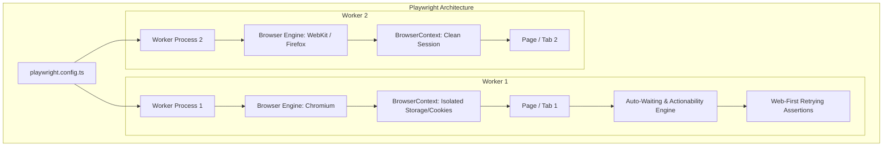

# 29 — Playwright Fundamentals : Complete Interview & Reference Guide

> One-paragraph elevator pitch: Playwright is Microsoft's cutting-edge browser automation and end-to-end testing framework engineered for the modern web. Built around asynchronous event-driven architecture, true multi-browser isolation via BrowserContexts, out-of-the-box auto-waiting, accessibility-first locators (`getByRole`), and time-travel trace debugging, Playwright eliminates test flakiness and delivers ultra-fast parallel execution across Chromium, Firefox, and WebKit.

---

## Table of Contents
1. [Syntax Reference — End to End](#1-syntax-reference--end-to-end)
2. [Built-in Functions & Methods](#2-built-in-functions--methods)
3. [Deep Insights & Gotchas](#3-deep-insights--gotchas)
4. [Interview-Ready Definitions](#4-interview-ready-definitions)
5. [Tricky Interview Questions](#5-tricky-interview-questions)
6. [Controversial Topics & Ongoing Debates](#6-controversial-topics--ongoing-debates)
7. [Quick Reference Cheat Sheet](#7-quick-reference-cheat-sheet)
8. [Memory Map & Visual Flowchart](#8-memory-map--visual-flowchart)
9. [LinkedIn-Style Post](#9-linkedin-style-post)
10. [Summary](#summary)

---

## Overview
Test automation has evolved from synchronous, flaky WebDriver-based polling to asynchronous, event-driven, CDP-powered (Chrome DevTools Protocol) browser architectures. Playwright represents the state-of-the-art in this paradigm. This master guide covers everything from core test fixtures (`page`, `context`, `browser`), declarative test runner configuration, user-facing role locators, web-first retrying assertions, parallel worker isolation, network interception, to time-travel trace analysis.

---

## 1. Syntax Reference — End to End

### 1.1 Test Suite & Lifecycle Hooks Structure
```typescript
import { test, expect } from '@playwright/test';

test.describe('E-Commerce Checkout Flow', () => {
  
  test.beforeAll(async () => {
    // Runs once before all tests in this describe block (e.g. database seeding)
  });

  test.beforeEach(async ({ page }) => {
    // Runs before every test with a clean, isolated BrowserContext & Page
    await page.goto('/login');
  });

  test.afterEach(async ({ page }) => {
    // Cleanup actions after test completes
  });

  test.afterAll(async () => {
    // Runs once after all tests finish
  });

  test('user can add item to cart and complete checkout', async ({ page }) => {
    await page.getByRole('textbox', { name: 'Username' }).fill('standard_user');
    await page.getByRole('textbox', { name: 'Password' }).fill('secret_sauce');
    await page.getByRole('button', { name: 'Login' }).click();

    await expect(page).toHaveURL(/.*inventory/);
    await page.getByRole('button', { name: 'Add to cart' }).first().click();
    
    const cartBadge = page.locator('.shopping_cart_badge');
    await expect(cartBadge).toHaveText('1');
  });

});
```

### 1.2 Configuration Control Plane (`playwright.config.ts`)
```typescript
import { defineConfig, devices } from '@playwright/test';

export default defineConfig({
  testDir: './e2e_tests',
  timeout: 30 * 1000,
  expect: { timeout: 5000 },
  fullyParallel: true,
  forbidOnly: !!process.env.CI,
  retries: process.env.CI ? 2 : 0,
  workers: process.env.CI ? 2 : undefined,
  reporter: [['html', { open: 'never' }], ['list']],

  use: {
    baseURL: 'https://app.thetestingacademy.com',
    trace: 'on-first-retry',
    screenshot: 'only-on-failure',
    video: 'retain-on-failure',
    headless: true,
  },

  projects: [
    { name: 'Chromium', use: { ...devices['Desktop Chrome'] } },
    { name: 'Firefox', use: { ...devices['Desktop Firefox'] } },
    { name: 'WebKit', use: { ...devices['Desktop Safari'] } },
  ],
});
```

### 1.3 Semantic User-Facing Locators
```typescript
// Role-based locators (Highest priority recommendation)
page.getByRole('button', { name: 'Submit' });
page.getByRole('textbox', { name: 'Email address' });
page.getByRole('checkbox', { name: 'Subscribe' });

// Label, Placeholder, and Text Locators
page.getByLabel('Password');
page.getByPlaceholder('Enter your query...');
page.getByText('Welcome back, Admin');

// Test ID Locators (Fallback for untaggable dynamic elements)
page.getByTestId('custom-data-grid-row-1');
```

---

## 2. Built-in Functions & Methods

### 2.1 Essential Page Navigation & Interactions
| Method | Description | Auto-Waits? |
| :--- | :--- | :--- |
| `page.goto(url, options)` | Navigates to target URL and waits for `'load'` by default. | Yes |
| `locator.fill(value)` | Clears text and types new string into input or textarea. | Yes (visible, editable, enabled) |
| `locator.click(options)` | Scrolls into view, waits for stability, and clicks center. | Yes (visible, stable, enabled) |
| `locator.press(key)` | Dispatches real keyboard keydown, keypress, keyup events. | Yes |
| `locator.check() / uncheck()` | Selects or deselects checkbox / radio button. | Yes |
| `locator.selectOption(val)` | Selects matching `<option>` in `<select>` dropdown. | Yes |
| `page.waitForURL(pattern)` | Waits until navigation matches URL string or RegExp. | Yes |

### 2.2 Web-First Retrying Assertions vs Synchronous Matchers
| Web-First Assertion | Synchronous Alternative (Do NOT use) | Purpose |
| :--- | :--- | :--- |
| `await expect(loc).toBeVisible()` | `expect(await loc.isVisible()).toBe(true)` | Retries until element is rendered and visible. |
| `await expect(loc).toHaveText('abc')` | `expect(await loc.innerText()).toBe('abc')` | Retries until inner text matches exactly. |
| `await expect(loc).toBeEnabled()` | `expect(await loc.isEnabled()).toBe(true)` | Retries until button/input loses disabled attribute. |
| `await expect(page).toHaveURL(/dash/)` | `expect(page.url()).toContain('dash')` | Retries until client-side routing completes. |
| `await expect(loc).toHaveCount(5)` | `expect(await loc.count()).toBe(5)` | Retries until dynamic list items finish rendering. |

---

## 3. Deep Insights & Gotchas

### 3.1 The Three-Tier Architecture: Browser -> Context -> Page
- **`Browser`:** A single OS-level browser process (e.g. `chromium.launch()`). Heavyweight to launch, so Playwright reuses a single Browser process across tests in the same worker.
- **`BrowserContext`:** An ultra-lightweight incognito session inside the browser. It owns separate cookies, localStorage, indexedDB, and cache. Instantiated in ~2 milliseconds!
- **`Page`:** A single browser tab or window inside a `BrowserContext`.

```
[ Worker Process ]
       │
   [ Browser ] (1 per worker)
       ├── [ BrowserContext 1 ] (Test 1 - Isolated Cookies/Storage)
       │         └── [ Page 1 ]
       └── [ BrowserContext 2 ] (Test 2 - Isolated Cookies/Storage)
                 └── [ Page 2 ]
```

### 3.2 Auto-Waiting Actionability Checks
Before executing an action like `locator.click()`, Playwright performs 5 critical checks:
1. **Attached:** Element is attached to the DOM.
2. **Visible:** Element has non-empty bounding box and is not `display: none` or `visibility: hidden`.
3. **Stable:** Element is not undergoing CSS animations or transforms.
4. **Receives Events:** Element is not obscured by modals, loading spinners, or overlays.
5. **Enabled:** Element does not have the `disabled` attribute.

### 3.3 The "Missing `await`" Nightmare
Because Playwright operations are asynchronous promises, forgetting `await` does not always throw an immediate syntax error. Instead:
```typescript
// ❌ WRONG: Promise is unhandled; test might finish before check completes!
expect(page.getByRole('button')).toBeVisible();

// ✅ CORRECT: Asynchronous polling waits until condition passes or timeouts
await expect(page.getByRole('button')).toBeVisible();
```

---

## 4. Interview-Ready Definitions

- **Playwright Test Runner:** An enterprise test runner provided by `@playwright/test` supporting parallel multi-worker execution, parameterized fixtures, HTML reporting, and artifact management.
- **BrowserContext:** An isolated in-memory incognito browser session that guarantees multi-tenant isolation with zero state bleed between tests without requiring a slow browser reboot.
- **Web-First Assertion:** An asynchronous assertion mechanism that automatically polls the DOM until expected conditions are satisfied or a configurable timeout is exceeded.
- **Role-Based Locators:** Locators that query the accessibility tree (`getByRole`) rather than fragile CSS or XPath implementation details.
- **Trace Viewer:** A post-mortem diagnostic GUI tool providing time-travel debugging, network inspection, console logs, and action filmstrips for failed test runs.

---

## 5. Tricky Interview Questions

### Q1: How does Playwright achieve 10x faster execution than Selenium?
**Answer:**
1. **Direct DevTools Protocol (CDP/WebSocket):** Playwright communicates with browser engines over a single bidirectional WebSocket connection rather than synchronous HTTP REST polling round-trips.
2. **Fast Context Isolation:** Instead of starting a new browser process for every test (costing 2–4 seconds), Playwright creates lightweight `BrowserContext` incognito sessions in under 5ms.
3. **Auto-Waiting:** Eliminates arbitrary `Thread.sleep()` pauses by hooking directly into the browser's internal rendering and event loop lifecycle.

### Q2: What is the difference between `page.locator()` and `page.$()` / `page.$$()`?
**Answer:**
`page.$()` (ElementHandle) is an outdated Puppeteer-style approach that queries the DOM immediately and returns a snapshot reference. If the DOM re-renders, the handle becomes stale (`StaleElementReferenceException`).
`page.locator()` creates a lazy, strict, self-healing pointer to a DOM element. It only evaluates upon action/assertion execution and automatically retries with auto-waiting.

### Q3: What is Strict Mode in Playwright locators?
**Answer:**
Playwright locators are strict by default. If a locator matches more than one element (e.g., `page.getByRole('button')` when 3 buttons exist), calling `click()` throws a `Strictness Violation Error`. This forces tests to be unambiguous. To resolve it, narrow the selector with `.filter()`, `.first()`, or explicit accessible names.

---

## 6. Controversial Topics & Ongoing Debates

### 1. Cypress vs Playwright vs Selenium
- **The Debate:** Selenium has 15+ years of legacy enterprise adoption. Cypress popularized modern developer experience. Playwright delivers true multi-tab, multi-origin iframe support, multi-language bindings (TS/JS, Python, Java, C#), and native parallel worker scaling.
- **Industry Verdict:** Playwright has rapidly become the gold standard for enterprise web test automation due to its reliability and zero-setup CI parallelization.

### 2. UI Login vs API Session Seeding (`storageState`)
- **The Debate:** Should every test perform UI authentication through the login form?
- **Best Practice:** Perform UI login once in a setup project, save cookies and tokens to `storageState.json`, and inject storage state into all subsequent worker contexts to speed up test suites by 80%.

---

## 7. Quick Reference Cheat Sheet

```typescript
// --- 1. Locators ---
page.getByRole('button', { name: 'Save' });
page.getByLabel('Username');
page.getByPlaceholder('Search...');
page.getByText('Order Completed');
page.getByTestId('checkout-btn');

// --- 2. Action Methods ---
await loc.click({ button: 'right', clickCount: 2 });
await loc.fill('text');
await loc.type('slow typing', { delay: 100 });
await loc.check();
await loc.selectOption('OptionValue');
await loc.hover();

// --- 3. Web-First Assertions ---
await expect(loc).toBeVisible();
await expect(loc).toBeHidden();
await expect(loc).toBeEnabled();
await expect(loc).toBeDisabled();
await expect(loc).toHaveText('Welcome');
await expect(loc).toContainText('Part');
await expect(loc).toHaveValue('input_val');
await expect(loc).toHaveAttribute('type', 'password');
await expect(page).toHaveURL(/dashboard/);
await expect(page).toHaveTitle(/Admin/);
```

---

## 8. Memory Map & Visual Flowchart



---

## 9. LinkedIn-Style Post

🚀 **Why Playwright is Redefining End-to-End Test Automation in 2026!**

If your automation test suites still suffer from random flaky failures, arbitrary `sleep(5000)` pauses, and slow execution times—it's time to upgrade to Microsoft Playwright.

Here are the 4 game-changing reasons:
1. **Lightweight BrowserContexts:** Run hundreds of isolated tests without restarting the heavy browser process.
2. **Auto-Waiting & Web-First Assertions:** No more manual wait loops. Playwright checks visibility, stability, and element enablement automatically before executing any action.
3. **Accessibility-First Locators:** Writing `page.getByRole('button', { name: 'Login' })` ensures your automated tests also validate screen-reader accessibility!
4. **Time-Travel Trace Viewer:** Inspect DOM snapshots, console logs, and network cascades at every millisecond of a failing test run.

Master the fundamentals, write resilient tests, and elevate your SDET engineering standards! 💡💻

#Playwright #TestAutomation #SDET #TypeScript #QualityEngineering #SoftwareTesting

---

## Summary
**Key Takeaway:** Playwright combines asynchronous event-driven architecture, ultra-fast `BrowserContext` isolation, auto-waiting accessibility locators, and rich trace diagnostics to deliver reliable, lightning-fast end-to-end testing suites.

---

## 🔗 Chapter 29 Topic Index & Deep Dives
- **[227 — Playwright Basics, Web-First Assertions & Role-Based Locators](./227_Example_Specs_IQ.md)** — Basic assertions, title verification, and locator syntax.
- **[228 — Multi-User Testing with Independent BrowserContexts](./228_Multiple_Context_Isolation_IQ.md)** — Multi-role testing (Admin vs Viewer) with complete session and storage isolation.
- **[229 — Standalone Playwright Scripting & Manual Lifecycle Management](./229_Older_Playwright_Script_IQ.md)** — Raw `chromium.launch()`, `BrowserContext`, `Page`, and strict reverse-order disposal.
- **[230 — Accessibility Locators, Test IDs, and Auto-Waiting in Practice](./230_TTA_Element_Filter_Spec_IQ.md)** — Accessible `getByRole` locators, test IDs, and elimination of manual sleep timers.
- **[231 — End-to-End Workflow: Form Inputs, Authentication & Dashboard Navigation](./231_App_TestingAcademy_E2E_IQ.md)** — Live app end-to-end tests, modal dismissal, and tab state navigation.
- **[232 — BCP Architecture: Browser, Context, and Page 3-Tier Hierarchy](./232_BCP_Lifecycle_IQ.md)** — Core foundational 3-tier hierarchy, lightweight context profiles, and disposal.
- **[233 — Test Fixtures: Automatic Isolation vs Custom Multi-Context Workflows](./233_Test_Fixtures_IQ.md)** — Dependency injection via `{ page }` and `{ browser }` fixtures for concurrent multi-role testing.
- **[234 — BrowserContext Options: Viewport, Geolocation, Locale & Device Emulation](./234_Test_Options_IQ.md)** — Deep environmental emulation, geolocation permissions, locale, and mobile iPhone profiling.
- **[235 — Playwright Test Annotations: skip, fixme, only, and fail](./235_Test_Annotations_IQ.md)** — Declarative execution control, conditional skips, fixme bug tracking, and `forbidOnly` CI protection.
- **[236 — Test Suite Architecture: test.describe Grouping & CLI Filtering](./236_Test_Describe_Grouping_IQ.md)** — Hierarchical describe blocks, scoped hooks, serial execution, and regex CLI filtering (`-g`).
- **[237 — Locator Commands: Lazy Resolution, Multiple Element Filtering & Actionability](./237_Locator_Commands_IQ.md)** — Lazy resolution, strict mode enforcement, element filtering, and actionability checks.
- **[Playwright Configuration & Multi-Browser Test Runner Setup](./Playwright_Config_IQ.md)** — Centralized configuration, projects cascade, and parallel execution.
- **[Playwright Architecture Deep Dive](./Playwright_Architecture_DeepDive_IQ.md)** — Complete protocol stack (TCP → WebSocket → CDP), Selenium vs Playwright architecture, Chromium vs Chrome, 6-layer deep insights, and BLAST framework.
