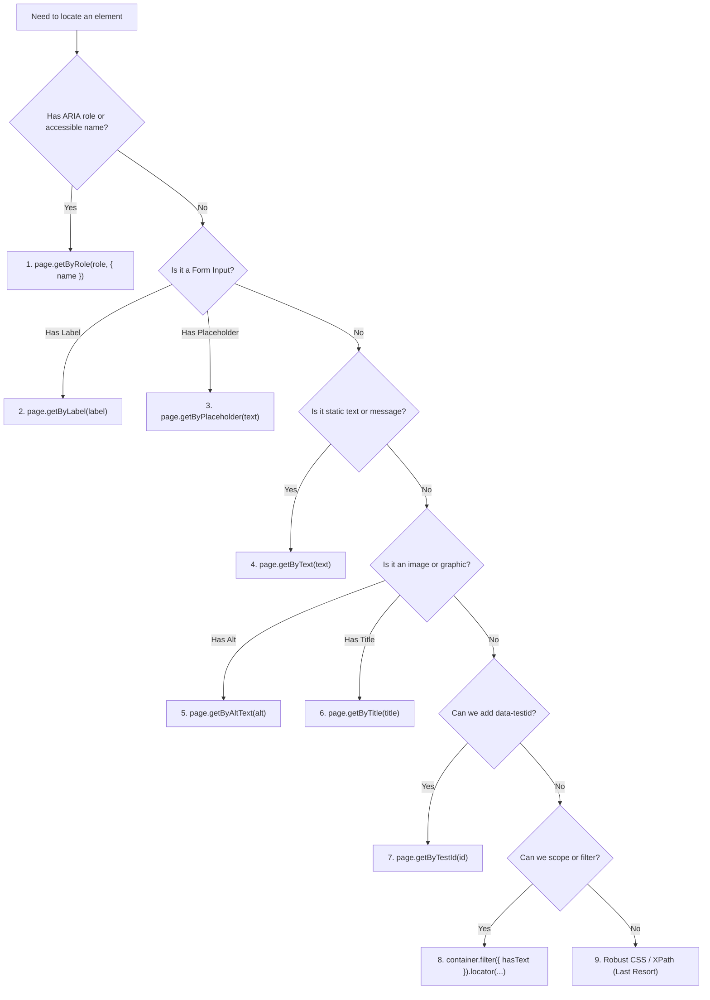

# Playwright Locator Strategies: The Comprehensive Production & Architecture Guide

> **Author / Perspective:** Senior SDET / Automation Platform Architect  
> **Scope:** Exhaustive architectural reference, API breakdown, best practices, anti-patterns, and decision matrices for locating and interacting with DOM elements in Playwright TypeScript.

---

## Table of Contents
1. [Core Architectural Philosophy of Locators](#1-core-architectural-philosophy-of-locators)
   - [1.1 Lazy Resolution vs Immediate DOM Query](#11-lazy-resolution-vs-immediate-dom-query)
   - [1.2 Zero StaleElementReferenceException](#12-zero-staleelementreferenceexception)
   - [1.3 Strict Mode Enforcement](#13-strict-mode-enforcement)
   - [1.4 The Actionability Engine](#14-the-actionability-engine)
   - [1.5 Why `page.$()` and `ElementHandle` are Discouraged](#15-why-page-and-elementhandle-are-discouraged)
2. [The Playwright Locator Hierarchy (Recommended Priority Order)](#2-the-playwright-locator-hierarchy-recommended-priority-order)
   - [Tier 1: Accessibility & User-Facing Locators (Primary Recommendation)](#tier-1-accessibility--user-facing-locators-primary-recommendation)
   - [Tier 2: Explicit Contract Locators (`getByTestId`)](#tier-2-explicit-contract-locators-getbytestid)
   - [Tier 3: Technical / DOM Locators (`locator(css | xpath)`)](#tier-3-technical--dom-locators-locatorcss--xpath)
3. [Deep Dive: Built-in User-Facing Locators](#3-deep-dive-built-in-user-facing-locators)
   - [3.1 `page.getByRole()` — The Gold Standard](#31-pagegetbyrole--the-gold-standard)
   - [3.2 `page.getByLabel()` — Form Input Precision](#32-pagegetbylabel--form-input-precision)
   - [3.3 `page.getByPlaceholder()` — Non-Labelled Inputs](#33-pagegetbyplaceholder--non-labelled-inputs)
   - [3.4 `page.getByText()` — Non-Interactive Content](#34-pagegetbytext--non-interactive-content)
   - [3.5 `page.getByAltText()` — Images & Graphical Nodes](#35-pagegetbyalttext--images--graphical-nodes)
   - [3.6 `page.getByTitle()` — Tooltips & Title Attributes](#36-pagegetbytitle--tooltips--title-attributes)
   - [3.7 `page.getByTestId()` — Resilient Test IDs & Config Customization](#37-pagegetbytestid--resilient-test-ids--config-customization)
4. [CSS & XPath Engines (When Semantic Locators Are Insufficient)](#4-css--xpath-engines-when-semantic-locators-are-insufficient)
   - [4.1 Standard CSS Selectors](#41-standard-css-selectors)
   - [4.2 Playwright Custom CSS Pseudo-Classes](#42-playwright-custom-css-pseudo-classes)
   - [4.3 XPath Selectors (Usage & Limitations)](#43-xpath-selectors-usage--limitations)
   - [4.4 Layout & Positional Selectors (`:right-of()`, `:below()`, etc.)](#44-layout--positional-selectors-right-of-below-etc)
5. [Locator Composition: Chaining, Combining & Scoping](#5-locator-composition-chaining-combining--scoping)
   - [5.1 Scoping Inside Component Subtrees](#51-scoping-inside-component-subtrees)
   - [5.2 Combining Locators: `.and()` and `.or()`](#52-combining-locators-and-and-or)
   - [5.3 Filtering Locators: `.filter({ hasText, has, hasNotText, hasNot })`](#53-filtering-locators-filter-hastext-has-hasnottext-hasnot-)
6. [Handling Multiple Elements](#6-handling-multiple-elements)
   - [6.1 Resolving Strict Mode: `.first()`, `.last()`, `.nth()`](#61-resolving-strict-mode-first-last-nth)
   - [6.2 Iteration: `.all()`, `for...of` loops](#62-iteration-all-forof-loops)
   - [6.3 Batch Data Extraction: `.allInnerTexts()`, `.allTextContents()`](#63-batch-data-extraction-allinnertexts-alltextcontents)
   - [6.4 Counting: `.count()` vs `expect(loc).toHaveCount()`](#64-counting-count-vs-expectloctohavecount)
7. [Complex DOM Structures: Shadow DOM & Iframes](#7-complex-dom-structures-shadow-dom--iframes)
   - [7.1 Automatic Shadow DOM Piercing](#71-automatic-shadow-dom-piercing)
   - [7.2 `frameLocator()` for Single and Nested Iframes](#72-framelocator-for-single-and-nested-iframes)
8. [Web-First Assertions with Locators](#8-web-first-assertions-with-locators)
   - [8.1 The Non-Retrying Assertions Trap](#81-the-non-retrying-assertions-trap)
   - [8.2 Key Web-First Matchers Reference](#82-key-web-first-matchers-reference)
9. [Enterprise Best Practices & Anti-Patterns](#9-enterprise-best-practices--anti-patterns)
10. [Locator Strategy Decision Matrix](#10-locator-strategy-decision-matrix)

---

## 1. Core Architectural Philosophy of Locators

### 1.1 Lazy Resolution vs Immediate DOM Query
In legacy frameworks (like Selenium WebDriver), calling `driver.findElement(By.id("submit"))` instantly sends an HTTP command over the wire to search the DOM at that precise millisecond. If the page is re-rendering or an animation is underway, it either fails immediately or caches a static DOM node reference.

In Playwright, **locators are lazy factories / non-evaluating pointers**. Creating a locator does not perform any browser communication or DOM querying:

```typescript
// NO network traffic, NO DOM query, 0ms execution:
const submitBtn = page.getByRole('button', { name: 'Save Changes' });
```

The DOM query only executes at the moment you perform an **action** (e.g. `.click()`, `.fill()`) or a **web-first assertion** (e.g. `await expect(submitBtn).toBeVisible()`).

```
┌─────────────────────────────────────────────────────────────┐
│                   LOCATOR EXECUTION TIMELINE                │
├─────────────────────────────────────────────────────────────┤
│ 1. const btn = page.getByRole('button', { name: 'Submit' }) │
│    ↳ (Creates pointer object in memory. DOM is NOT checked) │
│                                                             │
│ 2. await btn.click();                                       │
│    ↳ (Triggers Actionability Pipeline)                      │
│      ├── Find element matching selector in live DOM         │
│      ├── Verify Attached to DOM                             │
│      ├── Verify Visible (non-zero bounding box, no opacity) │
│      ├── Verify Stable (CSS transform/animation finished)   │
│      ├── Verify Enabled (not disabled)                      │
│      ├── Scroll into view if needed                         │
│      ├── Verify Element Receives Pointer Events (no overlay)│
│      └── Dispatch Click Event via CDP/WebSocket             │
└─────────────────────────────────────────────────────────────┘
```

### 1.2 Zero StaleElementReferenceException
Because locators re-query the live DOM at the exact millisecond of every action, single-page application (SPA) state changes (React re-renders, Angular zone updates, Vue virtual DOM diffs) **never** throw a `StaleElementReferenceException`. If an element is unmounted and remounted with the same attributes, Playwright automatically catches the new live instance.

### 1.3 Strict Mode Enforcement
Playwright enforces **Strict Mode** across all locator actions by default. If a locator resolves to more than one element when an action is executed, Playwright refuses to guess which element you meant and immediately throws a `strict mode violation` error:

```typescript
// DOM has 3 buttons with class 'btn-primary'
const button = page.locator('.btn-primary');

await button.click();
// ❌ Error: strict mode violation: locator('.btn-primary') resolved to 3 elements:
//    1) <button class="btn-primary">Save</button>
//    2) <button class="btn-primary">Submit</button>
//    3) <button class="btn-primary">Cancel</button>
```

**Why Strict Mode is a Superpower:**
- Prevents tests from accidentally clicking the wrong button (e.g., clicking the first "Delete" button when you wanted a specific one).
- Forces maintainable, resilient locators.
- Can be disambiguated semantically using `getByRole('button', { name: 'Save' })`, `.filter()`, or `.first()` / `.nth()`.

### 1.4 The Actionability Engine
Before executing any action, Playwright runs a series of actionability checks tailored to the specific interaction:

| Action | Attached | Visible | Stable | Enabled | Editable | Receives Events |
| :--- | :---: | :---: | :---: | :---: | :---: | :---: |
| `click()` / `dblclick()` | ✅ | ✅ | ✅ | ✅ | ❌ | ✅ |
| `fill()` / `clear()` | ✅ | ✅ | ✅ | ✅ | ✅ | ❌ |
| `check()` / `uncheck()` | ✅ | ✅ | ✅ | ✅ | ❌ | ✅ |
| `selectOption()` | ✅ | ✅ | ✅ | ✅ | ❌ | ❌ |
| `hover()` | ✅ | ✅ | ✅ | ❌ | ❌ | ✅ |
| `focus()` | ✅ | ✅ | ❌ | ❌ | ❌ | ❌ |
| `press()` | ✅ | ✅ | ❌ | ❌ | ❌ | ❌ |
| `setInputFiles()` | ✅ | ❌ | ❌ | ❌ | ❌ | ❌ |

*(Notice that `setInputFiles` does not require visibility because standard `<input type="file">` elements are frequently hidden with `display: none` by modern UI component libraries!)*

### 1.5 Why `page.$()` and `ElementHandle` are Discouraged
Playwright provides legacy `page.$(selector)` and `page.$$(selector)` APIs inherited from Puppeteer. These return an `ElementHandle`.
- **`ElementHandle`:** A static pointer to a specific DOM node in memory. If the node is detached or replaced, the handle becomes stale. It does **not** auto-wait or retry.
- **`Locator`:** A declarative recipe that continuously evaluates against the live DOM.

```typescript
// ❌ BAD: Returns ElementHandle (bypasses auto-wait, stale prone)
const element = await page.$('#submit-button');
await element?.click();

// ✅ GOOD: Declarative Locator (auto-waiting, auto-retrying, strict mode)
const button = page.locator('#submit-button');
await button.click();
```

---

## 2. The Playwright Locator Hierarchy (Recommended Priority Order)

Playwright recommends choosing locators based on how **users and assistive technologies perceive the page**, rather than underlying HTML tags, classes, or DOM hierarchy.

```
┌────────────────────────────────────────────────────────────────────────┐
│                      PLAYWRIGHT LOCATOR PYRAMID                        │
├────────────────────────────────────────────────────────────────────────┤
│  TIER 1 (MOST RECOMMENDED - USER-FACING / ACCESSIBILITY)               │
│  • page.getByRole(role, { name })                                      │
│  • page.getByLabel(text)                                               │
│  • page.getByPlaceholder(text)                                         │
│  • page.getByText(text)                                                │
│  • page.getByAltText(text)                                             │
│  • page.getByTitle(text)                                               │
├────────────────────────────────────────────────────────────────────────┤
│  TIER 2 (EXPLICIT QA TESTING CONTRACT)                                 │
│  • page.getByTestId(id)                                                │
├────────────────────────────────────────────────────────────────────────┤
│  TIER 3 (TECHNICAL DOM FALLBACKS - USE SPARINGLY)                      │
│  • page.locator('css-selector')                                        │
│  • page.locator('xpath-expression')                                    │
└────────────────────────────────────────────────────────────────────────┘
```

---

## 3. Deep Dive: Built-in User-Facing Locators

### 3.1 `page.getByRole()` — The Gold Standard
`getByRole()` locates elements by their **ARIA role** (implicit HTML semantic role or explicit `role=""` attribute) and accessible name.

#### Why it is #1:
1. Closest reflection of how real humans perceive UI elements.
2. Ensures your application is accessible (if `getByRole` fails to find an element, your app is likely broken for screen reader users).
3. Completely resilient to CSS restructuring, class name renaming, and HTML wrapper changes (`div` wrapping).

#### Syntax:
```typescript
page.getByRole(role, options);
```

#### Common ARIA Roles & Examples:
```typescript
// Buttons (<button>, <input type="button">, <input type="submit">, or [role="button"])
await page.getByRole('button', { name: 'Submit Application' }).click();

// Text inputs (<input type="text">, <textarea>, etc.)
await page.getByRole('textbox', { name: 'Email Address' }).fill('admin@test.com');

// Checkboxes (<input type="checkbox">, [role="checkbox"])
await page.getByRole('checkbox', { name: 'Subscribe to newsletter' }).check();

// Radio buttons (<input type="radio">, [role="radio"])
await page.getByRole('radio', { name: 'Credit Card' }).check();

// Dropdowns (<select>, [role="combobox"])
await page.getByRole('combobox', { name: 'Country' }).selectOption('US');

// Links (<a href="...">)
await page.getByRole('link', { name: 'Documentation' }).click();

// Headings (<h1> through <h6>) with specific level:
await expect(page.getByRole('heading', { name: 'Dashboard', level: 1 })).toBeVisible();

// Modal dialogs (<dialog>, [role="dialog"])
const modal = page.getByRole('dialog', { name: 'Delete Confirmation' });

// Tables, rows, cells
const table = page.getByRole('table');
const activeRow = page.getByRole('row', { name: 'Alice Smith' });
```

#### Powerful `getByRole` Options:
- `name`: string or RegExp matching the accessible name.
- `exact`: boolean (default `false`). If `true`, requires full string match.
- `checked`: boolean (for checkboxes/radios).
- `disabled`: boolean (matches only disabled or enabled elements).
- `expanded`: boolean (for accordions or dropdown menus).
- `includeHidden`: boolean (default `false`). Setting to `true` searches elements hidden from accessibility tree.

```typescript
// Matches exact button name case-sensitively:
page.getByRole('button', { name: 'Save', exact: true });

// Matches using regular expression:
page.getByRole('button', { name: /save|update/i });

// Locate only checked checkbox:
page.getByRole('checkbox', { name: 'Accept Terms', checked: true });
```

---

### 3.2 `page.getByLabel()` — Form Input Precision
`getByLabel()` locates input elements (`<input>`, `<textarea>`, `<select>`) associated with a `<label>`.

#### Association Patterns Supported:
1. Explicit association via `for` and `id`:
   ```html
   <label for="user-email">Work Email</label>
   <input id="user-email" type="email" />
   ```
2. Implicit wrapping association:
   ```html
   <label>
     Work Email
     <input type="email" />
   </label>
   ```
3. `aria-labelledby` or `aria-label`:
   ```html
   <input type="email" aria-label="Work Email" />
   ```

#### Usage:
```typescript
await page.getByLabel('Work Email').fill('john@company.com');
await page.getByLabel('Password', { exact: true }).fill('Secret123!');
```

---

### 3.3 `page.getByPlaceholder()` — Non-Labelled Inputs
Used when form inputs lack visible `<label>` elements and rely on a placeholder text.

```html
<input type="search" placeholder="Search products, brands, and categories..." />
```

```typescript
await page.getByPlaceholder('Search products, brands, and categories...').fill('Playwright');
```

> **Tip:** Do not use `getByPlaceholder` if a `<label>` exists. Labels are preferred because placeholders often vanish once text is typed.

---

### 3.4 `page.getByText()` — Non-Interactive Content
Used for asserting or locating static text elements (paragraphs, spans, headings, error banners, notifications).

```html
<div class="alert alert-danger">Invalid credentials provided. Please try again.</div>
```

```typescript
// Substring match (default):
await expect(page.getByText('Invalid credentials')).toBeVisible();

// Exact match:
await expect(page.getByText('Invalid credentials provided. Please try again.', { exact: true })).toBeVisible();

// RegExp match:
await expect(page.getByText(/invalid credentials/i)).toBeVisible();
```

> **Anti-Pattern Warning:** Do not use `page.getByText('Submit').click()` for buttons or links! Always use `page.getByRole('button', { name: 'Submit' })`. `getByText('Submit')` will match `<p>Submit</p>` or `<div>Submit</div>` instead of the clickable button.

---

### 3.5 `page.getByAltText()` — Images & Graphical Nodes
Locates elements (primarily `` and `<area>`) based on their `alt` text attribute.

```html

```

```typescript
await expect(page.getByAltText('Company Master Logo')).toBeVisible();
```

---

### 3.6 `page.getByTitle()` — Tooltips & Title Attributes
Locates elements with a `title` attribute or SVG `<title>` element.

```html
<span title="View Account Settings" class="icon-gear"></span>
```

```typescript
await page.getByTitle('View Account Settings').click();
```

---

### 3.7 `page.getByTestId()` — Resilient Test IDs & Config Customization
When elements lack accessible names or unique semantics, dedicated test attributes provide an explicit contract between developers and QA.

```html
<div data-testid="checkout-summary-card">...</div>
```

```typescript
await expect(page.getByTestId('checkout-summary-card')).toBeVisible();
```

#### Customizing the Test ID Attribute:
By default, Playwright looks for `data-testid`. If your organization uses `data-test`, `data-cy`, or `data-qa`, configure it globally in `playwright.config.ts`:

```typescript
// playwright.config.ts
import { defineConfig } from '@playwright/test';

export default defineConfig({
  use: {
    testIdAttribute: 'data-test-id', // or 'data-qa', 'data-cy'
  },
});
```

---

## 4. CSS & XPath Engines (When Semantic Locators Are Insufficient)

When working with third-party legacy widgets, complex canvas wrappers, or un-semantic canvas DOM trees, `page.locator()` allows standard CSS and XPath.

### 4.1 Standard CSS Selectors
```typescript
// ID selector
page.locator('#checkout-btn');

// Class selector
page.locator('.order-summary-row');

// Attribute selector
page.locator('input[name="billing_zip"]');

// Combined attribute & class
page.locator('button.btn-primary[type="submit"]');

// Child combinator
page.locator('ul.nav-tabs > li.active');
```

---

### 4.2 Playwright Custom CSS Pseudo-Classes
Playwright extends CSS syntax with powerful custom pseudo-classes:

#### 1. Text Pseudo-Classes:
- `:has-text("...")`: Matches elements containing text anywhere in their subtree (case-insensitive substring).
- `:text("...")`: Strict text matching.
- `:text-is("...")`: Exact string match.
- `:text-matches("...")`: Regular expression match.

```typescript
// Finds any .card element containing "Pro Plan" inside its DOM branch
page.locator('.card:has-text("Pro Plan")');

// Exact text inside button
page.locator('button:text-is("Sign In")');
```

#### 2. The `:has()` Parent Combinator:
Allows selecting a parent or container based on what children it contains:

```typescript
// Find the article card that contains a badge with text 'New'
page.locator('article.card:has(span.badge-new)');
```

#### 3. The `:visible` Pseudo-Class:
Filters elements to only those currently rendered and visible (non-zero width/height, not `display: none` or `visibility: hidden`):

```typescript
// Click the visible submit button when another hidden modal exists
await page.locator('button.btn-submit:visible').click();
```

---

### 4.3 XPath Selectors (Usage & Limitations)
Playwright automatically detects XPath when a string starts with `//` or `..` or `xpath=`:

```typescript
// Absolute / Relative XPath
page.locator('//button[normalize-space()="Confirm"]');

// Ancestor axis navigation
page.locator('//td[text()="Invoice #1042"]/following-sibling::td//button');
```

> **Architectural Guidance:** Avoid long, fragile XPath expressions (e.g., `//div[2]/div/section/form/div[3]/input`). Use semantic locators or `.filter()` whenever possible.

---

### 4.4 Layout & Positional Selectors (`:right-of()`, `:below()`, etc.)
Playwright supports spatial layout selectors based on geometric coordinates:

```typescript
// Locate input to the right of the 'Password' label
page.locator('input:right-of(:text("Password"))');

// Locate button below the pricing table
page.locator('button:below(.pricing-grid)');
```

> **Caution:** Layout selectors rely on computed CSS layout. Responsive breakpoints or mobile viewports can break them.

---

## 5. Locator Composition: Chaining, Combining & Scoping

### 5.1 Scoping Inside Component Subtrees
Locators can be chained to search strictly inside a parent element's subtree:

```typescript
const cartDrawer = page.locator('#shopping-cart-drawer');

// Searches ONLY inside #shopping-cart-drawer
const checkoutBtn = cartDrawer.getByRole('button', { name: 'Proceed to Checkout' });
await checkoutBtn.click();
```

---

### 5.2 Combining Locators: `.and()` and `.or()`

#### `.and()` — Both conditions must match the same element:
```typescript
const emailInput = page.getByRole('textbox').and(page.getByPlaceholder('Enter your email'));
```

#### `.or()` — Match either of two elements (ideal for A/B tests or multi-state UI):
```typescript
// Handles UI where the button might say "Accept" or "Agree"
const consentBtn = page.getByRole('button', { name: 'Accept' })
  .or(page.getByRole('button', { name: 'Agree' }));

await consentBtn.click();
```

---

### 5.3 Filtering Locators: `.filter({ hasText, has, hasNotText, hasNot })`
The `.filter()` method narrows down an existing locator without creating brittle CSS chains.

```typescript
// HTML:
// <div class="product-card">
//    <h3>Playwright Mastery</h3>
//    <span class="price">$49</span>
//    <button>Enroll Now</button>
// </div>

// 1. Filter by text in child subtree:
const courseCard = page.locator('.product-card')
  .filter({ hasText: 'Playwright Mastery' });

await courseCard.getByRole('button', { name: 'Enroll Now' }).click();

// 2. Filter by presence of another locator:
const featuredCourse = page.locator('.product-card')
  .filter({ has: page.locator('.badge-featured') });

// 3. Filter by negative condition (hasNot / hasNotText):
const regularItems = page.locator('.product-card')
  .filter({ hasNot: page.locator('.out-of-stock-label') });
```

---

## 6. Handling Multiple Elements

### 6.1 Resolving Strict Mode: `.first()`, `.last()`, `.nth()`
When multiple elements legitimately match, select one deterministically:

```typescript
const buttons = page.getByRole('button', { name: 'Delete' });

await buttons.first().click();    // First matching element
await buttons.last().click();     // Last matching element
await buttons.nth(2).click();     // 3rd element (0-indexed)
```

---

### 6.2 Iteration: `.all()`, `for...of` loops
To perform actions or assertions on every element in a list:

```typescript
const itemCheckboxes = page.locator('input[type="checkbox"].item-select');

// .all() returns an array of Locators:
for (const checkbox of await itemCheckboxes.all()) {
  await checkbox.check();
}
```

---

### 6.3 Batch Data Extraction: `.allInnerTexts()`, `.allTextContents()`
```typescript
const headers = page.locator('table th');

// Returns array of strings: ['ID', 'Name', 'Role', 'Actions']
const headerTexts = await headers.allInnerTexts();
```

---

### 6.4 Counting: `.count()` vs `expect(loc).toHaveCount()`
- **`.count()`**: Returns current count immediately (non-waiting).
- **`expect(loc).toHaveCount(n)`**: Retrying web-first assertion that waits up to 5s for the list to reach `n` items.

```typescript
// ❌ FLAKY in dynamic tables:
const count = await page.locator('.table-row').count();
expect(count).toBe(5);

// ✅ ROCK SOLID: Automatically retries until exactly 5 rows appear:
await expect(page.locator('.table-row')).toHaveCount(5);
```

---

## 7. Complex DOM Structures: Shadow DOM & Iframes

### 7.1 Automatic Shadow DOM Piercing
Playwright **automatically pierces open Shadow DOM roots** by default with all standard locators and CSS selectors!

```html
<!-- Inside Custom Web Component -->
<user-profile-widget>
  #shadow-root (open)
    <button class="edit-profile-btn">Edit Profile</button>
</user-profile-widget>
```

```typescript
// No special shadow-root code needed!
await page.locator('.edit-profile-btn').click();
await page.getByRole('button', { name: 'Edit Profile' }).click();
```

---

### 7.2 `frameLocator()` for Single and Nested Iframes
To interact inside an `<iframe>`, use `page.frameLocator()`:

```typescript
// Single iframe
const paymentFrame = page.frameLocator('iframe#stripe-payment-frame');
await paymentFrame.getByRole('textbox', { name: 'Card number' }).fill('4242424242424242');

// Chained / Nested iframes
const parentFrame = page.frameLocator('#parent-iframe');
const childFrame = parentFrame.frameLocator('#child-iframe');
await childFrame.getByRole('button', { name: 'Confirm' }).click();
```

---

## 8. Web-First Assertions with Locators

### 8.1 The Non-Retrying Assertions Trap
In Playwright, assertions must be performed on **Locators**, not boolean results:

```typescript
// ❌ DANGEROUS / FLAKY ANTI-PATTERN:
// locator.isVisible() evaluates once at that instant, returns boolean true/false.
// expect(false).toBe(true) fails instantly with NO retry!
expect(await page.getByRole('alert').isVisible()).toBe(true);

// ✅ WEB-FIRST RETRYING ASSERTION:
// Automatically polls the DOM for up to expect timeout (default 5000ms):
await expect(page.getByRole('alert')).toBeVisible();
```

### 8.2 Key Web-First Matchers Reference

| Assertion | Meaning |
| :--- | :--- |
| `await expect(locator).toBeVisible()` | Element is attached, has size, and not hidden |
| `await expect(locator).toBeHidden()` | Element is detached or hidden (`display: none`) |
| `await expect(locator).toBeEnabled()` | Element is not disabled |
| `await expect(locator).toBeDisabled()` | Element has `disabled` attribute |
| `await expect(locator).toBeChecked()` | Checkbox or radio is checked |
| `await expect(locator).toHaveText('Welcome')` | Exact or substring text match |
| `await expect(locator).toContainText('foo')` | Substring text match |
| `await expect(locator).toHaveValue('admin')` | Form input value equals string |
| `await expect(locator).toHaveAttribute('type', 'password')` | Element has specified attribute |
| `await expect(locator).toHaveCount(10)` | Locator matches exactly 10 DOM elements |
| `await expect(locator).toBeFocused()` | Element currently holds keyboard focus |

---

## 9. Enterprise Best Practices & Anti-Patterns

### ✅ Best Practices:
1. **Prioritize User-Facing Semantics:** Use `getByRole`, `getByLabel`, `getByPlaceholder`.
2. **Use Test IDs as Fallbacks:** Standardize on `data-testid` when semantics are ambiguous.
3. **Scope and Filter:** Use `parent.getByRole(...)` or `.filter({ hasText: ... })` instead of complex CSS selectors.
4. **Use Web-First Assertions:** Always use `await expect(locator).toBeVisible()`.
5. **Keep Locators Lazy:** Declare locators in Page Object Model (POM) properties without awaiting them:
   ```typescript
   export class LoginPage {
     readonly emailInput = this.page.getByLabel('Email');
     readonly submitButton = this.page.getByRole('button', { name: 'Log in' });
     constructor(private page: Page) {}
   }
   ```

### ❌ Anti-Patterns:
1. **Never Await Locator Creation:** `const btn = await page.locator(...)` is invalid.
2. **Never Use Fragile XPath/CSS Trees:** `div > div:nth-child(2) > span > a` breaks with minor styling changes.
3. **Never Fall Back to `page.$` or `page.$$`:** Bypasses auto-wait and returns brittle handles.
4. **Never Use Fixed Sleeps:** Replace `await page.waitForTimeout(5000)` with `await expect(locator).toBeVisible()`.
5. **Never Use `force: true` Blindly:** `await locator.click({ force: true })` bypasses actionability checks, hiding real user bugs (e.g. element covered by modal backdrop).

---

## 10. Locator Strategy Decision Matrix



---

## Summary Cheat Sheet

| Use Case | Recommended Syntax |
| :--- | :--- |
| Click a button | `await page.getByRole('button', { name: 'Save' }).click()` |
| Type in labeled input | `await page.getByLabel('Username').fill('john_doe')` |
| Type in placeholder input | `await page.getByPlaceholder('Search products...').fill('laptop')` |
| Check a checkbox | `await page.getByRole('checkbox', { name: 'Subscribe' }).check()` |
| Select a radio button | `await page.getByRole('radio', { name: 'Standard Delivery' }).check()` |
| Choose from dropdown | `await page.getByRole('combobox', { name: 'Country' }).selectOption('CA')` |
| Click navigation link | `await page.getByRole('link', { name: 'Pricing' }).click()` |
| Verify heading text | `await expect(page.getByRole('heading', { name: 'Orders' })).toBeVisible()` |
| Verify alert message | `await expect(page.getByRole('alert')).toHaveText(/success/i)` |
| Filter table row | `page.getByRole('row').filter({ hasText: 'Invoice #101' })` |
| Interact inside iframe | `page.frameLocator('#frame-id').getByRole('button').click()` |
| Verify item count | `await expect(page.getByRole('listitem')).toHaveCount(5)` |
